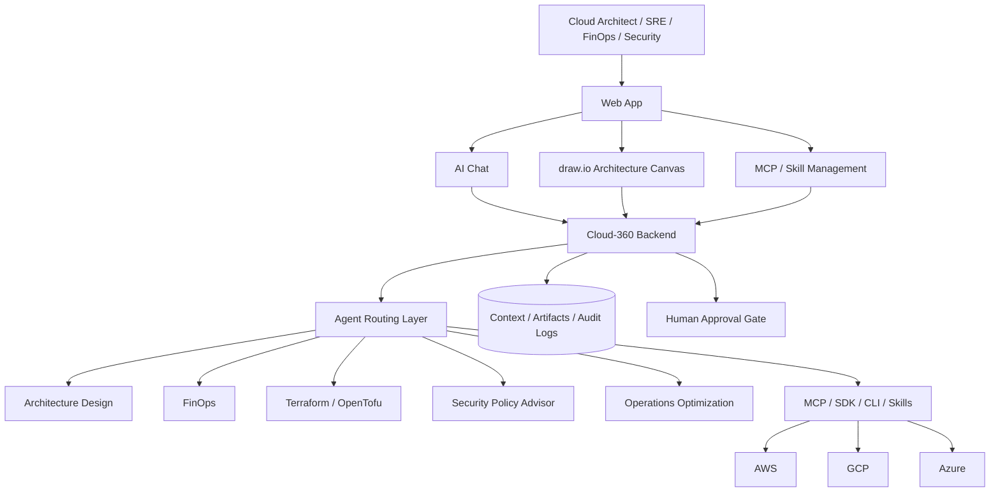

# Cloud-360

Cloud-360 是面向雲端架構師、SRE、FinOps 與 Security 團隊的 **AI-native multi-cloud architecture and operations platform**。

平台支援 AWS、GCP、Azure 三大公有雲，透過 AI Chat、Agentic AI、MCP、Cloud SDK、Cloud CLI、Terraform / OpenTofu 與可重用 Skills，協助團隊完成架構設計、跨雲選型、成本估算、IaC 產製、安全策略檢視與日常維運最佳化。

## Platform Vision

Cloud-360 的目標是提供一個 Web-first 的多雲管理與設計工作台：

- 將自然語言需求轉成多雲架構方案。
- 使用線上 draw.io / diagrams.net 相容畫布，讓使用者與 AI chatbot 共同編輯架構圖。
- 比較 AWS / GCP / Azure 元件、SLA、限制、相容性與成本。
- 估算多雲 TCO、Data Egress、Spot / Preemptible / Reserved pricing 策略。
- 將確認後的架構轉成 Terraform / OpenTofu 模組草稿。
- 透過 Agentic AI 主動檢查成本、安全、效能、可用性與維運風險。
- 透過 MCP / SDK / CLI / Skills 安全地整合雲平台管理能力。
- 內建 MCP 與 Skill 管理功能，讓平台可治理工具目錄、版本、權限、啟用狀態與審批流程。

## System Architecture



完整架構說明請見 [System Architecture](aidlc/spaces/default/intents/260802-default/inception/application-design/system-architecture.md)。

## Core Modules

1. **Architecture Design**
   - 自然語言轉架構藍圖。
   - 產生 Mermaid / PlantUML / draw.io 圖面。
   - 檢查 Well-Architected Framework 與 HA / DR / Scalability 需求。

2. **Cross-Cloud Component Selection**
   - 比較 AWS、GCP、Azure 同質服務。
   - 依 workload profile 推薦合適雲端元件。
   - 輸出 SLA、限制、相容性、lock-in、維運成本與替代方案。

3. **Cost Estimation & FinOps**
   - 估算 Compute、Database、Storage、Network、CDN、Data Egress 與 Observability 成本。
   - 比較 AWS Spot、Azure Spot、GCP Spot / Preemptible 等計費模式。
   - 產出成本異常與 right-sizing 建議。

4. **Infrastructure as Code - Terraform / OpenTofu**
   - 產生 `aws`、`google`、`azurerm` provider 對應的 Terraform / OpenTofu 模組。
   - 支援 `main.tf`、`variables.tf`、`outputs.tf`、`providers.tf` 與 `modules/` 結構。
   - 整合 tfsec、trivy、Checkov 等靜態掃描工具。

5. **Operations Optimization Review**
   - 分析已部署或設計中的架構。
   - 提供效能、可用性、成本、SLO/SLA 與架構現代化建議。
   - 主動建議 managed service、serverless、container platform 或跨雲遷移方案。

6. **AI Multi-Cloud Operations**
   - 使用 AI Chat 主動查詢、分析與管理 AWS / GCP / Azure。
   - 透過 Agentic AI 被動監控、主動分析與產生維運建議。
   - 透過 MCP servers、Cloud SDKs、Cloud CLIs 與 Skills 執行受控操作。

7. **Cloud Security Posture & Policy Advisory**
   - 檢視 IAM / RBAC、network exposure、storage access、encryption、audit logging、policy guardrails。
   - 產生 least-privilege、Policy-as-Code、IaC patch 與 remediation plan 建議。
   - 高風險修復必須通過 human approval gate。

8. **MCP & Skill Management**
   - 管理 MCP servers、tools、AI Skills、cloud provider connectors 與 reusable workflows。
   - 支援註冊、啟用/停用、版本控管、權限範圍、健康檢查、相依性檢查與審批流程。
   - 將工具能力納入 Agent Routing Layer，讓 AI 能安全選用合適工具執行 read-only 分析或經審批後的維運操作。

## Web-Based Desktop and Mobile Experience

Cloud-360 是 Web-first 平台，第一階段不做 native iOS / Android app。

- **Desktop Web**：完整工作台，包含 draw.io co-editing、IaC editor、FinOps dashboard、Security dashboard、Ops dashboard、Agent trace 與 audit log。
- **Mobile Web / Responsive Web / PWA**：維運伴隨介面，聚焦 AI Chat、alerts、approval workflow、cloud health digest、security / cost findings 與 readonly architecture diagram review。

## Architecture Visualization Canvas

Cloud-360 採用線上 **draw.io / diagrams.net-compatible architecture canvas**。使用者可以手動編輯架構圖，也可以透過 AI Chat 以自然語言要求 AI 共同修改圖面。

圖面不只是圖片，而是系統的 shared architecture context：

- source format：`.drawio` / diagrams.net XML
- derived format：Mermaid、PlantUML、SVG、PNG、internal architecture graph JSON
- downstream consumers：Design Agent、FinOps Agent、IaC Agent、Ops Agent、Security Policy Advisor Agent

## Cloud Operation Integration

Cloud-360 透過以下方式整合雲平台：

- MCP servers
- Cloud SDKs
- Cloud CLIs
- Terraform / OpenTofu providers
- AI Skills
- MCP / Skill Registry
- Cloud-native monitoring, billing, IAM, policy and security APIs

Read-only 查詢與分析可直接執行；write / delete / deploy / permission change / production-impacting action 必須先產生 plan、impact、rollback strategy，並通過 human approval gate。

## MCP & Skill Management

Cloud-360 內建 MCP 與 Skill 管理功能，用來治理平台可呼叫的工具能力。

核心能力：

- MCP Server Registry：登錄 AWS / GCP / Azure / internal tools MCP server。
- Skill Catalog：管理 reusable AI Skills，例如 FinOps 分析、安全檢查、Terraform 產生、incident triage。
- Tool Permission Model：定義每個 tool / skill 的 read-only、write、deploy、delete、permission-change 風險等級。
- Versioning & Approval：管理版本、變更紀錄、啟用/停用與審批。
- Health Check：檢查 MCP server 可用性、schema、auth scope、latency 與錯誤率。
- Agent Routing Integration：讓 Routing Agent 可根據任務、權限、風險與上下文選擇合適 MCP / Skill。

## Requirements Source

Cloud-360 的需求清單正本是 opendiamonds 帳號的 GitHub Project #16 [「Cloud-360 開發計劃」](https://github.com/users/opendiamonds/projects/16)。看板上的項目是需求的權威來源；repo 內的需求文件與 GitHub issue 皆為其衍生，兩者不一致時以看板為準。
GitHub Project #16 "Cloud-360 開發計劃" is the source of truth for the Cloud-360 requirement list; documents and issues in this repository are derived from it.

## Documentation

Cloud-360 的文件由 AI-DLC 各階段產生與維護，存放在作用中 intent 的 record 目錄下：`aidlc/spaces/<space>/intents/<record>/`。目前的 baseline record 是 `aidlc/spaces/default/intents/260802-default/`（見 ADR-0011；v2 之前為扁平的 `aidlc-docs/`）。
Cloud-360 documents live under the active intent's record directory, `aidlc/spaces/<space>/intents/<record>/`, generated and updated by AI-DLC workflow stages.

- [AI-DLC Record Index](aidlc/spaces/default/intents/260802-default/README.md)
- [System Requirement Specification](aidlc/spaces/default/intents/260802-default/inception/requirements-analysis/cloud-360-srs.md)
- [System Architecture](aidlc/spaces/default/intents/260802-default/inception/application-design/system-architecture.md)
- [User Stories](aidlc/spaces/default/intents/260802-default/inception/user-stories/stories.md)
- [User Personas](aidlc/spaces/default/intents/260802-default/inception/user-stories/personas.md)
- [ADR 0001: Repository Scope](aidlc/spaces/default/intents/260802-default/inception/decisions/0001-repo-scope.md)
- [ADR 0002: Agent Routing Layer](aidlc/spaces/default/intents/260802-default/inception/decisions/0002-agent-routing-layer.md)
- [ADR 0003: Web-Based Desktop and Mobile Experience](aidlc/spaces/default/intents/260802-default/inception/decisions/0003-web-based-experience.md)
- [ADR 0004: MCP and Skill Management](aidlc/spaces/default/intents/260802-default/inception/decisions/0004-mcp-skill-management.md)
- [ADR 0005: Bilingual Documentation](aidlc/spaces/default/intents/260802-default/inception/decisions/0005-bilingual-documentation.md)
- [ADR 0006: Adopt AIDLC Framework](aidlc/spaces/default/intents/260802-default/inception/decisions/0006-adopt-aidlc-framework.md)
- [ADR 0011: Adopt AI-DLC v2](aidlc/spaces/default/intents/260802-default/inception/decisions/0011-adopt-aidlc-v2.md)

## Repository Contract

This repository currently tracks the Cloud-360 SDD baseline:

- platform SRS
- architecture diagrams
- user stories
- ADRs
- repository validation script
- baseline CI

Production credentials, environment-specific secrets, direct production IaC, and destructive cloud operations are explicitly out of scope unless reviewed and approved through future ADRs.

## Validation

```bash
python3 scripts/validate_repo_contract.py
git diff --check
```
