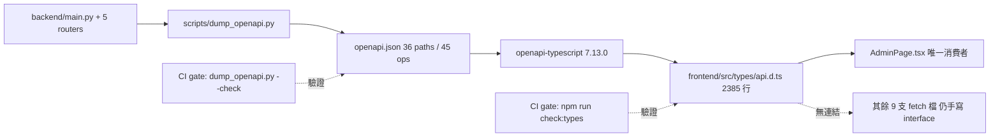
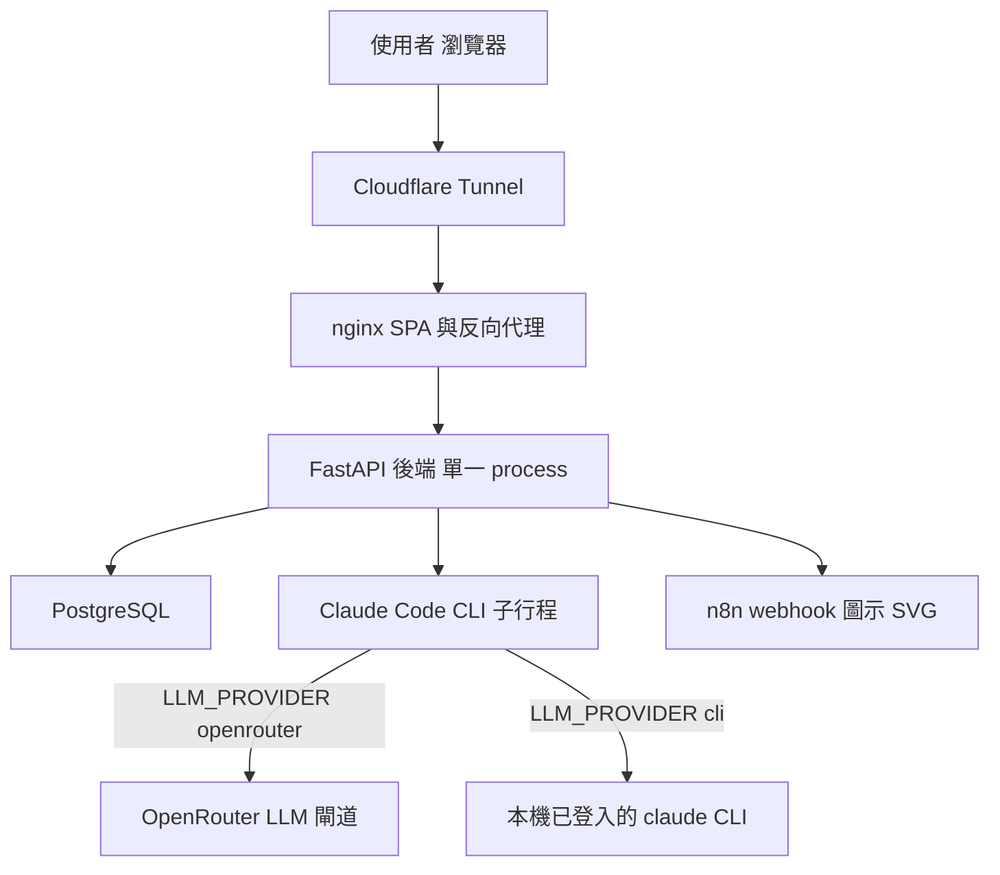
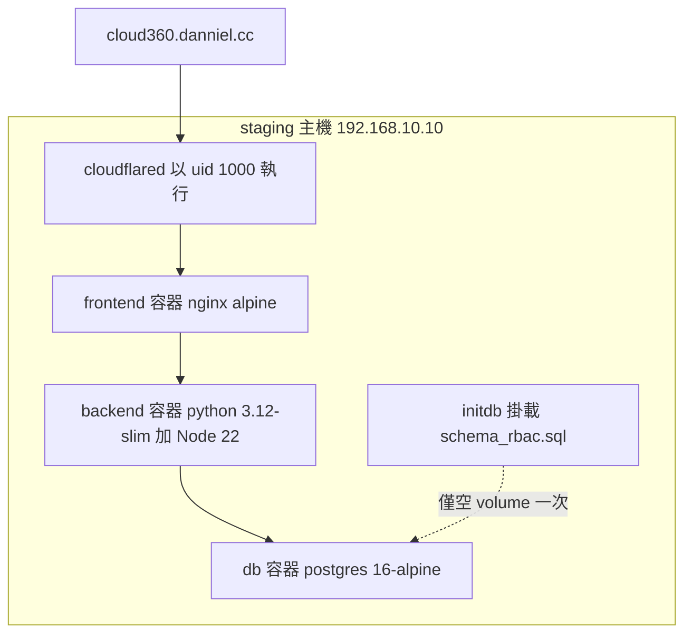
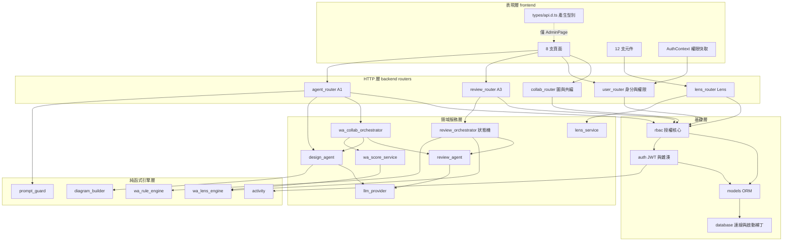
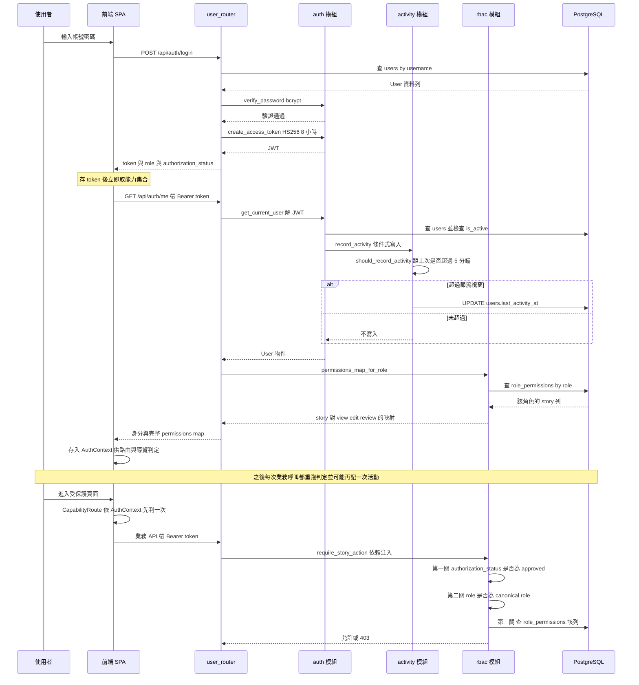
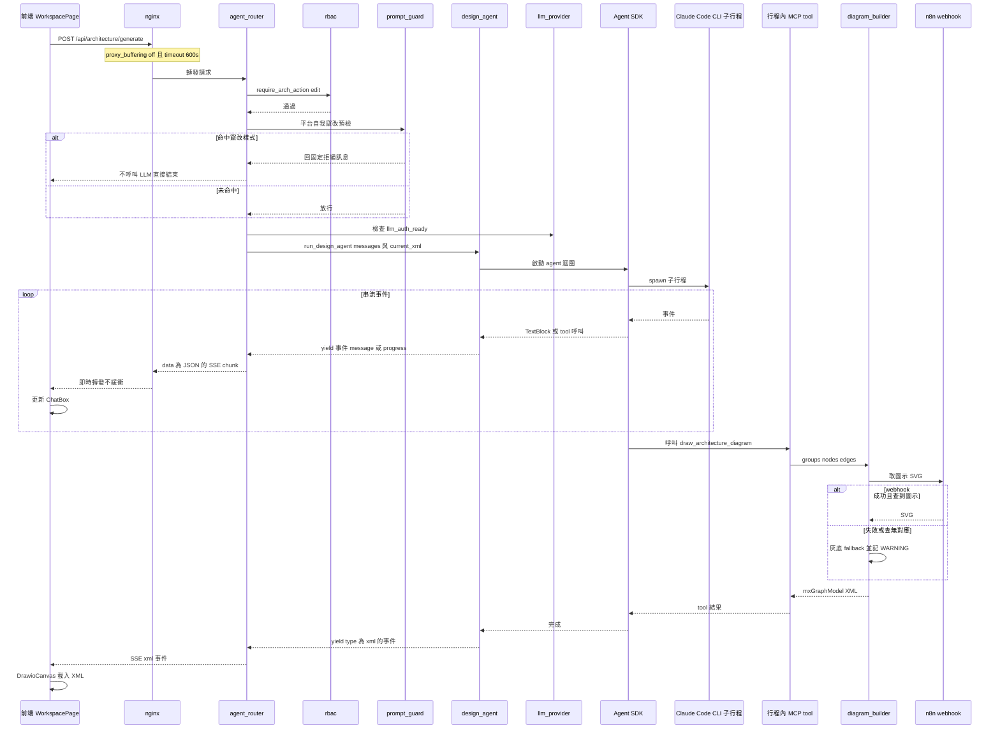
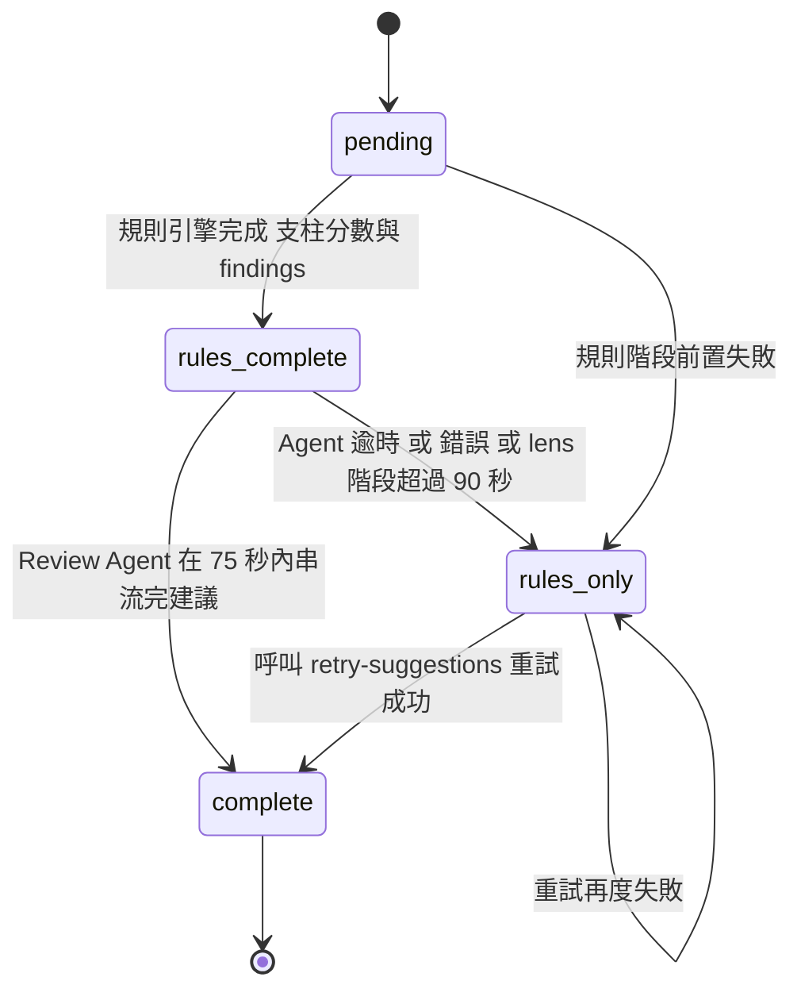
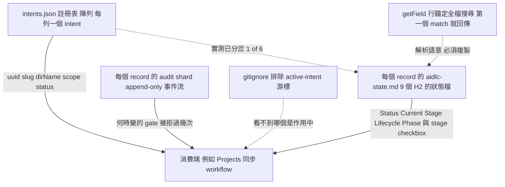
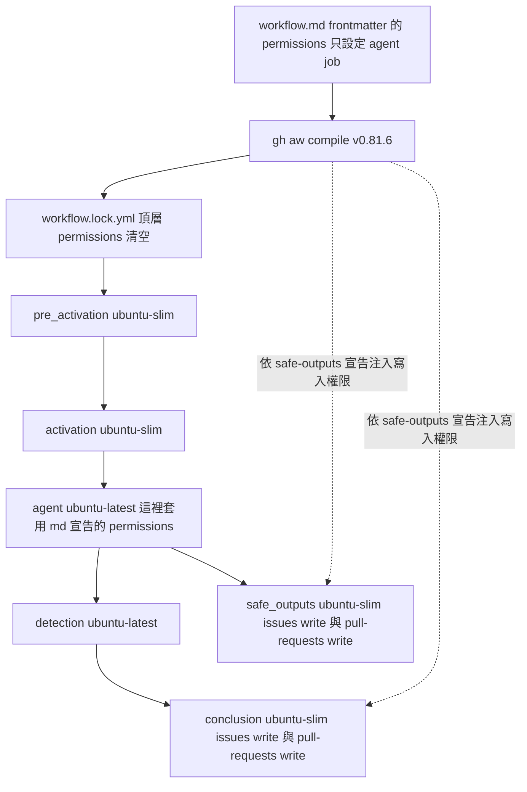

# Architecture — Cloud-360

> 逆向工程產出。**基準 commit `9307dbc`（2026-08-23）**；前一基準為 `c3de2c8`（2026-08-17）。
> **本輪為兩區定向掃描 ＋ 差異標註，不是完整重掃**（approval-handoff Q3=A）。
> 節標題後的新鮮度標記：**［本輪重寫］** 實掃改寫｜**［本輪機械複驗］** 數字已重新量測｜
> **［差異標註］** 未重新推導、只指出過期點｜**［沿用 `c3de2c8`］** 本輪未觸及。
> 完整範圍、未讀清單與**跨分支限制（基準已落後 `origin/ut` 三個 commit）**見
> `reverse-engineering-timestamp.md`。
>
> **用詞提醒**：在標記為［沿用 `c3de2c8`］或［差異標註］的段落內，「本輪／本次」指的是
> **`c3de2c8` 那一輪掃描**；在［本輪重寫］／［本輪機械複驗］段落內，以及任何加 **★** 的
> 條目，指的才是本輪（`9307dbc`，2026-08-23）。
>
> 每張 Mermaid 圖後方都附「文字 fallback」段落，內容與圖等價。
>
> **本檔涵蓋兩種架構**：`## 架構風格與判定依據` 到 `## 架構約束與已知張力` 描述**應用程式
> 架構**；末段的 `## 開發流程層架構` 兩節描述 **AI-DLC ＋ gh-aw 這套開發流程機制自身的架構**
> ——後者是本輪唯二實掃的範圍。

## 架構風格與判定依據 ［沿用 `c3de2c8`］

**判定結論：Modular Monolith + SPA。**（與前一版判定相同，`c3de2c8` 重新查證後維持；
本輪未再複驗，但 `c3de2c8..9307dbc` 的 20 個 commit 未新增服務邊界、佇列或快取層。）

支撐這個判定的觀察事實：

| 觀察 | 證據 |
|---|---|
| 後端是**單一 process**，5 個 router 掛在同一個 `FastAPI` app | `backend/main.py` 的 5 個 `include_router` |
| 全部模組共用**同一個** `SessionLocal` 與**同一個** PostgreSQL 實例 | `backend/database.py` 單一 engine |
| **無訊息佇列、無背景 worker、無快取層** | 依賴清單無 celery／redis／rabbitmq 等 |
| 前端是**獨立部署**的 Vite SPA，經 nginx 同源反向代理 | `frontend/nginx.conf` 將 `/api/` 轉發 `backend:8000` |
| 唯一的跨行程邊界是 LLM 子行程與兩個外部 HTTP 呼叫 | `claude-agent-sdk` spawn `claude` CLI；OpenRouter；n8n webhook |

**被排除的替代判定：**

- **微服務**：排除。沒有任何服務邊界上的獨立部署單元、獨立資料庫或網路呼叫；
  5 個 router 是模組邊界不是服務邊界，跨模組呼叫都是同 process 的 Python import。
- **分層單體（layered monolith）**：部分成立但不精確。`review`／`lens`／`wa_*` 家族確實有
  乾淨的 router → service → model 分層，但 `user_router.py` 與 `collab_router.py` 把商業邏輯
  直接寫在 HTTP handler 內、沒有獨立 service 層。分層**不是全域一致的**，因此以「模組化單體」
  描述其邊界特性比以「分層」描述更貼近實況。

## `c3de2c8` 掃描最值得下游注意的三件事 ［差異標註］

這三件事對後續設計決策有直接影響，先於細節列出。
**本輪未重新推導這三件事**；其中第三件所依據的 `diagram_builder.py` 未被本輪觸及，
第一、二件的核心結論（型別鏈覆蓋 1/10、SSE 與 WebSocket 是機械檢查盲區）在
`c3de2c8..9307dbc` 的 diff 中沒有反證，但**「WebSocket 無授權」這一項已在本輪被推翻**
（見下方張力四）——盲區仍在，未受保護的部分已修。

### 一、跨語言型別契約鏈已建好，但採用率只有 1/10

系統已經有一條**建置期的跨語言契約鏈**，且兩端各有一道 CI gate：



**文字 fallback（型別契約鏈）**：後端 5 個 router 的 `response_model` 由
`backend/scripts/dump_openapi.py` **從程式碼**（非 live 端點）dump 成 repo 根目錄的
`openapi.json`（3.1.0，36 paths／45 operations／29 schemas）。前端以
`openapi-typescript@7.13.0` 把該規格產成 `frontend/src/types/api.d.ts`（2,385 行）。
兩端各有一道 CI gate：backend job 的 `dump_openapi.py --check`
（由程式碼重 dump 並與 committed 規格比對）與 frontend job 的 `npm run check:types`
（重產型別到暫存檔並與 committed 型別檔逐位元比對）。

**但這條鏈只有一個消費者。** `api.d.ts` 全 repo 只被 `AdminPage.tsx` import
（`components['schemas']['UserSchema']`、`['UserListPage']`）；其餘 **9 支做 `fetch()` 的檔
仍各自手寫本地 interface**，與後端 `response_model` 之間沒有任何編譯期連結。

**這對設計決策的直接含義**：

- 「後端加欄位、前端漏接」這條失敗路徑，**在 `AdminPage` 上已被封住，在其餘 9 支上完全沒有守門**。
  評估任一變更「有沒有型別保護」時，答案取決於碰到的是哪一支檔，不能一概而論。
- 基礎設施已經就位（產生器、gate、腳本都在），把第 2、3 支檔接上去的**邊際成本遠低於建立這條鏈的成本**。
  這是「已就位、尚未擴散」而非「做不到」。
- **產生器版本字串有兩份手寫副本**且無機制鎖住一致：`package.json` 的 `gen:types` 與
  `frontend/scripts/check-api-types.mjs:21` 的 `GENERATOR` 常數各寫一次
  `openapi-typescript@7.13.0`。腳本註解自承「兩處若不一致，這道 gate 會比對到不同產生器的
  輸出而誤報」。

### 二、WebSocket 與 SSE 是三道機械檢查的共同盲區

系統有兩類**不在 `openapi.json` 內**的對外介面，因此**三道既有的機械檢查同時碰不到它們**：

| 介面 | 位置 | 為何檢查碰不到 |
|---|---|---|
| **WebSocket** `/api/collab/ws/{workspaceId}` | `collab_router.py` 的 `ConnectionManager`；前端 `useCollaboration.ts` | FastAPI 不把 WebSocket 路由寫進 OpenAPI 規格 |
| **SSE 事件名**（10 種，見下） | `agent_router.py`、`review_router.py`、`review_orchestrator.py`、`wa_collab_orchestrator.py` | 事件名是 response body 內的字串值，不是 schema 結構 |

碰不到它們的三道檢查：`dump_openapi.py --check`、`check-api-types.mjs`、
`tcms_validate.py` 的 API 比對 —— **三者的輸入都是 `openapi.json`**。

後端實際產生的 SSE 事件型別共 **10 種**：`message`、`progress`、`xml`、`xml_preview`、
`score`、`rules_done`、`lens_done`、`suggestion_delta`、`complete`、`error`。
契約目前**只由 `agent_router.py` 的 docstring**（標注「契約（前端依賴，請勿變更）」）表達。

#### 這個盲區已經產生了一個實際的失效，且沒有任何機制發現它

本次掃描實測到一組**雙向皆已死的契約**，是這個盲區的具體證據，非推測：

| 事實 | 證據 |
|---|---|
| 前端有一個分支處理 SSE 事件 `type === 'unsupported'` | `AssessmentPage.tsx:632`，並據以 `setPhase('unsupported')` |
| 前端另有一處判斷 review 狀態為 `unsupported` | `AssessmentPage.tsx:1195` |
| **後端從未產生 `"type": "unsupported"` 的 SSE 事件** | 全 `backend/` grep 該字串，只有一處命中 |
| **後端從未把 review 狀態寫成 `unsupported`** | `review_orchestrator.py` 的 status 賦值點只有 `pending`／`rules_complete`／`rules_only`／`complete` 四種 |
| 後端唯一的 `unsupported` 出現在封存查詢的過濾集合中 | `review_orchestrator.py:121` 的 `status.in_(("complete", "rules_only", "unsupported"))` |

也就是說：**前端兩段程式碼在等一個永遠不會到來的事件**，後端保留了一個永遠不會被寫入的
狀態值。六道 CI 檢查、`tsc -b`、ESLint、14 個 e2e case 全綠，**沒有一個能發現它**。

**對前一版 codekb 的更正**：前一版 `architecture.md` 把 `unsupported` 畫成 A3 狀態機的
一個終態（「圖形無法辨識雲別或不支援」）。**在本次基準 commit 上，該狀態不可達。**
下方「交易三」的狀態機圖已據實修正為四狀態。

### 三、`diagram_builder` 的 n8n 圖示取得已不再靜默降級（PR #499 已修正）

前一版 codekb 與 `project.md` 都把 `fetch_icon_from_n8n()` 記為全 repo 唯一的靜默降級點：
n8n 不可達或查無圖示時回灰底佔位 SVG、API 仍回 200，**使用者看到「圖產出來了但 icon 都是
灰塊」，而沒有任何地方說得出為什麼**。

**本次複驗程式碼：該路徑已修正。** PR #499（`功能(llm): 新增 LLM_PROVIDER，本機可改用已登入的
claude CLI`）已於 2026-08-16 合併進 `ut`，`fetch_icon_from_n8n()`
（`diagram_builder.py:1586`）現在對下列每一條降級路徑都記 `logger.warning`：

| 降級路徑 | 現況 |
|---|---|
| 回應非 200 | **記 WARNING**（含 service name、provider、status code）。原始碼註解逐字寫明「這條路徑原本靜默 return，是最難查的一種降級」 |
| 目錄回應查無對應項 | **記 WARNING**（含目錄項數、service name、provider） |
| 目錄項匹配到但不含 SVG 內容 | **記 WARNING**（含 entry 名稱） |
| 回應解析失敗 | **記 WARNING** |
| 請求本身失敗（逾時、連線錯誤） | **記 WARNING** |
| `N8N_WEBHOOK_URL` 未設定 | 直接回 fallback，**不記錄**（設計上的正常路徑，非異常） |

**殘留的一條窄路徑（本次新發現）**：當回應為 JSON 物件（`isinstance(data, dict)`）、
`_svg_from_entry(data)` 取不到 SVG、且 `data["data"]` 不是 dict 或同樣取不到 SVG 時，
控制流會**正常離開 `try` 區塊**（不觸發任何 `except`），落到函式最後的 `return fallback_svg`，
**這一條沒有 WARNING**。相較修正前這是明顯收斂的殘留面，但「靜默降級點為零」的說法
在本 commit 上仍不成立。

**API 回應仍為 200**（降級不失敗，是刻意的設計），因此**沒有任何自動化層會發現灰塊**——
log 是目前唯一的訊號，而 log 需要有人去看。

## 系統脈絡



**文字 fallback（系統脈絡）**：使用者瀏覽器經 Cloudflare Tunnel 進入 nginx；nginx 同時
負責提供 SPA 靜態資產與把 `/api/` 反向代理到 FastAPI 後端。後端對外只有三個下游：
PostgreSQL（唯一持久層）、由 Agent SDK spawn 的 Claude Code CLI 子行程、以及選填的
n8n webhook（取得動態圖示 SVG，失敗時有灰底 fallback 並記 WARNING）。

**LLM 存取有兩種模式**（`llm_provider.py`，223 LOC，本次新增）：`openrouter`（部署預設，
子行程連 OpenRouter 閘道）與 `cli`（本機模式，改用開發者已 `claude login` 的憑證，
容器內不可用）。該模組的 docstring 逐項解釋為何 `cli` 模式必須**刪除**而非清空衝突的
環境變數 —— 清空成空字串仍會被 SDK 視為已設定。

**只有 nginx 對外曝露**，後端與資料庫都不直接對外。

## 執行期組件拓撲



**文字 fallback（執行期拓撲）**：staging 為單機 docker compose stack，四個容器：
`cloudflared`（以 uid 1000 執行以讀取 0400 憑證）、`frontend`（nginx alpine，唯一對外）、
`backend`（python 3.12-slim 基底，映像內含 Node 22 與全域 `@anthropic-ai/claude-code`）、
`db`（postgres 16-alpine）。`schema_rbac.sql` 以 initdb 腳本掛載到 db 容器，
**僅在資料 volume 為空時執行一次**（虛線代表這個一次性關係）。對外主機名為
`cloud360.danniel.cc`，經 Cloudflare Tunnel 進入。

另有兩份 compose：repo 根的 `docker-compose.yml`（本機開發，只起 `db` 與 `adminer`，
資料庫為 postgres **15**-alpine —— 與 staging 的 16 不一致）與
`deploy/docker-compose.test.yml`（CI `ui-regression` 的短生命週期全端 stack，值全內嵌）。

**部署設定的唯一產生點是 `deploy/render-env.sh`**（寫出 14 個變數，並擋下含 `$` 的憑證，
因為 docker compose 會對 `--env-file` 的值做內插而無聲截斷）。

## 分層與模組邊界



**文字 fallback（分層）**：五層。表現層為 React SPA（8 頁面、12 元件，加上
`AuthContext` 作為前端權限快取，以及只被 `AdminPage` 使用的產生型別檔）。HTTP 層為 5 個
FastAPI router。領域服務層有兩個編排器（A3 狀態機 `review_orchestrator`、A1↔A3 協作
`wa_collab_orchestrator`）、兩個 LLM agent、兩個服務模組與 LLM 供應商切換層 `llm_provider`。

純函式引擎層（`wa_rule_engine`、`wa_lens_engine`、`diagram_builder`、`activity`、
`prompt_guard`）**不讀資料庫、不連外**（`diagram_builder` 的 n8n 呼叫與 `activity` 的
寫入器為僅有的例外），是全系統最容易測試的部分，也是 property-based 測試的落點。

基礎層有授權核心 `rbac`、驗證核心 `auth`、ORM `models` 與連線兼啟動補丁 `database`。
**五個 router 全部依賴 `rbac`** —— 這是全系統唯一的全域橫切依賴。

**本次新增的一條依賴邊**：`auth.get_current_user` → `activity.record_activity`。
這使「取得目前使用者」這個原本純讀取的動作**變成有條件的寫入路徑**（節流 5 分鐘），
是本輪架構上最值得注意的變化，詳見下方橫切關注點。

### 邊界品質評估

| 邊界 | 內聚度 | 耦合度 | 評語 |
|---|---|---|---|
| `wa_rule_engine` / `wa_lens_engine` | 高 | 極低 | 純函式、無 I/O。邊界最乾淨，可獨立演化 |
| `activity` / `prompt_guard` / `llm_limits` | 高 | 極低 | 政策常數 + 純判定函式，新增模組皆循此形狀 |
| `diagram_builder` | 高 | 低 | **1,818 LOC，全 repo 最大模組**（前一版記為 288，已大幅成長）。唯一 I/O 是 n8n webhook |
| `review_router` → `review_orchestrator` → `review_agent` | 高 | 低 | 分層明確，狀態機集中在一處 |
| `lens_router` → `lens_service` | 高 | 低 | 薄 router、獨立 service |
| `llm_provider` | 高 | 中 | 被兩個 agent 依賴；封裝了環境變數的微妙語意（刪除 vs 清空） |
| `rbac` | 高 | 高（被動） | 被 5 個 router 依賴是設計意圖，非缺陷 |
| `user_router` | 中 | 中 | **884 LOC，商業邏輯直寫 handler，無 service 層** |
| `collab_router` | 中 | 中 | **527 LOC，同上；另含 WebSocket 廣播狀態** |
| `database` | 低 | 高 | 混合三件事：連線管理、seed、runtime DDL 補丁（現為 **4** 支補丁） |

## 橫切關注點

### 授權（RBAC）— 四層同步

RBAC 是全系統最重要的橫切關注點，同時出現在**四個地方**，四層讀同一份 `role_permissions` 資料：

1. **後端 guard**：FastAPI `Depends`（`require_story_action`／`require_arch_action`）
2. **前端路由**：`CapabilityRoute storyId=... action=...`
3. **前端導覽**：`Sidebar` 的 `can()` 判定
4. **註冊頁角色目錄**：`GET /api/auth/roles/catalog`（**公開端點，無驗證**）

**架構後果**：任何 story 或角色的增減都是**四點同步**。這是設計上的必然（前端要能在
不打 API 的情況下決定顯示什麼），但代表新增能力時的檢查清單有四項而非一項。

### 架構圖三合一規則

`A1`／`A2`／`A4` 三個 story 在執行期被視為**同一功能**：判定時三者一律改讀 `A1`
（`ARCH_CANONICAL_STORY`），寫入權限矩陣時三者同步寫。這是一個埋在 `rbac.py` 內的
語意規則，讀矩陣資料時若不知道這條規則會誤判 `A2`／`A4` 的實際效力。

### 帳號活動記錄（本輪新增的橫切關注點）

`auth.get_current_user` 在驗證通過後呼叫 `activity.record_activity`。這條路徑的架構特性：

| 特性 | 內容 | 架構含義 |
|---|---|---|
| 觸發面 | **任何**帶有效憑證的請求，不限登入 | 這是真正的橫切關注點，不是單一端點的行為 |
| 節流 | `ACTIVITY_WRITE_THROTTLE` = 5 分鐘（滑動視窗，基準為上次成功寫入時刻） | 以精度換寫入量；避免每個請求都變成一次 DB 寫入 |
| 逾期判定 | `OVERDUE_THRESHOLD` = 90 天，純函式 `is_overdue()` | 判定邏輯與寫入邏輯分離，可獨立測試 |
| 空值語意 | `nullable=True` 且**刻意不設 `server_default`** | 有預設值會讓「從未活動」與「剛建立」不可區分 |

**對下游的提醒**：`get_current_user` 已不是純讀取。任何「在請求鏈上再掛一個副作用」的
設計提案，都要先確認它與這條既有寫入路徑的交互（交易邊界、失敗處理、節流視窗）。

### 認證機密與不安全預設值：`APP_ENV` 閘門（本輪重寫的橫切關注點）［本輪重寫］

**PR #526「強化認證與部署預設值」引入了一個新的全域橫切概念：`APP_ENV`。**
前一版 codekb 有四處記載已因此失效（預設帳號 `admin/admin123`、WebSocket 無認證、
token 存 `localStorage`、`JWT_SECRET` 有硬編 fallback），**四處本輪皆已逐行複驗並更正**。

`APP_ENV` 是一個**跨模組的環境閘門**，`LOCAL_APP_ENVS = {"local", "test", "ci"}`
（`auth.py:15`）。它同時被 `auth.py` 與 `database.py` 讀取，決定「不安全的開發便利預設值
是否允許生效」：

| 面向 | 舊行為（`c3de2c8`） | 新行為（`9307dbc`，本輪實讀） |
|---|---|---|
| **JWT 簽章金鑰** | `JWT_SECRET` 未設時**靜默** fallback 到程式內固定字串 | `_resolve_secret_key()`（`auth.py:22`）：有值就用；無值且 `APP_ENV ∈ {local,test,ci}` 才允許 `INSECURE_DEV_SECRET`；**否則 `raise RuntimeError("JWT_SECRET is required outside local/test environments")`——在 import 期即失敗** |
| **persona demo 帳號** | 空 DB 時無條件建立 11 個固定密碼帳號 | 僅 `APP_ENV=local`（或 `ALLOW_INSECURE_DEFAULT_PERSONAS` 明確 opt-in）才建立 |
| **bootstrap admin** | 固定密碼 `admin123`，且 `schema_rbac.sql` 亦 commit 其 bcrypt hash | 密碼取自 `CLOUD360_BOOTSTRAP_ADMIN_PASSWORD`；未設且非 local/test/ci 時**不建立**並記 log；`schema_rbac.sql` 的整個 D) 區塊已刪除（531 → **510 行**） |
| **前端 token 儲存** | `localStorage`（跨分頁、關閉瀏覽器仍存在） | `sessionStorage`，並以 `clearLegacyAuthStorage()` 主動清除四個舊 `localStorage` key（`token`／`username`／`role`／`authorization_status`） |
| **WebSocket** | 無 guard | `?token=` ＋ `_authorize_ws_user()`（見張力四） |

**這個閘門的架構含義，下游必須知道兩點**：

1. **失敗模式由「靜默」改為「fail fast」，但只在一半的維度上。** `JWT_SECRET` 缺值現在會
   讓後端**啟動失敗**；但 `APP_ENV` 本身**沒有** fail-fast——`os.environ.get("APP_ENV", "local")`
   的預設值是 `"local"`。也就是說**忘記設 `APP_ENV` 等於宣告自己是 local 環境**，
   於是所有不安全預設值重新啟用而不會有任何錯誤。安全性現在取決於一個
   **未設定即取最寬鬆值**的環境變數。
2. **`.env` 的載入路徑已被釘死**（新模組 `backend/env_bootstrap.py`）。
   舊的 `load_dotenv()` 會從 cwd 一路往上找第一份 `.env`，實際發生過「摸到使用者家目錄的
   `.env`」的事故。新模組把路徑固定為 `Path(__file__).resolve().parent / ".env"`，
   並成為 `main.py` 與 `database.py` 的**唯一**載入點。原因寫在模組 docstring：
   `database.py` 是被 `main.py` 匯入的，比 `main.py` 自己那行更早跑，
   **只修 `main.py` 完全無效**。回歸測試 `tests/test_dotenv_path.py` 守著這件事。
   **這件事與 `APP_ENV` 直接相關**：`APP_ENV` 從哪份 `.env` 讀到，就決定了上表整欄的行為。

### 串流（SSE） ［沿用 `c3de2c8`］

兩條 SSE 管線（A1 產圖、A3 評核）是系統最複雜的部分，並對基礎設施產生要求：
`frontend/nginx.conf` 為此特別關閉 `proxy_buffering` 並設 600 秒 timeout。
**任何反向代理層的變更都必須保留這兩項設定**，否則串流會被緩衝或中斷。

事件名的契約強度見上方「三件事」之二 —— **無任何機械檢查**。

### 錯誤處理策略

觀察到一致的「**降級而非失敗**」策略：

- A3 評核的 Agent 階段逾時（75 秒；lens 階段 90 秒）→ 狀態落為 `rules_only`，
  規則結果仍完整回傳，且提供 `retry-suggestions` 端點重試。
- `diagram_builder` 取圖示 SVG 失敗 → 用灰底 fallback，**並記 WARNING**（PR #499 後）。
- 無 DB lens 資料 → 回退到 `backend/lenses/` 的三份 JSON。
- LLM 憑證未就緒 → `llm_auth_ready()` 為 false 時回明確錯誤訊息，不是不明失敗。

`try/except` 的分布也一致：`user_router.py` **0 個**（全靠 `raise HTTPException` 快速失敗）；
`review_router.py`(4)、`collab_router.py`(5) 的 `try/except` 皆在外部呼叫邊界。

### 持久化

單一 PostgreSQL，7 個實體表 + 1 個 association table。**執行期 schema 的真實來源是 ORM 加上
啟動時的 DDL 補丁**（`database.py` 的**四個** `_ensure_*_schema()` 加一支
`_apply_security_reviewer_j3a_view`），不是任何一份 `.sql` 檔。
這一點是重大架構張力，詳見下方「架構約束與已知張力」。

## Interaction Diagrams

本節以圖描繪業務交易如何跨元件實現。三張圖分別涵蓋：授權判定鏈（含活動記錄）、
A1 串流產圖、A3 評核狀態機。

### 交易一：登入、RBAC 判定鏈與活動記錄



**文字 fallback（登入、RBAC 判定鏈與活動記錄）**：

1. **登入**：前端送帳密到 `POST /api/auth/login`。`user_router` 查 `users` 表，
   交給 `auth` 模組以 bcrypt 驗證密碼，通過後簽發 HS256 JWT（8 小時效期），
   回傳 token、role 與 `authorization_status`。
2. **取能力集合與記活動**：前端立刻打 `GET /api/auth/me`。`get_current_user` 解 JWT 取 `sub`，
   回查使用者並檢查 `is_active`（停用者在此被擋為 403）。**接著呼叫
   `activity.record_activity`**：先以 `should_record_activity` 判斷距上次寫入是否超過
   5 分鐘的節流視窗，超過才 UPDATE `users.last_activity_at`。這條路徑在**每個**帶有效
   憑證的請求上都會走一次，不限 `/me`。然後 `rbac.permissions_map_for_role`
   查該角色在 `role_permissions` 的所有列，回傳 `{story_id: {view, edit, review}}`。
3. **前端判定**：路由由 `CapabilityRoute` 依 `AuthContext` 判定，導覽由 `Sidebar` 的
   `can()` 判定。**這一層是體驗優化，不是安全邊界**。
4. **後端判定（真正的安全邊界）**：每次業務呼叫都重跑三關 ——
   第一關檢查 `authorization_status` 是否為 `approved`（否則直接 403，
   不論矩陣怎麼設定）；第二關檢查 role 是否為 canonical role；
   第三關查 `role_permissions` 對應列。`view` 的判定為
   `can_view OR can_edit OR can_review`。若 story 屬 `A1`／`A2`／`A4`，先改讀 `A1`。

### 交易二：A1 對話產圖的 SSE 串流



**文字 fallback（A1 SSE 串流）**：前端 `POST /api/architecture/generate`，經 nginx
（已關閉緩衝、timeout 600 秒）到 `agent_router`。router 先過 `require_arch_action("edit")`
授權，**再過 `prompt_guard` 的平台自我竄改預檢** —— 命中時不呼叫 LLM，直接回固定拒絕訊息。
接著確認 LLM 憑證就緒（`llm_provider.llm_auth_ready()`），呼叫
`design_agent.run_design_agent`，後者透過 `claude-agent-sdk` **spawn 一個 Claude Code CLI
子行程**（依 `LLM_PROVIDER` 走 OpenRouter 或本機已登入的 claude CLI）。

agent 產生的每個事件（`message`／`progress`）都即時 yield 出來，由 router 包成
`data: {JSON}` 的 SSE chunk 送到前端更新聊天框。當 agent 決定畫圖時，呼叫 in-process MCP tool
`draw_architecture_diagram`，該 tool 委派 `diagram_builder` 把 groups／nodes／edges
組成 draw.io `mxGraphModel` XML；組裝過程會打 n8n webhook 取圖示 SVG，
**失敗或查無對應時改用灰底 fallback 並記 WARNING，不中斷流程**。最終以 `xml` 型別事件回傳，
前端載入 `DrawioCanvas`。

**跨行程邊界提醒**：這條鏈路有一個容易被忽略的硬依賴 —— backend 容器內**必須有
Node 22 與全域安裝的 `@anthropic-ai/claude-code`**，否則 `claude-agent-sdk`
無法 spawn 子行程，A1 與 A3 建議階段全部失效。

### 交易三：A3 評核狀態機（本次已據實修正為四狀態）



**文字 fallback（A3 狀態機）**：評核建立時狀態為 `pending`。正常路徑先跑離線規則引擎，
完成後狀態轉為 `rules_complete`（此時支柱分數與 findings 已可用，SSE 已送出 `rules_done`
事件）。接著進入 lens 與 Review Agent 階段：成功串流完建議則轉 `complete`；Agent 逾時
（`AGENT_TIMEOUT_SEC` = 75 秒，lens agent 為 90 秒）或發生錯誤則轉 `rules_only`
—— **這是降級不是失敗，規則結果完整保留**。`rules_only` 狀態可透過
`POST /api/architecture/reviews/{review_id}/retry-suggestions` 重試（該端點會先檢查狀態
必須是 `rules_only`，否則回 `invalid_status` 錯誤）；重試成功轉 `complete`，
失敗則留在 `rules_only`。

**與前一版 codekb 的差異（重要）**：前一版把 `unsupported` 畫為第五個狀態。
**本次實測 `review_orchestrator.py` 的全部 status 賦值點，只有
`pending`／`rules_complete`／`rules_only`／`complete` 四種，`unsupported` 從未被寫入。**
前端仍保有處理它的分支（`AssessmentPage.tsx:632`、`:1195`），是無法到達的程式碼。
詳見上方「三件事」之二。

**同圖只保留一筆有效評核**：建立新評核時會 `_archive_previous()` 把該圖先前處於
`complete`／`rules_only`／`unsupported` 的評核封存（該過濾集合含一個永不出現的值）。

**SSE 事件序**（前端契約）：`rules_done` → `lens_done` → 多個 `suggestion_delta` →
`complete`；任一階段可改送 `error`。

## 架構約束與已知張力

### 張力一：Schema 的真實來源有三處，且不一致（最高優先） ［差異標註］

> **本輪機械複驗**：`schema_rbac.sql` 現為 **510 行**（`c3de2c8` 時 531 行）。
> 縮短的原因是 PR #526 **刪除了整個 D) 區塊**（原本 seed `admin` 帳號與 `admin123` 的
> bcrypt hash 的 INSERT ＋ UPDATE），檔頭涵蓋清單同步改為「不建立固定密碼管理員；
> bootstrap admin 由後端依環境變數建立」。實測現存區塊為 A)／B)／E)／C) 四段，**D) 已不存在**。
> 本節其餘關於「三源不一致」與「J5 只存在於 runtime 補丁」的論述**本輪未重新推導**。

| 來源 | 宣稱角色 | 實際地位 |
|---|---|---|
| `schema_rbac.sql`（**510** 行） | 新環境唯一要跑的完整部署腳本；掛為 initdb | **缺 J5 全部物件**；**且自 PR #526 起不再建立任何帳號** |
| `backend/models.py` + `database.py` 的 4 支 `_ensure_*_schema()` | ORM 定義與啟動補丁 | **執行期的實際權威** |
| `schema.sql`（78 行） | 精簡核心 DDL 參考 | 嚴重落後，缺 3 個表 |

**具體後果**：`users.authorization_status` 與 `role_authorization_requests` 表
**只存在於 `database.py::_ensure_j5_schema()`**。新環境用 initdb 建出來的 `users` 表
沒有 `authorization_status` 欄位、`role` 仍是 `NOT NULL`；J5 授權流程能運作純粹依賴
後端啟動時執行 `ALTER TABLE ... ADD COLUMN IF NOT EXISTS` 與 `ALTER COLUMN role DROP NOT NULL`。

**本輪的正面對照**：`users.last_activity_at` 的加入**有循 `project.md` 的 blocking 規則**
落到 `schema_rbac.sql`（當時 531 行，較更早的 523 行成長；★ 本輪為 510 行，縮短是因
PR #526 刪除 D) 區塊，與本節論點無關），並新增了對應的
`_ensure_last_activity_schema()` 補丁。這是「三處同步」被正確執行的一個實例，
與 J5 的既存違反形成對比 —— 亦即**規則本身可行，J5 是歷史欠帳而非結構性做不到**。

**設計新欄位時，仍必須同時落三處**（ORM／`_ensure_*_schema()` 補丁／`schema_rbac.sql`），
並更新 `DEPLOY.md` 的表清單。

### 張力二：權限矩陣是資料，不是程式碼

矩陣可由 `J3b.edit` 在 Admin UI 即時修改，改完立刻生效。這是刻意的彈性設計，但代價是：

- 執行期行為無法只從程式碼推斷，必須查 DB。
- 預設矩陣有**兩份來源**（`schema_rbac.sql` 的 INSERT 與
  `backend/services/rbac_seed_data.py` 的 **308 筆 tuple**，本次以 `ast.literal_eval` 實測確認
  為 11 角色 × 28 story），後者的 docstring 宣稱由前者產生，
  **但該產生腳本不存在於 repo，CI 也無一致性檢查**。
- `schema_rbac.sql` 有無條件的 `DELETE FROM role_permissions;`，
  使「重跑腳本取得新 DDL」與「保留 Admin UI 調整」互斥 —— 而張力一的修法正好需要重跑。

### 張力三：前後端資料契約只有 1/10 由機制維持

見上方「三件事」之一。`AdminPage` 已接上產生型別鏈並有兩道 CI gate；
**其餘 9 支做 `fetch()` 的檔仍是手寫鏡像**，漏改不會有任何工具報錯。

### 張力四：WebSocket 已補上認證，但仍在機械檢查的盲區內 ［本輪重寫］

**前一版記載「`/api/collab/ws/{workspace_id}` 是唯一沒有任何 `Depends` guard 的業務端點、
連線層不做 JWT 檢查」——該記載已於 PR #526 失效，本輪逐行複驗過原始碼。**

現況（`collab_router.py:255-286`，本輪實讀）：

| 環節 | 實作 |
|---|---|
| token 傳遞 | 以 **query string** `?token=` 帶入（`websocket.query_params.get("token")`）——WebSocket 握手無法帶自訂 header，這是既定作法 |
| 驗證 | `_authorize_ws_user()` 呼叫 `auth.get_user_from_token(token, db, record=False)`，再檢查該使用者對 diagram 的可存取性與架構圖編輯權 |
| 缺 token | `HTTPException(401, "WebSocket 需要 token")` |
| 拒絕方式 | 以 close code **1008**（policy violation，對應 401／403）或 **1003** 斷線 |
| payload 驗證 | 新增大小與形狀上限（2 MB；必須含 `<mxgraphmodel>`／`<mxfile>`；聊天 100 則 × 8000 字），違反者 `close(1003)` |
| 連線清理 | `manager.disconnect` 移入 `finally` |

**`record=False` 是一個刻意的架構決定**：WebSocket 驗證**不**觸發
`activity.record_activity`。也就是說長時間掛著的共編連線不會被算成「帳號有活動」——
下游若要以「最後活動時間」判斷帳號是否在用，必須知道這條路徑被排除在外。

**仍然成立的部分**：WebSocket 依舊**不在 `openapi.json` 內**，
`dump_openapi.py --check`／`check-api-types.mjs`／`tcms_validate.py` 三者依舊碰不到它。
**盲區沒有消失，只是盲區裡的那個洞被補了。** 這條授權路徑本身沒有任何自動化斷言保護
——本輪未發現對應的 HTTP／WebSocket 層測試（`grep websocket_connect backend/tests/` 無命中）。

### 張力五：`schema_rbac.sql` 與 `rbac_seed_data.py` 之外，`diagram_builder` 已成為新的體積焦點

`diagram_builder.py` 由前一版的 288 LOC 成長為 **1,818 LOC**，取代 `wa_rule_engine.py`(973)
成為全 repo 最大模組。它仍是純函式（唯一 I/O 是 n8n webhook），內聚度高，
但體積成長六倍值得在後續變更時留意其內部是否已可再分層。

### 對新變更的架構約束（給下游 stage 的檢查清單）

任何觸及 `users` 表或 Admin 頁的變更，必須同時滿足：

1. **三處 schema 同步**：`backend/models.py`、`database.py` 的 `_ensure_*_schema()` 補丁、
   `schema_rbac.sql`（用 `IF NOT EXISTS` 等可重跑安全寫法）。
2. **`DEPLOY.md` 表清單同步**（`project.md` blocking 規則）。
3. **時間戳慣例**：既有時間戳一律 `DateTime(timezone=True)`。
   注意 `last_activity_at` **刻意不設 `server_default`**（要區分「從未活動」與「剛建立」），
   與其他 `server_default=func.now()` 的欄位不同 —— 新欄位要先想清楚屬於哪一類。
4. **前後端契約**：`AdminPage` 走產生型別（改 `response_model` 後必須重跑
   `npm run gen:types` 並 commit，否則 `check:types` gate 紅燈），
   其餘 9 支檔仍是手寫，改到誰就要手動同步誰。
5. **規格漂移雙 gate**：任何改變 `response_model` 或路由的變更，同一個 PR 內必須一併
   更新 `openapi.json`（`dump_openapi.py`）與 `api.d.ts`（`gen:types`），
   否則 backend job 的 `dump_openapi.py --check` 與 frontend job 的 `check:types` 會擋下。
6. **`AdminPage` 的 hook 形狀**：受 `react-hooks/set-state-in-effect` 規則約束，
   資料抓取被迫拆成純抓取的 `fetchUserList`（不碰 state）與呼叫端在 `.then/.catch/.finally`
   內更新 state 的 `fetchUsers`，`useEffect` 內另用 `cancelled` flag。
   **新增資料源必須沿用此形狀，否則 CI lint 紅燈。**
7. **RBAC 四層同步**：若涉及新 story 或新角色，後端 guard、前端路由、前端導覽、
   註冊頁目錄四處都要動。
8. **若變更觸及 WebSocket 或 SSE 事件名**：**沒有任何機械檢查會保護你**。
   必須以人工審查 + e2e 斷言補上，並更新 `agent_router.py` 的 docstring 契約段。
   （WebSocket 現已有授權，但**授權本身也沒有自動化斷言**——見張力四。）

---

# 開發流程層架構

以下三節描述的**不是 Cloud-360 這個產品**，而是**維護它的那套機制**：AI-DLC 的狀態表徵、
gh-aw 的 agentic workflow 語料，以及兩份規範它們與 GitHub 整合的 ADR。
**這是本輪 reverse-engineering 唯二實掃的範圍**，內容全部在 `9307dbc` 上取得。

## 開發流程層架構（一）：AI-DLC 狀態表徵 ［本輪重寫］

一句話結論：**機器可讀的狀態欄位只在「章節齊全的 record」上成立，而 6 個 record 中有 1 個
結構完全不同、1 個註冊表與狀態檔互相矛盾、stage 列的集合本身跨 record 不一致，
且作用中 intent 的狀態檔目前完全未進版控。**

任何要消費 AI-DLC 狀態的機制（例如 ADR-0013 的 Projects 同步）都必須先接受這四件事。

### 兩個資料源與它們的關係



**文字 fallback（狀態表徵的資料源）**：AI-DLC 的狀態分散在三處。
`intents.json` 是註冊表（一個 JSON 陣列，每列一個 intent，欄位為 `uuid`／`slug`／
`dirName`／`scope`／`repos`／`status`）；每個 record 的 `aidlc-state.md` 是狀態檔
（9 個 H2，含 `Status`、`Current Stage`、`Lifecycle Phase` 與逐 stage 的 checkbox 列）；
每個 record 的 `audit/<host>-<clone8>.md` 是 append-only 的事件流，多出「什麼時候變的」
與「gate 被拒過幾次」這兩種註冊表與狀態檔都沒有的資訊。任何消費端若要自行解析狀態檔，
**必須複製 `getField()` 的行為**（見下）。`.gitignore` 排除 `active-intent` 游標，
消費端因此無從得知哪個 intent 是作用中的。**註冊表與狀態檔實測已分岔（6 個中有 1 個）。**

### `intents.json` 的欄位契約

型別定義在 `.claude/tools/aidlc-lib.ts:1344` 的 `interface IntentRegistryEntry`。

| 欄位 | 型別 | 必填 | 說明 |
|---|---|---|---|
| `uuid` | string | 是 | UUIDv7，出生時產生 |
| `slug` | string | 是 | 無日期前綴的識別字 |
| `dirName` | string? | **選填** | on-disk record 目錄名，逐字儲存。舊列（pre-spike）可能沒有，此時退回 `<slug>-<id8>` hex 比對（`recordDirMatches()`，`aidlc-lib.ts:1363`） |
| `scope` | string? | 選填 | scope slug。**`260802-default` 該列沒有 `scope`** |
| `repos` | string[]? | 選填 | 目前 6 列皆無 |
| `status` | string | 是 | 見下 |

**`status` 的值域只有兩個值，而且型別上沒有任何保護**：宣告為裸 `string`，
**無 union 型別、無 runtime 驗證**。引擎實際只寫入：

- `"in-flight"` —— 唯二寫入點 `aidlc-lib.ts:1698`（出生）與 `:1861`（migration 補列）
- `"complete"` —— 唯二寫入點 `aidlc-state.ts:1886` 與 `:2490`，皆在 `complete-workflow` 路徑

**沒有 `parked`／`abandoned`／`failed`。** `park` 只寫狀態檔的 `Parked` 欄位，
**完全不碰 `intents.json`**。目前唯一的消費端是 `aidlc-utility.ts:688`
（`intent.status === "complete" || !intent.dirName` → skip）。

**註冊表沒有任何 per-intent 的衍生欄位**——不含 stage、phase、時間戳。
要知道一個 intent 進行到哪，**只能讀 `aidlc-state.md`**。

目前 6 列（本輪實測）：

| dirName | scope | `intents.json` 的 status | 狀態檔的 `Status` | 一致？ |
|---|---|---|---|---|
| `260802-default` | *(無)* | `in-flight` | *(無此欄)* | 無法比對 |
| `260802-last-login-column` | `feature` | `in-flight` | **`Completed`** | **❌ 分岔** |
| `260806-a1-a3-ux` | `bugfix` | `in-flight` | `Running` | ✅ |
| `260806-drawio-templates` | `bugfix` | `complete` | `Completed` | ✅ |
| `260816-production-path-check` | `bugfix` | `complete` | `Completed` | ✅ |
| `260822-gh-projects-sync` | `aidlc-github-projects-sync` | `in-flight` | `Running` | ✅（**整列與整個 record 皆未進版控**） |

**分岔的成因不是 bug 而是機制**：`260802-last-login-column` 的狀態檔寫著
`Status: Completed`、`Next Action: Workflow complete`、`Lifecycle Phase: OPERATION`，
但註冊表列的翻轉**只發生在 `complete-workflow` 路徑**；該 intent 最後 7 個 operation stage
是 `[S]`（被跳過）而非正常走完，註冊表因此從未被翻。

> **對任何同步機制的直接含意**：`intents.json.status` 與狀態檔的 `Status`
> **不是同一個事實的兩份拷貝**，實測已經分岔。必須挑一個作為單一來源並寫明；
> 或同步兩者並在分岔時明確報告，**不得靜默取其一**。

### `aidlc-state.md` 的章節契約與四項實質漂移

模板在 `.claude/knowledge/aidlc-shared/state-template.md`（67 行），定義 9 個 H2：
`Project Information`／`Scope Configuration`／`Workspace State`／`Execution Plan Summary`／
`Runtime State`／`Phase Progress`／`Stage Progress`／`Current Status`／`Session Resume Point`。
模板明確聲明**不得手列 stage**——stage 列由引擎依編譯後的 stage graph ＋ scope grid 產生。

| record | H2 數 | `Status` | `Current Stage` | `Lifecycle Phase` | Stage 列數 | checkbox 分布 |
|---|---|---|---|---|---|---|
| `260802-default` | **1** | **欄位不存在** | **欄位不存在** | **欄位不存在** | **0** | 無 `Stage Progress` 區 |
| `260802-last-login-column` | 9 | `Completed` | `feedback-optimization` | `OPERATION` | 32 | 21 `[x]` / 11 `[S]` |
| `260806-a1-a3-ux` | 9 | `Running` | `build-and-test` | `CONSTRUCTION` | 32 | 6 `[x]` / 1 `[?]` / 25 `[ ]` |
| `260806-drawio-templates` | 9 | `Completed` | `build-and-test` | `CONSTRUCTION` | 32 | 7 `[x]` / 25 `[ ]` |
| `260816-production-path-check` | 9 | `Completed` | `tcms-test-cases` | `CONSTRUCTION` | **33** | 8 `[x]` / 25 `[ ]` |
| `260822-gh-projects-sync` | 9 | `Running` | `reverse-engineering` | `INCEPTION` | **33** | 7 `[x]` / 1 `[-]` / 25 `[ ]` |

**漂移一 —— `260802-default` 是結構性例外，不是「欄位空白」。**
它**根本沒有** `## Current Status`、`## Stage Progress`、`## Scope Configuration`、
`## Session Resume Point` 四個區塊；只有 `## Project Information` 一個 H2，
其下是 `### Phase Tracking`（H3，emoji ＋ 自由文字，如 `reverse-engineering: ✅`）
與 `### Construction Unit 驗收（A2）` 表。
**任何 parser 對它的每一個機器欄位都會回 null**，這不是資料缺漏而是格式不同。

該檔第 24–27 行有一段刻意的警告註解：人類可讀區改用「專案名稱／專案型態／AIDLC 版本」等
**中文欄名**，就是為了避開引擎的 state 命名空間，「否則 `getField()` 會把這裡的中文散文
當成機器欄位讀走」。**這條警告對任何新的同步機制同樣成立。**

**漂移二 —— `Skeleton Stance` 欄位在三個 record 存在、兩個不存在、且不在模板裡。**
（`260802-last-login-column:34` = `off`；`260806-a1-a3-ux:34` 與 `260806-drawio-templates:34`
= `scope-dependent`；`260816`／`260822` 無此行。）它以**孤立 bullet** 的形式夾在
`## Runtime State` 與 `## Phase Progress` 之間，不屬於任何區塊——因為
`## Runtime State` 只有 `Revision Count` 一行，而 `set-skeleton-stance` 子命令會插入此欄。

**漂移三 —— `Construction Autonomy Mode` 在模板裡（`state-template.md:61`），
但 6 個 record 一個都沒有。** 這是有後果的：`aidlc-lib.ts:2698` 的 `isAutonomousMode()`
與 `aidlc-state.ts:823` 讀這個欄位，缺欄位時一律 falsy → 判定為非 autonomous。
而 `setFieldStrict()`（`aidlc-lib.ts:2728`）在欄位缺席時會 **throw**，
`setField()` 則**靜默 no-op**。

**漂移四 —— stage 列的集合跨 record 不一致，差異是 `tcms-test-cases`。**
`260816` 與 `260822` 的 CONSTRUCTION 區有 8 列（含 `tcms-test-cases`）；
`260802-last-login-column`、`260806-a1-a3-ux`、`260806-drawio-templates` 只有 7 列，
**完全沒有這一行**。原因是 stage 列在 record 出生時依當時編譯的 stage graph 產生，
`tcms` plugin 是後來才加入的。
→ **任何以固定 stage 清單對映的機制會在舊 record 上錯位。**
stage 集合必須從各 record 的檔案本身解析，或從 `.claude/tools/data/stage-graph.json` 讀，
**不能寫死**。

### 兩套狀態詞彙的語意差別（本節最重要的一點）

**（a）per-stage checkbox — 六值。** 語意定義逐字寫在每個 record 的 `## Stage Progress`
下方 HTML 註解：

```
[ ] not started, [-] in progress, [?] awaiting approval (gate open),
[R] revising (user rejected gate), [x] completed, [S] skipped via --stage/--phase jump
```

（模板 `state-template.md:48` 的措辭較短：`[S] skipped`，缺 "via --stage/--phase jump"
半句。**以 record 內的長版為準**——那才是引擎實際寫出去的。）

**checkbox 之外，每列還有一個後綴 `— EXECUTE` 或 `— SKIP`，兩者正交。**
這是最容易誤讀的一點：

| 組合 | 語意 | 實例 |
|---|---|---|
| `[ ] xxx — SKIP` | 該 scope 根本不含此 stage，**從未打算跑** | `260822`：`- [ ] market-research — SKIP` |
| `[S] xxx — EXECUTE` | 在 scope 內、本來要跑，**但被 `--stage`／`--phase` 跳過** | `260802-last-login-column`：`- [S] nfr-design — EXECUTE` |
| `[ ] xxx — EXECUTE` | 在 scope 內、**尚未輪到** | `260822`：`- [ ] requirements-analysis — EXECUTE` |

三者都是「沒打勾」，但一個是不適用、一個是被跳過的欠債、一個是待辦。
**把三者一律映成同一個看板狀態會抹掉真實資訊。**

**（b）top-level `Status` — 只有兩值**：`Running` / `Completed`
（`state-template.md:60`；實測 6 個 record 也只出現這兩值）。

**兩套詞彙的三處實測落差**：

1. **`Status` 沒有「等待核准」這個值。** `260806-a1-a3-ux` 的 `build-and-test` checkbox 是
   `[?]`（gate 開著、等人核准），但 `Status: Running`。
   → **看板若要有 "In review" 這一格，來源必須是 checkbox，不可能是 `Status`。**
2. **`Status: Completed` 不代表所有 in-scope stage 都跑過。**
   `260802-last-login-column` 是 `Completed`，但 11 個 `— EXECUTE` 的 stage 是 `[S]`，
   `Completed: 21` / `Total Stages: 32`。
3. **`Next Stage` 不可靠。** `260806-a1-a3-ux` 是 `Status: Running`、
   `Current Stage: build-and-test`，卻寫 `Next Stage: none`。

### 欄位解析語意（自行 parse 時必須複製這個行為）

`getField()`（`aidlc-lib.ts:2676`）：

```ts
new RegExp(`^- \\*\\*${escapeRegex(field)}\\*\\*:[ \\t]*(.*)$`, "m")
```

- **行錨定、全檔搜尋、無區塊界定**——它不知道自己在哪個 H2 底下，**第一個 match 就回傳**。
- 刻意用 `[ \t]*` 而非 `\s*`，讓空值回傳 `""` 而非吃掉下一行。
- 找不到時回傳 **`null`（≠ `""`）**。

**後果**：`Status`、`Current Stage`、`Project` 這些欄名若在檔內任何地方以 `- **X**: `
形式再次出現且位置在前，就會被讀走。`260802-default` 的作者已察覺並以中文欄名迴避
——這是**既有的、被記錄下來的地雷**。

`setField()`（`:2710`）欄位不存在時**靜默回傳原內容**；`setFieldStrict()`（`:2728`）則 throw。

### 版控邊界：只看得到已 commit 的內容（結構性限制）

`.gitignore` 第 44–54 行（來源為 upstream v2 的 `dist/claude/.gitignore`，
本輪以 `git check-ignore -v` 實測四條）：

| 樣式 | 涵蓋 |
|---|---|
| `aidlc/active-space` | 已忽略 |
| `aidlc/spaces/*/intents/active-intent` | **已忽略——遠端無從得知哪個 intent 是作用中的** |
| `aidlc/.aidlc-clone-id`、`aidlc/.aidlc-sessions/` | 已忽略 |
| `aidlc/spaces/*/intents/*/runtime-graph.json` | 已忽略 |
| `aidlc/spaces/*/intents/*/.aidlc-*` | 涵蓋 `.aidlc-sensors/`、`.aidlc-steering-token-key`、`.aidlc-hooks-health` |

`aidlc-state.md` 與 `intents.json` 本身**不在**忽略清單，是「應該」進版控的。
**但實測工作樹揭露更尖銳的問題**：作用中 intent 的整個 record 目錄
（`260822-gh-projects-sync/`，含它的 `aidlc-state.md`、audit shard 與 31 個 ideation 產出）
**目前是 untracked**，`intents.json` 的對應新列也只存在於工作樹。

> **這對任何 GitHub 側的同步機制是結構性的**：一個跑在 GitHub Actions 上、checkout 預設
> 分支的 workflow，看到的是**已合併到 `ut`／`main` 的狀態快照**。in-flight intent 在被
> commit 並合併之前對它**不存在**——而「in-flight」正是看板最需要即時反映的那一段
> （Ready → In progress → In review）。
> **同步的更新頻率不由 cron 決定，由「人什麼時候 commit 並合併 record」決定。**

另外，`active-intent` 被忽略意味著遠端若要判定「作用中」，只能從 `intents.json` 的
`status: "in-flight"` 推——而該欄實測已與狀態檔分岔，且可能同時有 **3 列**是 `in-flight`。

### audit shard（相鄰資料源）

`<record>/audit/<host>-<clone8>.md`，**已追蹤、per-clone 分片**。
6 個 record 共 6 個 shard、**35,672 行**（最大 27,747 行 = `260802-last-login-column`）。
格式為 H2 標題 ＋ `**Key**: value` 行，`---` 分隔。事件型別實測 **44 種**，
與 stage 進度直接相關的計數：

`STAGE_STARTED`(84)／`STAGE_COMPLETED`(65)／`STAGE_AWAITING_APPROVAL`(56)／
`GATE_APPROVED`(50)／`STAGE_SKIPPED`(13)／`STAGE_REVISING`(5)／`GATE_REJECTED`(5)／
`STAGE_JUMPED`(4)／`PHASE_STARTED`(22)／`PHASE_VERIFIED`(20)／`PHASE_COMPLETED`(20)／
`PHASE_SKIPPED`(7)／`WORKFLOW_STARTED`(5)／`WORKFLOW_COMPLETED`(3)／`WORKFLOW_PARKED`(4)／
`WORKFLOW_UNPARKED`(4)

**shard 是唯一帶時間戳的來源**，也是唯一說得出「gate 被拒過幾次」的來源
（`STAGE_AWAITING_APPROVAL` 56 次對上 `GATE_APPROVED` 50 次、`GATE_REJECTED` 5 次）。
但它同樣受上述 commit 邊界限制，且**檔名含 host ＋ clone id**——一個 intent 若跨機器工作
會有多個 shard（目前每個 record 恰好 1 個，但 `260806-a1-a3-ux` 與
`260806-drawio-templates` 的 shard 來自不同人的機器，**多機情境是真實的**）。

**未讀**：shard 內容未精讀，**每種事件帶哪些 `**Key**:` 欄位未盤點**（見時間戳檔）。

## 開發流程層架構（二）：gh-aw workflow 語料 ［本輪重寫］

> **版本警告**：本節全部內容基於 **gh-aw `v0.81.6`**（基準 `9307dbc`）。
> `origin/ut` 已升級至 **`v0.86.2`**（`copilot` engine `1.0.65` → `1.0.79`），
> **本節的版本相關事實在 `ut` 上需重新查證**。詳見 `reverse-engineering-timestamp.md`。

### 語料範圍

`.github/workflows/` 共 **27 個檔**，**全部已追蹤進版控**（`.md` 與 `.lock.yml` 皆然）：

- **11 組 gh-aw agentic workflow**（`.md` ＋ `.lock.yml` 成對，22 檔）
- `agentics-maintenance.yml` —— gh-aw 自動產生的維護 workflow，cron `37 0 * * *`，**無對應 `.md`**
- `copilot-setup-steps.yml`（772 B，**未讀**）
- `ci.yml`、`deploy.yml` —— 手寫的傳統 workflow

另有 `.github/aw/actions-lock.json`（action SHA pin 表，`9307dbc` 上 5 筆）
與 `.github/agents/agentic-workflows.md`（gh-aw 使用指引，**只 grep 未通讀**）。
**沒有 `.github/workflows/aw.json`**。

### 11 組 workflow 逐項盤點

| # | `.md` | 顯示名稱（＝body 第一個 H1） | `on:` | `.md` 宣告的 `permissions:` | timeout | `tools:` github toolsets | `safe-outputs:` |
|---|---|---|---|---|---|---|---|
| 1 | `code-drift-alert` | Code Drift Alert | PR[3] ＋ **paths**（`backend/main.py`、`backend/services/**`、`backend/models.py`、`schema_rbac.sql`、`schema.sql`）＋ dispatch | contents:read, pull-requests:read | 15 | context, repos, pull_requests | `add-comment` max 1 |
| 2 | `contract-guard` | Contract Guard | PR[3] ＋ dispatch | contents:read, pull-requests:read | 20 | context, repos, pull_requests | `add-comment` max 1；`push-to-pull-request-branch` max 1 |
| 3 | `daily-digest` | Daily Digest | `schedule` cron `0 23 * * 1-5` ＋ dispatch | contents/issues/pull-requests/actions: read | 20 | context, repos, issues, pull_requests, actions | `create-issue` max 1 labels[digest]；`close-issue` max 1 |
| 4 | `deploy-doctor` | Deploy Doctor | **`workflow_dispatch` only**，inputs `run_id`(required)/`pr_number`/`failure_log` | contents/actions/issues: read | 15 | context, repos, actions, issues | `create-issue` max 1 labels[deploy-failure] |
| 5 | `issue-triage` | Issue Triage | `issues`[opened,reopened] ＋ dispatch | contents/issues: read | 15 | context, repos, issues | `add-comment` max 1；`add-labels` max 3 ＋ 10 項 allowlist |
| 6 | `lint-fix` | Lint Fixer | PR[3] ＋ dispatch | contents/pull-requests: read | 25 | **無** | `add-comment` max 1；`push-to-pull-request-branch` max 1 |
| 7 | `local-dev-drift` | Local Dev Drift | PR[3] ＋ **paths**（`backend/database.py`、`deploy/nginx.conf`、`deploy/render-env.sh`、三個 `.env.example`）＋ dispatch | contents/pull-requests: read | 15 | context, repos, pull_requests | `add-comment` max 1 |
| 8 | `pr-reviewer` | PR Reviewer | PR[3] ＋ dispatch | contents/pull-requests: read | 20 | context, repos, pull_requests | `add-comment` max 1 |
| 9 | `release-watch` | Release Watch | **`schedule: weekly on monday`**（gh-aw 的模糊排程語法，非 cron）＋ dispatch | contents/issues: read | 25 | context, repos, issues | `create-issue` max 1 labels[dependencies] |
| 10 | `spec-sync` | Spec Sync | **`push` to `ut`** ＋ **paths**（`aidlc/spaces/*/intents/*/inception/application-design/frontend-backend-specification.md`、`.../construction/database-schema.md`）＋ dispatch | contents/issues: read | 20 | context, repos, issues | `create-issue` max 1 labels[spec-drift] |
| 11 | `ui-regression` | UI Regression Reporter | PR[3] ＋ dispatch | contents/pull-requests: read | 30（見警告） | **無** | `add-comment` max 1 |

（PR[3] = `pull_request` types `[opened, synchronize, reopened]`。）

**全部 11 支共通**：`engine: copilot`、`network: defaults`。
兩支帶 `edit:` bash 權限（`contract-guard`、`lint-fix`）。

**`name:` 從哪來**：11 個 `.md` **都沒有** `name:` frontmatter key；
`.lock.yml` 的 `name:` 取自 **`.md` body 的第一個 H1**。
實證：`lint-fix.md` → `Lint Fixer`、`ui-regression.md` → `UI Regression Reporter`，
兩者都與檔名不同。**新增 workflow 時，body H1 必須與現有 11 個不同**——它同時決定
concurrency group（見下）。

### `safe-outputs`：**本 repo 用過 5 種，這不是框架的目錄**

觀察到的型別：`add-comment`(7)、`create-issue`(4)、`push-to-pull-request-branch`(2)、
`add-labels`(1)、`close-issue`(1)。

> **這 5 種是本 repo 的用量，不是 gh-aw 支援的完整型別目錄。**
> 完整目錄在 upstream `github/gh-aw` 的文件，repo 內**沒有副本**，本次掃描**未連外查證**。
> **不得把這 5 種當成「gh-aw 只支援這些」。**
>
> 已知的反例來自另一個來源：**ADR-0013（2026-08-23 查證官方文件）確認框架另有
> `update-project`、`create-project`、`create-project-status-update` 三個 safe-output，
> 以及供讀取的 `projects` toolset。** 這正好推翻了 ADR-0012 據以要求提權的前提。
> **該事實的來源是 ADR-0013，不是本次掃描。**

### `.md` ↔ `.lock.yml`：可機械偵測，但**沒有守門員**

**產生方式**：`gh aw compile [workflow-name]`。每個 `.lock.yml` 前三行是機器可讀的溯源標頭：

```
# gh-aw-metadata: {"schema_version":"v4","frontmatter_hash":"<sha256>","body_hash":"<sha256>",
#                  "compiler_version":"v0.81.6","strict":true,"agent_id":"copilot",
#                  "engine_versions":{"copilot":"1.0.65"}}
# gh-aw-manifest: {"version":1,"secrets":[...],"actions":[{repo,sha,version}...],"containers":[...]}
# This file was automatically generated by gh-aw (v0.81.6). DO NOT EDIT.
```

`frontmatter_hash` 與 `body_hash` 是 **`.md` 兩半各自的 sha256**——**理論上可以機械偵測 drift**。

**本輪的補充實測（新發現）**：把 `9307dbc`（v0.81.6）與 `origin/ut`（v0.86.2）的
`pr-reviewer.lock.yml` 標頭並排，`frontmatter_hash`（`0a2a0f6e…`）與
`body_hash`（`08111765…`）**逐字相同**，只有 `compiler_version` 與 `engine_versions` 改變。
這證實這對雜湊**涵蓋的是 `.md`，不是編譯輸出**：
- ✅ 可偵測「改了 `.md` 卻沒重編」
- ❌ **偵測不到「該用新版編譯器重編了」**——後者只能比對 `compiler_version`

**但沒有任何守門員**：
- GitHub Actions **只執行 `.lock.yml`**，`.md` 對 runtime 完全惰性。
- 全 repo grep `gh aw compile` 只命中 4 處，全是敘述性文字（ADR-0011、`ui-regression.md`
  的驗證提示、`.github/agents/agentic-workflows.md`、`agentics-maintenance.yml` 的標頭註解）。
- **`ci.yml` 沒有任何 compile-drift 檢查**；`validate_repo_contract.py` 的 `REQUIRED_FILES`
  只列 `.github/workflows/ci.yml`，不管 gh-aw 檔。

> **因此這是一條真實存在、無自動化防護的失效路徑**：改了 `.md` 卻忘記 `gh aw compile`，
> **CI 全綠、PR 可合併、行為維持舊的**；改了 `.lock.yml` 而沒改 `.md`，同樣無人察覺。
> **新增 workflow 一併繼承這條路徑。** 修法的材料已經在檔案裡（那兩個雜湊）。

### 編譯後的 job 拓撲：**權限提升由編譯器注入，作者不寫**



**文字 fallback（gh-aw 的 job 拓撲與權限）**：作者寫 `.md`，`gh aw compile` 產出
`.lock.yml`。`.lock.yml` 的**頂層 `permissions: {}` 被清空**，權限改為 per-job 宣告。
編譯後固定產生 5–6 個命名固定的 job：`pre_activation`（僅 PR／issue／push 觸發型有）、
`activation`、`agent`、`detection`、`conclusion`、`safe_outputs`。
`activation`／`conclusion`／`pre_activation`／`safe_outputs` 跑在 **`ubuntu-slim`**，
`agent`／`detection` 跑在 **`ubuntu-latest`**；**沒有任何 gh-aw workflow 使用 self-hosted
runner**。`.md` 裡宣告的 `permissions:` **只會套到 `agent` job**；寫入權限由編譯器
**依 `safe-outputs:` 的宣告**注入到 `conclusion` 與 `safe_outputs` 兩個 job。

以 `pr-reviewer.lock.yml` 為例（`.md` 只宣告 `contents: read` ＋ `pull-requests: read`）：

| job | permissions |
|---|---|
| `activation` | actions:read, contents:read |
| `agent` | contents:read, pull-requests:read ←（等於 `.md` 宣告的） |
| `detection` | contents:read |
| `conclusion` | contents:read, **issues:write**, **pull-requests:write** |
| `safe_outputs` | contents:read, **issues:write**, **pull-requests:write**（timeout-minutes: 45） |

> **這是新 workflow 作者最容易踩的一個坑**：想讓 workflow 寫 Projects 而在 `.md` 裡寫
> `projects: write`，那個 key **只會落到 `agent` job 上，而 `agent` job 不是執行寫入的那個
> job**。正確做法是宣告對應的 `safe-outputs:` 型別，讓編譯器把權限注入到
> `safe_outputs`／`conclusion`。

其他編譯後事實：

- **concurrency group** 由編譯器決定，形狀依觸發型別而異：
  PR 觸發 → `gh-aw-${{ github.workflow }}-${{ github.event.pull_request.number || github.ref || github.run_id }}`，
  **`cancel-in-progress: true`**；issue 觸發 → `…-${{ github.event.issue.number || github.run_id }}`，
  **無** cancel；push 觸發 → `…-${{ github.ref || github.run_id }}`，**無** cancel；
  schedule／dispatch-only → `gh-aw-${{ github.workflow }}`，**無** cancel。
- `workflow_dispatch` 一律被注入一個 `aw_context` input。
- 所有 action 被 **SHA pin**（`actions/checkout@34e11487… # v4`），容器 image 被 **digest pin**
  （`ghcr.io/github/gh-aw-firewall/*:0.27.11@sha256:…`、`ghcr.io/github/github-mcp-server:v1.4.0@…`、
  `ghcr.io/github/gh-aw-mcpg:v0.3.30@…`）。
- 使用的 secret 列在標頭：`COPILOT_GITHUB_TOKEN`、`GH_AW_GITHUB_MCP_SERVER_TOKEN`、
  `GH_AW_GITHUB_TOKEN`、`GITHUB_TOKEN`。

**未讀**：11 個 `.lock.yml` 沒有一個被全讀（各 1,500–1,700 行的生成檔）。
**agent job 內部的 prompt 組裝、firewall 設定、MCP server 啟動、safe-output 收集腳本，
一行都沒看。**

### `pre-agent-steps` / `post-steps`：只有一支在用，且踩過三個坑

只有 `ui-regression.md` 同時使用 `pre-agent-steps:`（7 個 step：checkout、setup-node、
compose up、等 8090、cache Playwright browsers、install、run suite、報 Kiwi TCMS）
與 `post-steps:`（teardown ＋ 依 `pw-report.json` 的 `.stats.unexpected` 重新拉紅）。
其餘 10 支都是純 agent workflow。

它的 frontmatter 註解記載了三個對新 workflow 直接有用的**實測**事實：

1. **`timeout-minutes:` 只約束 agent 執行步驟**（Copilot CLI 那一步）——gh-aw 把它編到該
   step 上而非 job 上。**`pre-agent-steps` 不受它保護**，繼承 GitHub 的 360 分鐘預設。
   PR #510 實測撞過：一次卡住的瀏覽器下載跑了 **5h59m24s**。
2. **gh-aw v0.81.6 會靜默丟棄 `pre-agent-steps` 內的 `timeout-minutes:`**
   （`env`／`id`／`if`／`uses`／`with`／`working-directory`／`continue-on-error` 都會保留），
   **且回報 0 errors / 0 warnings**。該檔因此改用 `run:` 內的 `timeout(1)` 指令。
   驗證方式：`gh aw compile ui-regression` 後 `grep timeout-minutes` 在 `.lock.yml` 上。
   **（此為對 v0.81.6 的實測；`ut` 上的 v0.86.2 未複驗。）**
3. **不要在 `pre-agent-steps` 加第二次 checkout**（`lint-fix.md` 的註解）：會與 gh-aw 自己的
   PR-branch checkout 打架，讓 `push-to-pull-request-branch` 對 base 算 patch，
   進而觸發 protected-files guard。

### GitHub Projects 在現有語料中完全不存在

實測：11 個 `.md` 中 `projects` 一詞只出現 1 次（`ui-regression.md:172` 的英文散文
「This Kiwi instance is shared across projects」，與 GitHub Projects 無關）；
11 個 `.lock.yml` 中 10 個為 0、`ui-regression.lock.yml` 為 1（同一句註解被編譯進去）。

**沒有任何 workflow 宣告 `projects: read`／`projects: write`；沒有任何 workflow 使用
`projects` github toolset；沒有任何 `safe-outputs` 型別與 Projects 相關。**

> 現有 11 支的形狀全部是「讀 repo ＋ 產生 issue／comment／label／push」，
> **沒有一支寫過 Projects v2**。而 Projects v2 是組織層資源，`GITHUB_TOKEN` 預設不涵蓋
> ——**這條路徑在本 repo 沒有先例可抄**。

### 與 `ci.yml` / `deploy.yml` 的共存面

**`ci.yml`**（`name: CI`）：`on: pull_request`（全部）＋ `push` to
`main`／`ut`／`danniel/**`／`chore/**`；`permissions: contents: read`；
`concurrency: ci-${{ github.workflow }}-${{ github.ref }}`，`cancel-in-progress: true`；
4 個 job（皆 `ubuntu-latest`，**無 `needs`，並行**）：`repo-contract`／`frontend`／
`backend`／`docker-build`。**檔名是 load-bearing**（在 `REQUIRED_FILES` 內，改名會讓它
自己強制的 contract 紅燈）。

**`deploy.yml`**（`name: Deploy (ut → 192.168.10.10)`）：
`on: pull_request` types `[closed]` branches `[ut]` ＋ `workflow_dispatch`（**不是 push**）；
`permissions: contents: read`（頂層）；`concurrency: deploy-10-10`，
`cancel-in-progress: false`；3 個 job：`deploy`（self-hosted `[self-hosted, linux, x64, cloud360]`，
30 min）／`rollback`（同 self-hosted，20 min，job 層提權為 contents:write ＋
pull-requests:write ＋ actions:write）／`notify`（`ubuntu-latest`，5 min）。

**新 workflow 需要避開的碰撞面**：

| 面向 | 現況 | 約束 |
|---|---|---|
| concurrency 命名空間 | gh-aw 用 `gh-aw-<workflow name>`；ci 用 `ci-CI-<ref>`；deploy 用 `deploy-10-10` | gh-aw 的 group 由編譯器產生，**不會撞**；但 `name`（＝body H1）必須與現有 11 個不同 |
| job 名稱 | gh-aw 固定 6 個，跨 workflow 重複但分屬不同 workflow | 無需迴避 |
| `push` 到 `ut` | 目前只有 `spec-sync`（有 paths 過濾）＋ `ci.yml` | 新 workflow 若也 `on: push: branches: [ut]`，會與這兩者同時起 |
| `pull_request: types: [closed]` | 只有 `deploy.yml` | 想在「merge 後同步」可共用，但要注意 `deploy-10-10` 的 `cancel-in-progress: false`（部署可能仍在跑） |
| self-hosted runner | 只有 `deploy.yml` 的兩個 job | gh-aw 一律 GitHub-hosted，**不會佔用 self-hosted runner** |
| 排程時段 | `daily-digest` cron `0 23 * * 1-5`；`release-watch` `weekly on monday`（gh-aw 模糊排程，分鐘由 gh-aw 打散）；`agentics-maintenance` cron `37 0 * * *` | 新的定時同步應避開這三段，或直接用 gh-aw 的模糊排程語法 |

## 開發流程層架構（三）：AI-DLC ↔ GitHub 整合的架構決策 ［本輪重寫］

> **ADR-0012 與 ADR-0013 必須併讀。** ADR-0012 的 Status 行已加註修訂指標；
> 單讀 ADR-0012 會得到已被推翻的結論。

| ADR | 路徑 | 狀態 |
|---|---|---|
| **ADR-0012** AI-DLC 與 GitHub Issues／Projects／Wiki 的雙向同步 | `aidlc/spaces/default/intents/260802-default/inception/decisions/0012-github-issues-projects-wiki-sync.md` | Accepted 2026-08-16，**第 1、5 點與階段表經 ADR-0013 修訂** |
| **ADR-0013** AI-DLC ↔ GitHub Projects 同步的映射層級、承載形式與階段順序 | `aidlc/spaces/default/intents/260822-gh-projects-sync/inception/decisions/0013-aidlc-projects-sync-scoping.md` | Accepted 2026-08-23 |

### 現行有效的架構決定（兩份合讀後）

| 面向 | 現行決定 | 出處 |
|---|---|---|
| **映射層級** | intent → **Project #16 的一則 issue**（不是「intent → 一整個 Project」）。Project #16 是需求清單的正本 | ADR-0013 §1（**修訂** 0012 §1） |
| `story → Issue` | **保留為未來方向，非否決**。本次不涉及 story 層 | ADR-0013 §1 |
| **真實來源逐欄位切分** | **狀態**（open/closed、看板欄位、assignee、labels、iteration）歸 **GitHub**；**內容**（story 標題敘述、AC、unit 定義、決策內文）歸 **repo**；**討論**（comments）歸 GitHub 且單向不回寫 | ADR-0012 §2（**未修訂**） |
| **受管區塊** | issue 內文以 `<!-- aidlc:managed -->` ／ `<!-- /aidlc:managed -->` 夾住的部分由 repo 覆寫；標記外的人寫內容永不觸碰 | ADR-0012 §2（**未修訂**） |
| **反向同步** | **納入範圍**（推翻本 intent ideation 原本列入 Won't Have 的決定）。一律開 PR，**不直接推 `ut`** | ADR-0013 §2 採納 ADR-0012 |
| **承載形式** | **gh-aw safe-outputs（`update-project` 等）**；**移除** ADR-0012 指定的 `scripts/aidlc_sync_*.py` | ADR-0013 §3（**修訂** 0012 §5） |
| **防迴圈三道防線** | ①受管區塊內容雜湊比對 ②commit 訊息帶 `[aidlc-sync]` 且反向同步排除這類 commit ③狀態欄位單向 | ADR-0012 §4（**未修訂**） |
| **同步狀態記錄** | `<record>/.aidlc-sync-state.json`（**需進版控**才能跨 runner 比對） | ADR-0012 §4（未修訂） |
| **與主流程零耦合（硬約束）** | **不得在 `.claude/` 下新增任何檔案**；觸發是 `on: push`，不是 stage 或 hook | ADR-0012 §6（**未修訂**） |
| **Wiki** | 單向鏡像（repo → Wiki），只放已核可 artifacts ＋ 根層文件；不在本 intent 範圍 | ADR-0012 §3（未修訂） |
| **token 隔離** | Projects token 存為獨立 secret、不重用既有的；同步 workflow 與其他 agentic workflow 分離不共用 token | ADR-0012 §5 的殘餘控制（ADR-0013 明示維持） |

### 兩項讓 ADR-0012 局部失效的前提變化

1. **gh-aw 現已提供 Projects 的 safe-outputs。** ADR-0012 記載「safe-outputs 只支援 5 種、
   沒有 Projects 操作」並據此推論「**必須提權讓 workflow 直接呼叫 `gh` CLI／GraphQL**」。
   ADR-0013 於 2026-08-23 查證官方文件確認框架已有 `update-project`
   （例：`{"type":"update_project","content_type":"issue","content_number":N,"fields":{"Status":"In progress"}}`）、
   `create-project`、`create-project-status-update` 與 `projects` toolset。
   **提權論證因此不再成立**，寫入改由框架的受管輸出代理。
2. **`project.md ## Forbidden` 於 2026-08-23 新增禁令**：不得以 repo 內新增的實作程式
   （例如 `scripts/` 下的 Python）承載流程自動化與外部系統同步，此類機制一律以 gh-aw
   或 GitHub Actions workflow 承載。該規則與 ADR-0012 指定的 `scripts/aidlc_sync_*.py`
   **直接衝突**，是 ADR-0013 §3 的另一個修訂理由。
   規則本身附帶一條重要限定：**gh-aw 是 LLM 驅動（`engine: copilot`），落在本 repo
   三塊結構性盲區的「所有 LLM 路徑」那一塊——決定性的映射邏輯應優先放在純 Actions 步驟，
   判斷性的工作才交給 gh-aw。**

### 一項待解衝突（本 stage 只記載，不裁定）

**PR #508 已於 2026-08-22 合併進 `ut`**（本輪 `gh pr view 508` ＋ `git ls-tree origin/ut`
實測），把 `scripts/aidlc_sync_push.py`／`aidlc_sync_pull.py`／`aidlc_sync_buglist.py`
三支腳本帶進 repo，`scripts/` 由 4 支變 7 支。而**一天後**（2026-08-23）：
ADR-0013 把這三支從設計中移除，`project.md` 新增禁止 repo 內腳本承載同步的規則。

規則字面寫的是「**新增**的實作程式」，這三支在規則生效時已存在。
因此需要一個明確決定：**既有豁免／遷移到 gh-aw／收窄規則**——三者擇一。
本 codekb 只記載衝突與其時間軸，不代為選擇。

**（注意本基準 `9307dbc` 上看不到這三支腳本，`scripts/` 仍是 4 支。**
`code-structure.md` 與 `component-inventory.md` 的清單反映的是本基準，
在 `ut` 上已不正確。）
