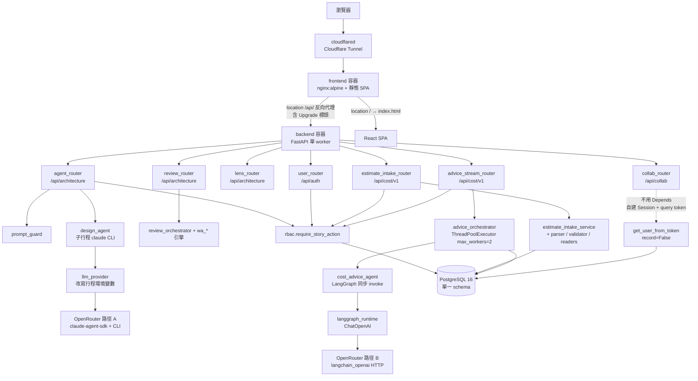
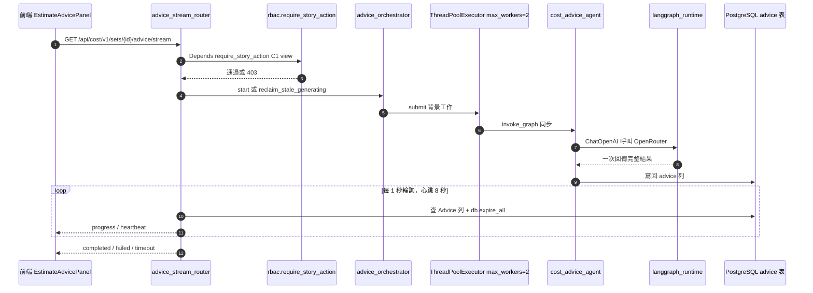
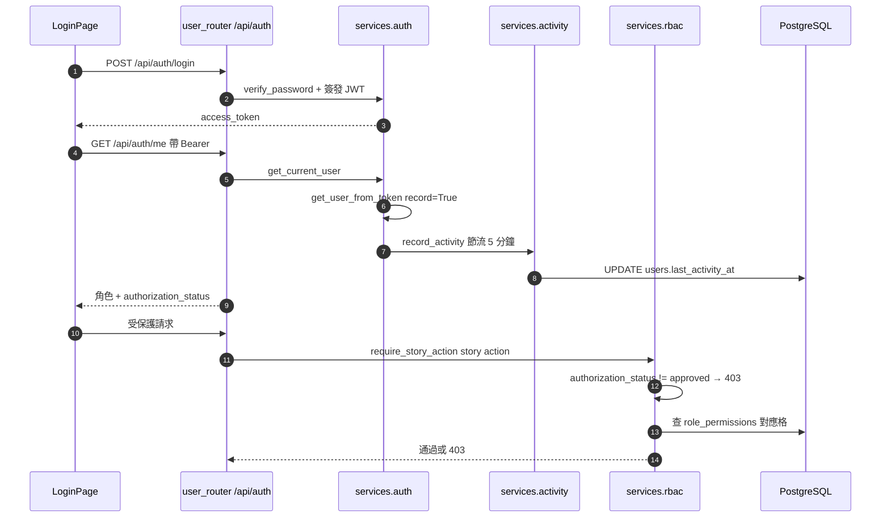
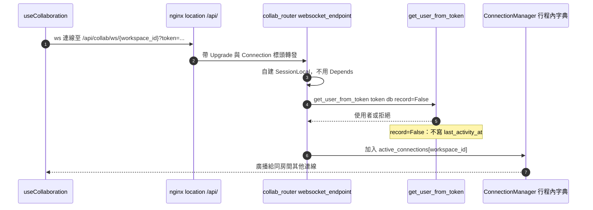

# Architecture — Cloud-360

> **基準**：`dc4b687`（2026-09-22）。深度分佈見 `reverse-engineering-timestamp.md`
> 的 `## Scope of Analysis`。證據標記慣例見 `business-overview.md` 檔頭。
> **本輪未以任何測試、lint 或 CI validator 的執行結果作為本 codekb 的事實來源**（唯一的例外是寫檔後跑過一次 `validate_repo_contract.py` 做落檔安全檢查，那不是對程式碼品質的判斷）。

## Architecture Analysis

### System Overview

Cloud-360 是一個 **兩層單體（backend 單體 ＋ frontend SPA）** 的多雲架構平台，
以 4 個容器組成 staging 堆疊，經 Cloudflare Tunnel 對外。後端把 A1／A3／A4／C1／J*
五條能力線全部收在**同一個 FastAPI 行程**內，以 7 個 router 掛在 5 個 URL prefix 下。

### Architectural Style

**Modular monolith（模組化單體）**，證據：

- 單一 FastAPI `app`，7 個 router 全部 `include_router` 進同一個 process `[讀]` `main.py:52–58`。
- 單一 `DATABASE_URL` 連線字串、單一 SQLAlchemy `Base`，**全樹無 `CREATE SCHEMA`、
  無 `search_path` 設定、無 `__table_args__ = {"schema": ...}`** `[算]`。
- 部署堆疊為 4 個服務：`db`、`backend`、`frontend`、`cloudflared`
  `[讀]` `deploy/docker-compose.deploy.yml:11–93`。**無訊息佇列、無快取層、無 Redis** `[算]`
  （全樹 13 個 `redis` 命中全部是領域內容——WA 規則建議文字、lens JSON、drawio 模板、
  AWS 服務清單 prompt——零基礎設施用途）。
- `backend/Dockerfile:36` 的 `CMD` 無 `--workers`，故為**單 worker 單行程** `[讀]`。

### Component Relationships

```mermaid
graph TD
    U["瀏覽器"] --> CF["cloudflared<br/>Cloudflare Tunnel"]
    CF --> NG["frontend 容器<br/>nginx:alpine + 靜態 SPA"]
    NG -->|"location /api/ 反向代理<br/>含 Upgrade 標頭"| BE["backend 容器<br/>FastAPI 單 worker"]
    NG -->|"location / → index.html"| SPA["React SPA"]

    BE --> R1["agent_router<br/>/api/architecture"]
    BE --> R2["review_router<br/>/api/architecture"]
    BE --> R3["lens_router<br/>/api/architecture"]
    BE --> R4["user_router<br/>/api/auth"]
    BE --> R5["collab_router<br/>/api/collab"]
    BE --> R6["estimate_intake_router<br/>/api/cost/v1"]
    BE --> R7["advice_stream_router<br/>/api/cost/v1"]

    R1 --> GUARD["prompt_guard"]
    R1 --> DA["design_agent<br/>子行程 claude CLI"]
    R2 --> RO["review_orchestrator + wa_* 引擎"]
    R6 --> EIS["estimate_intake_service<br/>+ parser / validator / readers"]
    R7 --> AO["advice_orchestrator<br/>ThreadPoolExecutor max_workers=2"]
    AO --> CAA["cost_advice_agent<br/>LangGraph 同步 invoke"]

    R1 --> RBAC["rbac.require_story_action"]
    R4 --> RBAC
    R6 --> RBAC
    R7 --> RBAC
    R5 -.->|"不用 Depends<br/>自建 Session + query token"| AUTHWS["get_user_from_token<br/>record=False"]

    DA --> LP["llm_provider<br/>改寫行程環境變數"]
    LP --> ORA["OpenRouter 路徑 A<br/>claude-agent-sdk + CLI"]
    CAA --> LGR["langgraph_runtime<br/>ChatOpenAI"]
    LGR --> ORB["OpenRouter 路徑 B<br/>langchain_openai HTTP"]

    RBAC --> DB[("PostgreSQL 16<br/>單一 schema")]
    EIS --> DB
    AO --> DB
    AUTHWS --> DB
```

<!-- Text fallback: 瀏覽器經 cloudflared 進入 frontend 容器（nginx）。nginx 的 location /api/ 反向代理到 backend 容器並帶 Upgrade 標頭（WebSocket 可用）；location / 回傳 SPA。backend 單一 FastAPI 行程掛 7 個 router：agent_router／review_router／lens_router 在 /api/architecture，user_router 在 /api/auth，collab_router 在 /api/collab，estimate_intake_router 與 advice_stream_router 在 /api/cost/v1。agent_router 走 prompt_guard 與 design_agent（子行程 claude CLI）；review_router 走 review_orchestrator 與 wa_* 引擎；estimate_intake_router 走 estimate_intake_service 與解析器群；advice_stream_router 走 advice_orchestrator（ThreadPoolExecutor max_workers=2）再到 cost_advice_agent（LangGraph 同步 invoke）。除 collab_router 外的 router 授權皆經 rbac.require_story_action；collab_router 的 WebSocket 不用 Depends，改自建 Session 並從 query string 取 token 呼叫 get_user_from_token(record=False)。LLM 有兩條互不相通的路徑：路徑 A 是 design_agent 經 llm_provider 改寫行程環境變數後驅動 claude-agent-sdk 子行程；路徑 B 是 cost_advice_agent 經 langgraph_runtime 的 ChatOpenAI 直打 OpenRouter HTTP。所有持久化落在單一 PostgreSQL 16 的單一 schema。 -->

### Data Flow

1. **認證**：登入 → JWT → 前端 36 處手寫 `Authorization: Bearer` 標頭 `[算]`。
   URL 一律經 `src/config/api.ts` 的 `apiUrl()` / `wsUrl()` `[讀]`。
2. **授權**：`require_story_action(story, action)` 為 FastAPI dependency，
   先擋 `authorization_status`，再查 `role_permissions` 表 `[讀]` `rbac.py:255–280`。
3. **活動記錄**：`get_user_from_token` 預設 `record=True`，會經 `activity.record_activity`
   以 5 分鐘節流更新 `users.last_activity_at` `[讀]` `auth.py:80–83`、`activity.py:25`。
4. **持久化**：13 個 ORM 模型 ＋ 1 個 association table（`diagram_shares`）`[讀]` `models.py`。
5. **Schema 演進**：`Base.metadata.create_all` 只建新表，既有表的 ALTER 由
   `init_db()` 的 6 支 `_ensure_*` 補丁承擔 `[讀]` `database.py:74–83`。

### Key Design Decisions

| 決定 | 證據 | 後果 |
|---|---|---|
| 授權全部掛在 dependency 層，service 層不再檢查角色 | `estimate_intake_router.py:52,82,95,108,123,132,142,152,163`、`advice_stream_router.py:165` 逐一 `[讀]` | 同進程直呼 service 函式會**完整繞過** RBAC；`estimate_intake_service.py` 內無第二道角色檢查（`estimate_access.py:29` 的 `can_view_set` 是 row-level 可見性，不是 role-level）`[簽]` |
| API 契約以 `openapi.json` 為單一真實來源，雙向閘門 | `ci.yml:256–260` 後端 dump `--check`；`ci.yml:197–198` 前端 `check:types` `[讀]` | 新 REST 端點必須在同一個 PR 重 dump 規格並重產 `api.d.ts`（2,823 行、已 commit） |
| `fastapi[standard]==0.141.1`、`pydantic==2.13.4` 精確釘選 | `requirements.txt:1–9` 的註解自述理由 `[讀]` | 為了讓 OpenAPI dump 位元決定性；升版即可能讓漂移閘門誤報 |
| `VITE_API_BASE_URL` 是**建置期** build arg | `deploy/docker-compose.deploy.yml:71–73`、`frontend/Dockerfile:12–15` `[讀]` | 改對外 URL 必須重建 frontend image，不是改環境變數 |
| backend image 內含 Node 22 與 `@anthropic-ai/claude-code` CLI | `backend/Dockerfile:3–18` `[讀]` | A1／A3 的 LLM 路徑是子行程；CLI 缺席會在**請求時**而非建置時失敗 |
| 單 worker 假設 | `backend/Dockerfile:36` 無 `--workers` `[讀]` | 三處行程內狀態容器因此成立（見「架構約束」） |

### Improvement Opportunities

1. 把 `advice_orchestrator` 的 job 狀態與 `collab_router` 的連線字典外部化，
   解除單 worker 假設（本 intent 若引入 Redis，這是順勢可解的）。
2. 為 WebSocket 建立一套等同 OpenAPI 的契約宣告與漂移閘門（目前完全沒有）。
3. 收斂兩套 LLM 客戶端棧對「預設模型名稱」的兩份物化。
4. 為 backend 補上 linter／type checker（目前三者皆無）。

---

## Interaction Diagrams

本節以三筆真實業務交易說明元件如何協作。三張圖的事實皆為本輪 `[讀]`。

### 交易一：C1 估價建議的產生與串流（與本 intent 最相關）

```mermaid
sequenceDiagram
    autonumber
    participant FE as 前端 EstimateAdvicePanel
    participant SSE as advice_stream_router
    participant RB as rbac.require_story_action
    participant ORCH as advice_orchestrator
    participant POOL as ThreadPoolExecutor max_workers=2
    participant AG as cost_advice_agent
    participant LG as langgraph_runtime
    participant DB as PostgreSQL advice 表

    FE->>SSE: GET /api/cost/v1/sets/{id}/advice/stream
    SSE->>RB: Depends require_story_action C1 view
    RB-->>SSE: 通過或 403
    SSE->>ORCH: start 或 reclaim_stale_generating
    ORCH->>POOL: submit 背景工作
    POOL->>AG: invoke_graph 同步
    AG->>LG: ChatOpenAI 呼叫 OpenRouter
    LG-->>AG: 一次回傳完整結果
    AG->>DB: 寫回 advice 列
    loop 每 1 秒輪詢，心跳 8 秒
        SSE->>DB: 查 Advice 列 + db.expire_all
        SSE-->>FE: progress / heartbeat
    end
    SSE-->>FE: completed / failed / timeout
```

<!-- Text fallback: 前端對 advice_stream_router 發出 GET /api/cost/v1/sets/{id}/advice/stream。該端點以 FastAPI dependency require_story_action("C1","view") 授權，通過或 403。接著呼叫 advice_orchestrator 啟動或回收停滯工作，orchestrator 把工作 submit 進 ThreadPoolExecutor（max_workers=2），工作執行緒呼叫 cost_advice_agent 的 invoke_graph——同步 invoke，不是 astream——agent 透過 langgraph_runtime 的 ChatOpenAI 呼叫 OpenRouter，一次回傳完整結果並寫回 advice 資料表。同時 SSE router 以每秒一輪的 while 迴圈查詢 advice 列並 expire_all，送出 progress 或 heartbeat（心跳 8 秒），最後送出 completed、failed 或 timeout。全程沒有任何 token 級增量。 -->

**這張圖對本 intent 的意義**：C1 的「串流」是 **DB 輪詢的狀態事件**，事件型別只有
`progress` / `completed` / `failed` / `timeout` / `heartbeat` 五種
`[讀]` `advice_stream_router.py:81–158`，心跳常數 `HEARTBEAT_SECONDS = 8.0`（`:25`），
逾時 `TIMEOUT = timedelta(minutes=5)`（`advice_orchestrator.py:19`）。
真正的 LLM 呼叫是 `cost_advice_agent.py:156` 的 `invoke_graph(compiled, {...})`——
**同步 `invoke`，不是 `astream`**。**大腦要「逐字轉送」成本查詢進度時，來源端沒有逐字可轉。**

### 交易二：登入與 RBAC 判定鏈

```mermaid
sequenceDiagram
    autonumber
    participant FE as LoginPage
    participant UR as user_router /api/auth
    participant AUTH as services.auth
    participant ACT as services.activity
    participant RB as services.rbac
    participant DB as PostgreSQL

    FE->>UR: POST /api/auth/login
    UR->>AUTH: verify_password + 簽發 JWT
    AUTH-->>FE: access_token
    FE->>UR: GET /api/auth/me 帶 Bearer
    UR->>AUTH: get_current_user
    AUTH->>AUTH: get_user_from_token record=True
    AUTH->>ACT: record_activity 節流 5 分鐘
    ACT->>DB: UPDATE users.last_activity_at
    UR-->>FE: 角色 + authorization_status
    FE->>UR: 受保護請求
    UR->>RB: require_story_action story action
    RB->>RB: authorization_status != approved → 403
    RB->>DB: 查 role_permissions 對應格
    RB-->>UR: 通過或 403
```

<!-- Text fallback: 前端 LoginPage 對 /api/auth/login 送出帳密，user_router 交給 services.auth 驗證並簽發 JWT。前端以 Bearer 呼叫 /api/auth/me，auth 的 get_current_user 走 get_user_from_token（record=True），順帶呼叫 services.activity 的 record_activity，以 5 分鐘節流更新 users.last_activity_at。之後每個受保護請求經 rbac.require_story_action：先檢查 authorization_status 是否為 approved，不是就直接 403；是則查 role_permissions 表對應的 (角色, story) 格，決定通過或 403。 -->

### 交易三：A4 共編的 WebSocket 握手（既有唯一 WS 前例）

```mermaid
sequenceDiagram
    autonumber
    participant FE as useCollaboration
    participant NX as nginx location /api/
    participant WS as collab_router websocket_endpoint
    participant AUTH as get_user_from_token
    participant CM as ConnectionManager 行程內字典

    FE->>NX: ws 連線至 /api/collab/ws/{workspace_id}?token=...
    NX->>WS: 帶 Upgrade 與 Connection 標頭轉發
    WS->>WS: 自建 SessionLocal，不用 Depends
    WS->>AUTH: get_user_from_token token db record=False
    AUTH-->>WS: 使用者或拒絕
    Note over AUTH: record=False：不寫 last_activity_at
    WS->>CM: 加入 active_connections[workspace_id]
    CM-->>FE: 廣播給同房間其他連線
```

<!-- Text fallback: 前端 useCollaboration 對 /api/collab/ws/{workspace_id}?token=... 建立 WebSocket。nginx 的 location /api/ 帶 Upgrade 與 Connection 標頭轉發。collab_router 的 websocket_endpoint 不使用 FastAPI Depends，而是自建 SessionLocal，從 query string 取 token，呼叫 get_user_from_token(token, db, record=False)。record=False 使這條路徑跳過 last_activity_at 的寫入。認證通過後把連線加入 ConnectionManager 的行程內字典 active_connections，並向同房間其他連線廣播。 -->

---

## 架構約束（給下游 stage 的檢查清單）

### 約束一：WebSocket 必須掛在 `/api/` 之下

`frontend/nginx.conf:16–32` **只有** `location /api/` 帶
`proxy_set_header Upgrade` 與 `Connection $connection_upgrade` `[讀]`；
`$connection_upgrade` 的 `map` 是在 `frontend/Dockerfile:21–23` 以 `printf` 寫進
`/etc/nginx/conf.d/upgrade-map.conf` 的 `[讀]`。`deploy/cloudflared/config.yml:17–18`
已為 WS 設 `tcpKeepAlive: 30s` `[讀]`。**`location /` 走 `try_files … /index.html`，
WS 握手落在那裡會直接拿到 HTML。** 網路路徑已通，但位置不可自由選。

### 約束二：新 WebSocket 契約沒有任何機械閘門（**本輪新發現的風險**）

`/api/collab/ws/{workspace_id}` 存在於程式（`collab_router.py:266`）但**不在
`openapi.json` 的 42 個 path 內** `[算]`——FastAPI 不登錄 websocket route。
結論：`dump_openapi.py --check` 與 `npm run check:types` 兩道漂移閘門
**對 WebSocket 契約完全無效**。本 intent 規劃的新 WebSocket 因此
**一道契約閘門都不過**；`team.md` 記載的「`tsc -b` 對前後端 schema 落差無效」
在 WS 這條路上完整成立，且連 OpenAPI 這個補救都不存在。

### 約束三：WebSocket 會靜默停止更新「最後活動時間」（**本輪新發現的風險**）

既有 WS 前例呼叫 `get_user_from_token(..., record=False)` `[讀]` `collab_router.py:257`，
跳過 `auth.py:80–83` 的 `record_activity`。**若大腦以 WS 為主要互動通道，
`users.last_activity_at` 這個既有能力會對大腦使用者靜默失效**——這是一條
不會有任何錯誤訊息的既有功能迴歸。另：token 放在 query string 會進
nginx／cloudflared 的 access log，新 WS 若照抄即承接同一個暴露面
（對應 ADR-0006 的 audit logging 與 network exposure 兩個面向）。

### 約束四：單行程假設散佈在三處狀態容器

| 位置 | 內容 | 證據 |
|---|---|---|
| `collab_router.py:58–59` | `ConnectionManager.active_connections: Dict[str, List[WebSocket]]` | `[讀]` |
| `advice_orchestrator.py:21–26` | `_executor`、`_progress`、`_inflight` 皆模組層全域 | `[讀]` |
| `pricing_client.py:29` | 磁碟快取 `backend/cost/.pricing_offer_cache/`（容器本地） | `[讀]` 檔頭 |

三者目前成立**只因為**單 worker。`advice_stream_router.py:59–78` 的 `_progress_event`
直接呼叫 `orch.get_progress()`（只讀本行程記憶體，`advice_orchestrator.py:75–77`）。
**任何多 worker／多副本化會同時打破三者**：同一個 estimate set 的 SSE 連線可能落在
沒有該 job 進度的行程上，畫面停在 `progress` 而永不 `completed`。

### 約束五：LangGraph runtime 已支援串流，只是沒人用（**本輪新發現，修正一項常見誤述**）

`langgraph_runtime.py:133–149` 有 `astream_graph`，但**全樹零消費者**
`[算]`（grep `astream_graph` 僅命中定義檔與 `test_langgraph_runtime.py`）。
**「既有 runtime 不能串流」是錯的說法**，不可拿來當自建第二個 runtime 的理由。
成立的理由是「避免與 C1 的同步 `invoke` 契約互相牽制」。

### 約束六：新資料模型無法靠 `schema_rbac.sql` 上線

`schema_rbac.sql` 只在**空 data volume** 上執行（`deploy/docker-compose.deploy.yml:21–23`
的註解逐字說明）`[讀]`，且 L319 有裸的 `DELETE FROM role_permissions;`——
對既有 staging 重跑會抹掉管理者的人工調整。既有環境的唯一演進路徑是
`backend/database.py` 的 6 支 `_ensure_*` 補丁，而它們**全部以
`except Exception as e: logger.warning(...)` 吞掉失敗**
`[讀]` `database.py:204–209`、`:251–256`、`:321–326`、`:493–500`、`:519–526`。
`project.md` 的 blocking 規則（`schema_rbac.sql` ＋ `DEPLOY.md` 同步）仍須照做，
但那是**新環境**的來源，不是**既有環境**的遷移手段。

### 約束七：獨立 schema 在本 repo 零前例、且現有測試基礎設施無法驗證（**本輪新發現的風險**）

全樹無 `CREATE SCHEMA`、無 `search_path` `[算]`；`DATABASE_URL` 為單一連線字串
（`database.py:22–24`）`[讀]`。測試路徑以 `tests/helpers.py` 的
`sys.modules.setdefault("psycopg2", MagicMock())` 換掉驅動、改走 **in-memory SQLite**，
而 **SQLite 沒有 PostgreSQL 的 schema 概念** `[簽]`。本 intent 的「同一資料庫、
獨立 schema」因此**既無前例、也無測試路徑**——這是下游必須正面處理的驗證缺口，
不是可以順帶帶過的實作細節。

### 約束八：Redis 是全新的第 5 個服務，會觸發 env contract blocking 規則

現有 deploy stack 為 4 個服務 `[讀]`。加第 5 個時，新環境變數必須在**同一個 PR** 內
讓 `deploy/render-env.sh`（L73–98 的 heredoc）寫它、`deploy/.env.example` 列它，
否則 `scripts/validate_env_contract.py` 紅燈。另注意 `render-env.sh:59–69`
會拒絕任何含 `$` 的憑證值（compose 會對 `--env-file` 的值做內插而無聲截斷）`[讀]`。

### 約束九：第三個 OpenRouter 入口，不是第二個

路徑 A（`claude-agent-sdk` ＋ CLI 子行程，消費者為 `design_agent`／`review_agent`／lens）
與路徑 B（`langchain_openai.ChatOpenAI`，消費者為 `cost_advice_agent`）已並存 `[讀]`。
大腦自建 runtime 後實際會是**三份**。具體耦合風險：
`llm_provider.configure_provider_env()` 會**改寫整個行程的環境變數**
（`:126–142` 會把 `ANTHROPIC_API_KEY` 設為空字串、`setdefault` `ANTHROPIC_BASE_URL`），
且它在**每個** A1／A3 請求都被呼叫（`agent_router.py:74`）`[讀]`。
`langgraph_runtime.py:61–68` 讀的是 `OPENROUTER_API_KEY`，目前不受影響——
但兩者共用同一個行程環境，新增第三份客戶端時這個耦合必須被明寫。

### 約束十：`backend/` 內新增模組可能誤觸兩支 import 邊界 validator

`scripts/validate_cost_calculator_boundary.py:15–24` 禁止 `estimate_parser.py` /
`estimate_validator.py` / `estimate_readers.py` **及其遞移 import 的同套件模組**
出現 `httpx|requests|sqlalchemy|fastapi`（以 AST 遞移追 import）`[讀]` 檔頭；
`validate_pricing_lookup_boundary.py:20–31,33–48` 禁止 4 支 intake 寫入路徑模組
import `pricing_client`／`pricing_sdk`，並**掃全 `backend/`** 禁止白名單
（8 支 `cost/pricing_*` 與 `cost/config.py`）以外的模組硬編 3 個計價 host `[讀]` 檔頭。
兩者都在 CI 的 `repo-contract` job 阻擋。
