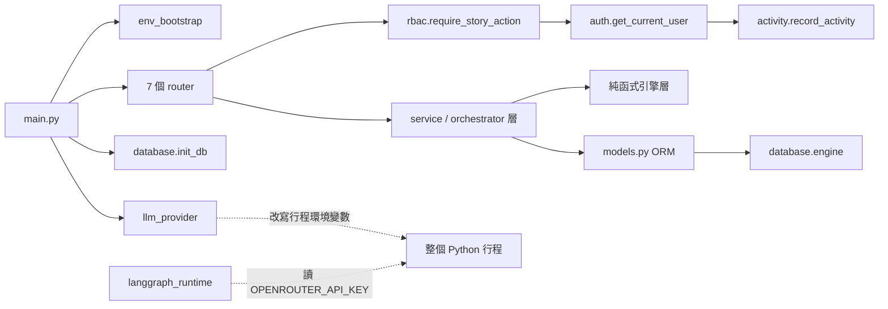

# Dependencies — Cloud-360

> **基準**：`dc4b687`（2026-09-22）。證據標記慣例見 `business-overview.md` 檔頭。
> **套件版本清單不在本檔重複**，見 `technology-stack.md`；本檔記載的是**耦合關係**
> ——誰依賴誰、依賴透過什麼機制成立、斷掉時會怎麼失敗。

## 外部執行期依賴（非套件）

| 依賴 | 用途 | 失敗模式 | 證據 |
|---|---|---|---|
| **OpenRouter** | 兩條 LLM 路徑的共同後端 | 兩條路徑各自失敗，錯誤形狀不同 | `[讀]` `llm_provider.py`、`langgraph_runtime.py:61–68` |
| **`claude` CLI 子行程** | A1／A3 的 LLM 執行載體，打包在 backend image 內 | **缺席時在請求時失敗，不是建置時** | `[讀]` `backend/Dockerfile:3–18` |
| **n8n webhook** | 架構圖 icon 取得 | 曾因 `N8N_USER`／`N8N_PASSWORD` 未被寫入 `deploy/.env` 而**靜默退回灰底佔位圖** | 規則層（`project.md` 記載的實例） |
| **PostgreSQL** | 全部持久化，單一 `DATABASE_URL` | 啟動補丁失敗只留 warning，應用照常啟動 | `[讀]` `database.py:22–24` |
| **Cloudflare Tunnel** | staging 對外唯一入口，已為 WS 設 `tcpKeepAlive: 30s` | — | `[讀]` `deploy/cloudflared/config.yml:17–18` |
| **Kiwi TCMS**（`tcms.danniel.cc`） | 測案同步，由 `scripts/tcms_*.py` 觸發 | `~/.tcms.conf` 不存在時不得靜默跳過 | 規則層 |
| **GitHub Actions ＋ self-hosted runner** | CI 與 CD | `deploy.yml` 綁 `[self-hosted, linux, x64, cloud360]` 標籤 | `[未驗，僅讀骨架]` |

## 建置期耦合（本輪實讀，皆為真實存在的耦合而非套件圖）

| 依賴邊 | 機制 | 斷掉的後果 | 證據 |
|---|---|---|---|
| `backend` → `schema_rbac.sql` | compose 以 `../schema_rbac.sql:/docker-entrypoint-initdb.d/01-schema_rbac.sql:ro` 掛進 postgres | **僅在空 data volume 上執行**；既有環境完全不會跑到它 | `[讀]` `deploy/docker-compose.deploy.yml:23`，註解在 `:21–22` |
| `frontend` → `PUBLIC_URL` | `VITE_API_BASE_URL` 是**建置期** build arg，Vite 內聯 | 改對外 URL 必須**重建 image**，不是改環境變數 | `[讀]` `deploy/docker-compose.deploy.yml:71–73`、`frontend/Dockerfile:12–15` |
| `openapi.json` ↔ `frontend/src/types/api.d.ts` | 兩道互補的漂移閘門 | 規格與程式或型別檔不同步即 CI 紅燈 | `[讀]` `ci.yml:256–260`（後端 `dump_openapi.py --check`）、`ci.yml:197–198`（前端 `check:types`） |
| `fastapi`／`pydantic` 精確釘選 → OpenAPI dump | 版本變動會改變 dump 的位元輸出 | 升版即可能讓漂移閘門誤報 | `[讀]` `requirements.txt:1–9` |
| `backend` image → Node 22 ＋ `claude` CLI | `design_agent` 以子行程驅動 | 見上表 | `[讀]` |

## 環境設定的三個分離範圍（blocking 規則，`validate_env_contract.py` 在 CI 執行）

| 範圍 | 設定來源 | 消費者 |
|---|---|---|
| 本機 dev | `backend/.env`、`frontend/.env`（範本 `*.env.example`） | bare-metal uvicorn ＋ vite |
| CI 測試 | `deploy/docker-compose.test.yml`（值全內嵌且有預設） | `ui-regression` 短生命週期 stack |
| 部署 | `deploy/.env`（**唯一產生點**為 `deploy/render-env.sh`，範本 `deploy/.env.example`） | `deploy/docker-compose.deploy.yml` |

三項本輪實讀確認的硬性條款 `[讀]`：

1. `deploy.yml` 的 deploy 與 rollback **兩個 job 都必須呼叫 `render-env.sh`**，不得任一 job 自行寫 `deploy/.env`。
2. **新增 compose 消費的變數時，同一個 PR 必須讓 `render-env.sh`（`:73–98` 的 heredoc）寫它、
   `deploy/.env.example` 列它。** 失敗模式無聲：無 fallback 的變數缺值時只會變成空字串，
   服務照常啟動但功能降級。
3. **憑證不得含 `$`**：compose 會對 `--env-file` 的值做內插而無聲截斷；
   `render-env.sh:59–69` 已對此擋下並要求改用 `openssl rand -hex 32` 產生。

## 內部跨模組依賴（重點邊）

<!-- Text fallback: main.py 依賴 env_bootstrap、llm_provider、database.init_db 與 7 個 router。router 依賴 rbac.require_story_action，後者依賴 auth.get_current_user，後者依賴 activity.record_activity。router 也依賴 service／orchestrator 層，該層依賴純函式引擎層與 models.py 的 ORM，ORM 依賴 database.engine。額外一條虛線耦合：llm_provider 會改寫整個 Python 行程的環境變數，而 langgraph_runtime 從同一個行程環境讀 OPENROUTER_API_KEY——兩者共用同一份行程狀態。 -->

### 兩套並存的 LLM 客戶端棧（本輪實讀）

| 路徑 | 技術鏈 | 消費者 | 預設模型名稱寫在哪 |
|---|---|---|---|
| A | `claude-agent-sdk` → 子行程 `claude` CLI → OpenRouter；環境由 `llm_provider.configure_provider_env()` 調教（`:114–142`） | `design_agent`、`review_agent`、lens 相關模組 | `llm_provider.py:75` |
| B | `langchain_openai.ChatOpenAI` → OpenRouter HTTP，由 `langgraph_runtime.py:71–98` 建立 | `cost/cost_advice_agent.py:132–162` | `langgraph_runtime.py:17` |

**同一個事實兩份物化，無任何測試鎖住兩者一致** `[讀]`。本 intent 自建 runtime 後
會是**第三份**，且必須處理一個具體耦合：`configure_provider_env()` 會在**每個**
A1／A3 請求被呼叫（`agent_router.py:74`）並改寫整個行程的 `ANTHROPIC_*` 環境變數
（`:126–142`）；路徑 B 讀的是 `OPENROUTER_API_KEY`，目前不受影響，但兩者共用同一個行程環境。

### CI 阻擋的 import 邊界（新模組必須先確認不會誤觸）

| Validator | 禁止內容 | 掃描方式 | 證據 |
|---|---|---|---|
| `scripts/validate_cost_calculator_boundary.py` | `estimate_parser` / `estimate_validator` / `estimate_readers` **及其遞移 import 的同套件模組**不得出現 `httpx｜requests｜sqlalchemy｜fastapi` | AST 遞移追 import（`:15–24`） | `[讀]` 檔頭 |
| `scripts/validate_pricing_lookup_boundary.py` | 4 支 intake 寫入路徑模組不得 import `pricing_client`／`pricing_sdk`（`:20–31`）；**全 `backend/`** 除白名單（8 支 `cost/pricing_*` ＋ `cost/config.py`）外不得硬編 3 個計價 host（`:33–48`） | 掃全 `backend/` 字串 | `[讀]` 檔頭 |

## 依賴面的已知風險

1. **backend 無 lockfile**：CI／Docker build／staging 部署三處各自解析當下最新版，
   可能彼此不同 `[算]`。
2. **`cloudflare/cloudflared:latest` 未釘選** `[讀]`：上游變動會直接進部署。
3. **權限清單三份物化，無一致性測試** `[讀]`：正本 `rbac.py:23–35` 的 `CANONICAL_ROLES`；
   副本 1 為 `auth.py:108–112` 的 11 個手寫字串 allowlist；副本 2 為 `schema_rbac.sql`
   L321+ 的 308 列 INSERT（與 `rbac_seed_data.py` 的 `DEFAULT_ROLE_PERMISSIONS` 互為兩份）。
   `rbac_seed_data.py` 檔頭自述「由 `schema_rbac.sql` 產生（勿手改；改 SQL 後重跑產生腳本）」，
   而**該產生腳本不在 `scripts/` 內** `[算]`——此宣稱目前無對應檔案。
4. **Secret 掃描的作用域小於規則所宣稱**：`validate_no_obvious_secrets()` 只讀
   `contract_files()`（repo 層必要檔 ＋ baseline record 必要檔 ＋ audit shard），
   `backend/`、`frontend/`、`deploy/`、`schema_rbac.sql`、任何 `.env.example`
   **都不在其中**。本輪未複驗此點，沿用既有記載 `[未驗]`。
