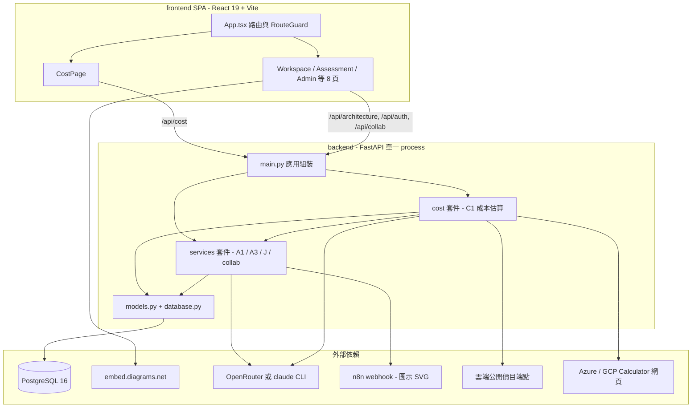
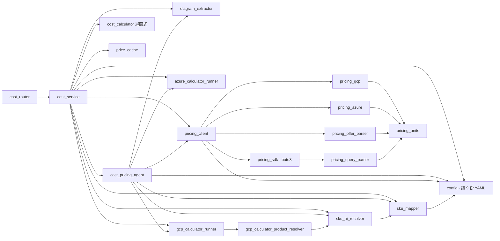
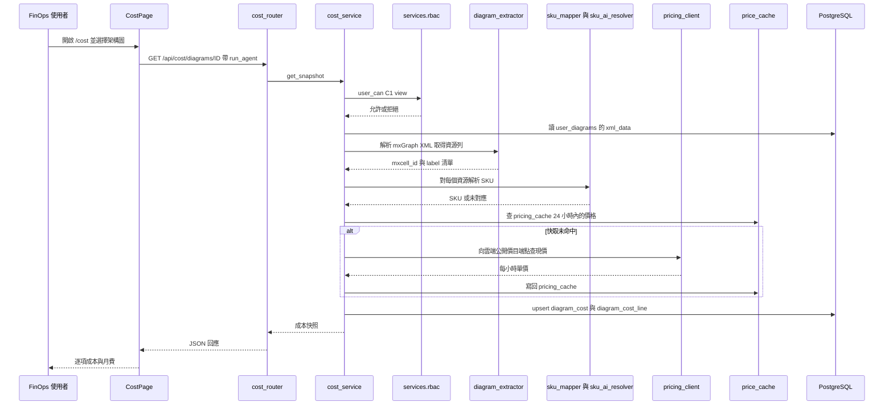
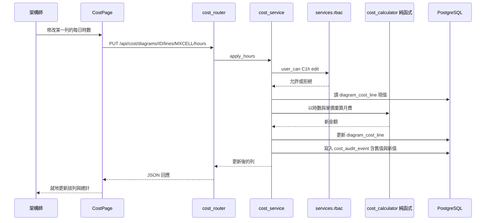
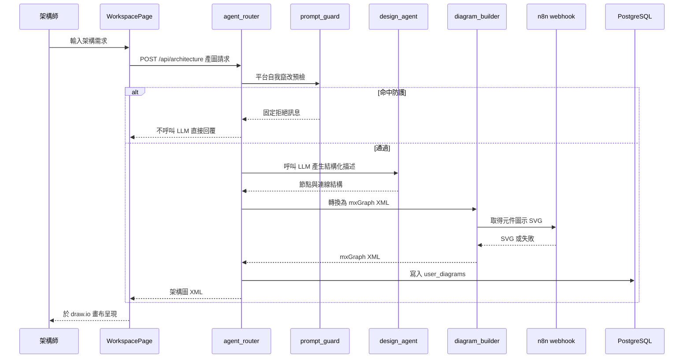

# 系統架構（Architecture）

> Reverse Engineering 合成產物｜repo `cloud`｜工作樹掃描日 2026-09-16｜intent `260916-estimate-upload-rework`｜mode **Full rescan**
> 每個 Mermaid 區塊都附文字 fallback（ADR-0009 與 `team.md` `## Mandated` 的內容驗證要求）。

## 架構風格

**模組化單體（Modular Monolith）＋ SPA 前端**，證據如下：

- 單一 FastAPI process 掛載 6 個 router 到 5 個 URL 前綴（`backend/main.py:51-56`），沒有跨 process 的服務邊界、沒有訊息佇列、沒有服務間 HTTP 呼叫。
- 單一 PostgreSQL 資料庫由所有領域共用（11 張 ORM 表，見 `code-structure.md`）；領域之間以 Python import 直接耦合，不是以契約解耦。
- 部署為 4 個容器（db、backend、frontend、cloudflared），一次整包上線（`deploy/docker-compose.deploy.yml`）。

模組邊界的清晰度**依領域而異**，這是既成事實而非待修違規：`cost`、`review`／`lens`／`wa_*` 家族有清楚的 router → service → 純函式三層；`user`／`collab` 家族的商業邏輯直寫在 handler 裡。

## 元件關係總覽

**文字 fallback**：前端 SPA 由 `App.tsx` 的路由表與 `RouteGuard` 分派到 9 個頁面，其中 `CostPage` 打 `/api/cost`，其餘頁面打 `/api/architecture`、`/api/auth`、`/api/collab`。後端 `main.py` 同時掛載 `cost` 套件與 `services` 套件；`cost` 單向依賴 `services`（授權、LLM provider、XML 清理），`services` 不反向依賴 `cost`。兩者都經 `models.py`／`database.py` 存取同一個 PostgreSQL。外部依賴中，draw.io 由前端直連，LLM、n8n、雲端公開價目端點與 Azure／GCP Calculator 網頁由後端呼叫。

## `backend/cost/` 內部結構

**文字 fallback**：`cost_router` 是唯一 HTTP 入口，單向呼叫 `cost_service`；`cost_service` 是扇出最廣的協調層（10 條內部邊）；`config` 是扇入最廣的葉節點（12 個模組引用，於 import 時載入 9 份 YAML）；`cost_calculator` 是唯一零相依的純函式模組（ADR-0006 property-based testing 的落點）；`pricing_client` 之下分為 GCP、Azure、offer parser 與 boto3 SDK 四條查價支線，四者最終都收斂到 `pricing_units`。套件內**未偵測到循環引用**。完整的正反向相依表在 `dependencies.md`。

## 互動圖（Interaction Diagrams）

以下三張圖描述跨元件的實際業務交易。

### 交易一：C1 取得架構圖成本快照

**文字 fallback**：使用者在 `/cost` 選圖後，前端呼叫 `GET /api/cost/diagrams/ID`。`cost_router` 轉交 `cost_service`，後者先經 `services.rbac.user_can` 檢查 `C1.view`，再從 `user_diagrams` 取出 mxGraph XML 交給 `diagram_extractor` 解析成資源列，逐項以 `sku_mapper`（YAML 規則）或 `sku_ai_resolver`（LLM）解析 SKU。價格先查 `pricing_cache`（24 小時 TTL），未命中才經 `pricing_client` 向雲端公開價目端點取價並寫回快取。結果 upsert 進 `diagram_cost`／`diagram_cost_line` 後回傳。`run_agent` 查詢參數預設為 `true`，會額外觸發 `cost_pricing_agent`。

### 交易二：調整每日時數與稽核

**文字 fallback**：時數、區域、SKU、單價覆寫四種寫入操作共用同一形狀——router 轉交 service、service 檢查對應故事權限（`C1h`／`C1r`／`C1o` 的 `edit`）、讀現值、交由純函式 `cost_calculator` 重算、更新 `diagram_cost_line`，並把「誰、何時、舊值、新值」寫進 `cost_audit_event`。稽核寫入與資料更新在同一交易內，沒有非同步補寫路徑。

### 交易三：A1 從自然語言到架構圖

**文字 fallback**：A1 產圖請求先過 `prompt_guard` 的平台自我竄改預檢（命中則不呼叫 LLM，回固定拒絕訊息，見 `project.md` `## Mandated`）；通過後由 `design_agent` 呼叫 LLM 取得結構化描述，`diagram_builder` 轉成 mxGraph XML 並向 n8n webhook 取元件圖示 SVG（失敗則降級為灰底佔位圖），最後寫入 `user_diagrams` 並回傳給前端於 draw.io 畫布呈現。C1 的估價正是消費這份 XML。

## 資料流與持久化

- **唯一寫入路徑**：所有 DDL 有兩個真實來源——`schema_rbac.sql`（僅在空 volume 經 `docker-entrypoint-initdb.d` 生效）與 `backend/database.py` 的 5 支 `_ensure_*_schema()` 啟動補丁（既有環境靠它升級）。兩者必須手動保持一致，沒有機械檢查。
- **成本相關 4 張表**（`diagram_cost`、`diagram_cost_line`、`pricing_cache`、`cost_audit_event`）只存在於 `schema_rbac.sql:169-212` 與 `_ensure_cost_schema()`（`database.py:329-395`）；`schema.sql` **完全沒有**成本 DDL。
- **雙層快取重疊**：`pricing_client` 在 `backend/cost/.pricing_offer_cache/` 寫 24 小時磁碟快取，`price_cache` 又在 `pricing_cache` 表寫 24 小時快取，兩套 TTL 各自為政。

## 關鍵設計決策與其後果

| 決策 | 位置 | 後果 |
|---|---|---|
| 成本域採 router → service → 純函式三層＋獨立 pricing port | `cost_router`／`cost_service`／`cost_calculator`／`pricing_client` | ADR-0006 的 PBT 約束有明確落點；`validate_cost_calculator_boundary.py` 以硬編碼路徑機械強制純函式層不得 import `httpx`／`requests`／`sqlalchemy`／`fastapi` |
| 成本套件放在 `backend/cost/` 而非 `backend/services/` 之下 | 目錄結構 | 相依方向單向為 `main → cost → services`；`services` 無任何模組 import `cost.*`，退役面的耦合因此極窄 |
| OpenAPI 與前端型別以 CI drift 閘門綁定 | `dump_openapi.py --check`、`npm run check:types` | 任何端點變更必須在同一 PR 重產 `openapi.json` 與 `frontend/src/types/api.d.ts` |
| Agent 以 in-process MCP server 暴露工具 | `cost_pricing_agent.py:43-49` | `cloud360-cost` 的 3 個 tool 是 agent 介面的唯一契約定義，遷移框架時必須逐一對應 |
| 根路徑導向以 C1 為第一順位 | `frontend/src/App.tsx:24` | 成本頁同時是 FinOps 角色的落地頁，存廢變更會改變登入後行為 |

## 架構強化機會

1. **DDL 單一真實來源**：`schema_rbac.sql` 與 `_ensure_*_schema()` 的重複應收斂為單一來源或加上一致性檢查。
2. **跨模組私有函式引用**：`cost_service.py:43` 引用 `services.collab_router._user_can_access_diagram` 與 `_visible_diagrams`，破壞封裝；授權來源應提升為公開介面。
3. **快取層重疊**：磁碟快取與 DB 快取應擇一，或明確定義兩者的職責分界。
4. **God module**：`diagram_builder.py`（1,818 行）、`gcp_calculator_runner.py`（979 行）、`wa_rule_engine.py`（973 行）等已達難以測試的規模，清單與行數見 `code-quality-assessment.md`。
