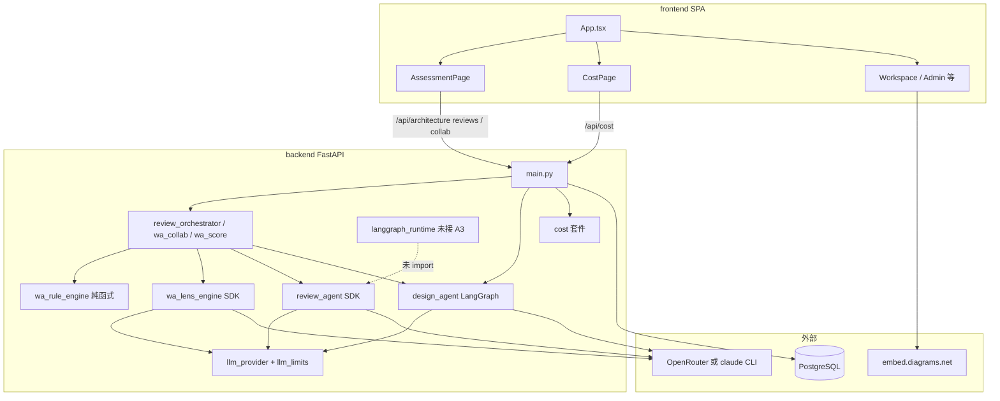
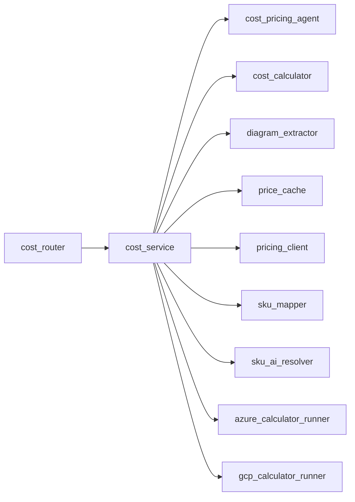
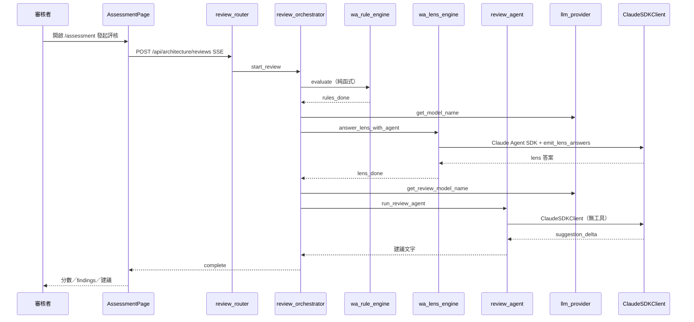
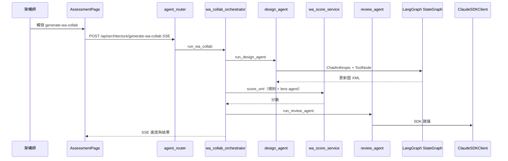
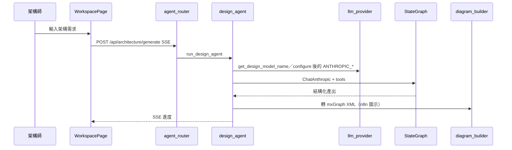

# 系統架構（Architecture）

> Reverse Engineering 合成產物｜repo `cloud`｜掃描日 2026-10-01｜intent `261001-a2-langgraph`｜mode **Focused merge（STALE）**
> 每個 Mermaid 區塊都附文字 fallback。成本內部結構圖保留自前一版；本輪新增 Assessment／Design agent 互動圖。

## 架構風格

**模組化單體（Modular Monolith）＋ SPA 前端**：

- 單一 FastAPI process 掛載 router（`backend/main.py`）：`agent_router`／`review_router`／`lens_router` → `/api/architecture`；`collab_router` → `/api/collab`；另含 cost／auth。
- 單一 PostgreSQL；部署 4 容器一次整包上線。
- Agent 執行呈現**雙框架並存**：Design＝LangGraph；Review／Lens（及 C1 `cost_pricing_agent`）＝Claude Agent SDK。

## 元件關係總覽

```mermaid
graph TD
  subgraph FE["frontend SPA"]
    ROUTES["App.tsx"]
    ASSESS["AssessmentPage"]
    COSTPAGE["CostPage"]
    OTHER["Workspace / Admin 等"]
  end

  subgraph BE["backend FastAPI"]
    MAIN["main.py"]
    DESIGN["design_agent LangGraph"]
    REVIEW["review_agent SDK"]
    LENS["wa_lens_engine SDK"]
    RULES["wa_rule_engine 純函式"]
    ORCH["review_orchestrator / wa_collab / wa_score"]
    LGHELPER["langgraph_runtime 未接 A3"]
    LLM["llm_provider + llm_limits"]
    COST["cost 套件"]
  end

  subgraph EXT["外部"]
    PG[("PostgreSQL")]
    OR["OpenRouter 或 claude CLI"]
    DRAWIO["embed.diagrams.net"]
  end

  ROUTES --> ASSESS
  ROUTES --> COSTPAGE
  ROUTES --> OTHER
  ASSESS -->|"/api/architecture reviews / collab"| MAIN
  COSTPAGE -->|"/api/cost"| MAIN
  MAIN --> ORCH
  MAIN --> DESIGN
  MAIN --> COST
  ORCH --> RULES
  ORCH --> LENS
  ORCH --> REVIEW
  ORCH --> DESIGN
  DESIGN --> LLM
  REVIEW --> LLM
  LENS --> LLM
  LGHELPER -.->|"未 import"| REVIEW
  MAIN --> PG
  DESIGN --> OR
  REVIEW --> OR
  LENS --> OR
  OTHER --> DRAWIO
```

**文字 fallback**：Assessment 經 `/api/architecture` 進入 `review_orchestrator`／`wa_collab_orchestrator`；規則評分為純函式，Lens／Review 走 Claude Agent SDK，Design 走 LangGraph。`langgraph_runtime` 與 Assessment 斷開。模型與認證由 `llm_provider`／`llm_limits` 統一配置（SDK 路徑另經 `agent_sdk_env`）。成本套件仍單向依賴 `services`。

## `backend/cost/` 內部結構（前一版保留）

```mermaid
graph LR
  ROUTER["cost_router"] --> SERVICE["cost_service"]
  SERVICE --> AGENT["cost_pricing_agent"]
  SERVICE --> CALCPURE["cost_calculator"]
  SERVICE --> EXTRACT["diagram_extractor"]
  SERVICE --> CACHE["price_cache"]
  SERVICE --> PCLIENT["pricing_client"]
  SERVICE --> SKU["sku_mapper"]
  SERVICE --> SKUAI["sku_ai_resolver"]
  SERVICE --> AZRUN["azure_calculator_runner"]
  SERVICE --> GCPRUN["gcp_calculator_runner"]
```

**文字 fallback**：`cost_router` → `cost_service` 扇出；`cost_calculator` 為零相依純函式；查價經 `pricing_client`。完整邊表見 `dependencies.md`（前一版深讀；本輪未重驗）。

## 互動圖（Interaction Diagrams）

### 交易一：Assessment 評核 SSE（規則 → Lens → Review）

```mermaid
sequenceDiagram
  participant U as 審核者
  participant FE as AssessmentPage
  participant RR as review_router
  participant RO as review_orchestrator
  participant WE as wa_rule_engine
  participant LE as wa_lens_engine
  participant RA as review_agent
  participant LP as llm_provider
  participant SDK as ClaudeSDKClient

  U->>FE: 開啟 /assessment 發起評核
  FE->>RR: POST /api/architecture/reviews SSE
  RR->>RO: start_review
  RO->>WE: evaluate（純函式）
  WE-->>RO: rules_done
  RO->>LP: get_model_name
  RO->>LE: answer_lens_with_agent
  LE->>SDK: Claude Agent SDK + emit_lens_answers
  SDK-->>LE: lens 答案
  LE-->>RO: lens_done
  RO->>LP: get_review_model_name
  RO->>RA: run_review_agent
  RA->>SDK: ClaudeSDKClient（無工具）
  SDK-->>RA: suggestion_delta
  RA-->>RO: 建議文字
  RO-->>FE: complete
  FE-->>U: 分數／findings／建議
```

**文字 fallback**：`POST /api/architecture/reviews` 由 `review_orchestrator.start_review` 串接三階段 SSE（`rules_done` → `lens_done` → `suggestion_delta` → `complete`）。規則無 LLM；Lens／Review 皆 Claude Agent SDK，模型名來自 `llm_provider`（openrouter 預設 lens／review 為 `google/gemini-3.7-flash`）。前端不傳 model。

### 交易二：A1↔A3 WA collab 優化 SSE

```mermaid
sequenceDiagram
  participant U as 架構師
  participant FE as AssessmentPage
  participant AR as agent_router
  participant WC as wa_collab_orchestrator
  participant DA as design_agent
  participant WS as wa_score_service
  participant RA as review_agent
  participant LG as LangGraph StateGraph
  participant SDK as ClaudeSDKClient

  U->>FE: 觸發 generate-wa-collab
  FE->>AR: POST /api/architecture/generate-wa-collab SSE
  AR->>WC: run_wa_collab
  WC->>DA: run_design_agent
  DA->>LG: ChatAnthropic + ToolNode
  LG-->>DA: 更新圖 XML
  WC->>WS: score_xml（規則 + lens agent）
  WS-->>WC: 分數
  WC->>RA: run_review_agent
  RA->>SDK: SDK 建議
  WC-->>FE: SSE 進度與結果
```

**文字 fallback**：collab 路徑同時呼叫 **LangGraph Design** 與 **SDK Review／Lens**（經 `wa_score_service`）。重構 Review／Lens 時必須保持此 SSE 契約與 orchestrator 呼叫面。

### 交易三：A1 Design LangGraph 產圖

```mermaid
sequenceDiagram
  participant U as 架構師
  participant FE as WorkspacePage
  participant AR as agent_router
  participant DA as design_agent
  participant LP as llm_provider
  participant LG as StateGraph
  participant DB2 as diagram_builder

  U->>FE: 輸入架構需求
  FE->>AR: POST /api/architecture/generate SSE
  AR->>DA: run_design_agent
  DA->>LP: get_design_model_name／configure 後的 ANTHROPIC_*
  DA->>LG: ChatAnthropic + tools
  LG-->>DA: 結構化產出
  DA->>DB2: 轉 mxGraph XML（n8n 圖示）
  DA-->>FE: SSE 進度
```

**文字 fallback**：Design 已採 LangGraph；openrouter 下依 `configure_provider_env` 映射的 `ANTHROPIC_AUTH_TOKEN`／`ANTHROPIC_BASE_URL` 走 `ChatAnthropic`。預設模型 `google/gemini-2.5-flash`。`langgraph_runtime.openrouter_chat_model`（`ChatOpenAI`）**不被** `design_agent` import。

### 交易四：C1 成本快照（前一版保留｜本輪未重驗）

見前一版序列：`CostPage` → `GET /api/cost/diagrams/{id}` → `cost_service` → extractor／SKU／pricing／cache。細節以 `dependencies.md` 為準；STALE 後僅 shallow 覆蓋。

## 資料流與持久化（摘要）

- DDL 雙軌：`schema_rbac.sql`（空 volume）與 `database.py` `_ensure_*_schema()`（既有環境）。
- A3 相關表：`architecture_reviews`、`wa_lenses`；C1 四表見前一版。
- Design：`MemorySaver` 進程內記憶體（重啟即失；多 worker 不共享）。
- Design：全域 `_progress_queue` 非 thread-safe 多租戶隔離。

## 關鍵設計決策與其後果

| 決策 | 位置 | 後果 |
|---|---|---|
| Design 迁 LangGraph；Review／Lens 留 SDK | `design_agent` vs `review_agent`／`wa_lens_engine` | 雙框架；Dockerfile 仍需 `claude` CLI |
| `llm_provider` 為 OpenRouter／CLI 真相源 | `llm_provider.py` | SDK／`ChatAnthropic` 共用 Anthropic-compat 映射 |
| `langgraph_runtime` 走 OpenAI-compat | `langgraph_runtime.py` | 與 Assessment／Design **平行未統一** |
| 成本套件單向依賴 services | `main → cost → services` | 退役耦合窄（前一版） |
| OpenAPI／前端型別 CI drift | `dump_openapi`／`gen:types` | 端點變更須同 PR 重產 |

## 架構強化機會

1. 将 Review／Lens 迁至 LangGraph（本 intent），並決定是否统一到 `langgraph_runtime` 或沿用 `ChatAnthropic`+`llm_provider`。
2. 全迁後評估移除映像內 Node／`claude-code`；同步修正 Dockerfile／`llm_provider` 過時頂註。
3. 統一或薄適配雙 OpenRouter 路徑；消除 Design progress queue／MemorySaver 進程限制（若多租戶需求成立）。
4. 前一版：DDL 單一來源、cost 跨模組私有函式、快取重疊、god modules（見 `code-quality-assessment.md`）。
