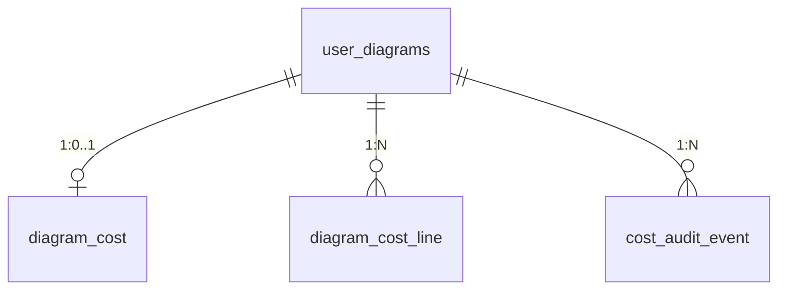

# Domain Entities — cost-schema-rbac

> Unit: `cost-schema-rbac` · Q1–Q4=A  
> 上游：`unit-of-work.md`、`requirements.md`、`components.md`、`decisions.md`（ADR-C1-02～04、06）。

## 範圍

本 unit 定義 **Postgres DDL／種子契約** 與 ORM 對齊形狀。不含 HTTP、公式、頁面。實作落點：`schema_rbac.sql`、`backend/models.py`（或 `backend/cost/models.py` 若分檔）、`services/rbac_seed_data.py`、`services/rbac.py`、`database._ensure_cost_schema()`、`DEPLOY.md`。

## 實體一覽

| 實體 | 持久化 | 擁有者 |
|---|---|---|
| `DiagramCost` | `diagram_cost` | 每張 `user_diagrams` 一列 |
| `DiagramCostLine` | `diagram_cost_line` | 每圖×`mxcell_id` |
| `PricingCache` | `pricing_cache` | 全域快取列 |
| `CostAuditEvent` | `cost_audit_event` | 稽核列（append-only） |
| `RolePermission`（擴充種子） | `role_permissions` | 既有表；本 intent 新增 4 個 `story_id` |

---

### DiagramCost

每圖估價設定（區域、預算）。XML 仍是畫布真實來源；此表不存列集合。

| 欄位 | 型別 | 約束 | 預設 | 備註 |
|---|---|---|---|---|
| `diagram_id` | `INTEGER` | PK, FK → `user_diagrams.id` ON DELETE CASCADE | — | 一圖一列 |
| `pricing_region` | `VARCHAR(64)` | NULL 允許 | NULL | 未設時 API 不打官方價（FR-4.1） |
| `monthly_budget` | `NUMERIC(12,2)` | NULL 允許 | NULL | 第一段可 NULL；第二段 FinOps 填寫 |
| `updated_at` | `TIMESTAMPTZ` | NOT NULL | `now()` | 區域／預算變更時更新 |

**生命週期**：圖建立後 lazy upsert（第一次開成本或改區域）；圖刪除 cascade 移除此列。

---

### DiagramCostLine

每圖可估價節點的持久化狀態（時數、SKU 指定、小時價覆寫）。

| 欄位 | 型別 | 約束 | 預設 | 備註 |
|---|---|---|---|---|
| `diagram_id` | `INTEGER` | PK(1), FK → `user_diagrams.id` ON DELETE CASCADE | — | |
| `mxcell_id` | `VARCHAR(128)` | PK(2) | — | draw.io cell id |
| `hours` | `INTEGER` | NOT NULL | **24** | FR-3.3；API 驗 0–24 |
| `sku_override` | `VARCHAR(128)` | NULL | NULL | FinOps 指定 SKU |
| `hourly_override` | `NUMERIC(12,2)` | NULL | NULL | Manual Override 小時價 |
| `updated_at` | `TIMESTAMPTZ` | NOT NULL | `now()` | |

**UK**：`(diagram_id, mxcell_id)`。

**對齊規則**（由 `cost-api` 執行，本站只定欄位）：snapshot 重擷取時，XML 消失的 id 刪行；新 id insert 且 `hours=24`；既有 id 保留 `hours`／override 欄。

---

### PricingCache

公開價目快取（ADR-C1-04）。

| 欄位 | 型別 | 約束 | 預設 | 備註 |
|---|---|---|---|---|
| `cloud` | `VARCHAR(16)` | PK(1) | — | `aws`／`gcp`／`azure` |
| `sku` | `VARCHAR(128)` | PK(2) | — | 公開 SKU 識別 |
| `region` | `VARCHAR(64)` | PK(3) | — | 估價區域碼 |
| `hourly` | `NUMERIC(12,2)` | NOT NULL | — | list 小時價 USD |
| `fetched_at` | `TIMESTAMPTZ` | NOT NULL | — | TTL 判斷：`now - fetched_at < 24h` |

**UK**：`(cloud, sku, region)`。Miss／過期由 service 重抓；失敗不寫正價列。

---

### CostAuditEvent

覆寫與預算變更稽核（ADR-C1-06）。對齊 `GET /diagrams/{id}/audit` 的 `items[]` 形狀。

| 欄位 | 型別 | 約束 | 備註 |
|---|---|---|---|
| `id` | `SERIAL` / `INTEGER` PK | NOT NULL | |
| `diagram_id` | `INTEGER` | FK → `user_diagrams.id` ON DELETE CASCADE | |
| `field` | `VARCHAR(32)` | NOT NULL | `hourly_override`｜`sku_override`｜`monthly_budget` |
| `mxcell_id` | `VARCHAR(128)` | NULL | 列級變更時必填；預算為 NULL |
| `old_value` | `TEXT` | NULL | 字串化舊值；首次設值可 NULL |
| `new_value` | `TEXT` | NOT NULL | 字串化新值 |
| `actor_username` | `VARCHAR(128)` | NOT NULL | 寫入當下 JWT 使用者 |
| `created_at` | `TIMESTAMPTZ` | NOT NULL DEFAULT `now()` | 回應 `at` |

**索引**：`(diagram_id, created_at DESC)` 供分頁讀取。

**HTTP 對照**（`component-methods.md` GET audit）：`created_at→at`、`actor_username→actor`；**另含** `mxcell_id`（列級變更時；預算變更為 `null`）——Construction 須同步擴充 OpenAPI 回應形狀，否則無法對應哪一列被改。

**不寫入**：時數、區域（本輪故事未要求）。

---

### RolePermission（種子擴充）

既有表形狀不變。本 intent 新增 `story_id`：

| story_id | 本輪使用的 action | `can_edit=true` 的 role（其餘 10 role 同 story 三旗標 false） |
|---|---|---|
| `C1h` | edit 時數 | `Project_Architect` |
| `C1r` | edit 區域 | `Project_Architect` |
| `C1b` | edit 預算 | `FinOps_Analyst`、`Project_Editor` |
| `C1o` | edit SKU／覆寫價 | `FinOps_Analyst` |

既有 `C1` 列**不修改**（只補缺失的 `C1h`～`C1o`）。`STORY_IDS` 由 `DEFAULT_ROLE_PERMISSIONS` 推導，須含上述五 id。

---

## 關係圖

文字 fallback：`user_diagrams` 刪除 → cascade `diagram_cost`、`diagram_cost_line`、`cost_audit_event`。`pricing_cache` 為獨立表，無 FK。

## 與其他 unit 的契約

| 消費者 | 讀寫 | 備註 |
|---|---|---|
| `cost-api` `cost_service` | R/W 四表 | 對齊、快取、稽核 insert |
| `cost-calculator` | 無 | 不碰 DB |
| `cost-ui` | 無 | 經 API |
| `cost-budget-banner` | R/W `monthly_budget`、讀 `cost_audit_event` | 第二段 |

## 不在本 unit

OpenAPI 形狀、extractor 規則、Hypothesis、Playwright、YAML SKU 對照內容。
