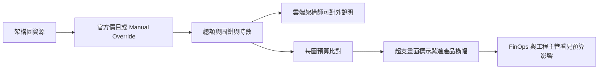

# Scope Document — 成本估算與 FinOps（C1 第一輪）

<!-- Stage: scope-definition（Ideation 1.4）· 來源標籤定義見 scope-definition-questions.md 的 ## Sources。
     [Q<n>] 指本 stage 問題檔的已選答案；[intent:*]／[feas:*] 指上游 artifact 的已確認決定。 -->

## 上游輸入

- **intent-statement**（`../intent-capture/intent-statement.md`）：問題陳述（報價不可信）、受益者與已確認的 C1 產品邊界（`mvp`）。
- **feasibility-assessment**（`../feasibility/feasibility-assessment.md`）：conditional GO 與公開免帳號價目、兩種雲別語意、本輪不含 egress 等前提。
- **constraint-register**（`../feasibility/constraint-register.md`）：官方 API 憑證禁令、權限三種變更、通知原語上限、security baseline 四面向。
- market-research 已依 scope 跳過，無市場面輸入。

## 範圍邊界

### In scope

兩段增量都屬本輪 Must；被插隊時**第一段可單獨上線**，第二段仍留在本輪範圍，不是降為 Should [Q1]。

#### 第一段（可單獨上線）

| # | 能力 | 說明 | Source |
| --- | --- | --- | --- |
| (a) | 公開價目覆蓋查證 | 先查各雲是否有公開免帳號官方價目；列出本輪走官方價 vs Manual Override 的雲別 | [Q2] [feas:R1] |
| (b) | 從架構圖擷取可估價資源 | 列名對到圖上元件；對不到的列名、不計入總額、顯示 N 項尚未定價 | [intent:Q3] [feas:Q7] |
| (c) | 單價 | 有公開免帳號價目的雲打官方 API；否則 Manual Override。三雲都沒有公開價目時，本輪仍做，全部 Override | [feas:Q2] [feas:Q1a] [Q4] |
| (d) | TCO 畫面 | 總額、圓餅拆解、每日時數可覆寫；顯示定價假設與來源時間 | [intent:Q3] |
| (e) | 入口 | Sidebar 的 C（成本／FinOps）與產圖成功後 CTA「查看預估成本」 | [intent:Q13] |

#### 第二段

| # | 能力 | 說明 | Source |
| --- | --- | --- | --- |
| (f) | 每圖每月預算 | 上限掛在單張架構圖 | [feas:Q4] [intent:Q10] |
| (g) | 超支警告 | 成本畫面視覺標示；只要該圖仍超支，每次進入產品都看到橫幅（無 inbox） | [feas:Q6] [intent:Q16] |

#### 橫切 Must

| # | 能力 | 說明 | Source |
| --- | --- | --- | --- |
| (h) | 測試底線＋部署資產同步 | 獨立 backlog 項：cost calculator 的 property-based testing、新 HTTP 端點 `TestClient`、權限種子 allow/deny、schema／seed 時同步 `schema_rbac.sql` 與 `DEPLOY.md` | [Q5] [memory:M1] [memory:M7] |

誰能改什麼（產品語意，切法留設計）：架構師改時數；FinOps 與工程主管設預算；僅 FinOps 覆寫單價 [feas:Q5]。

### Won't Have（本次明確排除 [Q3]）

| 排除項 | 理由 |
| --- | --- |
| C2（pricing models：Spot／RI 等） | 本輪只做 C1 [intent:Q9] |
| C3（data egress 路徑分析與熱點） | 本輪只做 C1 [intent:Q9] |
| 本輪 TCO 的 egress／資料傳輸列 | C1 AC 的 egress 留給 C3 [feas:Q3] |
| FinOps 核准流 | 否決權已定義、本輪不建造 [intent:Q14] |
| 站內 inbox（未讀數、歷史） | 通知上限為超支期間進產品橫幅 [feas:Q6] |
| staging 價目憑證 | 只用公開免帳號官方價目 [feas:Q2] |
| 讀取客戶帳單／Cost Explorer | 禁止 production credentials；數字是公開 list price [intent:Q12] |

### 未承諾（不在範圍、亦未列入排除）

無。Q3 已把建議清單全部列入 Won't Have；沒有「未選也不排除」的項。

## MoSCoW 總表

- **Must**：(a)～(h) 全部。整輪完成仍要兩段都交付；僅在被插隊時允許第一段單獨上線 [Q1]。
- **Should／Could**：無。
- **Won't**：上表七項 [Q3]。

## 價值流

<!-- Text fallback: 架構圖上的資源經官方價目或人工覆寫得到單價，組成總額、圓餅與時數重算，讓雲端架構師能對外說明；第二段再加上每圖預算比對，超支時在成本畫面標示並在進入產品時顯示橫幅，讓 FinOps 與工程主管看見預算影響。 -->

價值終點是 intent-statement 的成功指標：數字對到圖上資源、可重算、超支可見 [intent:Q3]。

## 排序原則

**Risk-first** [Q2]：先完成 (a) 公開價目覆蓋查證，再做擷取、單價、畫面與入口，最後才是預算與超支。即使 (a) 結論是「三雲都沒有公開價目」，仍繼續做 C1，全部 Manual Override [Q4]。細部 Bolt 切分留給 delivery-planning。

## Assumptions & Open Questions

- [assumption] 被插隊時第一段單獨上線，仍須滿足該段對應的 (h) 測試與部署資產；不是「沒測也可以先上」[Q1] [Q5]
- [assumption] 三種變更的權限切法（view／edit／review 是否夠用）仍是設計階段必答，承 feasibility [feas:Q5]
- [assumption] 超支橫幅出現在登入後哪些受保護頁，仍留設計 [feas:Q6]
- [assumption] proto-unit 粒度不是最終 Unit 切分，由 units-generation 檢驗
