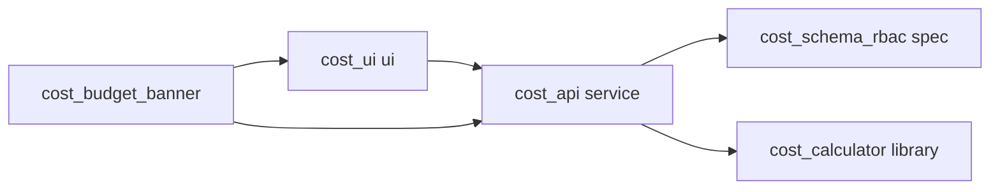

# Unit of Work — Dependency DAG

> Stage: units-generation 2.7：**只描述拓樸**（誰依賴誰）。**不定** Bolt 順序、**不定** critical path（那是 2.8 Delivery Planning）。  
> 來源：`component-dependency.md`（元件邊）、`services.md`（編排）、`decisions.md`（ADR-C1-01／08）、`component-methods.md`（HTTP 契約）、`components.md`、`requirements.md`、`stories.md`。

## 機器可讀邊

下列 yaml 是 compiler 計算 fan-out 的唯一來源。名稱與 `unit-of-work.md` 逐字相同。獨立 unit 的 `depends_on: []`。邊無環。`cost-budget-banner` 省略 `kind`。

```yaml
units:
  - name: cost-schema-rbac
    kind: spec
    depends_on: []
  - name: cost-calculator
    kind: library
    depends_on: []
  - name: cost-api
    kind: service
    depends_on: [cost-schema-rbac, cost-calculator]
  - name: cost-ui
    kind: ui
    depends_on: [cost-api]
  - name: cost-budget-banner
    depends_on: [cost-api, cost-ui]
```

## 有向邊（消費者 depends_on 提供者）



<!-- Text fallback: cost-api 依賴 schema 與 calculator；cost-ui 依賴 cost-api；cost-budget-banner 依賴 cost-api 與 cost-ui。schema 與 calculator 互不依賴。 -->

箭頭語意：**depends_on**（不是施工順序）。禁止把「schema 然後 calculator 然後 api」讀成 2.8 建議路徑。

| 邊 | 性質 | 理由 |
|---|---|---|
| `cost-api` → `cost-schema-rbac` | 技術依賴（不可覆寫） | service 讀寫四表與 `C1*` 種子；表不存在則 TestClient 無法綠 |
| `cost-api` → `cost-calculator` | 技術依賴（不可覆寫） | `cost_service` 呼叫純函式組 snapshot；library 無 HTTP |
| `cost-ui` → `cost-api` | 技術依賴（不可覆寫） | Playwright 打 `/api/cost*`；型別來自 OpenAPI dump |
| `cost-budget-banner` → `cost-api` | 技術依賴（不可覆寫） | 第二段在同一 router 加掛 `PUT /budget` 與 `GET /banner`（ADR-C1-08） |
| `cost-budget-banner` → `cost-ui` | 技術依賴（不可覆寫） | AC-7.1 的「已超支」掛在 `CostPage`；`OverspendBanner` 掛在已有 `Layout` 殼。頁與 Sidebar 由 `cost-ui` 擁有 |

schema 與 calculator **沒有**互相的邊。

## 本 intent 外的已存在提供者（不列入 yaml）

yaml **不得**出現 U-J／U-A1／U-A2：compiler 會把它們當成待建 unit。它們是 brownfield 前提：

| 已存在 | 本輪用法 |
|---|---|
| Identity／RBAC（既有 `require_story_action`） | 每個 cost 端點；`C1.view` 進頁 |
| `UserDiagram` XML（既有 collab） | extractor 輸入；可見性 404 |
| Workspace 成功卡（既有 A1） | 只加第四顆 CTA，不在產圖當下呼叫 cost |

## 整合契約

| 介面 | 提供者 | 消費者 | 形狀 |
|---|---|---|---|
| 四表＋種子 | `cost-schema-rbac` | `cost-api` | Postgres；UK `(diagram_id, mxcell_id)` |
| 純函式 | `cost-calculator` | `cost-api`（第二段 banner 經 service 再呼 `is_overspent`） | Decimal 出口兩位 |
| HTTP `/api/cost*` | `cost-api` | `cost-ui`、`cost-budget-banner` | `openapi.json` tag `cost`；generated `api.d.ts` |
| `CostPage`／`Layout` 掛點 | `cost-ui` | `cost-budget-banner` | test-id `cost-overspend-flag`、`cost-banner`、`cost-budget`。跨 unit DOM 擴充的實作機制（建置開關／第二模組檔／slot）見 functional-design；本站只定掛點與 `depends_on` |
| 無事件／無 queue | — | — | `services.md`：同步 REST 與行程內呼叫 |

`component-dependency.md` 的元件邊（router → service → extractor／mapper／calculator／pricing_client）全部落在 **`cost-api` 單元內部**，不形成跨 unit 邊。calculator 對 pricing_client 的零依賴必須維持：跨 unit 也不得從 library 指向 service。

## 可平行集合（拓樸，非排程）

無依賴、因此存在**多個合法拓樸排序**的集合：

| 集合 | 成員 |
|---|---|
| 兩個根 | `{cost-schema-rbac, cost-calculator}` 互不依賴，可同時存在於 DAG 上 |

其餘 unit 都有入邊，不能與它們的提供者「無關平行」。2.8 可以選擇先做哪個根、或是否把第二段與第一段分 Bolt——那些是經濟決策，本檔不選。

## Review

**Verdict:** READY
**Reviewer:** aidlc-architecture-reviewer-agent
**Date:** 2026-08-19T08:38:59Z
**Iteration:** 1

### Findings

| # | Severity | Location | Finding | Recommendation |
|---|---|---|---|---|
| 1 | Minor | `unit-of-work.md` → 約束（對 Construction）表 | 「兩段增量皆 Must；第一段可單獨上線」置於「約束（對 Construction）」標題下，屬產品範疇約束，但在此脈絡下有被誤讀為 Bolt 施工排程建議的風險。本檔（`unit-of-work-dependency.md`）已在第 47 行與末段明文警示「禁止把…讀成 2.8 建議路徑」，但警示位於另一份文件，未在原地配置。 | 在 `unit-of-work.md` 約束表末行或標題旁加一腳注：「此欄為產品範疇約束，不是 Bolt 施工順序；施工排程由 2.8 Delivery Planning 決定。」可使開發者在查閱約束時無需跨文件確認。 |
| 2 | Minor | `stories.md` C1-6 AC 編號 | C1-6 的 AC 編號從 6.3 直接跳至 6.5，未附任何刪除說明（Round 1 整合摘要只明文記錄「刪 AC-4.4／AC-5.6」）。`unit-of-work-story-map.md` 宣稱「C1-6：4 AC」，計數與 `stories.md` 的 `**AC-` 標題列數（6.1、6.2、6.3、6.5 共 4 條）一致，47 總數亦驗證無誤；但跳號無說明可能令 QA 懷疑是否有一條驗收標準被無意漏落。 | 在 `stories.md` 的 Round 1 整合摘要補一行「刪 AC-6.4（…原因…）」，或在 C1-6 段落加腳注說明跳號係刻意，以消除 QA 疑慮。此為 `stories.md` 的改進點，不影響 units-generation 拓樸正確性。 |
| 3 | Minor | `unit-of-work-dependency.md` 整合契約 → `CostPage`／`Layout` 掛點 | `cost-budget-banner` 依賴 `cost-ui` 的理由已記載（AC-7.1 的「已超支」掛在 `CostPage`；`OverspendBanner` 掛在 `Layout`），整合契約以 test-id 指定預期 DOM。然而 `cost-budget-banner` 在第二段必須修改 `cost-ui` 擁有的元件（CostPage、Layout），實作機制僅由 ADR-C1-08 一句「建置開關或第二個模組檔」帶過，Construction 開發者需自行選型（條件 import、slot 注入、feature flag 等）。 | 在 `functional-design` 階段明確指定跨單元 DOM 擴充機制（例如：cost-ui 的 CostPage 預留空的 `<div data-slot="overspend" />` 由 cost-budget-banner 填入，或以 React Context 傳遞），並在整合契約欄補一句「機制見 functional-design」，使開發者知道這是已規劃的設計決策而非需自行發明。 |

### Validation Tool Results

| 工具 | 結果 | 說明 |
|---|---|---|
| YAML 環偵測（手動追蹤所有邊） | PASS | schema-rbac: []；calculator: []；api: [schema-rbac, calculator]；ui: [api]；banner: [api, ui]。追蹤後無環：schema-rbac 與 calculator 皆為葉節點，api→兩葉，ui→api，banner→api+ui；不存在任何反向邊或多跳環路。 |
| Brownfield unit 漏列入 yaml 檢查 | PASS | yaml 僅列五個新 unit；U-J／U-A1／U-A2 已在「本 intent 外的已存在提供者」表中明文排除，compiler 不會誤把它們當成待建 unit。 |
| kind 合法值驗證 | PASS | spec（schema-rbac）、library（calculator）、service（api）、ui（cost-ui）均屬允許值；cost-budget-banner 省略 kind，Q1=A 明文授權且附理由（無單一 kind 能同時覆蓋 HTTP 與 UI 產物）。 |
| depends_on 名稱解析 | PASS | 所有 depends_on 值（cost-schema-rbac、cost-calculator、cost-api、cost-ui）均在 yaml `units[].name` 中有唯一宣告；無懸空引用。 |
| 獨立 unit depends_on: [] 驗證 | PASS | cost-schema-rbac 與 cost-calculator 皆為 `depends_on: []`；與 Q2=A「顯式兩個根」及文件聲明一致。 |
| 故事覆蓋盤點（C1-1～C1-7） | PASS | 七則故事皆有主責 unit；`unit-of-work-story-map.md` AC 合計 13+5+2+9+9+4+5=47，與 `stories.md` `**AC-` 標題逐條計數吻合（含 AC-1.1b、AC-4.3b、AC-5.4a/b 等複合編號）。 |
| 五個 unit 皆有故事 | PASS | cost-schema-rbac 與 cost-calculator 無「只屬於自己的」使用者故事，但分別以協作角色出現於四則故事，符合「every unit has stories（主責或協作）」。 |
| 第一段主責限制 | PASS | C1-1～C1-5 主責分別為 cost-ui（C1-1、C1-3、C1-4）與 cost-api（C1-2、C1-5）；cost-budget-banner 在第一段不持有任何主責，符合 Hard Rule。 |
| ADR-C1-08 與 cost-api 定義一致性 | PASS | `unit-of-work.md` cost-api「第一段禁止：不註冊 PUT .../budget、不註冊 GET /banner」與 ADR-C1-08「不 include budget 路由與 GET /banner（或恒 404）」措辭完全對齊；`budget` 回應恒 null、`overspent` 恒 false 亦覆蓋完整。 |
| Q5=A 覆寫有效性（無 Q3=B 殘留） | PASS | `unit-of-work.md` cost-ui 契約消費欄明載「generated api.d.ts（Q5=A）」；`unit-of-work-dependency.md` 整合契約表同列「openapi.json tag cost；generated api.d.ts」；全文無手寫 TypeScript 型別的相關措辭。 |
| cost-calculator 庫純度（不得反指 cost-api） | PASS | yaml `depends_on: []`；`component-dependency.md` 矩陣 calculator 列全 —；`unit-of-work.md` 明文「禁止 DB、httpx、HTTPException、OpenAPI 的 import」；library purity 維持。 |
| 拓樸語言污染（Bolt 施工排程偽裝為拓樸邊） | PASS（附 Minor 1） | 主 DAG 文件未出現 Bolt 排程語言；`unit-of-work-dependency.md` 第 47 行與末段有明文警示。`unit-of-work.md` 的「兩段增量皆 Must；第一段可單獨上線」屬產品約束而非排程，但與 Minor 1 所述有輕微誤讀風險。 |

### Summary

DAG 拓樸結構嚴謹：YAML 五節點無環、兩個根節點（schema-rbac ∥ calculator）→ api → ui → budget-banner；所有 depends_on 名稱可解析、kind 合法、brownfield unit 正確排除於 yaml 外。47 條 AC 計數驗證一致，七則 C1 故事均有主責分配，第一段不以 cost-budget-banner 為主責的硬規則已滿足，ADR-C1-08 禁止第一段註冊預算／橫幅的約束在 cost-api 定義中明確反映，Q5=A OpenAPI 契約完整覆寫 Q3=B 殘留。零 Critical、零 Major；三項 Minor（約束表措辭易誤讀、AC-6.4 跳號未說明、跨單元 DOM 擴充機制留 functional-design）均不影響拓樸正確性，開發者具備足夠信息可進入 Delivery Planning，無需返回設計者澄清拓樸或邊界問題。
