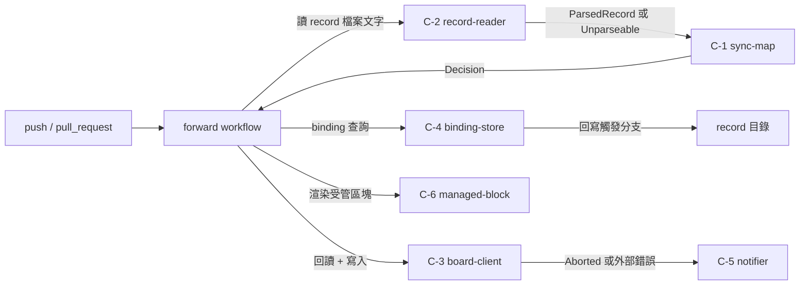

# Component Dependency — AI-DLC 與 GitHub Projects 的進度同步

<!-- Stage: application-design（Inception 2.5）· Record: 260822-gh-projects-sync
     依 `components.md` 的七個元件（C-1～C-7）與四支 workflow。
     上游輸入清單見 `components.md` §上游輸入（requirements、stories、codekb 三份、team-practices）。 -->

## 依賴矩陣

`→` 表示「列依賴行」。**純函式層（C-1／C-2）不依賴任何其他元件**，這是刻意的：它們是唯一能被純文字 fixture 驅動的部分，任何 I/O 依賴都會摧毀 [US:S-10 AC 1] 的可驅動性。

| 依賴者 ↓ ／ 被依賴 → | C-1 map | C-2 reader | C-3 board | C-4 binding | C-5 notifier | C-6 block | C-7 reconciler |
| --- | --- | --- | --- | --- | --- | --- | --- |
| **C-1 `sync-map`** | — | — | — | — | — | — | — |
| **C-2 `record-reader`** | — | — | — | — | — | — | — |
| **C-3 `board-client`** | — | — | — | — | — | — | — |
| **C-4 `binding-store`** | — | — | — | — | — | — | — |
| **C-5 `notifier`** | — | — | — | — | — | — | — |
| **C-6 `managed-block`** | — | — | — | — | — | — | — |
| **C-7 `reconciler`** | ● | ● | ● | ● | ● | ● | — |

● = 直接呼叫。**矩陣中沒有 ○**。

> **C-5 不經過 C-3**（reviewer iteration 1 Finding 5 的修正）。先前版本把 C-5 → C-3 標為 `○`，與同檔「通訊模式」表（C-5 ↔ GitHub Issues 為直接 REST）及 C-3 的公開介面（只有 `read_issue_state(binding)`，語意是「給定已知 binding 回傳其 issue 開關狀態」，做不到「以鍵搜尋 issue」）三處互相矛盾。
> **裁定**：C-3 的定位是「**Projects v2** 的唯一出入口」，不是「所有 GitHub 呼叫的唯一出入口」。通報 issue 的搜尋與建立屬 Issues REST，與 Projects v2 是不同的 API 面，收進 C-3 會讓它同時擁有兩套不相關的外部契約。故 **C-5 直接呼叫 Issues REST**，矩陣的 `○` 移除，三處說法統一。

**四個葉節點（C-1／C-2／C-4／C-6）互不依賴**，C-3 亦不依賴任何內部元件。編排全部集中在 workflow 層與 C-7。這使每個元件可獨立測試，也符合 architect 的「Least coupling, highest cohesion」。

## 資料流

### 正向同步（`aidlc-sync-forward.yml`）

**文字 fallback（正向同步的資料流）**：push 或 pull_request 觸發 forward workflow。workflow 讀出 record 的檔案文字交給 **C-2 record-reader** 解析，得到 `ParsedRecord` 或 `Unparseable`；把它交給 **C-1 sync-map** 得到 `Decision`（含 `status | null`、`field_value`、`reason_code`）。workflow 向 **C-4 binding-store** 取得該 intent 的綁定編號；若無則先請 **C-3 board-client** 建立 item 並把編號交回 C-4 寫入 record。有了編號後，workflow 請 C-3 **先回讀再寫入** Status 與自訂欄位，並請 **C-6 managed-block** 渲染受管區塊寫進 issue。C-3 回報 `Aborted`（回讀不符）或外部錯誤時，workflow 交給 **C-5 notifier** 通報。C-4 最後把綁定編號與 `sync-state.json` 回寫到觸發分支。

### 對帳（`aidlc-sync-reconcile.yml`）

C-7 是唯一的編排者：列舉 `intents.json` 的 registry → 對每個已綁定且未 park 的 intent 走一次「C-2 → C-1 → C-3 回讀」→ 有落差則補平並計數 → 產出三份清單（等待人工裁決／已暫停／回讀不符已中止）與一致率 → 偵測 issue 與 Status 不相稱（[US:S-9 AC 5]）→ 有落差則交 C-5 通報，但**不使 workflow 紅燈**（[US:S-8 AC 1] 前提②）。

### 反向同步（`aidlc-sync-reverse.yml`）

C-3 讀看板現況 → C-6 對受管區塊做內容雜湊比對（防迴圈第一道）→ 與 `sync-state.json` 記錄的最後已知值比對 → 有人為變更則 C-4 寫進同步專用檔並開 PR。**不動 `aidlc-state.md` 任何一行**（[req:FR-G2]）。

## 通訊模式

| 邊界 | 模式 | 失敗處置 |
| --- | --- | --- |
| workflow ↔ C-1／C-2 | 同步、程序內（composite action 的 output） | 解析失敗回 `Unparseable`，不拋例外——[req:FR-J3] 要求「跳過不寫」而非中止整輪 |
| workflow ↔ C-3 | 同步、HTTP（GraphQL） | 回讀不符 → `Aborted`（非錯誤，不紅燈）；API 錯誤 → 例外 → C-5 通報 ＋ 紅燈 |
| workflow ↔ C-4 | 同步、檔案系統 ＋ git | push 失敗（分支保護／權限）→ 例外 → C-5 通報 ＋ 紅燈。**這正是 [US:S-1 AC 6] 要防的**：回寫失敗導致下輪重複建立 item |
| C-5 ↔ GitHub Issues | 同步、REST | 通報本身失敗 → 紅燈（不可再遞迴通報） |
| 事件路徑 ↔ 對帳路徑 | **不通訊**，各自獨立 concurrency group | 同時寫同一 item 時由 C-3 的回讀比對承擔（[req:FR-C3]），後到者 `Aborted` |

## 共享資源與競爭點

| 資源 | 誰寫 | 競爭處置 |
| --- | --- | --- |
| Project #16 的 item Status | forward、reconcile、reverse 三條路徑 | C-3 的寫入前回讀（[req:FR-C1]）。**唯一結果是中止＋開 issue**，「重算後仍寫入」不是合格結果（[req:FR-C3]） |
| `<record>/sync-state.json` | forward、reverse | 兩者不同 concurrency group 但**同組**（reverse 與 reconcile 共用一組，見 `components.md`），forward 自成一組——**仍可能並行**。處置：`sync-state.json` 的寫入為 read-modify-write，衝突時以 git push 失敗表現，交 C-5 通報後由下輪對帳補平 |
| record 的綁定編號 | forward（首建時） | 一次性寫入；[US:S-1 AC 6] 的重複建立防護使重跑安全 |
| 通報 issue | C-5 | 以 `(intent, reason_code)` 為鍵，搜尋既有開啟中 issue（[Q5=A]）；**（ADR-0014：收斂改由 `notify` 承擔，非 `resolve_if_open`）** 並行時可能短暫產生兩則，由下輪的 `resolve_if_open` 收斂 |

## 與既有系統的碰撞面（[req:NFR-C1]）

| 面向 | 既有現況（[kb] 實測） | 本設計的處置 |
| --- | --- | --- |
| `ci.yml` 的 `concurrency: ci-CI-<ref>` ＋ `cancel-in-progress: true` ＋ `on: pull_request`（無分支過濾） | 回寫 commit 會觸發 `ci.yml` 並**取消開發者當下的 run** | C-4 的回寫必須讓 `ci.yml` 不因它觸發。落點為 `ci.yml` 加 `paths-ignore`（`**/sync-state.json`、綁定編號檔）或等價手段——**這是對既有檔案的修改，須在同一個 PR 內完成**，否則 [US:S-1 AC 7] 無法通過 |
| `deploy.yml`（`pull_request: types:[closed] branches:[ut]`） | 反向 PR 合併進 `ut` 會觸發部署 | 反向 PR 只改 record 目錄下的同步專用檔，部署本身無害；但會佔用 `deploy-10-10` 這個 `cancel-in-progress: false` 的 group。記為已知成本，不另行處置 |
| 6 支 `on: pull_request` 的 gh-aw（含 `ui-regression`） | 反向 PR 每日觸發完整 gauntlet，含 6 次 LLM agent 執行 | [US:S-6 AC 7] 已要求「指定的高成本 workflow 不對其執行」。落點為在 `ui-regression.md` 等的觸發條件加 `paths-ignore`，或在反向 PR 上加一個這些 workflow 會跳過的 label——**具體手段留給 construction**，本站只確立它是 `.github/` 內既有檔案的修改而非新機制 |
| 三支既有排程（`0 23 * * 1-5`／`37 0 * * *`／weekly monday） | 對帳需避開 | reconcile 的 cron 由 workflow input 宣告，實際值在 construction 定；全域 DoD 已列此為建置期檢查 |
| self-hosted runner | 只有 `deploy.yml` 兩個 job | 本設計四支 workflow 全部 GitHub-hosted，不佔用 |

## 元件與需求的雙向對照

| 元件 | 承載的 FR／NFR | 承載的故事 AC |
| --- | --- | --- |
| C-1 `sync-map` | FR-B1、B2、B3、B6、F1、F3、F4、J5 | S-2 AC 1–6、14、15；S-4 AC 1–5；S-5 AC 1、3 |
| C-2 `record-reader` | FR-J1、J3、J4、J6 | S-2 AC 7–10；S-3 AC 3、5 |
| C-3 `board-client` | FR-A1、C1、C2、C3、F2、**I2**、NFR-S1 | S-1 AC 1、6；S-3 AC 1、2；S-5 AC 2；S-9 AC 5；S-10 AC 2、5 |
| C-4 `binding-store` | FR-A2、A3、A4、NFR-C1 | S-1 AC 2–5、7 |
| C-5 `notifier` | FR-E1、**E2**、E3、J2、NFR-S6 | S-3 AC 4；S-7 AC 5；S-8 AC 1–3 |
| C-6 `managed-block` | FR-F3、G4 | S-4 AC 4、6；S-6 AC 6；US-OQ-3 的三種情形 |
| C-7 `reconciler` | FR-D1、**D2**、**D3**、**D4**、**E2**、NFR-O1、O2、P1、P2、P4 | S-7 AC 1–5；S-9 AC 1–6 |
| workflow 層 | FR-B4、**B5**、G1、G2、G3、**I1**、**I2**、**I5**、NFR-P3、**NFR-S2**、**NFR-S3**、**NFR-C2** | S-1 AC 3；S-2 AC 11–13；S-6 AC 1–5、7；S-11 AC 1、2 |

**FR-I3／FR-I4** 不由任何元件承載——它們是上線前置條件 PRE-1（[Q5=A] 於 user-stories 定案）。
**FR-H1**（README 指路）為單段文字，無元件。
**NFR-M1**（`.md` ↔ `.lock.yml` 漂移）不由本站承載——[req:OQ-4] 已指派 `ci-pipeline` 站。
**NFR-S4／S5**（不新增資料庫與機敏檔案／不新增監聽或端點）為**否定性約束**，由「本設計不引入任何常駐服務、資料庫或對外端點」整體滿足（見 `services.md` §這個機制沒有長駐服務），無單一元件承載。
**NFR-P2／P4**（對帳每日一次／單次處理量上限）列於 C-7 那一列，其實際承載機制與 FR-D1／FR-D3 是同一個（排程宣告與 `reconcile_batch_size` input）——**兩者並列是交叉索引，不是兩套機制**。（reviewer iteration 3 Minor #13：先前此處寫「不重複列」而 C-7 列實際已列出，同一張表自相矛盾，與 FR-H1 案同型。）

> **FR-H1 於 reviewer iteration 2 Major 後從「workflow 層」列移除**——它是 README 的單段文字，下方已明記「無元件」，先前補標籤時誤加到 workflow 層，使同一張表對同一條需求給出兩種歸屬。

> **本表於 reviewer iteration 1 Finding 4 後補齊 9 項標籤**（FR-B5、D3、D4、E2、I1、I2、I5、NFR-S2、NFR-S3）。逐項的承載機制**在先前版本的設計內容中本已存在**，缺的是這張表的引用標籤——但下游（units-generation、tcms-test-cases）把這張表當機械可核對的追溯工具，缺標籤會被誤讀為「無元件承載」。各項落點：FR-B5 由 C-1 `map` 為唯一映射入口滿足（兩條事件路徑呼叫同一個函式，同一輸入只產出一個 Status）；FR-D3 由 `reconcile_batch_size` input；FR-D4 由 `ReconcileReport.backfilled_count`；FR-E2 由 C-7 偵測落差後交 C-5（兩者皆列）；FR-I1／I2 由 S-D `selftest` 的兩段式驗證（dry-run fixture ＋ 對獨立測試 Project 的端到端），其中 I2 的寫入面經 C-3；FR-I5 由 ADR-A9 的成對反例斷言；NFR-S2 由 `app_id`／`app_private_key` 作為本機制專屬的獨立 secret；NFR-S3 由全域 DoD 的 `validate_repo_contract.py`。
