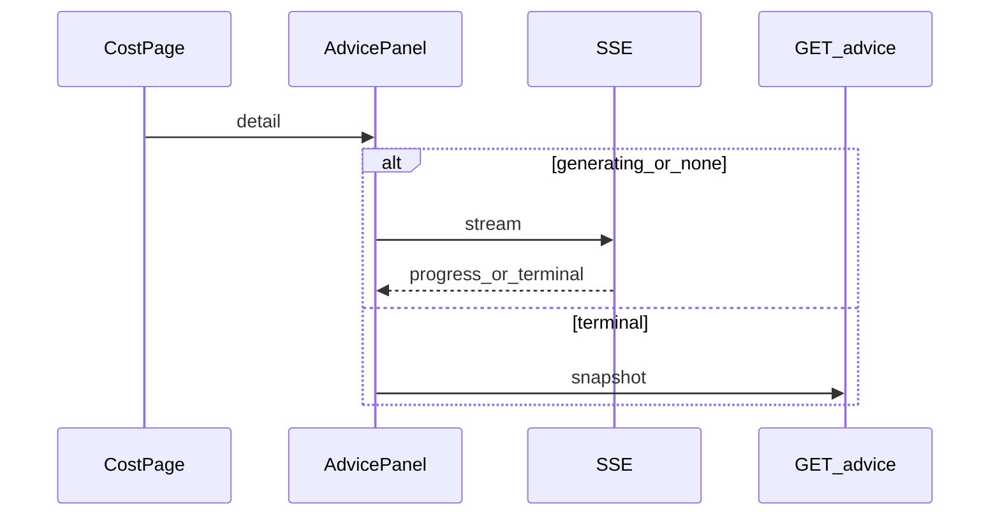

# 功能規格：U9 `advice-presentation-ui`

## 範圍
啟用 `/cost` 的 AI 建議區：SSE 訂閱、骨架進度、三類建議與免責標註。掛在 U8 `advice-slot`。**不含**上傳／明細／分享改動（僅替換佔位）。**不含** regenerate API。

## 工作流 W1 — 訂閱與呈現
1. `CostPage` 載入 `detail` → 渲染 `EstimateAdvicePanel`
2. 若 `advice_status` ∈ {`none`,`generating`,null} → `GET /api/cost/v1/sets/{id}/advice/stream`（fetch＋JWT）
3. 處理事件：`heartbeat`／`progress` 更新進度文案；`completed`／`failed`／`timeout` 關流並渲染終態
4. 若已 `completed`／`failed` → 直接 `GET .../advice` 快照，不開 SSE
5. 切換 estimate／unmount → `AbortController` 取消串流

## 工作流 W2 — 三態 UI（M5）
| 狀態 | UI |
|---|---|
| pending | 骨架＋「正在產生建議…（通常需要 1–3 分鐘）」 |
| complete | 三子標題恆常：省錢／跨雲比較／品質檢查；缺內容→「本期未提供」或原因 |
| failed | 逾時／失敗訊息；重試鈕（重連；仍 failed 則提示重新上傳） |

區段標題含「由 AI 產生，請自行核對」（FR4.5）。

**文字：** generating 走 SSE；終態走 REST；切換中止串流。

## Review

**Verdict:** READY
**Reviewer:** aidlc-architecture-reviewer-agent
**Date:** 2026-09-19T19:45:00Z
**Iteration:** 1

### Findings

| ID | Severity | Location | Finding | Required action | Status |
|---|---|---|---|---|---|

### Summary
READY after Request Changes; empty findings table (valid).
