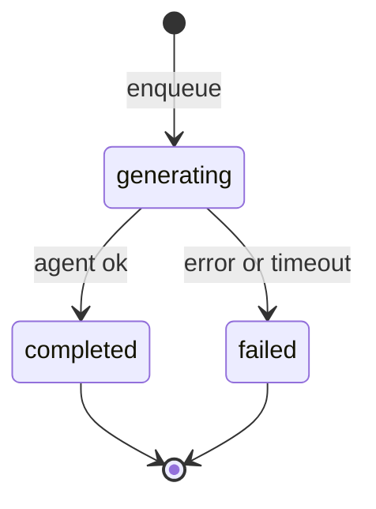
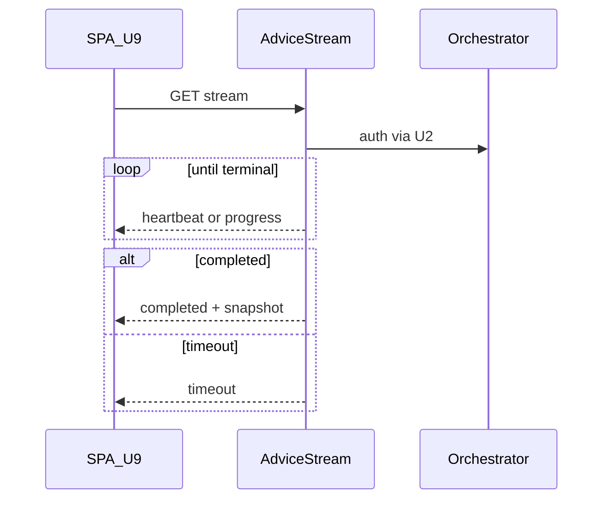
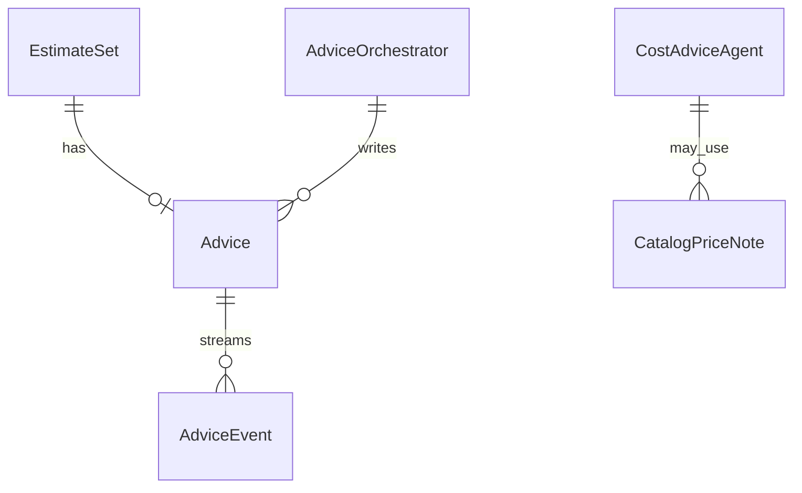

# 功能規格：U7 `cost-advice-agent`

本檔為建議產生與 SSE 工作流的真實來源。實體見 `entities.md`，規則見 `rules.md`。

## 範圍

依 Q1–Q6=A：

1. 模組：`advice_orchestrator`／`cost_advice_agent`／`advice_stream_router`；替換 U2 `enqueue_advice_job`
2. 同 process 非同步執行；逾時清 generating
3. 逾時 → `failed`＋`timed_out`；SSE `type=timeout`
4. generating 去重；completed／failed 不自動重跑
5. 可選 U5 查價；失敗不中止、不捏造
6. SSE 路徑進 `openapi.json`

**不含：** SPA、上傳 API、PricingLookup 本體、其他 agent 遷移。

---

## 工作流 W1 — Enqueue 與產生

| 步驟 | 動作 | 規則 |
|---|---|---|
| 1 | U2 上傳成功呼叫 `enqueue_advice_job` → Orchestrator | BR7.5 |
| 2 | 無列則建 `generating`＋`started_at`；已 generating → no-op | BR7.5 |
| 3 | 背景執行 Agent（U6）；可選查價 | BR7.2、BR7.3 |
| 4 | 成功 → 寫三類文字／reasons；`completed` | BR7.1 |
| 5 | 例外／逾時 → `failed`＋reasons | BR7.6、BR7.10 |

**文字：** 上傳觸發 → generating → 完成或失敗；不自動從終態重跑。

---

## 工作流 W2 — SSE 訂閱

| 步驟 | 動作 | 規則 |
|---|---|---|
| 1 | `GET .../advice/stream`；JWT＋U2 授權 | BR7.8 |
| 2 | 週期 `heartbeat`／`progress` | NFR2、C3 |
| 3 | 完成／失敗事件後關閉；逾時 `timeout` | BR7.6、BR7.7 |
| 4 | 斷線不取消背景 | BR7.7 |

**文字：** 訂閱者收進度；終態或逾時關流；背景獨立。

---

## 工作流 W3 — 查價（可選）

| 步驟 | 動作 | 規則 |
|---|---|---|
| 1 | Agent 需要現價時呼叫 `fetch_hourly` | BR7.3 |
| 2 | Hit → 僅作文案 | BR7.4 |
| 3 | Miss／錯誤 → 繼續，不捏造 | BR7.3 |

---

## 衍生檢視：ER（邏輯）

**文字：** 每 Set 一 Advice；事件不落庫；查價筆記僅暫存。

## 衍生檢視：規則摘要

| ID | 一句話 |
|---|---|
| BR7.1 | Must／Should 與 unavailable_reasons |
| BR7.2 | 完整解析進 LLM |
| BR7.3 | 查價可選、不捏造 |
| BR7.4 | 價不回寫明細 |
| BR7.5 | 去重／不自動重跑 |
| BR7.6 | 5 分鐘逾時 |
| BR7.7 | 斷線不取消 |
| BR7.8 | U2 授權 |
| BR7.9 | U6／OpenRouter |
| BR7.10 | 卡住 generating 可清 |

<!-- post-confirmation save -->

## Review

**Verdict:** READY
**Reviewer:** aidlc-architecture-reviewer-agent
**Date:** 2026-09-19T19:45:00Z
**Iteration:** 1

### Findings

| ID | Severity | Location | Finding | Required action | Status |
|---|---|---|---|---|---|

### Summary
READY after Request Changes; empty findings table (valid).
