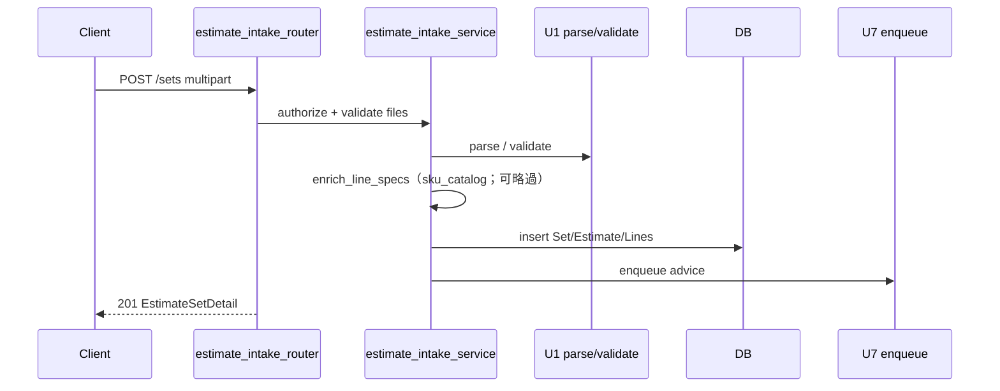
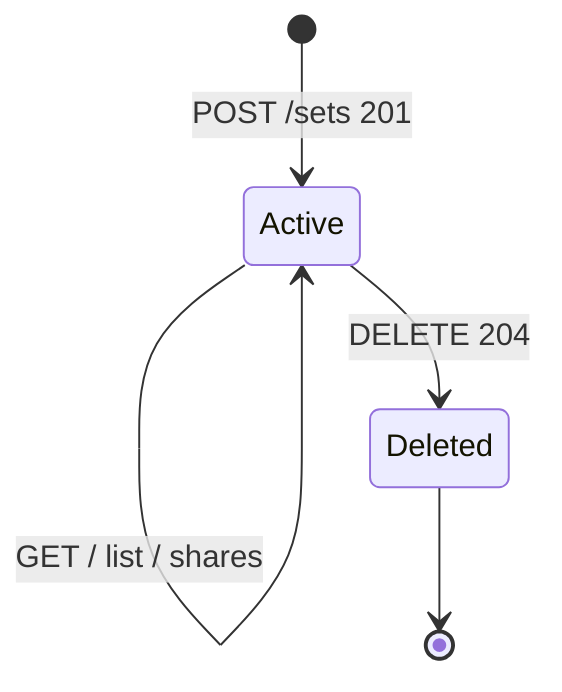
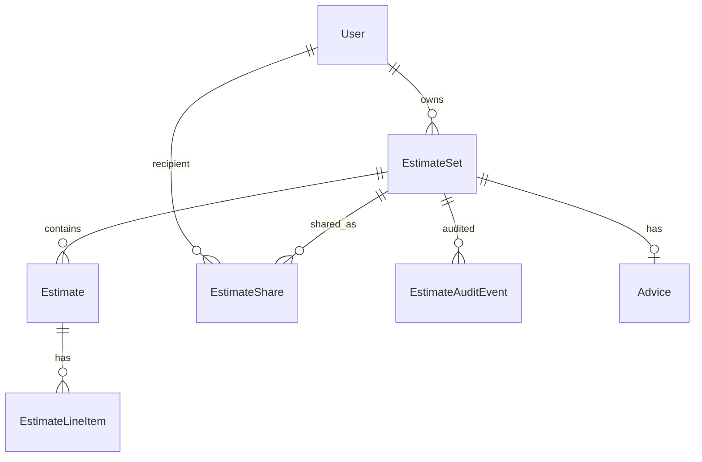

# 功能規格：U2 `estimate-intake-api`

本檔為**上傳與批次 API**工作流的真實來源。實體見 `entities.md`，規則見 `rules.md`。

## 範圍

依 Q1–Q6=A：

1. 新建 `estimate_intake_router`／`estimate_intake_service`（＋ access／audit），掛載 `/api/cost/v1`（Q1）
2. multipart 上傳 1–3 檔 → 驗證 → U1 parse／validate → 持久化 EstimateSet 樹 → 201（FR1、FR6.2）
3. 同 request **enqueue** U7 建議；不於上傳內同步跑完建議（Q2）
4. list／get／delete／shares；`diagram_id` 純標籤（Q3）；硬刪級聯（Q4）
5. `GET …/advice` 薄代理（Q5）；RBAC C1 更新＋移除 C1h～C1b（Q6）
6. 事件稽核；機械檢查每次重算；原始檔不落地

**不含：** SPA（U8／U9）、SSE stream（U7／C3）、查價 Port 強化（U5）、建議正文產生（U7）、舊 diagrams API（U3 已退）。

---

## 工作流 W1 — 上傳建立批次

| 步驟 | 動作 | 規則 |
|---|---|---|
| 1 | JWT＋C1 view／edit 權限檢查 | BR2.10、BR2.5 |
| 2 | 驗證檔數、大小、副檔名、魔數 | BR2.1 |
| 3 | 對每檔呼叫 `parse`；ambiguous 套用 `cloud_overrides` | BR2.2 |
| 4 | 對目錄形 SKU 補 `specDescription`（失敗略過）；建 EstimateSet／Estimate／LineItem；丟棄原始位元組 | BR2.3、BR2.13 |
| 5 | 寫 upload AuditEvent（列數／雲別，無金額） | BR2.12 |
| 6 | enqueue 建議；回 201＋Detail（含當場重算 checks） | BR2.8、BR2.4 |

**文字：** 客戶端上傳 → 授權與檔案驗證 → 解析 →（可選）SKU 描述補齊 → 寫庫 → 背景入隊建議 → 立即 201。

---

## 工作流 W2 — 讀取與歷史

| 步驟 | 動作 | 規則 |
|---|---|---|
| 1 | `GET /sets`：可見 Set 清單（預設含歷史） | BR2.5、FR6.3 |
| 2 | `GET /sets/{id}`：Detail＋當場重算 checks | BR2.4、BR2.5 |
| 3 | 不可見 → 404 | BR2.5 |

---

## 工作流 W3 — 分享

| 步驟 | 動作 | 規則 |
|---|---|---|
| 1 | `GET …/shares`：owner 或可視者依 C2（建議僅 owner 管理） | BR2.5 |
| 2 | `PUT …/shares`：owner 完整覆寫 `user_ids` | BR2.6 |
| 3 | 寫 share_replace AuditEvent | BR2.12 |

---

## 工作流 W4 — 刪除

| 步驟 | 動作 | 規則 |
|---|---|---|
| 1 | 僅 owner | BR2.5 |
| 2 | 硬刪級聯 Set 樹＋Share＋Audit＋Advice | BR2.7 |
| 3 | 204 | BR2.7 |

**文字：** 批次一經建立即 Active；硬刪後結束，無軟刪態。

---

## 工作流 W5 — Advice 薄讀與觸發邊界

| 步驟 | 動作 | 規則 |
|---|---|---|
| 1 | 上傳成功 enqueue（U7 實作可後補，介面須預留） | BR2.8 |
| 2 | `GET …/advice`：授權後讀 Advice 或 none／短窗 404 | BR2.9 |
| 3 | 不實作 `/advice/stream` | 範圍 |

---

## 衍生檢視：ER

**文字：** Set 為根；下轄最多三 Estimate 與多列 LineItem；Share／Audit 掛 Set；Advice 一對一可選。

## 衍生檢視：規則摘要

見 `rules.md` BR2.1–BR2.12。

---

## 與其他 Unit 的契約邊界

| 方向 | 契約 | 行為備註 |
|---|---|---|
| ← U1 | C1 parse／validate | 本 Unit 協調呼叫 |
| → SPA | C2 OpenAPI | U8／U9 消費；本 Unit 產 API |
| → U7 | 觸發 enqueue；薄讀 Advice | 正文／SSE 屬 U7 |
| ∥ U3 | 舊 HTTP 已刪 | 本 Unit 只加 v1 |
| → RBAC | FR7 | seed 於本 Unit |

## 錯誤與邊緣

| 情境 | 行為 |
|---|---|
| 檔案不合規 | 400／413；不寫庫 |
| ambiguous 無 override | 400 |
| 非可見 get | 404 |
| 非 owner delete／shares | 403 |
| enqueue 失敗 | audit；Advice failed 或不建 |
| 重複觸發建議 | UNIQUE(estimateSetId)；不建第二列 |

<!-- confirmed: Looks correct -->

## Review

**Verdict:** READY
**Reviewer:** aidlc-architecture-reviewer-agent
**Date:** 2026-09-19T19:45:00Z
**Iteration:** 1

### Findings

| ID | Severity | Location | Finding | Required action | Status |
|---|---|---|---|---|---|

### Summary
READY after Request Changes; empty findings table (valid).
