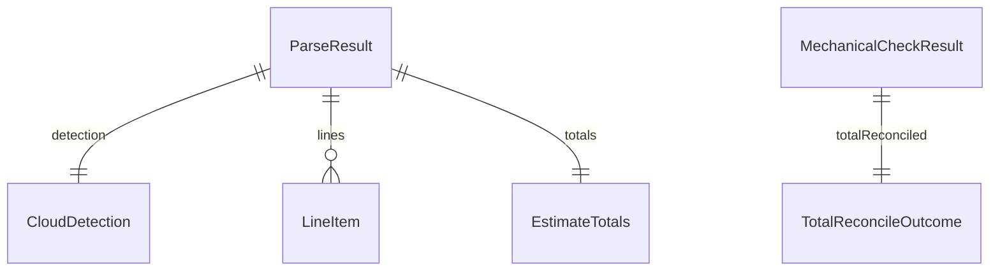

# 功能規格：U1 `estimate-parser`

本檔為**工作流與行為**的真實來源。實體形狀見 `entities.md`，決策規則見 `rules.md`。

## 範圍

提供兩個純函式入口（Q1=A）：

1. `parse(file_bytes, filename?) → ParseResult`
2. `validate(parse_result) → MechanicalCheckResult`

模組：`backend/cost/estimate_parser.py`（含雲別判定與三格式讀取器）、`backend/cost/estimate_validator.py`（Q2=B）。

消費者：僅 U2 `estimate-intake-api`（同 process 呼叫）。本 Unit 不談 HTTP。

---

## 工作流 W1 — 解析

| 步驟 | 動作 | 規則 |
|---|---|---|
| 1 | 依副檔名／內容嗅探選 csv 或 xlsx 讀取路徑 | BR1.1 |
| 2 | 讀標頭；執行雲別判定；再以 sourceFormat 過濾不符 BR1.1 的候選雲（排除後無候選 → ambiguous） | BR1.2、BR1.1 |
| 3 | 若無法建立欄位對應 | BR3.1 → ambiguous + `lines=[]` + totals 全 null |
| 4 | 逐列正規化為 LineItem（保留 ordinal 與 rawText；規格取 SKU 別名、GCP 取 serviceId；不填 specDescription） | BR2.1、BR2.2 |
| 5 | 擷取 EstimateTotals（缺則 null） | BR2.1、BR4.4 |
| 6 | 組裝 ParseResult 回傳 | — |

**不變式：** 不 import 禁止套件（BR2.3）；不讀 DB；不拋 HTTP 例外。

---

## 工作流 W2 — 機械檢查

| 步驟 | 動作 | 規則 |
|---|---|---|
| 1 | 輸入必須是完整 ParseResult | — |
| 2 | 幣別多數決與 offenders | BR4.1 |
| 3 | 數量負值 offenders（parsed 列；允許 0） | BR4.2 |
| 4 | 決定是否對帳 | BR4.4 |
| 5 | 若 attempted：0.5% 容差 | BR4.3 |
| 6 | 回傳 MechanicalCheckResult | — |

**不變式：** 同輸入同輸出（確定性）；結果不持久化。

---

## 衍生檢視：ER（自 entities.md）

**文字：** ParseResult 一對一帶 CloudDetection 與 EstimateTotals，一對多 LineItem。MechanicalCheckResult 一對一帶 TotalReconcileOutcome。兩棵樹在執行期分開：先 parse 再 validate。

## 衍生檢視：規則摘要（自 rules.md）

見 `rules.md` 表格；工作流觸發點見上表。

---

## 與其他 Unit 的契約邊界

| 方向 | 契約 | 行為備註 |
|---|---|---|
| → U2 | C1 shared-schema | U2 負責魔數／大小限制與 HTTP；本 Unit 只收 bytes |
| — | — | 雲別 override：若 detection=ambiguous，U2 在使用者指定後可帶 cloud 重跑或只覆寫 detection——**重跑 parse 仍由本 Unit 執行**；override 語意屬 U2 functional-design |

## 錯誤與邊緣

| 情境 | 行為 |
|---|---|
| 空檔／僅空白 | BR3.1 ambiguous 空 lines；totals 兩欄皆 null |
| 僅標頭無資料列 | resolved（若可判雲）+ lines=[]；對帳因無 statedTotal 或 sum=0 走 BR4.4／BR4.3 |
| 全列 unidentifiable | 對帳跳過（BR4.4） |
| 幣別平手 | currencyTie=true（BR4.1） |

## Review

**Verdict:** READY
**Reviewer:** aidlc-architecture-reviewer-agent
**Date:** 2026-09-19T19:45:00Z
**Iteration:** 1

### Findings

| ID | Severity | Location | Finding | Required action | Status |
|---|---|---|---|---|---|

### Summary
READY after Request Changes; empty findings table (valid).
