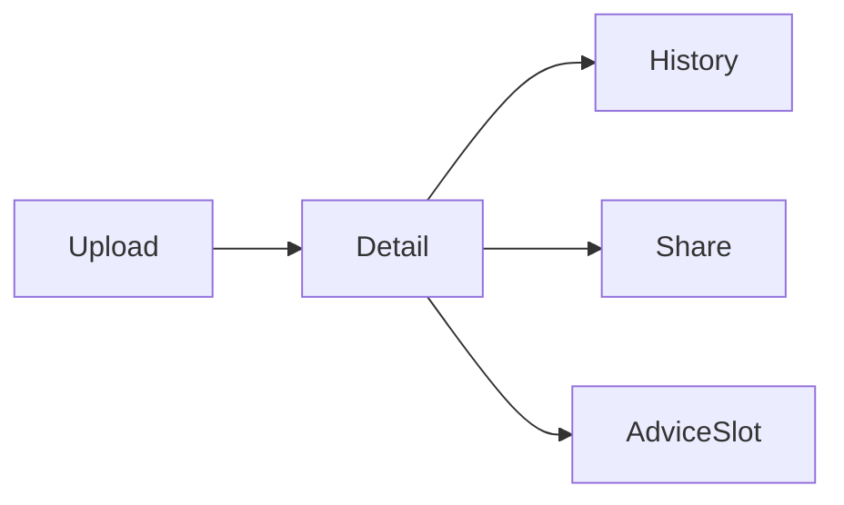

# 功能規格：U8 `estimate-workspace-ui`

## 範圍
重寫 `/cost`：M1 空態、M2 上傳中、M3 主畫面（摺疊）、檢查結果、歷史 drawer、分享／隱私徽章。建議區僅占位（U9）。**與 U3 同批部署**。

## 工作流 W1 — 上傳
1. 拖放 ≤3 檔 → POST `/api/cost/v1/sets`（multipart＋可選 cloud_overrides／diagram_id）
2. 201 → 渲染明細＋checks；建議區顯示占位
3. 錯誤：固定 detail 字串顯示於上傳區

## 工作流 W2 — 歷史與分享
1. 「歷史」開 drawer → GET `/sets`
2. 選一筆 → GET `/sets/{id}` 載入主畫面
3. 擁有者可 PUT shares；徽章反映 privacy

## 工作流 W3 — 建議占位
1. 渲染 `#advice-slot`；文案「AI 建議載入區（U9）」
2. **不**連線 `/advice/stream`

**文字：** 上傳得明細；歷史／分享獨立；建議僅占位。

## Review

**Verdict:** READY
**Reviewer:** aidlc-architecture-reviewer-agent
**Date:** 2026-09-19T19:45:00Z
**Iteration:** 1

### Findings

| ID | Severity | Location | Finding | Required action | Status |
|---|---|---|---|---|---|

### Summary
READY after Request Changes; empty findings table (valid).
