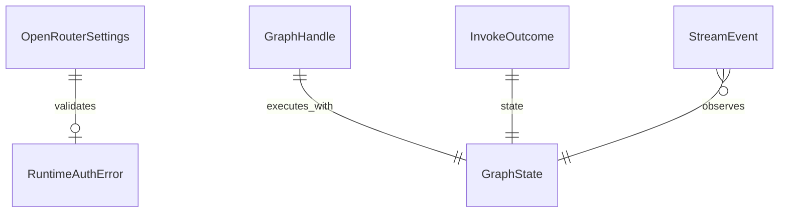

# 功能規格：U6 `langgraph-runtime`

本檔為**工作流與行為**的真實來源。實體形狀見 `entities.md`，決策規則見 `rules.md`。

## 範圍

提供執行期底座（Q1–Q3=A；契約形狀以本檔與 entities 為準）：

1. OpenRouter OpenAI 相容客戶端建構（讀 `OPENROUTER_API_KEY`）
2. `invoke_graph(graph, state, *, config?) → InvokeOutcome`（成功時 `outcome.state` 為終態 GraphState）
3. 串流雙入口（事件形狀皆為 StreamEvent）：
   - `stream_graph(...) → Iterator[StreamEvent]` — sync，供 smoke／腳本
   - `astream_graph(...) → AsyncIterator[StreamEvent]` — async，供 U7 在 FastAPI SSE／async handler 使用（**不得**在 async handler 內阻塞迭代 sync Iterator）

模組落點：`backend/services/langgraph_runtime.py`（＋必要時同目錄小輔助）。

**不含：** 成本建議圖節點、提示詞、三類建議語意、查價工具（U7／U5）；不改 `llm_provider`；不移除 `claude-agent-sdk`。

消費者：U7 `cost-advice-agent`（同 process）。B2 smoke 腳本可直接呼叫以證明一次成功推論。

---

## 工作流 W1 — 建構客戶端

| 步驟 | 動作 | 規則 |
|---|---|---|
| 1 | 讀取 `OPENROUTER_API_KEY` | BR10.4 |
| 2 | 若缺／空 → 拋 RuntimeAuthError（含變數名、無金鑰值） | BR10.4、BR10.7 |
| 3 | 以固定 baseUrl `https://openrouter.ai/api/v1` 建立 OpenAI 相容客戶 | BR10.2 |
| 4 | 不修改 `llm_provider` 環境語意 | BR10.2 |

---

## 工作流 W2 — 同步執行

| 步驟 | 動作 | 規則 |
|---|---|---|
| 1 | 呼叫端傳入已編譯圖與初始狀態 | BR10.5 |
| 2 | 若此次執行需要 LLM 且尚未通過金鑰檢查 → 同 W1 | BR10.4 |
| 3 | `invoke_graph` 執行至終態，回傳 `InvokeOutcome`（內含 `state`） | BR10.1、BR10.8 |
| 4 | 回傳內容不得含金鑰 | BR10.7 |

---

## 工作流 W3 — 串流執行

| 步驟 | 動作 | 規則 |
|---|---|---|
| 1 | 同 W2 前置（圖＋狀態＋金鑰） | BR10.4、BR10.5 |
| 2 | 依呼叫情境選 sync `stream_graph` 或 async `astream_graph` | BR10.1、BR10.9 |
| 3 | 逐一產出 StreamEvent（兩入口事件形狀相同） | BR10.1 |
| 4 | 事件 data 不得含金鑰 | BR10.7 |

---

## 工作流 W4 — B2 去風險驗證

| 步驟 | 動作 | 規則 |
|---|---|---|
| 1 | unittest：mock 客戶端覆蓋成功路徑與缺金鑰路徑 | BR10.6、BR10.4 |
| 2 | 本機／手動：`scripts/smoke_langgraph_openrouter.py`（名稱可微調）在有金鑰時完成一次真實推論 | BR10.6、B2 DoD |
| 3 | CI 不要求真實金鑰 | BR10.6 |

---

## 衍生檢視：ER（自 entities.md）

**文字：** OpenRouterSettings 在缺金鑰時對應 RuntimeAuthError。GraphHandle 搭配 GraphState 執行；同步結果為 InvokeOutcome，串流為多個 StreamEvent。業務圖拓樸不在本模型內。

## 衍生檢視：規則摘要（自 rules.md）

見 `rules.md` 表格；工作流觸發點見上表。

---

## 與其他 Unit 的契約邊界

| 方向 | 契約 | 行為備註 |
|---|---|---|
| → U7 | 函式庫 API | U7 編譯圖、定義狀態與節點；本 Unit 只 invoke／stream／astream |
| ∥ 既有 agents | FR10.3 | design／review／wa_lens 繼續用 claude-agent-sdk；兩路徑共存 |
| — llm_provider | 平行 | 不得為本 Unit 改寫其 CLI／Anthropic 映射語意 |

## 錯誤與邊緣

| 情境 | 行為 |
|---|---|
| 缺 `OPENROUTER_API_KEY` | RuntimeAuthError；不 fallback CLI |
| 呼叫端傳入未編譯／無效圖 | 領域錯誤或底層例外上拋；本 Unit 不吞掉後假裝成功 |
| 網路／上游 4xx／5xx | 上拋可診斷錯誤；訊息不含水印金鑰 |
| 僅驗證相依可 import | 屬 build；不代替 W4 的 mock／smoke |

## Review

**Verdict:** READY
**Reviewer:** aidlc-architecture-reviewer-agent
**Date:** 2026-09-19T19:45:00Z
**Iteration:** 1

### Findings

| ID | Severity | Location | Finding | Required action | Status |
|---|---|---|---|---|---|

### Summary
READY after Request Changes; empty findings table (valid).
