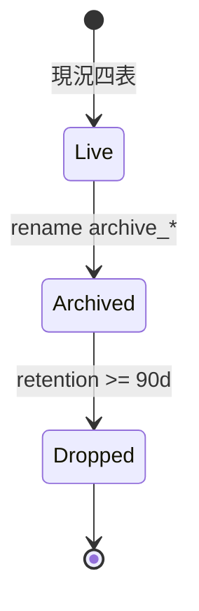
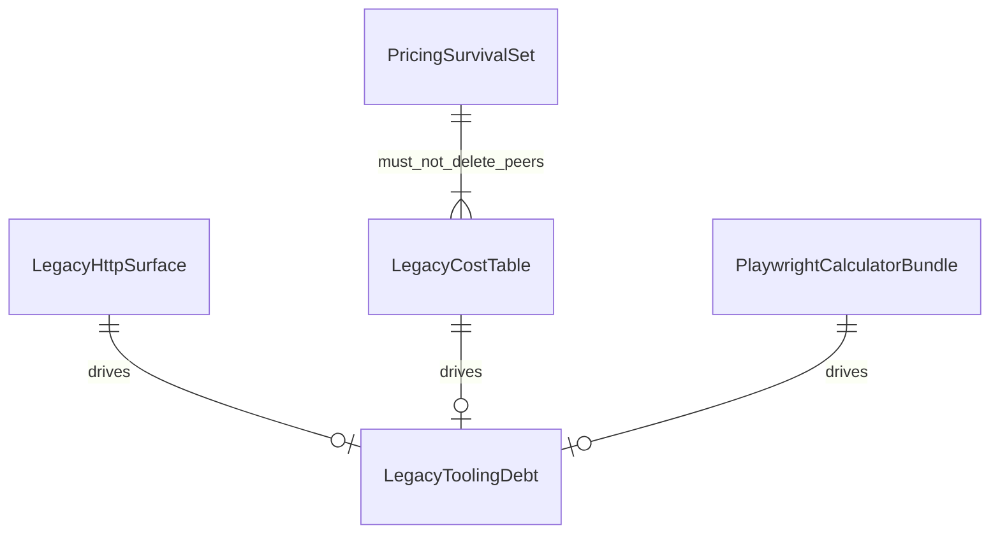

# 功能規格：U3 `legacy-cost-retirement`

本檔為**退場工作流**的真實來源。資產分類見 `entities.md`，決策規則見 `rules.md`。

## 範圍

依 Q1–Q6 定案：

1. 移除舊 `/api/cost` diagrams／budget／calculator-export 等 HTTP 面（FR9.1；Q2=A）
2. 四張舊表 **rename → `archive_*`，保留 ≥90 天** 後再物理刪除（FR9.2；Q3=C）
3. 移除 Playwright Calculator 模組與 Python `playwright` 相依（FR9.3；Q4=A）
4. 保留 U5 最小存活集（FR9.4／9.5；Q5=A）
5. 處理 e2e／warm cache／orphan prompt／OpenAPI 重產（FR9.7／9.9–9.11）
6. **合併／部署與 U8 同批**（Q1=A）

**不含：** 新 `/api/cost/v1`（U2）、新 Cost UI（U8）、查價 Port 強化（U5）、邊界腳本改指向（U1 已做）、直接 DROP 四表而未 archive。

---

## 工作流 W1 — HTTP 退場

| 步驟 | 動作 | 規則 |
|---|---|---|
| 1 | 自 `main.py` 移除 `cost_router` 掛載 | BR9.1 |
| 2 | 刪除／清空舊 router、service、agent 中僅服務舊 HTTP 的模組 | BR9.1 |
| 3 | 確認無新增 v1 stub | BR9.1 |
| 4 | 同 PR 重產 `openapi.json` 與前端型別 | BR9.7 |

---

## 工作流 W2 — 表改名與保留期

| 步驟 | 動作 | 規則 |
|---|---|---|
| 1 | 雙軌遷移：`diagram_cost`→`archive_diagram_cost`（其餘三表同理） | BR9.2 |
| 2 | 更新 `database.py::_ensure_cost_schema` 與 `schema_rbac.sql` | BR9.2 |
| 3 | 更新 `DEPLOY.md` 表對照；記載保留到期日（≥90 天） | BR9.2 |
| 4 | 應用程式碼停止讀寫 live 表名；ORM／查詢改指向存活路徑或移除 | BR9.2、BR9.4 |
| 5 | （可後續 chore）到期後 DROP `archive_*` | BR9.2 |

**文字：** 四表由 live 改名為 archive_*；保留滿一季後才允許物理刪除。本 Unit 至少完成到 Archived＋文件化到期。

---

## 工作流 W3 — Calculator 與相依清理

| 步驟 | 動作 | 規則 |
|---|---|---|
| 1 | 刪除 azure／gcp calculator runner、product resolver、spike | BR9.3 |
| 2 | 自 `requirements.txt` 移除 Python `playwright` | BR9.3 |
| 3 | 確認前端 e2e Playwright 仍可用 | BR9.3 |

---

## 工作流 W4 — 存活集護欄與工具鏈

| 步驟 | 動作 | 規則 |
|---|---|---|
| 1 | 對照 PricingSurvivalSet 做刪除審查 | BR9.4 |
| 2 | 修正或移除 `warm_aws_pricing_cache.py` | BR9.7 |
| 3 | 處理 `cost_pricing_agent_system.md` 等 orphan | BR9.7 |
| 4 | 不得回退 `validate_cost_calculator_boundary.py` 目標 | BR9.8 |

---

## 工作流 W5 — e2e 與同批部署閘

| 步驟 | 動作 | 規則 |
|---|---|---|
| 1 | 刪除或改寫依賴舊 diagrams／`$86.40` 的 e2e | BR9.6 |
| 2 | U8 未就緒時允許 skip／移除，並註明由 U8 補 | BR9.6 |
| 3 | 合併前確認 U8 變更同批 | BR9.5 |

---

## 衍生檢視：ER（自 entities.md）

**文字：** 三類待刪／改名資產驅動工具鏈清理；PricingSurvivalSet 約束不得誤刪查價同伴模組。

## 衍生檢視：規則摘要（自 rules.md）

見 `rules.md` 表格；工作流觸發點見上表。

---

## 與其他 Unit 的契約邊界

| 方向 | 契約 | 行為備註 |
|---|---|---|
| ∥ U8 | 同批部署 | 無 U8 不得單獨合 U3 |
| ← U2 | 新 API | 本 Unit 不建立 v1 |
| → U5 | 存活集 | pricing_* 最小集保留 |
| ← U1 | 邊界腳本 | 已改指向 parser；不得回退 |

## 錯誤與邊緣

| 情境 | 行為 |
|---|---|
| 只合 U3 不合 U8 | 阻擋合併／部署（BR9.5） |
| 誤刪 pricing_sdk | 違反 BR9.4；必須還原 |
| staging 仍有 live 表資料 | rename 保留於 archive_*；不在本 Unit 直接 DROP |
| e2e 仍斷言舊 API | CI 紅；須依 BR9.6 處理 |

<!-- confirmed: Looks correct -->

## Review

**Verdict:** READY
**Reviewer:** aidlc-architecture-reviewer-agent
**Date:** 2026-09-19T19:45:00Z
**Iteration:** 1

### Findings

| ID | Severity | Location | Finding | Required action | Status |
|---|---|---|---|---|---|

### Summary
READY after Request Changes; empty findings table (valid).
