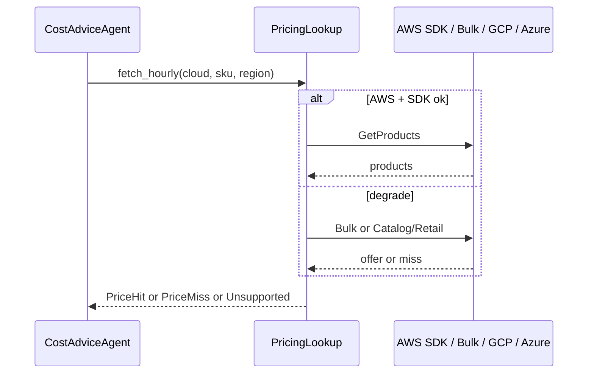
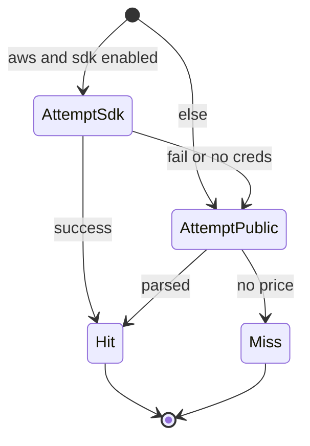
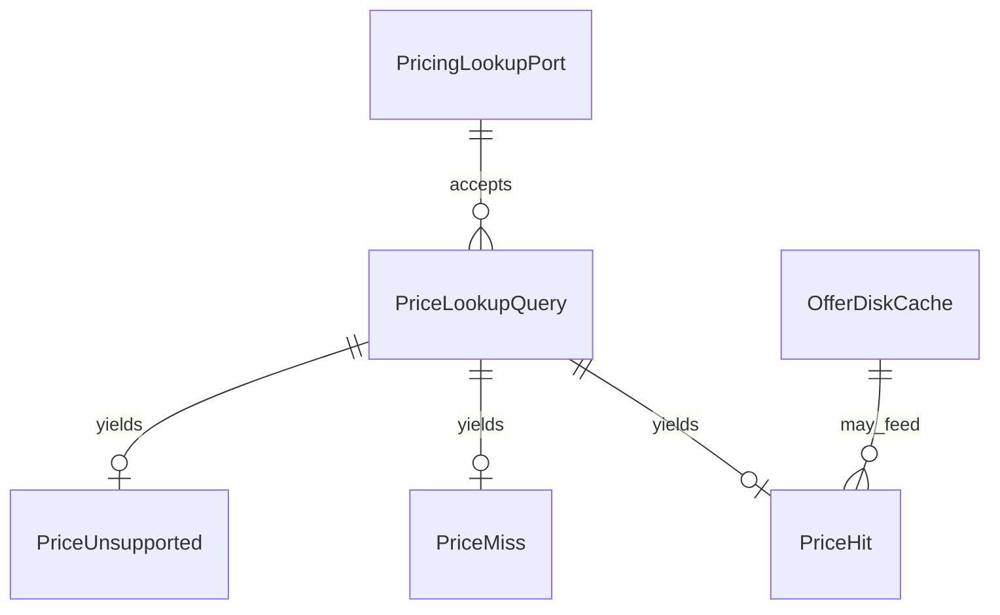

# 功能規格：U5 `pricing-lookup-port`

本檔為**唯讀目錄價 Port**工作流的真實來源。實體見 `entities.md`，規則見 `rules.md`。

## 範圍

依 Q1–Q6=A：

1. 公開入口保留 `fetch_hourly`；文件／邊界稱 PricingLookup（Q1）
2. 保留 24h 磁碟 offer 快取；不重建 Postgres `pricing_cache`（Q2）
3. AWS：SDK 可啟用；無憑證／失敗 → Bulk → miss／unsupported；不讓 U7 崩潰（Q3）
4. 盤點 warm／死引用並修或刪（Q4）
5. CI 邊界：intake 寫入路徑不得 import Port；他處不得直打 Pricing API（Q5／BR5.7–5.8）
6. GCP Catalog、Azure Retail；禁 Cost Explorer 等帳單 API（Q6）

**不含：** 建議正文／SSE（U7）、上傳／明細 API（U2）、憑證注入管線（U4 已做）、SPA。

---

## 工作流 W1 — 單筆查價

| 步驟 | 動作 | 規則 |
|---|---|---|
| 1 | 呼叫端（預期 U7）傳入 cloud／sku／region | BR5.1 |
| 2 | 若 unsupported 覆蓋 → `PriceUnsupported` | BR5.1 |
| 3 | AWS：嘗試 SDK（若啟用且有憑證） | BR5.4、BR5.5 |
| 4 | 失敗／未啟用 → Bulk＋磁碟快取 | BR5.4、BR5.6 |
| 5 | GCP／Azure：Catalog／Retail（缺 key → miss） | BR5.3、BR5.5 |
| 6 | 回傳 Hit／Miss；**不**寫明細 | BR5.2 |

**文字：** Agent 查價 → Port 依雲別嘗試允許端點並降級 → 僅回傳結果給建議文字。

---

## 工作流 W2 — 降級與缺憑證

| 步驟 | 動作 | 規則 |
|---|---|---|
| 1 | 無 IAM／無 GCP key | FR11.4、BR5.4 |
| 2 | 降級公開路徑或直接 Miss | BR5.4 |
| 3 | 不拋未處理例外中止建議 | FR5.10 |

**文字：** SDK 可選；任何失敗落到公開或 Miss，流程可繼續。

---

## 工作流 W3 — 邊界與存活集守護

| 步驟 | 動作 | 規則 |
|---|---|---|
| 1 | 保留 sdk／parser／YAML 等最小集 | BR5.9 |
| 2 | CI：intake 不得 import Port；禁直打 host | BR5.7、BR5.8 |
| 3 | 盤點 warm／文件死引用 | BR5.10 |
| 4 | 禁新增帳單類客戶端 | BR5.3 |

---

## 衍生檢視：ER（邏輯）

**文字：** 查詢對三種結果擇一；磁碟快取可供給 Hit；無 DB 實體關聯。

## 衍生檢視：規則摘要

見 `rules.md` BR5.1–BR5.10。

---

## 與其他 Unit 的契約邊界

| 方向 | 契約 | 行為備註 |
|---|---|---|
| ← U4 | 憑證可注入、可缺席 | 本 Unit 執行期降級 |
| → U7 | `fetch_hourly` 結果 | 非單元相依；可選呼叫 |
| ∥ U2 | 無 import／無寫回 | AH-6／Q5 |
| ∥ U3 | archive_* 不讀寫 | 不重建 pricing_cache |

## 錯誤與邊緣

| 情境 | 行為 |
|---|---|
| 缺憑證 | 降級或 Miss；應用仍可啟動 |
| SDK／網路錯誤 | 降級；不中止建議 |
| 不在覆蓋表 | Unsupported |
| 誤打帳單 API | 禁止；測試／邊界擋 |

<!-- confirmed: Looks correct -->

<!-- post-confirmation save -->

## Review

**Verdict:** READY
**Reviewer:** aidlc-architecture-reviewer-agent
**Date:** 2026-09-19T19:45:00Z
**Iteration:** 1

### Findings

| ID | Severity | Location | Finding | Required action | Status |
|---|---|---|---|---|---|

### Summary
READY after Request Changes; empty findings table (valid).
