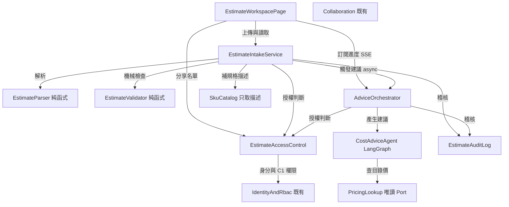

# 元件目錄：C1 估價表上傳

本檔的 `yaml` 區塊是**真實來源**，其下所有表格與圖皆由它衍生。

元件＝要寫程式碼的邏輯構件。資料庫、LLM 供應商、雲端價目端點皆為 `external_dependencies`，不是元件。部署拓樸不在本站決定（那是 units-generation）。實體只捕捉「擁有者＋形狀」——型別、驗證約束、允許值與關聯基數屬 functional-design 的 `entities.md`。

`IdentityAndRbac` 與 `Collaboration` 為**既有且本期不改動**的元件，列入目錄僅為使 `User`／`UserDiagram` 的跨元件參照合法。

## Part A — 機器可讀目錄

```yaml
components:
  - name: EstimateWorkspacePage
    summary: /cost 頁面，估價表上傳與結果檢視的唯一使用者介面
    behaviour: >
      沿用 /cost 路徑，App.tsx:24 的根導向與 Sidebar.tsx:201 的導覽項目不變（FR3.3）。
      呈現拖放上傳區並常駐顯示限制（5 MB、3 檔、.csv/.xlsx）；每檔落地後顯示雲別判定
      結果並允許就地更正。三張雲別卡片預設摺疊，標頭攜帶雲別、項數、總額與機械檢查
      摘要（含無法辨識列數——此為 FR3.2 在摺疊版面下成立的依據）。展開後為逐項明細表，
      無法辨識的列留在原始順序、淡色底、金額欄標示「無法辨識」。規格欄有
      spec_description 時優先顯示描述，原始 SKU 作副標（FR3.1、FR13）。空狀態與上傳區
      提供三雲官方估價教學按鈕，開啟 2–3 頁彈窗（官網截圖＋匯出位置），不得只放裸外連
      （FR12）。「檢查結果」與「AI 建議」為兩個標題分明的區段，後者固定加註「由 AI
      產生，請自行核對」（FR4.5）。建議區在等待期間為骨架載入狀態，經 SSE 接收階段
      進度與最終結果。隱私狀態徽章為純展示不可點；分享按鈕為唯一入口。歷史上傳以側邊
      抽屜呈現，**不提供勾選框與並排比較**（FR6.3）。細部規格見 refined-mockups。
    responsibilities:
      - 上傳互動與前端層的限制提示
      - 官方估價教學彈窗（FR12）
      - 明細（含規格描述）、機械檢查結果與 AI 建議的呈現與來源區分
      - SSE 訂閱與進度呈現
      - 歷史清單與分享入口
    depends_on:
      - component: EstimateIntakeService
        interaction: 上傳檔案、讀取估價批次與逐項明細
        style: sync
      - component: AdviceOrchestrator
        interaction: 訂閱建議產生的進度與結果
        style: event
      - component: EstimateAccessControl
        interaction: 讀取與設定分享名單
        style: sync
    dependents: []
    external_dependencies: []
    entities: []

  - name: EstimateIntakeService
    summary: 上傳入口與協調層，擁有估價批次、單雲估價表與逐項明細
    behaviour: >
      把關上傳限制：單檔 5 MB、單次最多 3 檔、僅 .csv 與 .xlsx，且驗證檔案內容的魔數
      與副檔名相符，不符者拒絕並說明原因（FR1.3、FR1.4）。呼叫 EstimateParser 取得
      雲別判定與解析結果；判定失敗時不逕自拒絕，回報給前端要求使用者指定（FR1.5）。
      原始檔案在解析完成後即丟棄，不落地保存（FR1.6）——這是本元件唯一持有原始位元組
      的地方，丟棄責任在此。寫庫前得呼叫 SkuCatalog 為目錄形 SKU 補規格描述
      （FR13）；**不得**因此 import PricingLookup／pricing_client。持久化
      EstimateSet、Estimate 與 EstimateLineItem，接著觸發 AdviceOrchestrator。
      **機械檢查結果不持久化**：EstimateValidator 是純函式且輸入（逐項明細）已持久化，
      每次讀取時重算，永遠與明細一致。維持 cost_router → cost_service → 純函式層的
      三層形狀（NFR6），router 為本元件的 HTTP 邊界、不含業務邏輯。
    responsibilities:
      - 上傳限制與檔案型別把關
      - 原始檔案的即用即棄
      - 解析與機械檢查的協調
      - 目錄形 SKU 的描述補齊（經 SkuCatalog，失敗略過）
      - 估價批次、單雲估價表與逐項明細的持久化與讀取
      - 歷史清單與刪除
    depends_on:
      - component: EstimateParser
        interaction: 將上傳檔案位元組解析為雲別與逐項明細
        style: sync
      - component: EstimateValidator
        interaction: 對解析結果執行三項確定性檢查
        style: sync
      - component: EstimateAccessControl
        interaction: 判斷呼叫者是否可讀寫該估價批次
        style: sync
      - component: EstimateAuditLog
        interaction: 記錄上傳與解析的事件層級軌跡
        style: sync
      - component: AdviceOrchestrator
        interaction: 解析完成後觸發建議產生
        style: async
      - component: SkuCatalog
        interaction: 寫庫前為目錄形 SKU 補規格描述（失敗略過）
        style: sync
    dependents:
      - component: EstimateWorkspacePage
        interaction: 上傳與讀取
    external_dependencies:
      - name: PostgreSQL
        kind: database
        purpose: 估價批次、單雲估價表與逐項明細的持久化
    entities:
      - name: EstimateSet
        identifier: id
        attributes: [id, ownerUserId, createdAt, diagramId, note]
        references:
          - entity: User
            owned_by: IdentityAndRbac
            relationship: 每個 EstimateSet 屬於一位上傳者
          - entity: UserDiagram
            owned_by: Collaboration
            relationship: 每個 EstimateSet 可選擇性標記一張架構圖，也可不標記
      - name: Estimate
        identifier: id
        attributes: [id, estimateSetId, cloud, statedTotal, currency, parsedLineCount, unparsedLineCount]
        references:
          - entity: EstimateSet
            owned_by: EstimateIntakeService
            relationship: 每份 Estimate 屬於一個 EstimateSet，同一批次內每朵雲至多一份
      - name: EstimateLineItem
        identifier: id
        attributes: [id, estimateId, ordinal, itemName, spec, specDescription, quantity, amount, currency, parseStatus, rawText]
        references:
          - entity: Estimate
            owned_by: EstimateIntakeService
            relationship: 每一列屬於一份 Estimate，並以 ordinal 保留原始順序

  - name: EstimateParser
    summary: 純函式解析器，將三朵雲的官方估價表轉為正規化的逐項明細
    behaviour: >
      依檔案標頭欄位判定雲別（FR1.5）；判定不出來時回傳 ambiguous，**不拋例外、不做
      使用者互動**——互動是協調層的事。依判定結果選用 AWS CSV、Azure XLSX 或 GCP CSV
      三個內部讀取器之一（FR1.2），擷取品項、規格、數量、金額，以及該表的總額與幣別
      （FR2.1）。規格優先對應 SKU／SKU ID 別名；GCP 另擷取 serviceId。**不填**
      specDescription、**不外呼**。採寬鬆策略：能解析的列照常產出，無法辨識的列保留原始文字並標記
      （FR2.2）。「無法辨識」的判定為該列的金額或數量無法解析為數值；品項或規格文字
      缺漏但金額與數量完好者不計入。**模組內不得 import httpx、requests、sqlalchemy、
      fastapi**（FR2.3），由 scripts/validate_cost_calculator_boundary.py 機械強制。
      受 property-based test 覆蓋（FR2.4、ADR-0006 hard constraint）。
      模組路徑為 backend/cost/estimate_parser.py。
    responsibilities:
      - 雲別判定
      - 三種格式的讀取與正規化
      - 無法辨識列的標記與原始文字保留
    depends_on: []
    dependents:
      - component: EstimateIntakeService
        interaction: 解析上傳檔案
    external_dependencies: []
    entities: []

  - name: EstimateValidator
    summary: 純函式驗證器，對解析結果執行三項確定性機械檢查
    behaviour: >
      三項檢查：幣別一致性（FR4.1，逐列判斷，指出哪幾列異於多數）、數量正值（FR4.2，
      逐列判斷）、總額對帳（FR4.3，整表判斷，逐列金額加總與表上總額比對，容差 0.5%）。
      **存在任何無法辨識的列時跳過總額對帳**，改為報告「因 N 列無法辨識，總額無法核對」
      （FR4.4）——此判斷所需的資訊（哪些列無法辨識）已在輸入的解析結果中，不需向協調層
      詢問。輸出明確標示每項結論屬於哪一檢查，供 UI 與 AI 建議區分來源（FR4.5）。
      與 EstimateParser 同為純函式層，同樣不得 import httpx、requests、sqlalchemy、
      fastapi。
    responsibilities:
      - 幣別一致性檢查
      - 數量正值檢查
      - 總額對帳與其跳過條件
    depends_on: []
    dependents:
      - component: EstimateIntakeService
        interaction: 對解析結果執行檢查
    external_dependencies: []
    entities: []

  - name: EstimateAccessControl
    summary: 估價批次的可見性判斷與分享名單管理
    behaviour: >
      估價批次預設僅上傳者本人可見（FR6.5）；上傳者可明確分享給指定使用者（FR6.6），
      沿用架構圖既有的關聯表模型（diagram_shares 的形狀）。**可見性判斷完全自足**——
      只看 EstimateSet 的擁有者與其分享名單，不查架構圖權限（FR7.3 的替代方案）。
      EstimateSet 上的架構圖外鍵是純標記，不參與任何授權判斷。這使
      cost_service.py:43 對 services.collab_router 私有函式的跨模組引用自然消失，
      並維持 C6 要求的單向相依。RBAC 故事權限仍走既有 services.rbac 的公開介面，
      story id 為 C1（FR7.1）。
    responsibilities:
      - 估價批次的讀寫授權判斷
      - 分享名單的建立、查詢與撤銷
    depends_on:
      - component: IdentityAndRbac
        interaction: 取得使用者身分與 C1 故事權限判斷
        style: sync
    dependents:
      - component: EstimateIntakeService
        interaction: 授權判斷
      - component: AdviceOrchestrator
        interaction: SSE 訂閱與建議讀取的授權判斷
      - component: EstimateWorkspacePage
        interaction: 分享名單的讀取與設定
    external_dependencies:
      - name: PostgreSQL
        kind: database
        purpose: 分享關聯的持久化
    entities:
      - name: EstimateShare
        identifier: (estimateSetId, userId) 複合鍵
        attributes: [estimateSetId, userId, sharedAt]
        references:
          - entity: EstimateSet
            owned_by: EstimateIntakeService
            relationship: 每筆分享指向一個被分享的 EstimateSet
          - entity: User
            owned_by: IdentityAndRbac
            relationship: 每筆分享指向一位被分享的使用者

  - name: AdviceOrchestrator
    summary: 建議產生的背景工作排程與 SSE 發布，擁有建議實體
    behaviour: >
      解析完成後被觸發，**以背景工作執行建議產生，生命週期與 HTTP 請求解耦**
      （F1=B）——客戶端斷線時工作續跑並在完成時寫入，使用者重新進入頁面即可看到結果。
      Advice 於工作開始時即以「產生中」狀態建立，完成或失敗時就地更新狀態；因此不需要
      獨立的工作狀態實體。經 text/event-stream 發布階段進度與最終結果（FR NFR2），
      沿用 services/agent_router.py 與 review_router.py 的既有 SSE 形式。
      **串流必須週期性送出 heartbeat 或階段進度事件**：本功能可能靜默數分鐘才吐出
      結果，而靜默的長連線會被反向代理或 Cloudflare 的 idle timeout 切斷；A1／A3 因
      逐 token 輸出而不會遇到此問題，本功能會。三類建議一次填入（省錢、跨雲比較、
      品質檢查）；未交付或資料不足者以明確原因呈現而非停留在「產生中」（FR5.2、FR5.3）。
      逾時上限 5 分鐘（NFR1），逾時後明細與機械檢查保持可用，僅建議區顯示逾時與重試。
    responsibilities:
      - 建議產生工作的排程與生命週期管理
      - 建議的持久化與狀態轉換
      - SSE 進度發布與 heartbeat
      - 逾時處置與降級
    depends_on:
      - component: CostAdviceAgent
        interaction: 產生三類建議
        style: sync
      - component: EstimateAccessControl
        interaction: SSE 訂閱與建議讀取的授權判斷
        style: sync
      - component: EstimateAuditLog
        interaction: 記錄建議產生的完成時間
        style: sync
    dependents:
      - component: EstimateIntakeService
        interaction: 解析完成後觸發
      - component: EstimateWorkspacePage
        interaction: 訂閱進度與結果
    external_dependencies:
      - name: PostgreSQL
        kind: database
        purpose: 建議與其狀態的持久化
    entities:
      - name: Advice
        identifier: id
        attributes: [id, estimateSetId, status, savingText, comparisonText, qualityText, unavailableReasons, startedAt, completedAt]
        references:
          - entity: EstimateSet
            owned_by: EstimateIntakeService
            relationship: 每份 Advice 對應一個 EstimateSet，一對一

  - name: CostAdviceAgent
    summary: LangGraph 成本建議 agent，產生省錢、跨雲比較與品質檢查三類建議
    behaviour: >
      由 claude_agent_sdk 遷移至 LangGraph（FR10.1）；模型存取走 OpenRouter 的
      OpenAI 相容端點（FR10.2）。**不得移除 claude-agent-sdk 相依**——
      services/design_agent.py、review_agent.py、wa_lens_engine.py 仍在使用，
      連帶 Dockerfile 的 Node 22 與 @anthropic-ai/claude-code 也不可拿掉（FR10.3）。
      送交 LLM 的內容為完整解析結果：品項、規格、數量、金額（FR5.4）。省錢建議為核心
      必備（FR5.1）；跨雲比較至少需一朵雲的資料，僅上傳一朵雲時須明示「資料不足」而非
      給出無依據的結論（FR5.3）。產生建議時得經 PricingLookup 查目錄價確認現價，
      **所得價格只寫入建議文字、不得回寫明細表**（FR5.5、AH-6）。既有
      cost_pricing_agent.py:43-49 的 in-process MCP server 三個 tool 是遷移時必須
      逐一對應的介面契約。backend/prompts/cost_pricing_agent_system.md 隨舊 agent
      拆除後須一併處理（FR9.11）。
    responsibilities:
      - LangGraph 圖的節點與邊
      - 三類建議的產生
      - 查價工具的呼叫決策
    depends_on:
      - component: PricingLookup
        interaction: 按需查詢目錄價以確認現價
        style: sync
    dependents:
      - component: AdviceOrchestrator
        interaction: 產生建議
    external_dependencies:
      - name: OpenRouter
        kind: third-party-api
        purpose: LLM 推論（OpenAI 相容端點）
    entities: []

  - name: PricingLookup
    summary: 唯讀目錄價查詢 Port，改造自既有 pricing_client
    behaviour: >
      **唯讀。其價格輸出不得進入估價明細的寫入路徑**——這條界線是本元件的職責定義而非
      使用慣例（AH-6、ADR-0017 §8）。規格**文字描述**的查詢不經本元件，見 SkuCatalog
      （FR13）。僅限目錄價端點（FR5.7）：AWS Price List Query
      API（boto3，走 IAM）與公開 Bulk Price List、GCP Cloud Billing Catalog API
      （需 API key）、Azure Retail Prices API（本即公開）。**實際帳單與用量類 API
      ——Cost Explorer、Cost Management、Billing Export——全面禁止**，此禁令是前者
      得以解禁的對價（ADR-0018 §2）。IAM 權限限於 pricing:GetProducts 等 Price List
      Query API 所需動作，不得包含任何帳戶資源或帳單資料的讀取權（FR5.9）。憑證缺漏
      或呼叫失敗時降級回公開端點或略過，**不得使建議產生流程失敗**（FR5.10、FR11.4）。
      httpx 不得在 PricingLookup／SkuCatalog 以外直打雲端 Pricing API。保留 pricing_sdk、
      pricing_query_parser、pricing_units、pricing_gcp、pricing_azure、
      pricing_offer_parser、config 與其 YAML（FR9.4、FR9.5）。
    responsibilities:
      - 三朵雲目錄價端點的統一包裝
      - 憑證缺漏與呼叫失敗的降級
      - 「唯讀、不回寫明細」界線的持有
    depends_on: []
    dependents:
      - component: CostAdviceAgent
        interaction: 按需查詢目錄價
    external_dependencies:
      - name: AWS Price List Query API
        kind: third-party-api
        purpose: AWS 目錄價查詢（IAM 憑證，最小權限）
      - name: GCP Cloud Billing Catalog API
        kind: third-party-api
        purpose: GCP 目錄價查詢（API key 限用於此 API）
      - name: Azure Retail Prices API
        kind: third-party-api
        purpose: Azure 目錄價查詢（公開，不需憑證）
    entities: []

  - name: SkuCatalog
    summary: 目錄 SKU → 人類可讀規格描述；不回傳、不持久化價格
    behaviour: >
      僅當規格文字符合 FR13.1 的目錄 SKU 形狀時查詢 ADR-0018 目錄價端點，回傳描述
      字串。失敗、逾時、缺憑證、超過互異 SKU 上限時靜默略過。**不得**回傳 hourly
      或寫入金額欄；**不得** import／轉呼叫 PricingLookup.fetch_hourly。模組路徑
      cost/sku_catalog.py；由 EstimateIntakeService 延遲載入。
    responsibilities:
      - 目錄形 SKU 的描述查詢與短時磁碟快取
      - 價格不進入明細的第二道結構界線（與 PricingLookup 互補）
    depends_on: []
    dependents:
      - component: EstimateIntakeService
        interaction: 寫庫前補 specDescription
    external_dependencies:
      - name: AWS Price List Query API
        kind: third-party-api
        purpose: AWS SKU 描述（非估價金額）
      - name: GCP Cloud Billing Catalog API
        kind: third-party-api
        purpose: GCP SKU 描述
      - name: Azure Retail Prices API
        kind: third-party-api
        purpose: Azure SKU 描述
    entities: []

  - name: EstimateAuditLog
    summary: 事件層級稽核軌跡
    behaviour: >
      記錄何人、何時、上傳了哪朵雲的估價表、解析出幾列、幾列無法辨識、何時產生了建議
      （FR8.1）。**不含金額與逐項明細**（FR8.2）。因原始檔不保存（FR1.6），稽核軌跡
      無法支援「重現當初那份檔案」的事後回溯，此為已知且接受的限制（FR8.3）。
    responsibilities:
      - 稽核事件的寫入
      - 金額與明細不入稽核的界線持有
    depends_on: []
    dependents:
      - component: EstimateIntakeService
        interaction: 記錄上傳與解析事件
      - component: AdviceOrchestrator
        interaction: 記錄建議產生完成事件
    external_dependencies:
      - name: PostgreSQL
        kind: database
        purpose: 稽核事件的持久化
    entities:
      - name: EstimateAuditEvent
        identifier: id
        attributes: [id, actorUserId, eventType, occurredAt, cloud, parsedLineCount, unparsedLineCount, estimateSetId]
        references:
          - entity: User
            owned_by: IdentityAndRbac
            relationship: 每筆稽核事件記錄一位行為者
          - entity: EstimateSet
            owned_by: EstimateIntakeService
            relationship: 每筆稽核事件關聯到一個 EstimateSet

  - name: IdentityAndRbac
    summary: 既有身分與權限元件，本期不改動
    behaviour: >
      **既有元件，列入目錄僅為使 User 的跨元件參照合法。** JWT 認證、密碼雜湊、故事級
      權限評估。本 intent 對它的唯一改動在 seed 資料層而非程式層：保留 story id C1
      並將語意改為「上傳與檢視估價表」（FR7.1），移除 C1h、C1r、C1o、C1b 四組
      （各 11 列，位於 backend/services/rbac_seed_data.py）（FR7.2）。
    responsibilities:
      - 身分認證
      - 故事級權限評估
    depends_on: []
    dependents:
      - component: EstimateAccessControl
        interaction: 身分與 C1 故事權限
    external_dependencies:
      - name: PostgreSQL
        kind: database
        purpose: 使用者與權限資料
    entities:
      - name: User
        identifier: id
        attributes: [id, username, role, isActive, authorizationStatus]

  - name: Collaboration
    summary: 既有協作元件，本期不改動
    behaviour: >
      **既有元件，列入目錄僅為使 UserDiagram 的跨元件參照合法。** 架構圖 CRUD、聊天
      歷史、分享、WebSocket 同步。本 intent **不修改**它——Q6=B 的自有授權判斷正是為了
      避免動到它，並維持 C6 要求的「services 不得反向 import cost」單向相依。
      EstimateSet 對 UserDiagram 的外鍵是純標記，架構圖被刪除時該外鍵設為 NULL、
      估價批次留存（Q5=A）。
    responsibilities:
      - 架構圖 CRUD 與分享
    depends_on: []
    dependents: []
    external_dependencies:
      - name: PostgreSQL
        kind: database
        purpose: 架構圖資料
    entities:
      - name: UserDiagram
        identifier: id
        attributes: [id, userId, title, xmlData, updatedAt]
```

## Part B — 人類可讀視圖

### 元件關係圖



**文字 fallback**：前端 `EstimateWorkspacePage` 有三條對外邊——上傳與讀取走 `EstimateIntakeService`、建議進度以 SSE 訂閱 `AdviceOrchestrator`、分享名單走 `EstimateAccessControl`。`EstimateIntakeService` 是扇出最廣的協調層：同步呼叫兩個純函式元件（`EstimateParser` 解析、`EstimateValidator` 檢查）、同步呼叫 `SkuCatalog` 補規格描述、`EstimateAccessControl` 授權與 `EstimateAuditLog` 稽核，並以非同步觸發 `AdviceOrchestrator`。**不**呼叫 `PricingLookup`。`AdviceOrchestrator` 同步呼叫 `CostAdviceAgent`，後者再同步呼叫 `PricingLookup` 查目錄價。`EstimateAccessControl` 是唯一接觸既有 `IdentityAndRbac` 的新元件；**沒有任何新元件呼叫 `Collaboration`**。兩個純函式元件、`PricingLookup` 與 `SkuCatalog` 皆為零出度葉節點。圖為有向無環。

### 元件摘要

| Component | Purpose | Depends On | Dependents | Entities Owned |
|---|---|---|---|---|
| EstimateWorkspacePage | `/cost` 頁面 | EstimateIntakeService, AdviceOrchestrator, EstimateAccessControl | — | — |
| EstimateIntakeService | 上傳入口與協調 | EstimateParser, EstimateValidator, SkuCatalog, EstimateAccessControl, EstimateAuditLog, AdviceOrchestrator | EstimateWorkspacePage | EstimateSet, Estimate, EstimateLineItem |
| EstimateParser | 純函式解析 | — | EstimateIntakeService | — |
| EstimateValidator | 純函式機械檢查 | — | EstimateIntakeService | — |
| EstimateAccessControl | 可見性與分享 | IdentityAndRbac | EstimateIntakeService, AdviceOrchestrator, EstimateWorkspacePage | EstimateShare |
| AdviceOrchestrator | 背景工作與 SSE 發布 | CostAdviceAgent, EstimateAccessControl, EstimateAuditLog | EstimateIntakeService, EstimateWorkspacePage | Advice |
| CostAdviceAgent | LangGraph 建議產生 | PricingLookup | AdviceOrchestrator | — |
| PricingLookup | 唯讀目錄價 Port（價格） | — | CostAdviceAgent | — |
| SkuCatalog | 目錄 SKU 描述 | — | EstimateIntakeService | — |
| EstimateAuditLog | 事件層級稽核 | — | EstimateIntakeService, AdviceOrchestrator | EstimateAuditEvent |
| IdentityAndRbac（既有） | 身分與權限 | — | EstimateAccessControl | User |
| Collaboration（既有） | 架構圖 CRUD | — | — | UserDiagram |

### 實體擁有權

| Entity | Owning Component | Identifier | Attributes | References |
|---|---|---|---|---|
| EstimateSet | EstimateIntakeService | id | id, ownerUserId, createdAt, diagramId, note | User（IdentityAndRbac）、UserDiagram（Collaboration，可為空） |
| Estimate | EstimateIntakeService | id | id, estimateSetId, cloud, statedTotal, currency, parsedLineCount, unparsedLineCount | EstimateSet |
| EstimateLineItem | EstimateIntakeService | id | id, estimateId, ordinal, itemName, spec, specDescription, quantity, amount, currency, parseStatus, rawText | Estimate |
| EstimateShare | EstimateAccessControl | (estimateSetId, userId) | estimateSetId, userId, sharedAt | EstimateSet、User |
| Advice | AdviceOrchestrator | id | id, estimateSetId, status, savingText, comparisonText, qualityText, unavailableReasons, startedAt, completedAt | EstimateSet |
| EstimateAuditEvent | EstimateAuditLog | id | id, actorUserId, eventType, occurredAt, cloud, parsedLineCount, unparsedLineCount, estimateSetId | User、EstimateSet |
| User（既有） | IdentityAndRbac | id | id, username, role, isActive, authorizationStatus | — |
| UserDiagram（既有） | Collaboration | id | id, userId, title, xmlData, updatedAt | — |

**沒有任何實體記錄機械檢查結果。** 這是刻意的：`EstimateValidator` 是純函式，輸入（`EstimateLineItem`）已持久化，每次讀取時重算即可，永遠與明細一致。持久化反而會製造「存下來的結果與現在算出來的不一致」這種只能靠人工發現的漂移。

### 外部依賴

| Component | Dependency | Kind | Purpose |
|---|---|---|---|
| EstimateIntakeService | PostgreSQL | database | 估價批次、估價表與逐項明細 |
| EstimateAccessControl | PostgreSQL | database | 分享關聯 |
| AdviceOrchestrator | PostgreSQL | database | 建議與其狀態 |
| EstimateAuditLog | PostgreSQL | database | 稽核事件 |
| CostAdviceAgent | OpenRouter | third-party-api | LLM 推論（OpenAI 相容端點） |
| PricingLookup | AWS Price List Query API | third-party-api | AWS 目錄價（IAM，最小權限） |
| PricingLookup | GCP Cloud Billing Catalog API | third-party-api | GCP 目錄價（API key 限用此 API） |
| PricingLookup | Azure Retail Prices API | third-party-api | Azure 目錄價（公開） |
| SkuCatalog | AWS／GCP／Azure 目錄價 API | third-party-api | 只取 SKU 描述，不取估價金額 |
| IdentityAndRbac（既有） | PostgreSQL | database | 使用者與權限 |
| Collaboration（既有） | PostgreSQL | database | 架構圖 |

`EstimateParser` 與 `EstimateValidator` **沒有任何外部依賴**——這正是 FR2.3 純函式約束的意義，也是 `scripts/validate_cost_calculator_boundary.py` 能以 import 比對機械強制它的前提。

### 各元件為何是獨立構件

| Component | 分立理由 |
|---|---|
| EstimateWorkspacePage | 前後端邊界；變更節奏與後端解耦（UI 調整不應觸及解析邏輯） |
| EstimateIntakeService | 唯一持有原始檔案位元組者，FR1.6 的「即用即棄」責任必須有單一歸屬；也是三個核心實體的擁有者 |
| EstimateParser | **零相依是硬約束不是偏好**（FR2.3，CI 機械強制）。與協調層混在一起會讓 import 比對失效，連帶讓 ADR-0006 的 PBT 約束失去落點 |
| EstimateValidator | 同上的零相依約束。與 Parser 分立是因兩者變更節奏不同：解析邏輯隨雲端匯出格式變動，檢查規則隨業務判準變動 |
| EstimateAccessControl | 授權是橫切關注；獨立後 FR7.3 的跨模組私有函式引用才有單一替代落點。分享關聯的擁有權也需要明確歸屬 |
| AdviceOrchestrator | **生命週期與其他元件不同**——它是唯一跨越 HTTP 請求邊界存活的構件（F1=B 的背景工作）。把它併進協調層會讓「請求結束即結束」與「工作續跑」兩種生命週期糾纏在一起 |
| CostAdviceAgent | LangGraph 遷移（FR10.1）的變更面須與排程、SSE、持久化隔離，否則框架遷移會波及不相關的程式碼 |
| PricingLookup | **職責即界線**：「唯讀、價格不得回寫明細」（AH-6）需要一個可指認的邊界來承載。併進 agent 會讓這條界線變成註解而非結構 |
| SkuCatalog | 描述查詢必須與 `fetch_hourly` 分離，否則 intake 會被迫依賴 PricingLookup，AH-6 的相依圖守門失效 |
| EstimateAuditLog | 「不含金額與明細」（FR8.2）同樣需要結構性的界線。獨立元件使違反此界線需要跨元件傳遞，較易在審查中被發現 |

### Alternatives Rejected

各分解選項的完整取捨見 `decisions.md`。摘要：

| 決策 | 選定 | 主要落選項 |
|---|---|---|
| 解析器分解 | 單一 `EstimateParser` 含三讀取器（Q1=C） | 三個獨立元件（B）——三者共用雲別判定與正規化，拆開會複製這兩塊 |
| 機械檢查歸屬 | 獨立 `EstimateValidator`（Q2=B） | 併入 Parser（A）——變更節奏不同；併入協調層（C）——會破壞純函式約束 |
| 建議持久化 | 持久化（Q3=A） | 不持久化（B）——舊版檢視會殘缺；每次重算（C）——重複的 LLM 成本且結果不穩定 |
| 非同步機制 | SSE + 背景工作（Q4=A、F1=B） | 同步請求（C）——3–5 分鐘同步請求在反向代理下不可靠 |
| 架構圖綁定 | 純標籤（Q5=A） | 連動可見性（B／C）——會把兩個資源的授權耦合起來 |
| 授權來源 | cost 域自有判斷（Q6=B） | 新增 `services/diagram_access`（A）——本 intent 不需要，且會擴大改動面 |
| 解析器路徑 | `backend/cost/estimate_parser.py`（Q7=A） | 頂層 `backend/estimate/`（C）——會新增第二條進入邊，破壞 C6 |
| 查價 Port | 獨立且標示唯讀（Q8=C） | 併入 agent（B）——AH-6 的界線會失去結構性載體 |

## Assumptions & Open Questions

**假設**

- **A-DD1**：`EstimateSet` 為本站推導而非需求明文。`requirements.md` 未使用「批次」一詞，但 FR5.3（跨雲比較）、FR6.3（歷史清單）、FR6.6（分享）三者的對象都是「一次上傳」而非「單朵雲的估價表」，故引入此概念。若後續發現使用者期望以單朵雲為分享與歷史的單位，此決定須推翻。
- **A-DD2**：`Advice` 與 `EstimateSet` 為一對一。目前沒有「同一批次重新產生建議並保留兩版」的需求；若日後需要，`Advice` 須改為多筆並加上版本序。
- **A-DD3**：`EstimateIntakeService` 的 HTTP 邊界（router）與協調層（service）在本目錄中視為同一元件的兩層，而非兩個元件。NFR6 要求的三層形狀仍成立，只是三層之中的前兩層落在同一元件內。理由是 router 不含業務邏輯，不符合本站對元件的定義。

**待決**

- **OQ-DD1**：`backend/cost/` 套件名與新職責（估價表上傳）語意已不貼合，但 Q7=A 選擇沿用以維持單一進入邊與最小 CI 改動。是否在後續 intent 重新命名，留給 operation 階段。
- **OQ-DD2**：既有 `pricing_client` 在 `backend/cost/.pricing_offer_cache/` 寫 24 小時磁碟快取，而 `pricing_cache` 資料表隨 FR9.2 退場。磁碟快取的去留 `requirements.md` 未提及。`PricingLookup` 保留或移除它，交由 functional-design。
- **OQ-DD3**：`AdviceOrchestrator` 的背景工作以何種機制執行（FastAPI `BackgroundTasks`、`asyncio` task、或外部 worker），本站不決定——那是 units-generation 與 infrastructure-design 的範疇。但有一條約束必須傳下去：**單一 FastAPI process 的部署拓樸（見 codekb `architecture.md`）意味著 process 重啟會遺失進行中的工作**，`Advice` 的「產生中」狀態因此可能永久卡住，需要逾時清理機制。
- **OQ-DD4**：FR9 的退場項中，FR9.3（Playwright 移除）、FR9.7（`warm_aws_pricing_cache.py` 修正）、FR9.10（OpenAPI 與型別重產）、FR9.11（孤兒 prompt 檔）**沒有對應的新元件**——它們是純刪除或工具鏈維護，不由任何構件實現。`traceability.json` 中如實標記為 GAP，不強行對應。

## Review

**Reviewer:** aidlc-architecture-reviewer-agent
**Iteration:** 1
**Verdict:** READY

---

### 發現概要

本審閱從**語意層**切入，機械性完備性驗證（名稱唯一、相依對稱、無環、實體單一擁有者等）已由作者聲明通過，不在此重複。以下三項發現均為次要等級，不構成阻擋。

---

### 發現一（次要）：`EstimateValidator` 純函式約束無 CI 強制機制

**位置**：`components.md` → `EstimateValidator` `behaviour` 段；對比 FR2.3 與 FR9.6

**問題**

`components.md` 明示 `EstimateValidator` 與 `EstimateParser` 同屬純函式層，「不得 import httpx、requests、sqlalchemy、fastapi」。然而：

- `EstimateParser` 有明確模組路徑（`backend/cost/estimate_parser.py`），FR9.6 要求 `validate_cost_calculator_boundary.py` 改指向它，形成 CI 機械強制。
- `EstimateValidator` **未指定模組路徑**，且 FR2.3 / FR9.6 的 CI 強制範圍僅涵蓋解析器，不涵蓋驗證器。

結果：若有人在 `EstimateValidator` 中意外引入 `sqlalchemy`，CI 不會攔截，「每次重算永遠與明細一致」的正確性保證（decisions.md ADR-002 核心論點）將靜默失效。

**建議處置**：在 functional-design 的 `entities.md` 或 `contract-design` 階段補記 `EstimateValidator` 的模組路徑，並在 CI 腳本或 `pre-commit` hook 中加入對應的 import 邊界檢查；或明確接受「此約束僅由 code review 防守」並將此決定記入 `decisions.md`。

---

### 發現二（次要）：`Advice` 一對一假設未處理背景工作重複觸發的競態

**位置**：`components.md` → `AdviceOrchestrator` `behaviour` 段；`Advice` 實體；A-DD2

**問題**

A-DD2 宣告 `Advice` 與 `EstimateSet` 為一對一。`AdviceOrchestrator` 在解析完成後被觸發，但設計未說明若 `EstimateIntakeService` 因重試或客戶端重複請求而多次觸發 `AdviceOrchestrator` 時的行為：

- 若直接 INSERT 兩筆 `Advice`，一對一假設被破壞，UI 讀哪一筆未定義。
- 若 UPSERT 或先查後建，需要在 `Advice.estimateSetId` 上有 UNIQUE 約束，設計未說明。

`Advice` 的「一開始即以『產生中』狀態建立」模式在 INSERT 比 SELECT 先跑的情況下可能產生兩筆「產生中」紀錄（若資料庫無 UNIQUE 約束）。

**建議處置**：在 functional-design 的 `entities.md` 補記 `Advice.estimateSetId` 須為 UNIQUE（資料庫層約束），並說明 `AdviceOrchestrator` 在觸發時應先確認是否已有非失敗狀態的 `Advice` 存在。此決定可承接 OQ-DD3 的逾時清理討論一起處理。

---

### 發現三（次要）：「再上傳一朵雲」的覆蓋語意與 `EstimateSet` 約束的張力未完全傳達

**位置**：`components.md` → `EstimateIntakeService` `behaviour` 段（「同一批次內每朵雲至多一份」）；`decisions.md` ADR-003 Consequences；`mockups.md` M3（「＋ 再上傳一份估價表」）

**問題**

ADR-003 已誠實標記此語意未定，但兩側的線索指向**不同的預設**：

- `Estimate` 的約束「同一批次每朵雲至多一份」若嚴格執行，「加進現有批次再上傳 AWS」只能選擇：取代舊的 `Estimate`（UPDATE 語意）或開新批次。
- mockups M3 的標籤「＋ 再上傳一份估價表」暗示「加進現有批次」——這更接近 UPDATE 語意。

問題在於：若 functional-design 選擇 UPDATE 語意，與之相關的 `EstimateAuditEvent` 須決定是「新增一筆上傳事件」還是「覆蓋舊事件」；若選擇新批次語意，M3 的 UI 標籤與互動邏輯需要修改。這個設計張力目前只存在於 ADR-003 的 Consequences 段，沒有作為明確的下游傳遞訊息寫入 Open Questions。

**建議處置**：將此決定需求明確列入 `domain-design-questions.md` 的 Consolidated Summary 或 `components.md` OQ 清單，供 functional-design 認領。具體問法：「re-upload 同一朵雲時，行為應為 UPDATE 現有 `Estimate` + 新增 `EstimateAuditEvent`，或建立新 `EstimateSet`？」

---

### 審閱整體評估

**元件邊界成立**：九個元件的獨立性都有可查的結構理由（FR 約束、生命週期差異、單一責任），作者在「各元件為何是獨立構件」表中的論點均可通過挑戰。特別是：

- `EstimateParser` 與 `EstimateValidator` 分立的理由（不同變更節奏）成立；若合併，一次 CI 紅燈可能混淆兩種完全無關的改動。
- `AdviceOrchestrator` 獨立的理由（唯一跨 HTTP 請求邊界存活的元件）成立；將它併入協調層會讓兩種生命週期在同一程式單元中糾纏。
- `PricingLookup` 的「唯讀 Port」定位成立；不獨立的話 AH-6 的寫入路徑界線只剩文字約束而無結構保障。

**`EstimateSet` 的必要性成立**：FR5.3（跨雲比較）、FR6.3（歷史清單）、FR6.6（分享）三者的掛載對象確實需要一個批次概念，需求文件雖未直接命名，但隱含此需求。ADR-003 的推導過程嚴謹，替代方案（時間戳分組）的弱點分析也正確。

**`Advice` 不設獨立工作實體**：`status` 欄位自帶狀態、`startedAt` 欄位可支撐逾時清理的設計決定（F1=B 的連帶裁決）合理。OQ-DD3 已將「process 重啟 → 卡死『產生中』」傳給下游，知情且誠實。

**brownfield 約束均已對應**：C6 單向相依（EstimateAccessControl 用 services.rbac 公開介面，取代跨模組私有函式引用）、FR2.3 的 CI 腳本改一行路徑、SSE heartbeat 要求（因本功能靜默期較 A1/A3 長）均明確寫入元件行為。

**11 項 GAP 均為合理分類**：FR5.8、FR9.3、FR9.7、FR9.8、FR9.9、FR9.10、FR9.11、FR10.4、FR11.1、FR11.2、FR11.3 皆屬部署設定、純刪除或工具鏈維護；無任何一項應對應新構件而被錯誤歸為 GAP。

**三項次要發現均不阻擋實作**：發現一（CI 強制缺口）、發現二（競態條件）、發現三（語意張力）在 functional-design 均有明確的承接點，開發者無需在此基礎上另行請示架構決定即可開始建立功能設計。
