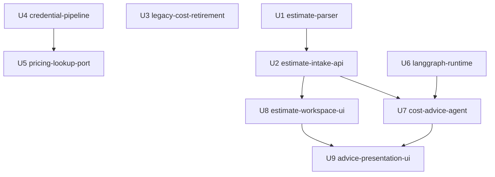

# 工作單元相依：C1 估價表上傳

本檔只描述**拓樸**——誰能依賴誰、何處可平行、整合點為何。**不**推薦單一建置順序或關鍵路徑（屬 delivery-planning）。

## 機器可讀邊區塊

```yaml
units:
  - name: estimate-parser
    kind: library
    depends_on: []
  - name: estimate-intake-api
    kind: service
    depends_on: [estimate-parser]
  - name: legacy-cost-retirement
    kind: service
    depends_on: []
  - name: credential-pipeline
    kind: packaging
    depends_on: []
  - name: pricing-lookup-port
    kind: library
    depends_on: [credential-pipeline]
  - name: langgraph-runtime
    kind: library
    depends_on: []
  - name: cost-advice-agent
    kind: service
    depends_on: [langgraph-runtime, estimate-intake-api]
  - name: estimate-workspace-ui
    kind: ui
    depends_on: [estimate-intake-api]
  - name: advice-presentation-ui
    kind: ui
    depends_on: [estimate-workspace-ui, cost-advice-agent]
```

## 相依圖



**文字 fallback**：四條無入邊的根——`estimate-parser`、`legacy-cost-retirement`、`credential-pipeline`、`langgraph-runtime`。`estimate-intake-api` 只依賴解析器；其後扇出到 `cost-advice-agent` 與 `estimate-workspace-ui`。`cost-advice-agent` 另依賴 `langgraph-runtime`。`pricing-lookup-port` 只依賴憑證管線，**沒有**指向建議 agent 的單元邊（Q3=A）。`advice-presentation-ui` 依賴工作區 UI 與建議 agent。圖為有向無環。

## 刻意省略的邊

| 元件邊 | 為何不成單元邊 |
|---|---|
| `CostAdviceAgent → PricingLookup` | Q3=A：查價可降級（FR5.10）；建議可先完成，查價後掛 |
| U3 → U8 或 U8 → U3 | 同批部署是**部署約束**，不是「誰實作誰先」的相依；兩邊皆無技術前置 |

## 共同部署約束（非相依邊）

- **`legacy-cost-retirement` 與 `estimate-workspace-ui` 必須同批部署**（Q6=A）。delivery-planning 打包 Bolt 時不得拆開。
- **FR9.8 環境變數增刪**：U3（減舊 C1 參數）與 U4（增憑證變數）若分批合併進 `ut`，中間態可能讓 `validate_env_contract.py` 紅燈。delivery-planning 須同批打包，或以 **U4 先行**（審閱 R-02）。
- **U2 與 U3 的 router／OpenAPI 檔案衝突**：拓樸上無相依、可平行開發，但合併時建議同一 Bolt，或 U3 先移除舊 handler、U2 再加入新 handler（審閱 R-03）。

## 整合點

| 從 → 到 | 契約種類 | 正式化 |
|---|---|---|
| U1 → U2 | 解析器輸出結構（逐項明細、雲別、無法辨識標記） | contract-design（Q7=A） |
| U2 → U8／U7 | HTTP API（上傳、讀取、分享、歷史） | contract-design |
| U2 → U7 | 觸發建議產生（async／內部呼叫） | functional-design |
| U7 → U2 | SSE 訂閱與建議讀取的授權查詢（`EstimateAccessControl`） | contract-design 或 functional-design 附錄（審閱 R-01） |
| U7 → U9 | SSE 事件格式（進度、heartbeat、完成／失敗） | contract-design |
| U5 → U7（選用、執行期） | 查價結果結構 | 本期不強制正式化（Q7 未選 C）；以型別＋測試即可 |

## 可平行開發集合

以下集合內單元**彼此無相依邊**（多個合法拓樸序存在）：

1. **根集合**：`{estimate-parser, legacy-cost-retirement, credential-pipeline, langgraph-runtime}`
2. **在 U1 完成後**：`estimate-intake-api` 解鎖；其完成前 U7／U8 不可開工（對 U2 的相依）
3. **U2 與 U6 皆完成後**：`cost-advice-agent` 可開工；同時若 U2 完成，`estimate-workspace-ui` 可與 U7 **平行**
4. **U4 完成後**：`pricing-lookup-port` 可與建議路徑**完全平行**
5. **U7 與 U8 皆完成後**：`advice-presentation-ui` 解鎖

AH-2 認定的「解析器、退場、LangGraph 骨架可同時起跑」對應根集合中的 U1、U3、U6；U4 同屬根集合。

## 檔案衝突風險（非拓樸）

| 單元對 | 風險 |
|---|---|
| U8 ↔ U9 | 同一批前端頁面檔（Q4=A 已接受） |
| U2 ↔ U3 | 可能同改 `cost_router`／schema／OpenAPI（A-UG2） |
| U3 ↔ U4 | FR9.8 環境變數增刪兩側（A-UG1） |
