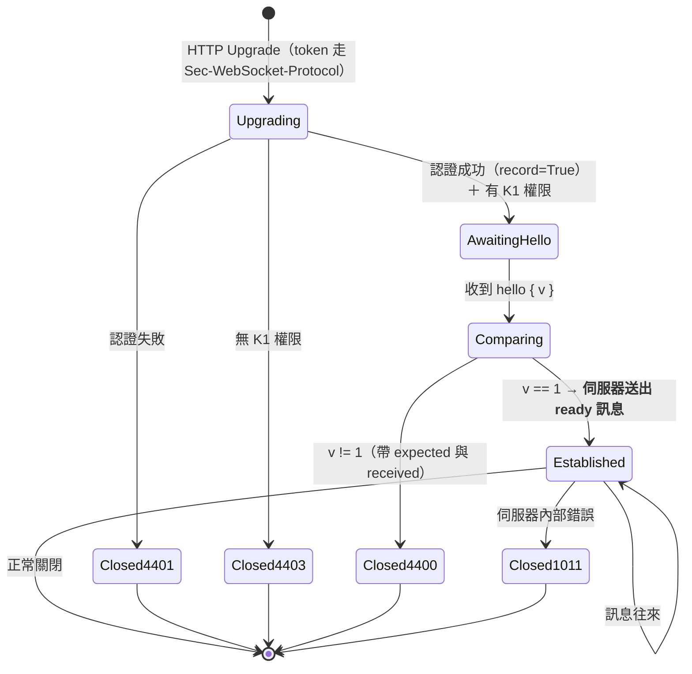
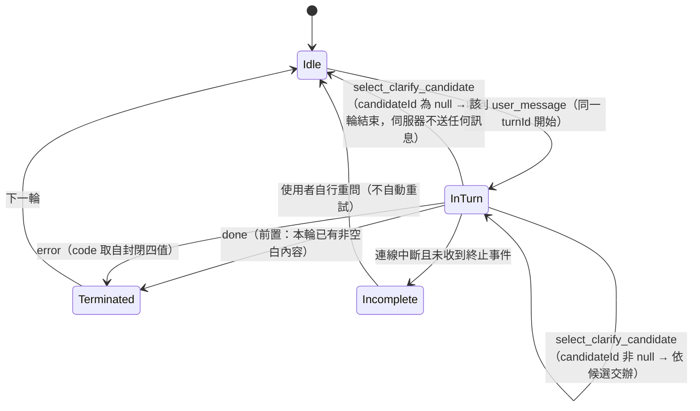
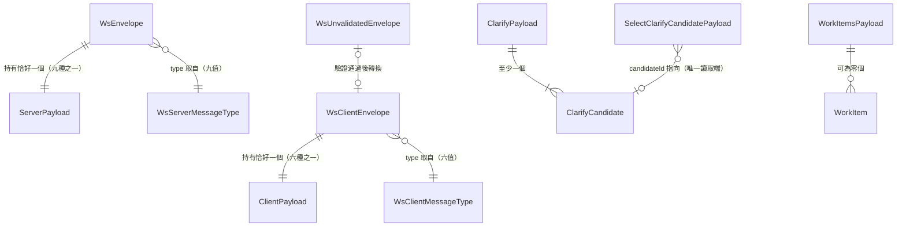

# Functional Spec — `U2 brain-ws-contract`（`spec`）

## 〇、本檔的定位與它是誰的真實來源

`entities.md` 是**資料形狀**的真實來源，`rules.md` 是**決策邏輯**的真實來源。
本檔是**有序行為**的真實來源——工作流程與狀態機——因為那兩份都不表達順序與轉換。

本檔另含兩個**衍生**視圖供閱讀：實體關係圖（衍生自 `entities.md`）與規則摘要
（衍生自 `rules.md`）。**衍生視圖與來源不一致時，以來源為準。**

本單元是 `spec` 類單元，交付的是型別與兩道 CI 閘門，**沒有執行期程式碼**。
所以本檔的「工作流程」主要是**建置期流程**，唯一的執行期狀態機是版本協商——
而那個狀態機的**實作**屬 `U13`，本檔只定義它所依賴的型別與判準。

---

## 一、工作流程（本檔的真實來源之一）

### WF-1：契約變更的完整流程（建置期，本單元的核心）

這是本單元存在的理由。每一步都必須發生，漏任一步的後果寫在該步的「漏掉會怎樣」。

| 步 | 動作 | 執行者 | 漏掉會怎樣 |
|---|---|---|---|
| 1 | 修改後端 Pydantic 模型（**唯一**人手改的那一份） | 開發者 | — |
| 2 | 執行 dump，重新產生 `ws-contract.json` | 開發者（本機） | 第一道閘門紅燈（規格檔 ≠ 程式碼）。**這是想要的行為** |
| 3 | 由 `ws-contract.json` 重新產生 `frontend/src/types/ws-contract.d.ts` | 開發者（本機） | 第二道閘門紅燈。**若沒有第二道閘門**，型別檔會停在舊形狀而 `tsc -b` 仍綠——前端在執行期拿到未定義值（`BR4.3`） |
| 4 | 兩個衍生物一併 commit | 開發者 | 同上 |
| 5 | CI backend job：`dump --check` 斷言「規格檔 == 程式碼」 | CI | 步 2 被跳過時無人察覺 |
| 6 | CI frontend job：斷言「committed 型別檔 == 由規格檔重產的型別檔」 | CI | 步 3 被跳過時無人察覺（見步 3） |
| 7 | 消費端（`U13`／`U14`）依新型別調整；不合者 `tsc -b` 紅燈 | `U13`／`U14` | 消費端與契約不符而編譯通過 |

**兩道閘門的職責不可互換**（`BR4.3`）：第一道驗「規格檔對不對」，第二道驗「型別檔有沒有跟上規格檔」。
`tsc -b` 驗的是第三件事——「用法符不符合型別檔」。三者缺一都有一條靜默通過的路徑。

### WF-2：新增一個 `error.code`（`BR2.8` 的操作面）

封閉列舉的代價要寫成具體步驟，否則「改契約」聽起來比實際輕。

1. 在後端 Pydantic 模型的 `code` 列舉加入新成員。
2. 走 WF-1 的步 2–6（兩個衍生物重產、commit、兩道閘門）。
3. 前端的窮盡 `switch` 會**立刻**因缺少分支而 `tsc -b` 紅燈——**這是封閉列舉的價值**，
   不是它的缺點。補上該分支的處置。
4. 若該 code 需要對使用者顯示特定訊息，落點在 `U14`（`BR3.1`）。

### WF-3：新增一個訊息型別（`BR1.4` 的操作面）

1. 在對應方向的 type 列舉加入新值。
2. 為它定義 payload 實體（**必須**——`BR1.4` 要求兩個集合等勢且同名）。
3. 走 WF-1 的步 2–6。
4. `BR1.4` 的機械斷言會在步 2 攔下「加了 type 卻沒加 payload」或反之。

### WF-4：協定升版（`BR1.1` 的操作面）

1. 把 `v` 的字面型別由 `1` 改為 `2`。
2. 走 WF-1 的步 2–6。
3. **所有仍寫 `v: 1` 的消費端立刻是型別錯誤**——這是 Q6=A 選字面型別的整個目的。
4. 伺服器端的 `4400` 關閉路徑（收到不相容的 `hello`）屬 `U13`，不在本單元。
5. **本單元不提供任何向後相容機制**（Q2=A 明確排除）：舊分頁會被踢掉，而那是刻意的——
   舊分頁拿著舊型別繼續連線只會在執行期拿到未定義值。

---

## 二、狀態機（本檔的真實來源之一）

### SM-1：版本協商（執行期；本單元定型別與判準，`U13` 實作）

**文字 fallback**（Mermaid 無法顯示時）：初始 → `Upgrading`（HTTP Upgrade，token 走
`Sec-WebSocket-Protocol` 而非 query string）。認證失敗 → `4401` 關閉；無 `K1` 權限 →
`4403` 關閉；認證成功（以 `record=True` 呼叫，使活動稽核不失效）→ `AwaitingHello`。
收到首則 `hello { v }` → `Comparing`。`v` 完全等於 `1` → **伺服器送出一則 `ready` 訊息**
並進入 `Established`；否則 `4400` 關閉並帶 `expected` 與 `received`。
`Established` 狀態下訊息往來；伺服器內部錯誤 → `1011` 關閉。

**狀態名與訊息名的區分（審查 R-01 更正）**：初版把狀態命名為 `Ready`，而 `K-12:948` 要求的
`ready` 是一則**訊息**——同名讓「`K-02` 的 type 清單沒有 `ready`」這個矛盾在圖上看起來已解決。
現在狀態叫 `Established`，`ready` 是圖上的一個明確**動作**，而它對應 `entities.md` 的
第九個 server type 與 `ReadyPayload`。

**入站解析的兩段（審查 R-03 補）**：`AwaitingHello` → `Comparing` 這一步必須以
`WsUnvalidatedEnvelope`（`v: integer`、`type: string`，寬鬆）解析——`WsClientEnvelope` 的
字面型別 `1` 無法表示不相容的 `hello`，於是取不到 `4400` 所要求的 `received`。
`Comparing` 通過後才一律以 `WsClientEnvelope` 處理。

**本單元擁有的部分**：`hello`／`ready` 的 payload 型別、`v` 的字面型別 `1` 與入站的寬鬆型別、
以及「完全相等」這個判準。
**本單元不擁有的部分**：關閉碼的數值常數、`expected`／`received` 的承載形式、握手步驟的實作、
`record=True` 的呼叫、`K1` 權限檢查——全屬 `U13`／`K-12`。

### SM-2：一輪回覆的生命週期（執行期；本單元定終止語意的型別面）

**文字 fallback**：`Idle` → 收到 `user_message` 進入 `InTurn`（同一 `turnId` 開始）。
`InTurn` 內可反覆收到 `token`（非空白）／`clarify`／`work_items`／`cost_card`；
收到 `clarify` 後客戶端可送 `select_clarify_candidate`：`candidateId` **非 null** ＝ 選定該候選，
流程留在同一輪內（依該候選交辦）；`candidateId` **為 null** ＝「都不是」，
**該輪就此結束並回到 `Idle`——伺服器不送 `work_target`、不送 `work_items`、不送任何終止事件**
（`BR2.14`；`AC1.2.3` 逐字要求「脈絡列與作業對象不變」，送狀態訊息會違反它，
送零內容 `done` 會違反 `BR2.6`，送 `error` 會讓使用者以為出錯）。

**這條路徑與 `Incomplete` 的區別（審查 R-15，Critical）**：兩者都沒有終止事件，
但前者是**客戶端主動結束**（它自己知道使用者按了「都不是」），後者是**連線中斷**
（客戶端沒有收到預期的終止事件）。`BR3.4` 的「標為未完成、不自動重試」只適用後者。
初版的 `SM-2` 完全沒有前者的離開路徑，使實作者無從選擇——而兩個可選做法都違反某條已核可約束。`ready` **不出現在本狀態機**——它屬握手階段（SM-1），
在任何一輪之前。
收到 `done`（前置條件：本輪已有非空白內容）或 `error`（`code` 取自封閉四值，見 `BR2.8`）進入
`Terminated`，之後不得再有該 `turnId` 的任何訊息。連線中斷且未收到終止事件進入
`Incomplete`：該輪標為未完成、**不自動重試**，使用者自行重問。

**三個狀態訊息不在這個狀態機裡**：`sharing_mode`、`work_target`、`work_items` 是
**狀態訊息**，可在任何時候因狀態改變而扇出給同一 session key 的全部存活連線——
它們不屬於任何一輪，也不計入「每輪至多一個終止事件」（`K-02` 逐字）。
`work_items` 同時出現在兩處是刻意的：它既可在一輪內回報進度，也可因外部狀態改變而扇出。

---

## 三、衍生視圖：實體關係圖

**衍生自 `entities.md`；那份 yaml 是真實來源。** 本圖只畫組成關係，不畫 18 個實體的全部欄位。

**文字 fallback**：伺服器方向的 `WsEnvelope` 持有恰好一個 payload（九種之一），型別由
`type` 判別；客戶端方向的 `WsClientEnvelope` 同理（六種之一）。`WsUnvalidatedEnvelope` 是入站
解析的寬鬆型別，驗證通過後轉為 `WsClientEnvelope`（不通過則不轉換）。
`type` 的值域分別來自 `WsServerMessageType`（九值）與 `WsClientMessageType`（六值）。
`ClarifyPayload` 組成一至多個 `ClarifyCandidate`；`SelectClarifyCandidatePayload` 的
`candidateId` 指向其中一個——**這是 `ClarifyCandidate.id` 的唯一讀取端**（審查 R-02 之前
它是懸空欄位）。`WorkItemsPayload` 組成零至多個 `WorkItem`。其餘 12 個 payload 為葉節點。

---

## 四、`J-10` 的兩種情境——`EMPTY_RESPONSE` 與「零內容 `done` ＝契約違規」

**這一節是 `J-10` 指派的實質承載**（Q5=A）。

`contract-summary.md:1473` 的交接表把「把 `mockups.md` H-7 依 `N-14` 改寫」指派給本站。
本站**不改 `mockups.md`**——它是 `refined-mockups` 已通過 reviewer 的產出，而 `project.md`
的既有處置形狀是「標出缺口、指派落點，不逕自修改已核可上游」。改為在此寫明實質內容。

> **`mockups.md` 的 H-7 是一個開放問題，不是一段描述。** 初版把它稱為「舊描述」是錯的
> （審查 R-09）。它逐字是：
>
> > **大腦的串流是否可能以零內容結束**。決定 `StreamingMessage` 的 `empty-stream`
> > 是否可達（本站自檢 1 抓出）。注意 FR1.5 的 `prompt_guard` 命中會回**固定訊息**，
> > 那是有內容的，不走此態
> > —— `mockups.md:536`
>
> **本節就是它的答案，用它自己的詞彙**：
>
> **`StreamingMessage` 的 `empty-stream` 在契約上不可達。** `BR2.6` 明文禁止零內容以
> `done` 結束——零內容一律走 `error(code: EMPTY_RESPONSE)`，而那是一條**錯誤**路徑，
> 不是串流結束路徑。`prompt_guard` 命中的固定訊息屬有效回覆，正常以 `done` 結束
> （`K-12` `x-termination-semantics.prompt_guard_case` 逐字），確實不走此態——H-7 的
> 這個註記成立。
>
> **所以 `interaction-spec.md:459` 的 `empty-stream` 狀態該怎麼處置**：
> **保留，但改錨為 `BR3.3` 的契約違規備援態**，不是「串流正常結束但沒內容」。
> 兩者的觸發條件不同：前者是伺服器違反契約（送了零內容的 `done`），後者在契約下不存在。
> 該狀態的現有呈現（「沒有收到回覆」＋ 重試、不留空白訊息）**適用於契約違規情形**，
> 但依 `BR3.3` 還須**記錄異常**——那一點 `interaction-spec.md` 沒有寫，落點 `U14`。
>
> **不刪除它的理由**與 `K-12` 給的一樣：契約保證與防禦性實作是兩件事。刪掉它等於假設
> 伺服器永不違約。
>
> **兩份文件對 H-7 不一致**：`mockups.md:536` 仍把它列為未決的交接事項。
> 這是 Q5=A 的已知代價，在此顯性標示而非讓下游自己撞到。

### 情境一：`EMPTY_RESPONSE`（契約內的正常失敗）

- **何時發生**：上游結束但未產出有效回覆（`BR2.6`）。內部推理、控制事件與空白都不算內容。
- **伺服器行為**：送 `error(code: EMPTY_RESPONSE)`，**不得**送 `done`。
- **前端義務**：顯示**明確的錯誤提示**（`BR3.1`）。不是空白、不是轉圈、不是靜默。
- **這是契約允許的狀態**——不是 bug。系統誠實地說「這一輪沒有產出」。

### 情境二：零內容的 `done`（契約違規）

- **何時發生**：**契約上不可能**——`BR2.6` 禁止它。但前端不假設對方守約。
- **前端義務**（`BR3.3`）：視為**契約違規**，顯示備援提示、**記錄異常**，
  **不得呈現空白成功態**。
- **為何保留這條而不是刪掉那個狀態**：`K-12` 逐字寫了理由——「契約保證」與
  「防禦性實作」是兩件事，分開比單純刪掉那個狀態更強。刪掉它等於假設伺服器永不出錯。

### 兩者的差別，以及為何必須分開

| | `EMPTY_RESPONSE` | 零內容 `done` |
|---|---|---|
| 契約地位 | **允許**的正常失敗 | **違規** |
| 前端呈現 | 明確錯誤提示 | 備援提示 |
| 是否記錄異常 | 否（正常路徑） | **是** |
| 診斷意義 | 上游沒產出東西 | **伺服器違反了契約**，需要查後端 |

**合併這兩者會失去最重要的訊號**：前者是預期內的，後者代表伺服器有 bug。
若前端對兩者同樣處置，違規會被當成正常失敗而永不被發現。

---

## 五、衍生視圖：規則摘要

**衍生自 `rules.md`；那份 yaml 是真實來源。** **31** 條規則，四組（第二輪審查新增
`BR1.6`／`BR2.13`／`BR2.14`）。

| 組 | 條數 | 管什麼 | 誰強制 |
|---|---|---|---|
| `BR1.*` | 6 | 封包層不變量（`v`、判別 union、`turnId` 必填與**兩類判準**、兩集合等勢、終止事件的 `turnId` 一致性） | 型別 ＋ dump 斷言 ＋ 後端 validator |
| `BR2.*` | 14 | payload 層不變量（各欄位值域與相依、四個 error code 判準、**拒絕客戶端 `turnId`**、**`candidateId` 為 null 的處置**） | 後端 Pydantic 模型 ＋ 型別 |
| `BR3.*` | 5 | 消費端義務（窮盡處理、未知型別、零內容 `done`、不自動重送、驗證 `ready.protocolVersion`） | `U14` 的實作 |
| `BR4.*` | 6 | 建置期（衍生物不得手改、冪等、兩道閘門、註解保留、產生器釘版） | CI ＋ 流程 |

**三條規則本單元無法強制，已在 `rules.md` §四 逐條標示落點**：`BR1.3` 的「同一輪
`turnId` 相同」（執行期性質）、`BR2.5` 的欄位相依（需要相依型別）、`BR3.*` 全組
（前端行為）。不假裝型別能擋住它們。

---

## 六、本單元承載的故事，以及它只承載到哪裡

本單元承載 `US1.2`（`AC1.2.1`–`AC1.2.4`）與 `US8.1`（`AC8.1.1`–`AC8.1.4`）兩則故事，
但**只承載它們的型別面**。逐條寫清楚界線，避免下游誤讀為已滿足：

| AC | 本單元提供什麼 | 誰真正滿足它 |
|---|---|---|
| `AC1.2.1`（信心值 < 0.7 時不建工作項、列候選反問） | `clarify` 訊息型別 ＋ `candidates` 結構 ＋ `confidence` 的 0–1 定義域 | **`U11`**（門檻判斷與「不建立任何工作項」的行為） |
| `AC1.2.2`（選定候選後依該候選交辦） | **`select_clarify_candidate` ＋ `candidateId` 非 null**（審查 R-02 新增）。初版寫「走既有 `user_message` 或 `U11` 定義的路徑」——**那條路徑不存在**：`UserMessagePayload` 只有 `text`，候選的 `id` 無處可放，且 `K-12:920` 一帶逐字寫 `U14` 的唯一後端通道是本端點 | **`U11`**（依該候選交辦的實際行為） |
| `AC1.2.3`（選「都不是」回到輸入狀態，脈絡列不變） | **`select_clarify_candidate` ＋ `candidateId` 為 null**（審查 R-02 新增）＋ `BR1.2` 使「不送 `work_target`」成為「脈絡列不變」的精確表達 | **`U14`**（畫面行為）＋ **`U13`**（不送狀態訊息） |
| `AC1.2.4`（路由層回應帶 0–1 信心值可與門檻比較） | `confidence: number\|null` 且定義域 0–1（`BR2.4`） | **`U11`**（真的產出那個值） |
| `AC8.1.1`（整段完成前就出現第一個字） | `token` 訊息型別（串流的最小單位） | **`U13`**（真的逐 token 送出） |
| `AC8.1.2`（走 WS 仍更新最後活動時間） | **無**——本單元不碰活動記錄 | **`U13`**（`record=True`） |
| `AC8.1.3`（token 不出現在 query string） | **只擋了一半**：`BR2.12` ＋ `HelloPayload` 不含 token 欄位，排除了「token 放在**訊息內**」這一條路徑。**對 query string 零約束**——它在 URL，不在 envelope 內，本契約的型別碰不到它。初版宣稱「型別上唯一可構造」是**假的**（審查 R-06） | **`U13`**（`K-12` `x-hard-constraints.token_transport`，`contract-summary.md:876–880`，該處逐字點名既有前例 `collab_router.py:270` 正是 query string） |
| `AC8.1.4`（既有 5 個 SSE 端點行為不變） | **無**——本單元不碰既有端點 | 由「不改」滿足；`U13` 須確認 |

**traceability 的狀態怎麼標，以及我為什麼改了判斷**：

`functional-design` 這一站的 `OK` 語意是「**這條 AC 對應到這些業務規則**」，不是
「這條 AC 已被實作」——後者是 `code-generation` 的 traceability 才能宣稱的事。
我起初打算把八條 AC 全標 `Deferred`（理由是沒有一條由本單元獨力滿足），但那是誤用了
這一站的語意，而且會讓 `rules.md` 的全部規則**全部**被 `traceability` sensor 判為
orphan（orphan 的定義是「沒有被任何 `OK` 列指向、也沒進 `reverse`」）。

改採的標法：

- **`OK`**：本單元把該 AC 翻譯成了具體的業務規則。`target` 欄位同時寫出**界線**
  （型別面在本單元、行為面在哪個單元），所以 `OK` 不會被讀成「已完成」。
- **`Deferred`**：本單元對該 AC **完全沒有貢獻**（`AC8.1.2` 活動記錄、`AC8.1.4` 既有
  SSE 不變）——標 `OK` 才是不誠實的那一邊。
- **`reverse`**：所有沒有對應 AC 的規則逐條寫明理由（契約不變量與建置期規則本來就沒有
  使用者可見的 AC）。

上表的「誰真正滿足它」一欄不變——那個界線是真的，`OK` 只表示翻譯關係成立。

---

## 七、上游來源逐份對照（本站消費了什麼、從哪一行來）

stage 宣告消費五份上游。逐份寫出**它供給了什麼**，以及沒供給什麼——避免「引用了標籤卻
沒寫來源檔」那種讀者無法複驗的形狀。

| 上游檔 | 本站從它取得什麼 | 具體落點 |
|---|---|---|
| `inception/units-generation/unit-of-work.md` | `U2` 的擁有與交付（「前後端共用的 WS 訊息型別來源 ＋ 一道新的 CI 一致性檢查（N-1）」）、驗證方式（「CI 規格漂移檢查」）、依賴（無，可平行根）與被依賴（`U13`、`U14`） | 本檔 `§〇` 的「本單元是 `spec` 類單元」；`§六` 的界線表把每條 AC 指回 `U11`／`U13`／`U14`，依據就是這裡的被依賴關係 |
| `inception/units-generation/unit-of-work-story-map.md` | 本單元承載的**兩則**故事：`US1.2` 與 `US8.1`（該檔的單元對照列逐字記 `U2 brain-ws-contract ｜ US1.2、US8.1 ｜ 2`） | 本檔 `§六` 的八條 AC 全部來自這兩則故事；`traceability.json` 的 `upstream_ids` 恰為那八條 |
| `inception/requirements-analysis/requirements.md` | 被引用的 FR／NFR：`FR1.2`（工作項狀態五值為下限）、`FR1.4`（逐項更正）、`FR2.1`／`FR2.2`（跨頁共享與同一作業對象）、`FR3.1`／`FR3.2`／`FR3.3`（獨立對話）、`FR8.1`–`FR8.5`（串流、既有 SSE 不變、活動記錄、token 傳輸）、`NFR2`（跨頁上下文保留率）、`NFR4`（撐過後端重啟）、`NFR5`（型別一致性）、`NFR9`（模型呼叫上限為設計原則非門檻） | `rules.md` 的 `BR2.5`（`FR1.2`）、`BR2.12`（`FR8.5`）、`BR3.4`（`FR8.x` 的重送立場）；本檔 `§六` 的 `AC8.1.2`／`AC8.1.4` 界線 |
| `inception/domain-design/components.md` | `token`／`clarify`／`work_items`／`cost_card`／`done`／`error` **六種型別為下限**、`confidence` 不得列為必填、`sideEffect: unknown` 是合法值且系統不承諾停掉不留半成品、H-4 的型別一致性缺口 | `entities.md` 的 `WsServerMessageType` entity_constraints、`ClarifyCandidate.confidence`、`WorkItem.sideEffect`；`rules.md` 的 `BR2.3`／`BR2.10` |
| `inception/contract-design/contract-summary.md` | `K-02`（`:171–305`）的完整 envelope 與十三種 payload、兩道 CI gate 與其職責分工、`behaviour_semantics`；`K-12`（`:853–997`）的握手、版本協商、終止語意、關閉碼、扇出與單一行程假設；`J-10`（`:1473`）的指派 | 幾乎整份 `entities.md`；`rules.md` 的 `BR1.*`／`BR2.*`／`BR4.*` 多數條；本檔 `§一`／`§二`／`§四` |

**兩份上游本站刻意沒有消費**：`codekb/`（本單元是全新契約，沒有既有程式碼可逆推）與
`inception/refined-mockups/mockups.md`（Q5=A 決定不回改它；本檔 `§四` 取代它的 H-7 作為
現行規格，兩者不一致已在該節顯性標示）。

---

## 七之二、`ADR-0006` Security Baseline 四面向逐項判定（審查 R-08，Major）

**這一節是補上的，而它是同型缺口的第三次重犯。** `project.md ## Mandated` 逐字要求
「對每一項變更檢查 `ADR-0006` security baseline 的四個面向……涉及 IAM／權限矩陣／網路暴露／
稽核記錄的變更，須在該 stage 產出中明列 security 影響與處置，不得僅以『已有 ADR-0006』帶過」，
且該檔已把它升為**自檢第七項**，並逐字記載這個缺口在 `domain-design` 與 `units-generation`
兩站重犯過。本站初版的五份產出對 `ADR-0006` 的 `grep -c` **全部為 0**——我是第三次。

| 面向 | 判定 | 本單元的影響與處置 |
|---|---|---|
| **IAM** | **適用** | 本單元有兩處 IAM 面。(1) **`BR2.12`（客戶端訊息不得攜帶身分）是一條授權繞過的防線**：若任何 client payload 含使用者 id／角色／token，客戶端即可自稱任何身分。處置是把它寫成**否定式**的契約規則（不得有某種欄位），並讓 `WsClientEnvelope` 與六個 client payload 的欄位集合**都不含**身分欄位——即在型別層不可構造。principal 綁在連線上（`K-12` `x-authorization-responsibility.per_connection_principal`）。(2) **`UNAUTHORIZED` 與關閉碼 `4403` 的分工**：連線建立期的無權限走 `4403` **關閉連線**；連線已建立後的授權失敗走 `error(UNAUTHORIZED)` **保留連線**。分工寫在 `BR2.8` 的判準。**本單元不擁有任何受保護操作**（`K-02` `behaviour_semantics.authorization_responsibility` 逐字「無」），授權發生在 `K-12` 的握手與 `K-07`／`K-08` 的 facade。 |
| **Encryption** | **適用（處置全在別的單元）** | **審查 R-22 更正判定詞**：初版判「不適用（附理由）」卻在同格寫出兩項具體的加密關切——那與同表 Audit logging 判「適用（但本單元只提供前提）」的結構相同，判定詞卻相反。改為一致的「適用（處置全在別的單元）」。本單元不引入任何連線、不持久化任何資料——它交付的是型別與兩道建置期閘門。傳輸加密由 `wss`（`K-12` `servers.staging.protocol` 逐字）承載，屬 `U13`；靜態加密無對象（本單元無儲存）。**但有一項必須寫下**：`UserMessagePayload.text` 與 `TokenPayload.text` 會攜帶使用者的對話內容，其**靜態**加密要求是 `OQ-3`（指派 `nfr-design`），落在 `U5 memory-data` 的資料範圍——本單元只定義它在傳輸中的形狀，不定義它落地後怎麼存。 |
| **Network exposure** | **適用（本單元的主要安全面之一）** | `K-12:853` 逐字「本 intent **唯一**新增的對外網路面」，而本單元定義它上面跑的全部訊息型別。三項處置：(1) **`AC8.1.3`（token 不得在 query string）本單元只擋了一半**——見 `§六` 與 `entities.md` 的 `HelloPayload`，本契約對 URL 零約束，實際擋它的是 `K-12` `x-hard-constraints.token_transport`（屬 `U13`）。**這一點初版宣稱型別上唯一可構造，那是假的（審查 R-06）**，錯誤的保證感比沒有保證更危險。(2) **`BR2.9`（`error.message` 不得含內部實作細節）**：對外網路面的錯誤訊息是資訊洩漏的常見路徑。(3) **`WsUnvalidatedEnvelope` 是信任邊界的閘門**：入站訊息先以寬鬆型別解析、驗證通過才轉為具體型別，符合 `code-generation-patterns.md` 的「External Input → Validate at boundary → Convert to domain type」形狀。 |
| **Audit logging** | **適用（但本單元只提供前提）** | `AC8.1.2` 要求走 WebSocket 仍更新 `users.last_activity_at`，而既有 WS 前例以 `record=False` 跳過它——照抄會讓帳號活動稽核對大腦使用者**靜默失效**。**本單元對此無型別手段**（握手不經任何訊息 payload），故 `traceability.json` 把 `AC8.1.2` 標為 `Deferred`、落點 `U13`。本單元提供的前提是：`BR3.3` 要求前端對契約違規**記錄異常**、`BR3.2` 要求對未知 type **記錄異常**——兩者使「契約被違反」這件事在稽核上留得下痕跡，而不是靜默忽略。 |

**`ADR-0006` 的 property-based testing hard constraint**：**判定不適用，附理由。**
該約束點名三個模組（IaC generator、cost calculator、agent routing），本單元**不含其中任何一個**。
更根本的是：本單元**沒有任何純函式運算**可供 property-based 測試——它交付的是型別宣告與
兩道建置期閘門，`rules.md` 的 `category` 分佈中 `calculation` 為 **0**（腳本實算）。
最接近純函式的候選是 `BR1.4` 的正規化（snake→Pascal ＋ `Payload` 後綴）與 `BR1.5` 的相等比對，
兩者都是單行對映，property-based 測試的成本高於價值；建議以 example-based 斷言實作即可。
**落點**：ADR-0006 的 PBT 約束在本 intent 的真實落點是 `U11` 的 IntentRouter 門檻純函式與
`U6` 的 EmbeddingPort（`contract-summary.md` 已記載）。

---

## 八、Assumptions & Open Questions

- **`turnId` 的產生方式未定**，屬 `U13`。本單元只要求它必填且同一輪相同（`BR1.3`），
  而後者本單元無法強制。
- **`BR1.4` 與 `BR4.4` 是可機械驗證但尚未實作的**：建議 `code-generation` 時把它們
  寫成 dump 腳本內的斷言。若不實作，兩者退化為只寫在文件裡的規則。
- **`OQ-10`（路由層能否產出可比較的信心值）未收斂。** 若收斂為「不能」，
  `confidence: number|null` 的型別**不需改動**（已容許 null），但 `AC1.2.1` 的門檻判斷
  會改寫——那在 `U11`，不在本站。本站的型別選擇刻意讓這個 OQ 的兩種結果都不需回改契約。
- **`mockups.md` H-7 與本檔 §四 不一致**（Q5=A 的已知代價）。現行規格是本檔。
  若日後要消除這個不一致，落點是一次獨立的 mockups 修訂，不是本單元。
- **Q4=A 的界線代價**：下列**四類**東西不在契約檔內，故它們**沒有漂移保護**。
  這是刻意的範圍切分（`K-12` 擁有它們），但代價必須寫下來而不是假設沒有：

  | 不受保護的東西 | 失敗模式 | 落點 |
  |---|---|---|
  | 關閉碼數值（`4400`／`4401`／`4403`／`1011`） | 前後端對關閉原因的解讀不一致 | `U13`／`K-12` |
  | 端點路徑（`/api/brain/ws`） | 前端連錯路徑；`location /` 走 `try_files` 會回 HTML 而非升級 | `U13`／`K-12` |
  | `expected`／`received` 的承載形式 | `4400` 關閉時帶不出協商失敗的實際值（審查 R-03） | `U13`／`K-12` |
  | **`Sec-WebSocket-Protocol` 的 subprotocol 名稱與編碼格式**（審查 R-07 補列） | **最靜默的一個**：它是前後端必須逐字一致的共用字串，而 `K-12:876` 只規定「token 走該標頭」、全檔未定其值格式；既不在契約檔（無閘門）、也無任何契約明文擁有它。前端改了格式而後端沒跟上時，**握手直接失敗且沒有任何閘門會紅燈** | `U13`，或一次 `K-12` 修訂 |

  **第四項與前三項的差別**：前三項至少有一個契約（`K-12`）明文擁有並定義了它們；
  第四項**沒有任何契約定義它的值**——那不只是「不在本契約檔內」，是**根本沒有被定義過**。
