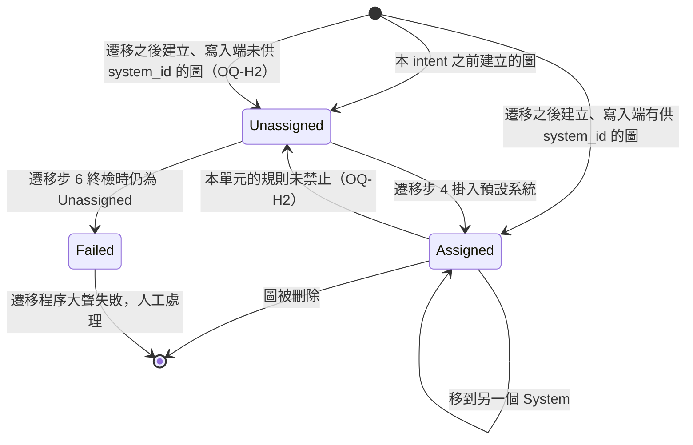
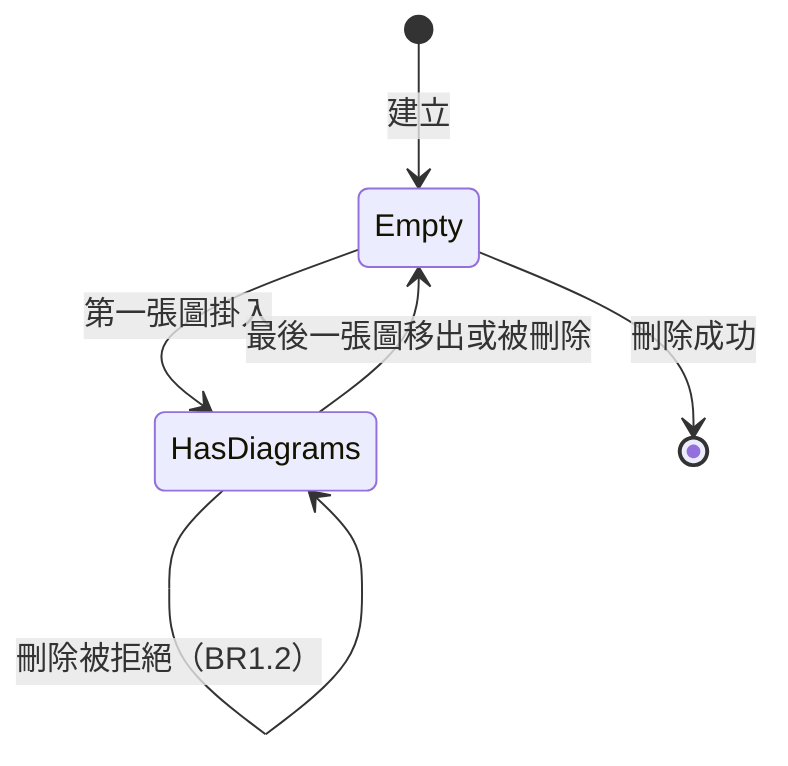
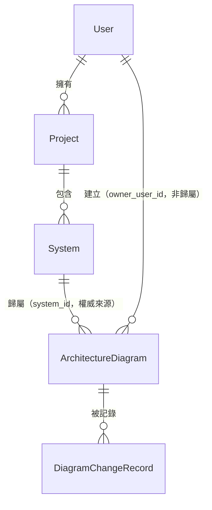

# Functional Spec — `U4 hierarchy-data`（`spec`）

<!-- Stage: functional-design（Construction 3.1）· Unit: hierarchy-data · kind: spec -->

## 〇、本檔的定位與它是誰的真實來源

`entities.md` 是**資料形狀**的真實來源，`rules.md` 是**決策邏輯**的真實來源。
本檔是**有序行為**的真實來源——遷移流程與生命週期狀態機——因為那兩份都不表達順序與轉換。

本檔另含兩個**衍生**視圖供閱讀：實體關係圖（衍生自 `entities.md`）與規則摘要
（衍生自 `rules.md`）。**衍生視圖與來源不一致時，以來源為準。**

本單元是 `spec` 類單元，交付資料模型與一次性遷移程序。
它**不含任何授權判定**（`K-04` 逐字「授權責任：無」），也不含任何使用者介面。

**本單元交出去的東西有一條清楚的時間界線，讀本檔的人先看這一句**：
遷移**跑完的那一刻**，每張圖都有歸屬（`BR2.1` 的終檢，`AC9.1.4`）。
那之後，本單元關掉的是**刪除這一類**路——兩層都關：刪 Project（`BR1.1`）與刪 System
（`BR1.2`）。兩層都要，因為只鎖 System 層的話，刪 Project 時 System 連帶消失，
其下的圖照樣懸空（`contract-summary.md` 的 `known_threat_to_the_invariant` 逐字把
`DG-2` 定為「**Project／System** 刪除的 cascade 行為未定」，是兩個分支，審查 R-13）。
「把已掛好的圖改回空」與「新插入的圖不帶歸屬」這兩條路**本單元沒有關**，
處置是 `§八` 的 `OQ-H2`（落點 `U7`／`U16`）。
`§二` 的 `SM-1` 與 `rules.md §三` 的誠實分界都以這條界線為準。

---

## 一、工作流程（本檔的真實來源之一）

### WF-1：一次性遷移（本單元的核心）

每一步都必須發生，順序不可調換。「漏掉會怎樣」逐步寫明。

| 步 | 動作 | 漏掉會怎樣 |
|---|---|---|
| 1 | 建立 `Project`／`System`／`DiagramChangeRecord` 三個結構，以可重跑安全的方式 | 重跑時在第一步就失敗，後續全部不執行 |
| 2 | 為架構圖增加 `system_id` 欄位（**可為空**） | 步 4 無處可寫 |
| 3 | 建立 `BR1.3` 的**兩層**唯一性約束（Project 以 `owner_user_id` 為範圍、System 以 `project_id` 為範圍） | **`BR2.2` 的冪等失去資料庫層保證**，退化為「靠程式流程記得檢查」——而部分失敗後的重跑正是最容易忘的時候 |
| 4 | 逐使用者：**取得或建立**其預設專案與預設系統，把其 `system_id` 為空的圖掛入 | 遷移沒有發生 |
| 5 | 建立 `BR1.1`／`BR1.2` 的刪除約束 | `DG-2` 未解——不變量只在遷移當下成立 |
| 6 | 終檢：查詢 `system_id` 為空的列數；**不為 0 即大聲失敗** | `AC9.1.4` 失守，而且失敗是靜默的 |

**步 3 必須在步 4 之前**：約束先存在，遷移才受它保護。反過來的話，步 4 若在中途
失敗、重跑時第二組預設專案已經被建出來了，約束才建立就會因既有的重複資料而建不起來。

**步 5 必須在步 4 之後**：`BR1.2` 要求「其下仍有圖時不准刪 System」，
而步 4 正在把圖掛進 System——先建約束不會擋住掛入（那是 INSERT／UPDATE 不是 DELETE），
所以嚴格說順序可換；**但放在步 4 之後可以在一個乾淨的狀態上建立**，
且步 6 的終檢緊接其後，三者形成一個「遷移—加鎖—驗收」的序列。

**步 6 的失敗形式**（`BR2.1`）：**必須是失敗，不得是警告。**
`stories.md:426` 逐字寫明這條 AC 的目的就是「直接否掉照抄既有 `logger.warning`
形狀的實作」。

### WF-2：遷移的重跑（部分失敗後）

1. 步 1–3、5 因可重跑安全的寫法而成為無操作。
2. 步 4 逐使用者：
   - 預設專案／系統**已存在** → 取用，不建立（`BR1.3` 在資料庫層保證不會建出第二個預設
     **Project**；第二**組**的配對另需本流程自己先解析預設 Project、再以其 id 為範圍找 System
     ——沒有約束擋這一步，見 `rules.md §三`，審查 R-07）；
   - 圖的 `system_id` **已非空** → 跳過，**不重新指派**（`BR2.2` 的判準）。
3. 步 6 終檢照常。

**這個流程的關鍵性質**：重跑是**安全且有進展**的——上次做完的不會被推翻，
上次沒做完的會被補上。這正是 Q3=A 選「`system_id IS NOT NULL`」而不選
「該使用者是否已有預設專案」的原因：後者在部分失敗時會整個跳過該使用者。

### WF-3：刪除一個 System（`DG-2` 的解在流程上的樣子——就「刪除」這一條路而言）

1. 檢查其下是否仍有架構圖。
2. **有** → 刪除被拒絕（`BR1.2`，資料庫層）。呼叫端須回報「還有 N 張圖」與下一步
   （`BR3.2`，落點 `U7`／`U16`，**不在本單元**）。
3. **無** → 刪除成功。

刪除 `Project` 同形（`BR1.1`，檢查其下是否仍有 System）。

**為什麼這條流程值得單獨寫下來**：它是 `AC9.1.4` 的不變量從「遷移當下成立」
在**刪除這一類路上**變成「執行期持續成立」的全部機制（**不是全部的路**——改回空與新插入不帶值兩條見 `§〇` 與 `§八` 的 `OQ-H2`；本句初版無限定，與同檔 `§〇` 及 `rules.md` 的 `BR2.1` 列對撞，審查 R-08）。`domain-design` 的 `decisions.md:136–137` 逐字
「本 ADR 只保證遷移程序本身，**不保證遷移之後的維持**」——本流程就是那個「維持」。

---

## 二、狀態機（本檔的真實來源之一）

### SM-1：架構圖的歸屬狀態

**文字 fallback**（Mermaid 無法顯示時）：架構圖的歸屬有兩個正常狀態與一個失敗狀態。
本 intent **之前**建立的圖起始於 `Unassigned`（`system_id` 為空）。
遷移**之後**建立的圖，起始狀態**取決於它的寫入端有沒有供 `system_id`**：有就是
`Assigned`，沒有就是 `Unassigned`（見下方 `OQ-H2`）。
`Unassigned` → `Assigned` 的轉換是遷移步 4。
`Assigned` 可轉到另一個 `Assigned`（移到別的系統），或隨圖被刪除而結束。
`Assigned` → `Unassigned` 這條邊**本單元的規則沒有禁止**（見下方）。
若終檢（步 6）時仍有圖停在 `Unassigned`，進入 `Failed`：遷移程序大聲失敗，人工處理。

**`BR1.2` 關掉的是「刪除 System 造成懸空」這一條路，不是全部的路**
（iteration 2 審查 R-08，Major：本段初版寫成「`Assigned` 永不回到 `Unassigned`」並
宣稱「這句話就是 `DG-2` 的解」，兩句都比機制實際做到的強）。準確的說法是三層：

1. **`DG-2` 原本的範圍就是刪除**。`domain-design/decisions.md:134–137` 逐字寫的是
   遷移「不保證遷移之後的維持」，而該處討論的懸空來自**刪除**。`BR1.2` 確實把那一條
   關掉了（拒絕刪除，而不是 `SET NULL`）——就這一條路而言，`DG-2` 已解。
2. **`AC9.1.4` 沒有被打破**。它的 Given 逐字是「遷移已執行」，問的是那一刻
   `system_id IS NULL` 的列數，而 `BR2.1` 的終檢讓它成立。
3. **但本單元的規則沒有關掉另外兩條路**：把一張已掛好的圖的 `system_id` 直接改回空
   （本欄在本設計裡永遠可為空，`WF-1`／`WF-2`／`rules.md` 都沒有指定遷移後收成
   `NOT NULL`），以及新插入的圖乾脆不帶 `system_id`——**既有 A1 儲存路徑正是後者**，
   它不知道這一欄存在。這兩條路的處置是 `OQ-H2`（§八），本站不定案。
   本單元把所有寫入授權委給 `K-07` 的 facade 而不設計它，所以 `U7` 會不會開出
   「取消歸屬」這種操作，本站答不出來——寫成絕對句會讓 `U7` 以為不用防。

### SM-2：System 的可刪除性

**文字 fallback**：System 建立時為 `Empty`。第一張圖掛入後進入 `HasDiagrams`，
在該狀態下圖可繼續掛入或移出；最後一張圖離開後回到 `Empty`。
**只有 `Empty` 狀態可以被刪除**；在 `HasDiagrams` 狀態下嘗試刪除會被拒絕
且狀態不變（`BR1.2`）。`Project` 對 `System` 同形（`BR1.1`）。

**這個狀態機使「可不可以刪」成為一個可查詢的事實**，而不是一個要在刪除當下
才發現的意外——`U7` 可以據此在介面上先告訴使用者。

---

## 三、衍生視圖：實體關係圖

**衍生自 `entities.md`；那份 yaml 是真實來源。** 本圖只畫關係，不畫全部欄位。

**文字 fallback**：一位 `User` 擁有零到多個 `Project`；一個 `Project` 包含零到多個
`System`；一個 `System` 歸屬零到多張 `ArchitectureDiagram`（經 `system_id`，
**這是歸屬的權威來源**）。`User` 另經 `owner_user_id` 與 `ArchitectureDiagram` 相連，
但那是「**誰建的**」，**不是歸屬**——兩者在遷移後可能指向不同的人
（`BR3.3`）。一張 `ArchitectureDiagram` 有零到多列 `DiagramChangeRecord`。

**既有的 `diagram_shares` 多對多不在本圖內**，因為本單元不改變它
（`decisions.md:140–143` 逐字）。它仍然存在且行為不變。

---

## 四、衍生視圖：規則摘要

**衍生自 `rules.md`；那份 yaml 是真實來源。** **12** 條規則，三組（`BR2.6` 為審查 R-04 後升格）。

| 組 | 條數 | 管什麼 | 誰強制 |
|---|---|---|---|
| `BR1.*` | 3 | 結構不變量（兩層刪除約束 ＋ 預設唯一性） | **資料庫層**——三條規則本身都由約束強制；但由 `BR1.3` **遞移**得出的「每位使用者至多一組預設」還額外依賴 `BR2.5` 的獨佔寫入紀律，不是單靠約束（`rules.md §三` 有完整分界，審查 R-07） |
| `BR2.*` | 6 | 遷移不變量（終檢、冪等、不動既有欄位、可測入口、逐使用者、計數紀錄） | 遷移程序 ＋ `BR1.3` |
| `BR3.*` | 3 | 消費端義務（讀 `source`、刪除錯誤訊息、歸屬權威來源） | **不在本單元**，逐條已標落點 |

依 category：`constraint` **8**、`validation` **1**、`policy` **3**、
`authorization` **0**、`calculation` **0**。

---

## 五、`DiagramChangeRecord` 的「只寫不讀」與它的未來讀取端（`Q2=A` 的實質承載）

`domain-design` 自檢查出 `DG-3`（本實體無讀取端）並指派本站。**定案：本輪只寫不讀**，
但「無讀取端」必須記為**已接受的狀態**而非遺漏，且未來的讀取端要在此被指名——
否則它就是一張會一直長大、沒有人看、而「有沒有正確寫入」永遠不會被發現的表。

### 為何本輪不給它讀取端

讀取面（架構圖的變更歷程畫面）**不在已核可範圍內**：`scope-document.md` 的能力 9
逐字只有「專案 → 系統 → 架構圖 階層」六個字，指的是資料模型。
硬給它一個讀取端就是本站自行擴大範圍，而那會落在已經最重的 `U14` 上。

### 未來讀取端的指名（不是承諾要做，是指明「若要做，做在哪」）

| 項 | 內容 |
|---|---|
| **最可能的讀取端** | 架構圖詳情頁的「變更歷程」區塊——它是唯一已有 `diagram_id` 在手的畫面 |
| **觸發時機** | 使用者開啟某張圖並要求查看它為何變成現在的樣子 |
| **讀取前必做** | 先讀 `source`（`BR3.1`）。本輪唯一值為大腦交辦，**不得**呈現為完整歷程 |
| **落地前提** | 需要一個新的能力項進入 scope；本站**不**代為主張它應該做 |

### 這張表在本 intent 結束時的誠實狀態

- 有結構、有寫入端（`U12`）、**沒有任何讀取端**；
- 它的涵蓋面**只有大腦交辦的異動**，而這件事由 `source` 欄位自己宣告（`Q4=A`）；
- **不會有任何自動化機制發現它寫錯了**——因為沒有人讀它。
  這是已接受的代價，寫在這裡使它在被讀取端接上的那一天不會被當成既有保證。

---

## 六、`ADR-0006` Security Baseline 四面向逐項判定（自檢第七項）

`project.md` 明列此為 hard constraint，四面向缺一不可；判定為不適用者亦須附理由。

| 面向 | 判定 | 本單元的影響與處置 |
|---|---|---|
| **IAM** | **適用（處置全在別的單元，但本單元是它保護的對象）** | `K-04` `behaviour_semantics.authorization_responsibility` 逐字「**無**——DDL 與遷移在部署／啟動路徑執行，不經使用者授權」。本單元建立的 `projects`／`systems` 是 `[RA:FR9.5]` 要求「讀、建立、修改、刪除**一律經 `require_story_action`**，不得有任何繞過的路徑，含同進程直呼 service 層」的對象——但那條的承載是 `K-07` 的 facade（`U7`）與 `K2` story id（`U3`）。**本單元的處置是不自建任何存取路徑**：不提供 router、不提供 service 層讀寫函式，使「繞過 facade」在本單元的交付面上不可構造。 |
| **Encryption** | **適用（無新增敏感面）** | 本單元新增的欄位為名稱、識別碼、時間戳與一段需求摘要。**`requirement_summary` 是唯一需要判斷的**：它承載使用者輸入的需求文字，與 `U5 memory-data` 的對話內容同類。其靜態加密要求是 `OQ-3`（指派 `nfr-design`）。**但 `OQ-3` 自身的文字（`requirements.md:597`）只涵蓋 episodic memory，一個字都沒提 `U4`**——初版只在本檔寫一句「它也適用」，而那句話只活在本單元的產出裡，解 `OQ-3` 的 `nfr-design` 沒有理由會讀到它（審查 R-03）。已升為具名待補項 **`S-4`**，見 `§八` 的回補表。 |
| **Network exposure** | **不適用，附理由** | 本單元不新增任何端點、不開任何連線、不對外暴露任何介面。它交付的是資料結構與一次性遷移程序，兩者都在部署／啟動路徑內執行。對外面由 `K-07`（HTTP）與 `K-12`（WebSocket）承擔，皆不屬本單元。 |
| **Audit logging** | **適用** | 三處：(1) **遷移程序的失敗必須大聲**（`BR2.1`）——`stories.md:426` 逐字要求否掉 `logger.warning` 形狀，這是可稽核性的直接要求；(2) **遷移的寫入是資料寫入而非只是結構變更**（`K-04` `observable_side_effects` 逐字），故其執行必須留下計數紀錄——**已升格為具名規則 `BR2.6`**，落點 `code-generation`（審查 R-04：初版只寫成一句無 id、無落點、不在回補表內的旁述，而本站其他每一項新增義務都有）；(3) `DiagramChangeRecord` 本身就是一種稽核資料，其 `actor_user_id` 欄位（**審查 R-02 還原**，初版靜默漏掉）正是讓它能回答「是誰讓這張圖變成這樣」的欄位——`WorkOrchestrator` 可能代表一個有多位參與者的共享工作階段行動，沒有該欄位就只答得出「圖變了」。**寫入端是 `U12 WorkOrchestrator`（與 `source` 同一個），但它在多位參與者的共享工作階段裡怎麼認定「行動者是誰」，本站答不出來**——`WorkOrchestrator` 的內部設計不屬本單元，故列為 `U12` 自己 functional-design 的開放問題而不留成隱含假設（審查 R-09：本欄之所以要還原，理由正是多參與者這個情境，那麼「誰來決定是哪一位」就不能空著）。但**本輪無讀取端**（`§五`）——它記得下來，只是沒有人看。 |

**`ADR-0006` property-based testing hard constraint**：**不適用，附理由。**
該約束點名 IaC generator、cost calculator、agent routing 三類純計算模組，
本單元不含其中任何一個。`rules.md` 的 category 分佈中 `calculation` 為 **0**——
本單元交付資料結構與一段順序固定的遷移流程，沒有值域可供性質測試的純函式。
PBT 在本 intent 的落點是 `U11` 的 IntentRouter 門檻純函式與 `U6` 的 EmbeddingPort。

---

## 七、`project.md` 的 blocking 規則：本單元觸發它

`project.md ## Mandated` 逐字要求：變更**資料庫結構或部署必知的 schema／seed 行為**時，
必須同步更新 `schema_rbac.sql` 與 `DEPLOY.md`，**blocking，未完成不得標示相關
Construction／部署階段為完成**。

本單元的觸發點逐項對照該規則的條件清單：

| 觸發條件（規則原文） | 本單元是否命中 |
|---|---|
| 新增／刪除／更名表 | **命中**——新增三張表 |
| 新增／刪除／更名／改型欄位 | **命中**——`ArchitectureDiagram` 新增 `system_id` |
| 索引／唯一約束／外鍵變更 | **命中**——`BR1.1`／`BR1.2` 的刪除約束、`BR1.3` 的部分唯一索引 |
| seed／預設資料語意變更 | 未命中——本單元不動 `role_permissions` 或預設帳號 |
| ORM／啟動補丁引入新 DDL | **命中**——遷移程序即為此 |

**四項命中，故 blocking 成立。** 具體必做項（`schema_rbac.sql` 的 DDL 與 COMMENT、
`DEPLOY.md` 的表／欄位說明與 `psql` 驗證指令）屬 `code-generation` 的交付，
本站在此記下義務與其依據，使它不會在下一站被當成可選項。

**另一項連帶**：`project.md` 亦要求異動 `backend/database.py` 的 schema 補丁時
同步更新 `LOCAL-DEV.md`。本單元的遷移程序若落在該檔，此項一併成立。

---

## 八、Assumptions & Open Questions

- **`OQ-H1`（本站新發現，不定案）— 刪除使用者時，他擁有的 `Project` 怎麼辦？**
  `Q1=A` 讓這個既有缺口浮上來：架構圖對使用者的既有外鍵**連刪除行為都沒有定義**，
  而本單元要新增 `Project.owner_user_id`。若也設為「拒絕刪除」，刪使用者會被其專案擋住；
  若設為連帶刪除，刪使用者會連帶刪專案，而專案下的系統若還有圖**又會被 `BR1.2` 擋住**
  ——兩者相加的行為需要一次獨立裁決。
  **這個問題在 `Q1` 定案之前不存在。** 落點 **`U7`**（它擁有 `Project`／`System`
  的生命週期）。**本站不自行定案**，理由是它牽涉既有資料的刪除語意，
  而本單元的範圍是新增結構與一次性遷移。
- **`OQ-H2`（本站新發現，不定案）— 遷移之後，誰保證新建的圖有 `system_id`？**
  `system_id` 在本設計裡**永遠可為空**（`entities.md` 逐字 `required: false`，而
  `WF-1`／`WF-2`／`rules.md` 都沒有指定遷移後把它收成 `NOT NULL`），而 `BR1.2`
  只擋住「刪除 System」這一條路。於是遷移跑完之後還有兩條路沒人擋：
  把一張已掛好的圖的 `system_id` 直接改回空；以及新插入的圖乾脆不帶它——
  **既有 A1 儲存路徑正是後者**，它不知道這一欄存在。
  `AC9.1.4` 不受影響（它的 Given 是「遷移已執行」，問那一刻的列數，`BR2.1` 讓它成立），
  受影響的是 `SM-1` 原本那句絕對話，已於 `§二` 收窄（審查 R-08）。
  **收成 `NOT NULL` 可以一次關掉兩條路，但它與 `AC9.1.3` 直接衝突**——
  該 AC 逐字要求「遷移不改變既有頁面的使用方式」，而既有頁面的插入不帶 `system_id`，
  收緊之後那條插入會失敗。所以**收緊的前置條件是每一個寫入端都先供值**，
  而本單元既不擁有那些寫入端、也不設計 `K-07` 的 facade。
  **本站不自行定案。** 落點 **`U7`**（生命週期與 facade，須決定是否開出「取消歸屬」操作、
  以及新建圖時強制供值）與 **`U16`**（畫面面，新建圖時的歸屬選擇）。
  **這個問題在 `Q1=A` 把 `DG-2` 收窄成「刪除」之後才看得出來**：在那之前，
  「遷移之後的維持」整件事都還沒有任何機制，無法區分已關與未關的路。
  **未定子題（審查 R-14）— 遷移重跑碰到「遷移後才變成空」的圖要怎麼辦？**
  `SM-1` 本輪才承認 `Assigned → Unassigned` 可達，而 `WF-2` 步 2 與 `BR2.2` 的判準是
  「`system_id` 為空即掛入預設系統」——照字面，一張遷移後被刻意取消歸屬的圖會在下一次
  重跑時被**靜默改掛回預設系統**。而 `BR2.2.source` 否掉「每次全表重算」的理由逐字是
  「會覆蓋掉遷移之後使用者自己做的歸屬調整」。**取消歸屬算不算那類調整，本站不表態**：
  它取決於 `U7` 是否真的開出取消歸屮操作，而那正是上面這個 `OQ-H2` 的主體。
  兩者必須一起裁決，不得只答一半。落點同 `OQ-H2`。
- **`OQ-H3`（本站新發現，不定案）— 共享工作階段有多位參與者時，`actor_user_id` 填誰？**
  `DiagramChangeRecord.actor_user_id` 為必填，寫入端是 `U12 WorkOrchestrator`
  （`components.md` 的 dependents 邊逐字「架構圖被異動時寫入變更紀錄」）。但
  `WorkOrchestrator` 可能代表一個**共享工作階段**的行動，而該階段可以有多位參與者——
  「這次異動的行動者是哪一位」怎麼認定，取決於 `WorkOrchestrator` 的內部設計，
  **不屬本單元**。本站不定案。**落點 `U12`**（它的 functional-design）。
  本欄之所以要還原（審查 R-02），理由正是多參與者這個情境，所以這個問題不能留成
  隱含假設。**升為具名項的理由（審查 R-11）**：它原本只以散文寫在 `entities.md`
  的欄位註解裡，而 `U12` 的 functional-design 沒有任何理由會打開 `U4` 的 `entities.md`
  ——與 `S-4` 當初被升格的缺口同一個形狀。
  **落點風險**：`functional-design` 的 `execution` 是 `CONDITIONAL`
  （`.claude/tools/data/stage-graph.json`）。若 `U12` 的 functional-design 被 skip，
  本項沒有承接站，屆時判定 skip 的人必須把它重新提交給使用者。
- **`requirement_summary`（與 `requirement_label`）的靜態加密**：**`S-4`，見下方回補表。**
  `OQ-3` 在 `requirements.md:597` 的**自身範圍逐字只寫 episodic memory**（`U5` 的記憶內容），
  一個字都沒提 `U4`。初版只在本檔寫一句「它也適用於本欄位」——
  那句話**只活在 `U4` 自己的產出裡**，而解 `OQ-3` 的是 `nfr-design`，
  它沒有任何理由會打開本單元的 functional-spec（審查 R-03）。
  本站無法修改已核可的 `requirements.md`，故改為**具名待補項**帶進回補表，
  使它與 `S-1`／`S-2`／`S-3` 一樣有 id、有落點、會被再看到一次。
- **遷移的執行位置未定**：啟動路徑、獨立指令、或兩者皆可。`BR2.4` 只要求
  「必須有可被測試程式匯入並呼叫的入口」，不排除它同時被啟動路徑呼叫。
  具體落點留 `code-generation`。
- **`is_default` 是否對使用者可見未定**：本站把它定為遷移冪等的承載，
  **不定義它在介面上是否顯示**。若 `U16` 的物件選擇器要把預設專案排在最前面，
  那是它的呈現決定，本單元只保證欄位存在且唯一。

### 本階段新增、已核可 scope 尚未涵蓋（需回補）

| 項 | 新增了什麼 | 觸發 |
|---|---|---|
| **S-1** | `Project`／`System` 各多一個 `is_default` 欄位與一個部分唯一約束 | `Q3=A` |
| **S-2** | `DiagramChangeRecord` 多一個必填 `source` 封閉列舉欄位 | `Q4=A` 的承載形式 |
| **S-3** | `U7` 多兩項義務：刪除被拒時的可理解錯誤（`BR3.2`）、刪除前置動作的使用者路徑 | `Q1=A` |
| **S-4** | **`OQ-3` 的範圍需擴及 `U4` 的 `requirement_summary`／`requirement_label`**——`OQ-3` 自身文字只涵蓋 episodic memory，而這兩欄同樣承載使用者輸入的需求文字。**落點 `nfr-design`**（`OQ-3` 的承接站）；需在該站解 `OQ-3` 時一併涵蓋，或由該站明確排除並說明理由。**落點風險（審查 R-10）**：`nfr-design` 的 `execution` 是 `CONDITIONAL`，其條件依賴 `nfr-requirements` 是否執行（`requirements.md:597` 的 `OQ-3` 列自己也已寫下這個依賴）。**若 `nfr-requirements` 被 skip，`nfr-design` 必然一併 skip，`S-4` 就沒有承接站**——屆時判定 skip 的人必須把 `S-4` 重新提交給使用者，不得讓它靜默落空 | 審查 R-03、R-10 |

`S-1`–`S-3` 皆在提問或摘要確認當下向使用者揭露過，非事後補記；
`S-4` 為 iteration 1 審查後補入（R-03），性質是**把原本只存在於本檔的一句話升格為可追蹤項**，不是新的設計決定。
`OQ-H2` 為 iteration 2 審查後補入（R-08），性質是**把一個原本被絕對句掩蓋的缺口寫成不定案項**，
它同樣不是新的設計決定——缺口在初版就存在，初版只是聲稱它不存在。它已於本輪的摘要確認向使用者揭露。
`OQ-H3` 為第三輪審查後補入（R-11），性質同樣是**升格**而非新決定：該開放問題在
`entities.md` 的 `actor_user_id` 註解裡已經寫著，只是沒有 id、不在本節、不在
`traceability.json`，而 `U12` 沒有理由會打開 `U4` 的 `entities.md`。
