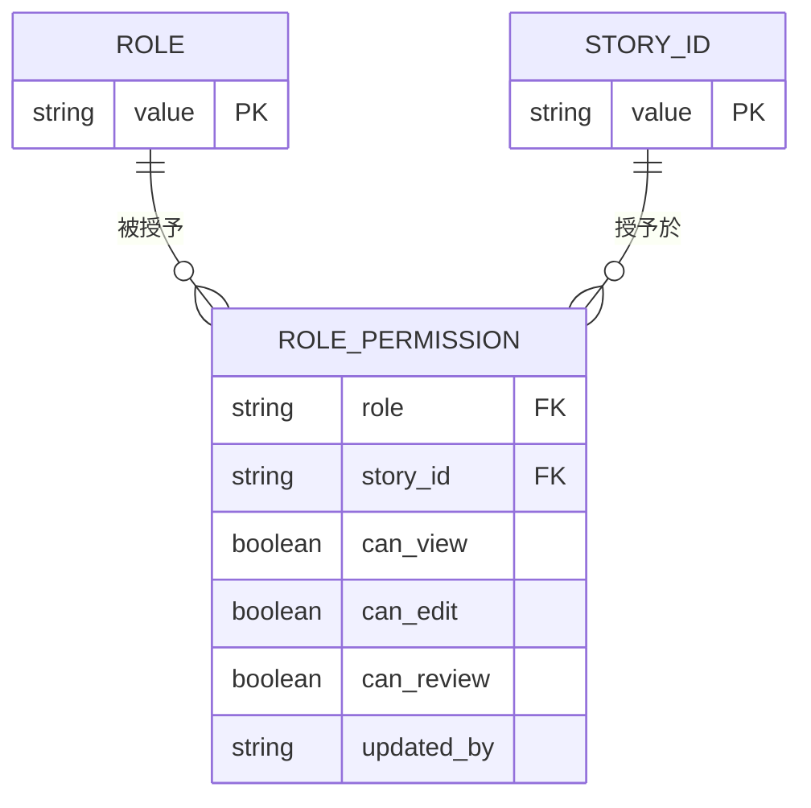

# Functional Spec — `U3 rbac-story-ids`（`spec`）

<!-- Stage: functional-design（Construction 3.1）· Unit: rbac-story-ids · kind: spec -->

本檔是**工作流程與狀態轉移的 source of truth**；實體模型的正本在 `entities.md`、
規則的正本在 `rules.md`，本檔的 ER 圖與規則摘要為衍生視圖。

---

## 一、本單元的 22 列（完整列舉）

這張表是本單元的全部交付內容。`v`／`e`／`r` 分別為 `can_view`／`can_edit`／
`can_review`，`-` 表示 `false`。

| 角色 | `K1` 統一入口頁 | `K2` 專案／系統階層 |
|---|---|---|
| `Project_Architect` | `v--` | `ve-` |
| `Developer` | `v--` | `v--` |
| `Project_Editor` | `v--` | `ve-` |
| `Project_Admin` | `v--` | `ve-` |
| `FinOps_Analyst` | `v--` | `v--` |
| `SRE` | `---` | `v--` |
| `Ops_Lead` | `---` | `v--` |
| `Platform_Engineer` | `---` | `v--` |
| `Security_Reviewer` | `v--` | `v--` |
| `Platform_Admin` | `v--` | `ve-` |
| `Platform_Owner` | `v--` | `v--` |

**實算複驗**：`K1` 欄有 8 個 `v`、3 個 `---`；`K2` 欄有 11 個 `v`、其中 4 個帶 `e`；
`r` 欄在兩個 story id 上皆為 0。合計 22 列，矩陣由 308 增為 **330**。

**兩個可達性保證各自成立**：

- `BR1.3`：`SRE`／`Ops_Lead`／`Platform_Engineer` 三者皆持有 `A1` view
  （本站實讀 `DEFAULT_ROLE_PERMISSIONS` 複驗），故 `AC1.4.2` 的 Given 可構造。
- `BR2.2`：七個角色不具 `K2.edit`，故 `AC9.2.3` 的 Given 可構造。

---

## 二、工作流程

### W-1：應用程式啟動時的 seed 寫入

本單元**不新增這條流程**，它已存在（`database.py:158–175`）。本單元改變的是
它所迭代的資料。逐步如下：

1. 啟動路徑呼叫 `ensure_role_permissions_seeded(db, force=False)`。
2. 該函式檢查 `role_permissions` 列數。
   - **空表**（全新環境）→ 寫入全部 330 列，結束。
   - **非空**（既有環境）→ **整段 no-op 並回 0**（`rbac.py:63–65`）。
     這一步對本單元的 22 列**完全無效**，`BR3.2` 即為此而立。
3. 啟動路徑接著呼叫 `ensure_missing_role_permissions(db)`。
4. 該函式逐列走訪 `DEFAULT_ROLE_PERMISSIONS`（現為 330 列）：
   - `(role, story_id)` 已存在 → 略過，**不覆寫**（`BR3.3`）。
   - 不存在 → `INSERT`，`updated_by = "system_seed"`。
5. 既有環境在此步補進 22 列；全新環境在此步插入 0 列（第 2 步已寫完）。
   兩條路徑殊途同歸，這是本流程冪等的來源。

**失敗行為**：第 3 步若不存在或未被呼叫，既有環境永遠拿不到 `K1`／`K2`，
而**應用程式不會報錯**——`user_can` 對缺列回 `false`（`rbac.py:150–151`），
現象是「所有人都沒有入口頁權限」，不是一個可辨識的錯誤。
本站已查證該函式存在於 `rbac.py:84–111` 且已被 `database.py:171–175` 呼叫，
故這一條是**既有保障，不是本單元要新建的機制**。

### W-2：空 volume 建庫

`schema_rbac.sql` 只在空 volume 執行，內含裸的 `DELETE FROM role_permissions;`
後重寫 seed。本單元必須把 22 列加進該檔的 seed 區塊（`BR4.1`），否則
「從 SQL 建的新環境」與「程式內的預設值」不一致——而 `W-1` 第 2 步會因為表非空
而 no-op，第 4 步才補上差額。**兩邊不一致時系統仍能運作**，只是新環境的
初始狀態與預期不同，這是它難以被發現的原因。

`rbac_seed_data.py` 檔頭逐字：「由 `schema_rbac.sql` 產生的預設 `role_permissions`
列（勿手改；改 SQL 後重跑產生腳本）」。**正確順序是先改 SQL、再重新產生 Python**。

### W-3：管理者於權限頁調整（既有流程，本單元的影響）

`K1`／`K2` 加入後，權限頁會多出兩列可調整的能力。三件事要注意：

1. 調整後該列的 `updated_by` 由 `"system_seed"` 變為操作者，
   `W-1` 第 4 步此後永遠不會再動它（`BR3.3`）。
2. 若管理者把 `K1` 給滿全部 11 個角色，`BR1.3` 被破壞、`AC1.4.2` 變成死碼——
   **但這是執行期的資料狀態，不是 seed 缺陷**。本單元保證的是**預設值**成立，
   不保證管理者不會把它改壞。`BR1.3` 的可執行檢查落在 seed 的測試上。
3. `user_router.py:885` 存在一個以 `force=True` 呼叫
   `ensure_role_permissions_seeded` 的端點，它會 `DELETE` 全表再重寫。
   `K1`／`K2` 進入 `DEFAULT_ROLE_PERMISSIONS` 後，該端點的重置目標一併包含
   新兩欄——**這是正確行為**，記此以免下游誤讀為本單元引入的缺陷。

---

## 三、狀態機：單一 `(role, story_id)` 列的生命週期

```
        [不存在]
            |
            | W-1 第 2 步（空表全寫）或第 4 步（補缺失列）
            v
      [預設值 · updated_by = system_seed]
            |
            | 管理者於權限頁調整（W-3）
            v
      [已調整 · updated_by = <操作者>]
            |
            | user_router.py:885 的 force=True 重置端點
            v
      [預設值 · updated_by = system_seed]   ← 回到上一狀態
```

<!-- Text fallback：一列有兩個狀態。從「不存在」經 seed 進入「預設值」；
管理者在權限頁調整後進入「已調整」；唯一能從「已調整」回到「預設值」的路徑是
force=True 的重置端點，它會清空全表重寫。ensure_missing_role_permissions
只做「不存在 → 預設值」這一個轉移，永遠不做另外兩個。 -->

**轉移的完整性**：`ensure_missing_role_permissions` 只實作第一個轉移。
它不會把「已調整」改回「預設值」，也不會刪除任何列——這正是它能在每次啟動
安全執行的原因（`BR3.3`）。

---

## 四、ER 圖（衍生自 `entities.md`，該檔的 YAML 為正本）



<!-- Text fallback：三個實體。ROLE（11 個正式角色，value 為主鍵）與
STORY_ID（30 個能力識別字，value 為主鍵）各自一對多連到 ROLE_PERMISSION。
ROLE_PERMISSION 以 (role, story_id) 為複合唯一鍵，帶三個布林旗標
can_view／can_edit／can_review 與一個 updated_by 字串。
本單元不新增實體，只新增 ROLE_PERMISSION 的 22 個實例與 STORY_ID 的 2 個值。 -->

---

## 五、規則摘要（衍生自 `rules.md`，該檔的 YAML 為正本）

16 條規則分四群：`BR1`（`K1` 語意與預設值，4 條）、`BR2`（`K2`，4 條）、
`BR3`（寫入端與冪等，4 條）、`BR4`（同步義務，4 條）。
類別實算：constraint 10、policy 5、validation 1、authorization 0、calculation 0。
完整對照表見 `rules.md` 的摘要段。

**審查後補入的第 16 條**：`BR4.4` 要求同一個 PR 新增測試鎖住 `schema_rbac.sql`
與 `rbac_seed_data.py` 兩份 seed 副本逐列等值。它不是審查提出的，是本站自查——
`team.md ## Code Style` 的「單一真實來源」逐字要求跨語言邊界的副本必須附一致性
測試，而本站查證 `backend/tests/` **目前沒有任何測試做這件事**，且本單元正是在
往兩份副本各加 22 列。

---

## 六、ADR-0006 security baseline 的四個面向（hard constraint，逐項判定）

| 面向 | 適用 | 本單元的處置 |
|---|---|---|
| **IAM** | **適用（核心）** | 本單元**就是** IAM 變更：新增兩個 story id、22 列 seed。處置為 `BR1.1`–`BR2.4` 的明文預設值，加上兩條可達性保證（`BR1.3`、`BR2.2`）確保「不具權限」的情形可被測試構造。交付條件含 allow/deny 雙向 TestClient（`team.md` A 規則）。**最小權限**的具體落點：`K1` 不給三個純唯讀維運角色、`K2.edit` 只給四個角色而非全部。 |
| **Encryption** | **不適用** | 本單元不新增任何欄位、不儲存任何機密值。`role_permissions` 的內容是布林旗標與角色名，無敏感資料。理由與 `U4` 的加密判定同源（同一個 PostgreSQL、同一個磁碟邊界）。 |
| **Network exposure** | **不適用** | 本單元交付零端點、零畫面、零對外介面。新增的暴露面在 `U7`（HTTP 端點）與 `U14`（頁面），各自於其 stage 判定。 |
| **Audit logging** | **適用（部分）** | seed 寫入的可稽核性由 `updated_by` 欄位承載：預設列為 `"system_seed"`，人工調整後為操作者（`entities.md` 的 `updated_by` 約束）。**已知缺口**：`ensure_missing_role_permissions` 只在插入非零列時記一行 `logger.info`（`rbac.py:109–110`），**不記錄是哪些列**。既有環境補進 22 列時，日誌只會有一個數字。此缺口不在本單元修（改動既有函式的日誌行為超出 seed 範圍），記為交接事項 `H-3`。 |

---

## 七、交接事項

| ID | 事項 | 承接站 | 性質 |
|---|---|---|---|
| `H-1` | **`K1` 的唯讀／編輯雙態**。Figma `首頁`（`53:2`）副標逐字「目前處於唯讀分享模式…請求編輯權限解鎖完整 AI 互動能力」＋「進入編輯模式」按鈕。本站經人工裁決**不採納為需求**（`K1` 做成 view-only，`BR1.2`）。若 `U14` 決定要雙態，`K1` 的 seed 要再改一次並再觸發一次 `BR4.1`／`BR4.2` 的 blocking 同步。記為 `OQ-K1`。 | `U14 entry-page-ui` | 開放決策 |
| `H-2` | **刪除專案／系統時既有資料的處置**。本站 Q4 未採「非空不可刪」的結構前提，故該行為未定。`K-04` 的 `DG-2` 已在追蹤同一件事（cascade 未定會讓 `system_id` 懸空，使 `U4` 的不變量在遷移**之後**被打破）。記為 `OQ-K2`。 | `U7 hierarchy-service` | 開放決策 |
| `H-3` | **seed 寫入的稽核粒度**。`ensure_missing_role_permissions` 只記插入列數、不記哪些列（見第六節）。 | **無自然承接站**（見下方註） | 已知缺口 |
| `H-4` | **入口頁沒有脈絡列**。Figma `首頁` 無「目前作業對象」列，專案／子系統選擇器只在編輯模式的畫布頁 header。已核可的 `AC2.1.1` 要求「在入口頁看到三元組 → 切到 `/workspace` 逐欄相同」，其**起點在該設計上不存在**。 | `U14 entry-page-ui` | 設計落差（人工裁決本站不處理） |
| `H-5` | **沒有「進行中的工作」常駐區**。`mockups.md` M1 的 `[DM:D4]`=C 釘死 `INV-1`（一份狀態、兩個視圖）；Figma 首頁與三欄圖的 AI 面板皆無常駐區，`FR1.2` 的五狀態集合在畫面上沒有對象。 | `U14 entry-page-ui` | 設計落差（同上） |
| `H-6` | **八張能力卡 ≠ M2 的反問候選**。Figma `首頁` 的 A–H 八張卡與 `user_router.py:60` 的 `STORY_FEATURE_LABELS` 字首組 **1:1 對應**（A 架構、B 跨雲選型、C 成本、D IaC、E 維運、F 多雲維運、G 安全、H MCP/Skill；J 為 Sidebar 的「系統管理」群組）。那是**產品功能目錄**；M2 的候選是**針對使用者該句話的歧義澄清**（Figma `選擇功能` `54:191` 才是後者，其候選逐字標為「A1. 自然語言轉架構與草圖產出」「A2. 自動化 Well-Architected 評核與模擬」）。兩者在 Figma 裡同時存在，已核可文件只有後者。 | `U14 entry-page-ui` | 設計落差（同上） |
| `H-7` | **記憶沒有入口**。`mockups.md` M0／M6／M7 要求 Sidebar 有「我的記憶」為第二個獨立項；Figma 左欄是「新對話 ＋ 對話歷史（今天／過去 7 天／過去 30 天）＋ 系統管理」，無記憶項，而「對話歷史」是已核可設計裡沒有的。 | `U15 memory-page-ui`、`U14` | 設計落差（同上） |

**`H-3` 為何寫「無自然承接站」**（審查 R-02 要求給確定落點，本站的回應）：
缺口在 `ensure_missing_role_permissions` 的日誌行為，而那是 `rbac.py` 的共用函式，
**本 intent 沒有任何單元的責任範圍涵蓋它**——`U3` 的 `§八` 明文不改它的行為，
`U7` 交付的是 `projects`／`systems` 的 HTTP 端點、不碰 seed 路徑。
依 `project.md` 的既有教訓（找不到誠實的轉移目標時寫「無自然承接站」並重新提交
使用者，不得填一個看起來合理的站），本站不指派假目標。**處置**：第六節的
ADR-0006 表已標示 audit logging 面為「適用（部分）」，本註把它講明——
**該面向在本 intent 內只被部分履行，`H-3` 未結案**。任何日後引用本單元作為
「已處理 ADR-0006 稽核面」的說法都須一併讀這一段。

**`H-4`–`H-7` 的來源**：Figma 檔 `ecYwIVWjHESXzaQRyLphix` 的四個框架於本站
進行中由使用者提供並**實讀畫面**（非讀圖層名推斷）。經人工裁決「只先解第 4 項
（＝`H-1`），其餘記成交接」，故本站**不回改任何已核可的上游產出**。

---

## 八、本單元明確不做的事

- 任何 HTTP 端點、任何 service 層函式、任何前端檔案（`BR1.4`）。
- 任何授權判定邏輯——判定由既有 `require_story_action` 承擔。
- 新增或修改既有 308 列中的任何一列。
- 修改 `ensure_missing_role_permissions` 或 `ensure_role_permissions_seeded`
  的行為（兩者皆已存在且已被呼叫，本單元只改變其迭代的資料）。
- `STORY_FEATURE_LABELS` 以外的 `user_router.py` 變更。
