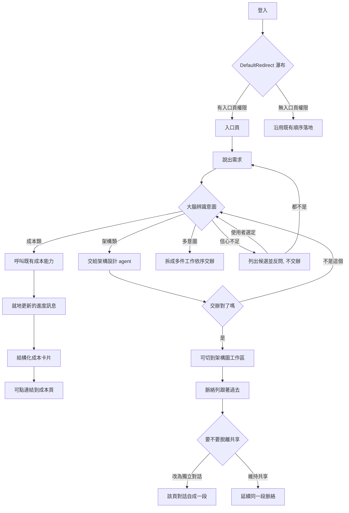

# User Flow — 統一入口大腦

## 上游輸入

本站消費 `intent-statement.md`、`scope-document.md`、`intent-backlog.md`。
具約束力的已核可決定：共享工作階段涵蓋入口頁、架構圖工作區、評估頁三處
[Q7]；成本答案就地在入口頁呈現 [Q14]；成本編排為 Must [S11]；主動通知推播
為唯一的 Should，故不出現在下列任一條 happy path 中。

## 核心流程圖

<!-- Text fallback: 使用者登入後，由 DefaultRedirect 的權限瀑布決定落地頁；
有入口頁權限者進入口頁，沒有的沿用既有順序落地。在入口頁說出需求後，大腦
辨識意圖並分三路：架構類交給架構設計 agent，成本類呼叫既有成本能力，
多意圖則拆成多件工作依序交辦。若信心不足則走第四條路：列出候選並反問、
不交辦——使用者選定後回到辨識，或選「都不是」回到重新輸入。成本路徑先顯示
就地更新的進度訊息，完成後換成結構化卡片，卡片可連到成本頁。架構路徑在
切到工作區之前先經過一個判斷點：使用者若說「不是這個」，該項停掉並回到
辨識重新交辦；確認對了才切到架構圖工作區，脈絡列會跟著過去；在該頁可選擇
改為獨立對話（該頁對話自成一段）或維持共享（延續同一段脈絡）。 -->

## Flow 1 — 架構設計者：說出需求到改到圖（主流程）

1. 登入後落在入口頁（有權限者；[R8]）。
2. 脈絡列顯示「尚未選定」，使用者輸入「把付款服務的架構圖加一個 Redis 快取」。
3. 大腦辨識為架構類意圖，並從敘述中認出作業對象，脈絡列更新為
   「電商平台 / 訂單系統 / 主架構圖」。
4. 大腦交辦給架構設計 agent，回覆中以 `(i)` 提示可到架構圖生成頁看結果。
5. 使用者切到架構圖生成頁——**脈絡列跟著過去且顯示同一個對象**，不需重講
   （[R3]；對應成功指標「跨頁面上下文保留率」）。

## Flow 2 — 成本關注者：問成本到看到答案（主流程）

1. 在入口頁輸入「這個系統這個月大概花多少？」。
2. 大腦辨識為成本類意圖，以 HTTP 帶使用者 token 呼叫既有 `/api/cost/v1`
   （feasibility 約束 C-S5——既有授權照常執行，不被繞過）。
3. 成本端排入非同步 job 並開始送狀態事件；大腦把 `progress` 轉譯為
   **單一則就地更新**的訊息（[R5]）。
4. 收到 `completed` 後，該則訊息被**結構化卡片**取代（[R4]），卡片附
   「到成本頁看完整分析」連結。
5. 使用者**全程不離開入口頁**（[Q14]）。

**非 happy path（已登記，非本站新發現）**：`timeout` 與 `failed` 兩種終態
各需可見訊息，否則使用者停在最後一則進度訊息、分不出「還在跑」與「失敗」
——feasibility RAID **R-9**。

## Flow 3 — 在子功能頁另開一段獨立對話

1. 使用者在架構圖生成頁，脈絡列顯示共享狀態。
2. 於脈絡列選「改為獨立對話」（[R6]——切換由脈絡元件統一承載）。
3. 該頁對話脫離共享 session，入口頁的脈絡不受影響。
4. 使用者可隨時切回共享。

## Flow 4 — 無入口頁權限者

1. 登入後 `DefaultRedirect` 的瀑布跳過入口頁，沿用既有順序落地
   （架構 → 評估 → 成本 → 管理，皆不符則 `/403`）。
2. Sidebar 不顯示「入口」項目。
3. **不存在「無權限的入口頁」畫面**——該狀態不可達，故 `wireframes.md`
   未為它繪製畫面（[R8]）。

## Flow 5 — 意圖不明確或辨識錯誤：使用者把它導回來（錯誤路徑）

本流程為 iteration 2 人工退回的補正。原稿四條流程全為成功面，
`ux-guide.md` 的 user flow 格式明文要求 `Error paths`，而「意圖識別準確率」
是三個成功指標之一——會失敗且被量測的能力，流程上必須有可救回的路徑。

**Persona**：四類直接服務對象皆適用（不限特定角色）。
**Trigger**：大腦對使用者的一句話無法判定意圖，或已交辦後使用者發現判斷錯了。

路徑 A — **交辦前**（信心不足）：

1. 使用者在入口頁輸入語意不明確的一句話。
2. 大腦**不交辦、不產生任何結果**，列出候選判讀（見 `wireframes.md` 第 12 節）。
3. 使用者選定其中一個候選 → 回到正常交辦流程（Flow 1 或 Flow 2 的第 3 步）。
4. 使用者選「都不是，我再講一次」 → 回到輸入，脈絡列與作業對象不變。

路徑 B — **交辦後**（判斷錯了）：

1. 大腦已交辦並顯示「處理中」。
2. 使用者以該工作項旁的「不是這個」或自然語言更正（見 `wireframes.md` 第 13 節）。
3. 大腦停掉該項——該項在畫面上轉為**可見的終止狀態**（`wireframes.md` 第 13
   節的 `[已停掉 (x)]`）——並明講原本那件**有沒有留下東西**，改交給正確的功能。
   本站不承諾系統真能做到「停掉時不留半成品」，只承諾畫面把實情講出來。
4. 多意圖情境下此更正為**逐項**，其餘項不受影響（見 `wireframes.md` 第 8 節）。

**Error paths**：

- 反問後使用者仍未選定（直接輸入新的一句話）→ 視為新需求重新辨識，舊的候選
  清單作廢，不殘留在對話流中等待。
- 被停掉的工作已產生副作用（例如架構圖已被改寫）→ **本站未定案回復方式**，
  只定案畫面必須明講有沒有留下東西；回復機制屬設計階段。

## Assumptions & Open Questions

- 大腦「從敘述中認出作業對象」的判定方式（明確指名／延續上次／反問）未定；iteration 2 補正只定案了「信心不足時走反問、且反問前不交辦」這一條路徑的存在與畫面，三種判定方式之間如何選擇仍未定 [assumption]
- 觸發反問的判定門檻（信心低於多少）為數值參數，與三個成功指標的門檻同屬 requirements-analysis 的工作，本站不預選 [assumption]
- 多意圖拆解後的交辦順序與其在對話流中的呈現未定，流程圖只表達「拆成多件依序交辦」 [assumption]
- 切回共享對話時，獨立那段的內容如何處置（保留、捨棄、可回溯）未定 [assumption]
- 主動通知推播為唯一的 Should，未出現在任何一條流程中；若第一版交付，其觸發點與落點待該時定案 [assumption]
- 記憶的檢視與刪除（能力 4，[F5]=C）未列為獨立流程——它不是「說出需求到得到結果」那條主線的一環，而是使用者主動去管理自己資料的動作；其畫面見 `wireframes.md` 第 9 節 [assumption]

<!-- 定稿存檔：對應 rough-mockups 的 Consolidated Summary Confirmation 收據
     824afc07（2026-09-22）。本檔於 iteration 1 審查後未變更內容，僅補此註記
     與上方一條 Assumptions（記憶管理不列為獨立流程的理由）。 -->

<!-- 修訂 1 定稿存檔（2026-09-24）：對應重跑後的收據 13e46922。本輪修訂範圍：
     核心流程圖新增「信心不足→反問」分支與「交辦對了嗎」判斷點、文字 fallback
     同步改寫、新增 Flow 5（含 Error paths）、Assumptions 改寫 1 條並新增 1 條。
     Flow 5 第 3 步於審查 PL-05 後再修，與 wireframes.md 第 13 節同步為等價
     措辭：只承諾可見的終止狀態與「把實情講出來」，不承諾不留半成品。 -->
