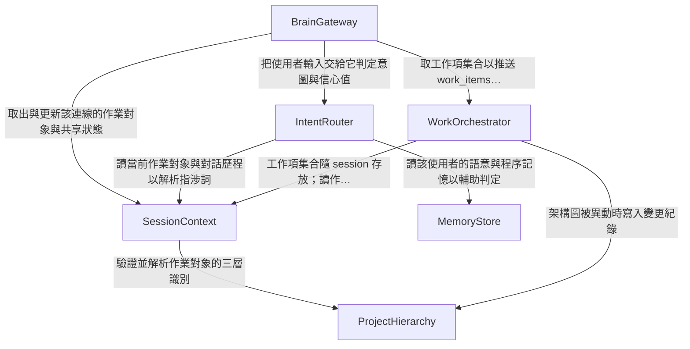

# Components — 統一入口大腦

<!-- Stage: domain-design（Inception 2.6）· Record: 260920-orchestration-brain
     lead: aidlc-architect-agent · support: aidlc-aws-platform-agent, aidlc-design-agent -->

## 這份檔在做什麼

識別本 intent 要**寫程式**的邏輯建構塊。依 stage 檔的定義：元件是「有自己商業邏輯、
實體與生命週期的一段軟體」；**資料庫、快取、佇列、第三方服務是元件的依賴，不是元件**
——它們一律列在 `external_dependencies`。

本站**不決定**部署拓樸（那是 `units-generation` 的事）、**不選**技術棧或 NFR 手法
（那是 NFR 與 infrastructure 階段的事）。實體只記到**歸屬與形狀**層級——哪個元件擁有它、
識別欄位、屬性名稱、跨元件參照；**不記**資料型別、驗證約束、允許值與關係基數，
那份完整 schema 屬 functional-design。

**規模**：6 個元件、7 個實體、8 條 `depends_on` 邊、
13 項外部依賴。以上四個數字皆由下方 YAML 實算，非目測。

---

## Part A — 機讀目錄（本檔的真實來源）

下方 YAML 是這份檔的**單一真實來源**，Part B 的所有表格與圖皆由它以腳本衍生，
不是手抄。

```yaml
components:
  - name: BrainGateway
    summary: 大腦對外的唯一 WebSocket 端點；訊息封包的編解與串流
    behaviour: >
      掛在 /api/ 之下（nginx 的 location /api/ 是唯一帶 Upgrade 標頭者，location /
      走 try_files 會回 HTML）。握手認證的 token 走 Sec-WebSocket-Protocol 標頭或
      握手後首則訊息，不得放 query string。握手時以 record=True 呼叫既有的
      get_user_from_token，使 users.last_activity_at 照常更新（既有 WS 前例用
      record=False，照抄會讓帳號活動稽核對大腦使用者靜默失效）。每一則進入的使用者
      文字先過既有 prompt_guard，命中即不呼叫任何 LLM 並回固定拒絕訊息。
      對外訊息型別至少含 clarify、work_items、cost_card、token、done、error；
      clarify 的候選帶 id/label/capability，信心值為選填且不得列為必填。
      不得在事件迴圈上做同步 LLM 呼叫。
    responsibilities:
      - WebSocket 連線生命週期與握手認證
      - 訊息封包的型別契約（前後端共用來源，CI 一致性檢查的受檢對象）
      - 大腦回覆的 token 串流轉送
      - 每則輸入的 prompt_guard 預檢
    depends_on:
      - component: IntentRouter
        interaction: 把使用者輸入交給它判定意圖與信心值
        style: sync
      - component: SessionContext
        interaction: 取出與更新該連線的作業對象與共享狀態
        style: sync
      - component: WorkOrchestrator
        interaction: 取工作項集合以推送 work_items 訊息；轉送使用者的逐項更正
        style: sync
    dependents: []
    external_dependencies:
      - name: nginx
        kind: other
        purpose: 反向代理；WS 路徑受其 location /api/ 限制
      - name: Cloudflare Tunnel
        kind: other
        purpose: 對外暴露；已為 WS 設 tcpKeepAlive 30s
    entities: []

  - name: IntentRouter
    summary: 把一句自然語言判定為意圖類別並輸出可與門檻比較的信心值
    behaviour: >
      必須輸出 0–1 的信心值（這是獨立需求，不是門檻判定的前提句——若實作出不輸出
      信心值的路由層，反問路徑會靜默永不觸發而文件上看起來已解決）。信心值 < 0.7
      即不交辦、不產生任何結果，改產生 clarify 候選。一句含 N 個可分離意圖者輸出
      N 個意圖。若最終模型無法提供可用信心訊號，觸發條件改以「候選並列且無單一
      最高分」表達，畫面不變、本元件對外介面不變。
    responsibilities:
      - 意圖分類與信心值輸出
      - 多意圖拆解
      - 信心不足時產生候選判讀清單
      - 多輪對話的指涉詞解析（第 N 輪指向第 N−1 輪產出）
    depends_on:
      - component: SessionContext
        interaction: 讀當前作業對象與對話歷程以解析指涉詞
        style: sync
      - component: MemoryStore
        interaction: 讀該使用者的語意與程序記憶以輔助判定
        style: sync
    dependents:
      - component: BrainGateway
        interaction: 把使用者輸入交給它判定
    external_dependencies:
      - name: OpenRouter
        kind: third-party-api
        purpose: 路由層 LLM 呼叫（模型定案為 nfr-requirements 的待辦）
    entities: []

  - name: SessionContext
    summary: 作業對象、共享↔獨立狀態與對話歷程的單一來源，外部化於 Redis
    behaviour: >
      一律放 Redis，不得放行程記憶體——重啟 backend 後既有對話的脈絡與作業對象
      須完整還原。作業對象、共享／獨立狀態、工作項集合放在同一個 session key 之下，
      TTL 24 小時、每次互動續期；TTL 到期三者一起消失，下次進入即為全新 session
      且作業對象回到未選定。共享工作階段涵蓋統一入口、/workspace、/assessment 三處，
      不含 /admin/* 與 /cost。子功能頁得開啟不共享訊息歷程但沿用當前作業對象的
      獨立對話。
    responsibilities:
      - 作業對象（專案／系統／架構圖三層）的持有與切換
      - 共享↔獨立對話的狀態
      - 對話歷程的暫存與跨頁面延續
      - session 的存活期與清除（TTL 續期）
    depends_on:
      - component: ProjectHierarchy
        interaction: 驗證並解析作業對象的三層識別
        style: sync
    dependents:
      - component: BrainGateway
        interaction: 取出與更新該連線的作業對象
      - component: IntentRouter
        interaction: 讀作業對象與歷程以解析指涉詞
      - component: WorkOrchestrator
        interaction: 工作項集合隨 session 存放與清除
    external_dependencies:
      - name: Redis
        kind: cache
        purpose: session 狀態外部化；第 5 個部署服務
    entities:
      - name: BrainSession
        identifier: sessionKey
        attributes: [sessionKey, userId, currentProjectId, currentSystemId, currentDiagramId, sharingMode, messageHistory, expiresAt]
        references:
          - entity: Project
            owned_by: ProjectHierarchy
            relationship: 每個 session 最多指向一個目前專案
          - entity: System
            owned_by: ProjectHierarchy
            relationship: 每個 session 最多指向一個目前系統

  - name: WorkOrchestrator
    summary: 工作項的狀態機、多意圖的依序交辦、逐項更正，以及對既有能力的呼叫
    behaviour: >
      每個工作項帶一個狀態，狀態值集合不得少於五個：處理中／等待中／完成／失敗／
      已停掉。等待中用於依賴前一項結果者；已停掉用於使用者更正後的終止狀態，
      且該項必須帶 sideEffect 欄位（none／unknown／說明文字）讓畫面能誠實說出
      有沒有留下東西——unknown 是合法值，因為系統不承諾停掉時不留半成品。
      更正為逐項，其餘工作項不受影響。呼叫既有成本能力一律走 HTTP 並帶使用者
      token，使既有的 require_story_action("C1", …) 照常執行，不得同進程直呼
      service 層繞過授權。把成本 job 的五種狀態事件轉譯進自己的訊息流，不等 job
      完成才開始回覆，且不做 token 級巢狀串流轉送（來源端沒有逐字可轉）。
    responsibilities:
      - 工作項集合與其狀態轉換
      - 多意圖的拆解結果落為 N 個工作項並決定交辦順序
      - 逐項更正（停掉某項並改交辦）
      - 呼叫既有 A1／A3／C1 能力並轉譯其回應與狀態事件
    depends_on:
      - component: SessionContext
        interaction: 工作項集合隨 session 存放；讀作業對象決定交辦目標
        style: sync
      - component: ProjectHierarchy
        interaction: 架構圖被異動時寫入變更紀錄
        style: sync
    dependents:
      - component: BrainGateway
        interaction: 取工作項集合以推送；轉送逐項更正
    external_dependencies:
      - name: 既有 A1／A3 端點
        kind: other
        purpose: 架構圖生成與 Well-Architected 檢視，經 HTTP 呼叫
      - name: 既有 C1 端點 /api/cost/v1
        kind: other
        purpose: 成本估價；HTTP 帶使用者 token 以保留既有授權
    entities:
      - name: WorkItem
        identifier: workItemId
        attributes: [workItemId, sessionKey, label, status, capability, waitingOn, failureReason, sideEffect, createdAt]
        references:
          - entity: BrainSession
            owned_by: SessionContext
            relationship: 每個工作項屬於一個 session

  - name: MemoryStore
    summary: 語意／程序／情節三種記憶的持有、授權、檢索與稽核
    behaviour: >
      三種記憶落在同一個 PostgreSQL database 的獨立 schema，以保留原生跨 schema
      join 能力；資料庫層的邊界以「grant 只開放記憶 schema」承載。每一列記憶帶
      擁有者與可見範圍欄位，讀取一律經過該模型。擁有者由本元件在寫入時依呼叫者的
      已驗證身分設定，不得由呼叫方自行指定。可見範圍預設為最窄（僅擁有者可見）；
      放寬可見範圍是一個獨立的、需授權的操作，僅 Platform_Admin 與 Platform_Owner
      得為之，且每次變更須留稽核紀錄（誰、何時、由什麼範圍改為什麼範圍）。
      使用者得刪除自己的記憶，刪除動作本身須留稽核紀錄。情節記憶保存 90 天，
      逾期自動刪除由 gh-aw／GitHub Actions workflow 承載，不得是 backend 內的
      排程程式；清除動作亦須留稽核。檢索以 pgvector 的向量相似度進行，向量由 EmbeddingPort 產生。該 Port 有四個
      實作並由設定切換：ollama（bge-m3，1024 維，staging 用）、fastembed
      （multilingual-e5-large，1024 維，行程內，本機無 Ollama 時用）、fulltext
      （不算向量，退回 PostgreSQL 全文檢索）、stub（決定性替身，CI 用）。
      向量欄位為 vector(1024)，兩個向量提供者同維度故可共用。每列記憶存
      embeddingModel；相似度檢索只比對同一 embeddingModel 的列——同維度不等於同
      向量空間，不加這道過濾會讓跨模型的檢索回垃圾且不報錯。fulltext 模式下建立的
      列其向量為 NULL，之後不會被向量檢索看到，除非重新 embed。偵測不到選定的
      提供者時必須大聲失敗並列出可選值，不得靜默降級為全文檢索。
    responsibilities:
      - 三種記憶的讀寫與其獨立 schema
      - 擁有者與可見範圍的寫入端強制（最小權限）
      - 可見範圍放寬的授權與稽核
      - 使用者自行刪除與其稽核
      - 語意相似度檢索（經 EmbeddingPort 取得向量，依 embeddingModel 分群比對）
      - EmbeddingPort 的提供者選擇與其不可用時的大聲失敗
    depends_on: []
    dependents:
      - component: IntentRouter
        interaction: 讀語意與程序記憶以輔助意圖判定
    external_dependencies:
      - name: PostgreSQL（記憶 schema）
        kind: database
        purpose: 三種記憶的持久化；獨立 schema ＋ grant 邊界
      - name: pgvector
        kind: database
        purpose: 向量欄位與相似度索引；需 pgvector/pgvector:pg16 image
      - name: Ollama（bge-m3）
        kind: other
        purpose: staging 的 embedding 運算；第 6 個部署服務，零 API 費用
      - name: fastembed（multilingual-e5-large）
        kind: other
        purpose: 本機無 Ollama 時的行程內 embedding；ONNX、不拉 torch、不加服務
      - name: gh-aw／GitHub Actions workflow
        kind: other
        purpose: 90 天逾期清除的承載形式
    entities:
      - name: MemoryRecord
        identifier: memoryId
        attributes: [memoryId, kind, ownerUserId, visibilityScope, content, embedding, embeddingModel, createdAt, expiresAt]
        references: []
      - name: MemoryAuditEvent
        identifier: auditEventId
        attributes: [auditEventId, memoryId, actorUserId, action, previousScope, newScope, occurredAt]
        references:
          - entity: MemoryRecord
            owned_by: MemoryStore
            relationship: 每筆稽核事件指向一列記憶

  - name: ProjectHierarchy
    summary: 專案 → 系統 → 架構圖 的三層資料模型、建立路徑、既有圖遷移與變更紀錄
    behaviour: >
      一個專案有多個系統、一個系統對應一份架構圖檔與其中多張圖。讀、建立、修改、
      刪除一律經 require_story_action（story id K2），不得有任何繞過該 dependency
      的路徑，含同進程直呼 service 層。建立路徑有兩個使用者入口（脈絡列選單的
      表單、對話式建立的確認卡）但共用同一條寫入路徑，授權檢查、稽核紀錄與錯誤
      訊息各只有一份。既有架構圖的遷移為每個持有圖的使用者建立「預設專案／預設
      系統」並把其現有圖掛入；user_diagrams.user_id 保留為「誰建的」，新增
      nullable 的 system_id 作為「屬於哪個系統」，並明訂 system_id 為歸屬的權威
      來源。遷移後架構圖表中 system_id IS NULL 的列數必須為 0，不為 0 時遷移程序
      須大聲失敗，不得以警告帶過。架構圖每次被異動時寫入一列變更紀錄，帶來源需求
      的摘要與一個輕量標籤（不建 Requirement 實體、不建多對多關聯表）。
    responsibilities:
      - 專案與系統的資料模型與生命週期
      - 架構圖對系統的歸屬
      - 既有圖的遷移與其回復方式
      - 建立路徑的單一寫入端與授權
      - 架構圖變更紀錄（來源需求摘要與標籤）
    depends_on: []
    dependents:
      - component: SessionContext
        interaction: 驗證並解析作業對象的三層識別
      - component: WorkOrchestrator
        interaction: 架構圖被異動時寫入變更紀錄
    external_dependencies:
      - name: PostgreSQL（主 schema）
        kind: database
        purpose: projects／systems／變更紀錄的持久化
      - name: 既有 user_diagrams 表
        kind: database
        purpose: 遷移的對象；新增 nullable system_id
    entities:
      - name: Project
        identifier: projectId
        attributes: [projectId, name, ownerUserId, createdAt]
        references: []
      - name: System
        identifier: systemId
        attributes: [systemId, projectId, name, createdAt]
        references:
          - entity: Project
            owned_by: ProjectHierarchy
            relationship: 每個系統屬於一個專案
      - name: DiagramChangeRecord
        identifier: changeRecordId
        attributes: [changeRecordId, diagramId, actorUserId, requirementSummary, requirementLabel, occurredAt]
        references:
          - entity: System
            owned_by: ProjectHierarchy
            relationship: 每筆變更紀錄經架構圖上溯到一個系統
```

### Well-formedness 驗證結果

stage 檔列了 8 條規則，本站以腳本逐條驗證（非目測）：

| 規則 | 結果 |
|---|---|
| 元件名稱唯一 | ✓ 6 個名稱無重複 |
| 每個 `component:`／`owned_by` 都指向已宣告元件 | ✓ |
| 無元件依賴自己 | ✓ |
| `depends_on`／`dependents` 對稱 | ✓ 正向 8 邊、由 `dependents` 反推 8 邊，對稱差集為空 |
| 每個實體恰由一個元件擁有且有 identifier | ✓ 7 個實體 |
| 每個 `references.entity` 在其 `owned_by` 下已宣告 | ✓ |
| 依賴圖無環 | ✓ （DFS 三色法實測，無刻意保留的環） |
| 基礎設施不作為元件 | ✓ PostgreSQL／pgvector／Redis／Ollama／fastembed／nginx／Cloudflare Tunnel／既有端點皆列於 `external_dependencies` |

---

## Part B — 人讀視圖（由 Part A 衍生）

### Component Diagram



<!-- Text fallback: BrainGateway 依賴 IntentRouter（判定意圖）、SessionContext
（取用作業對象）與 WorkOrchestrator（取工作項、轉送更正）。IntentRouter 依賴
SessionContext（解析指涉詞）與 MemoryStore（讀語意與程序記憶）。SessionContext
依賴 ProjectHierarchy（解析三層識別）。WorkOrchestrator 依賴 SessionContext
（工作項隨 session 存放）與 ProjectHierarchy（寫變更紀錄）。MemoryStore 與
ProjectHierarchy 不依賴任何元件，是兩個葉節點。 -->

### Component Summary

| Component | Purpose | Depends On | Dependents | Entities Owned |
|---|---|---|---|---|
| `BrainGateway` | 大腦對外的唯一 WebSocket 端點；訊息封包的編解與串流 | IntentRouter、SessionContext、WorkOrchestrator | — | — |
| `IntentRouter` | 把一句自然語言判定為意圖類別並輸出可與門檻比較的信心值 | SessionContext、MemoryStore | BrainGateway | — |
| `SessionContext` | 作業對象、共享↔獨立狀態與對話歷程的單一來源，外部化於 Redis | ProjectHierarchy | BrainGateway、IntentRouter、WorkOrchestrator | BrainSession |
| `WorkOrchestrator` | 工作項的狀態機、多意圖的依序交辦、逐項更正，以及對既有能力的呼叫 | SessionContext、ProjectHierarchy | BrainGateway | WorkItem |
| `MemoryStore` | 語意／程序／情節三種記憶的持有、授權、檢索與稽核 | — | IntentRouter | MemoryRecord、MemoryAuditEvent |
| `ProjectHierarchy` | 專案 → 系統 → 架構圖 的三層資料模型、建立路徑、既有圖遷移與變更紀錄 | — | SessionContext、WorkOrchestrator | Project、System、DiagramChangeRecord |

### Entity Ownership

| Entity | Owning Component | Identifier | Attributes | References |
|---|---|---|---|---|
| `BrainSession` | `SessionContext` | `sessionKey` | `sessionKey`、`userId`、`currentProjectId`、`currentSystemId`、`currentDiagramId`、`sharingMode`、`messageHistory`、`expiresAt` | Project（ProjectHierarchy）；System（ProjectHierarchy） |
| `WorkItem` | `WorkOrchestrator` | `workItemId` | `workItemId`、`sessionKey`、`label`、`status`、`capability`、`waitingOn`、`failureReason`、`sideEffect`、`createdAt` | BrainSession（SessionContext） |
| `MemoryRecord` | `MemoryStore` | `memoryId` | `memoryId`、`kind`、`ownerUserId`、`visibilityScope`、`content`、`embedding`、`embeddingModel`、`createdAt`、`expiresAt` | — |
| `MemoryAuditEvent` | `MemoryStore` | `auditEventId` | `auditEventId`、`memoryId`、`actorUserId`、`action`、`previousScope`、`newScope`、`occurredAt` | MemoryRecord（MemoryStore） |
| `Project` | `ProjectHierarchy` | `projectId` | `projectId`、`name`、`ownerUserId`、`createdAt` | — |
| `System` | `ProjectHierarchy` | `systemId` | `systemId`、`projectId`、`name`、`createdAt` | Project（ProjectHierarchy） |
| `DiagramChangeRecord` | `ProjectHierarchy` | `changeRecordId` | `changeRecordId`、`diagramId`、`actorUserId`、`requirementSummary`、`requirementLabel`、`occurredAt` | System（ProjectHierarchy） |

### External Dependencies

| Component | Dependency | Kind | Purpose |
|---|---|---|---|
| `BrainGateway` | nginx | `other` | 反向代理；WS 路徑受其 location /api/ 限制 |
| `BrainGateway` | Cloudflare Tunnel | `other` | 對外暴露；已為 WS 設 tcpKeepAlive 30s |
| `IntentRouter` | OpenRouter | `third-party-api` | 路由層 LLM 呼叫（模型定案為 nfr-requirements 的待辦） |
| `SessionContext` | Redis | `cache` | session 狀態外部化；第 5 個部署服務 |
| `WorkOrchestrator` | 既有 A1／A3 端點 | `other` | 架構圖生成與 Well-Architected 檢視，經 HTTP 呼叫 |
| `WorkOrchestrator` | 既有 C1 端點 /api/cost/v1 | `other` | 成本估價；HTTP 帶使用者 token 以保留既有授權 |
| `MemoryStore` | PostgreSQL（記憶 schema） | `database` | 三種記憶的持久化；獨立 schema ＋ grant 邊界 |
| `MemoryStore` | pgvector | `database` | 向量欄位與相似度索引；需 pgvector/pgvector:pg16 image |
| `MemoryStore` | Ollama（bge-m3） | `other` | staging 的 embedding 運算；第 6 個部署服務，零 API 費用 |
| `MemoryStore` | fastembed（multilingual-e5-large） | `other` | 本機無 Ollama 時的行程內 embedding；ONNX、不拉 torch、不加服務 |
| `MemoryStore` | gh-aw／GitHub Actions workflow | `other` | 90 天逾期清除的承載形式 |
| `ProjectHierarchy` | PostgreSQL（主 schema） | `database` | projects／systems／變更紀錄的持久化 |
| `ProjectHierarchy` | 既有 user_diagrams 表 | `database` | 遷移的對象；新增 nullable system_id |

### Rationale — 為什麼每個都是獨立的建構塊

| Component | 獨立的理由 | 判準 |
|---|---|---|
| `BrainGateway` | 它是**協定層**：WebSocket 生命週期、訊息封包型別、串流轉送。這些會因為傳輸協定變更而改，與商業邏輯的變更理由完全不同；且它是 NFR5／N-1 要求的契約閘門的唯一受檢對象 | distinct concern、distinct change rate |
| `IntentRouter` | 它是唯一呼叫路由層 LLM 的地方，而模型選型尚未定案（`OQ-4`／`OQ-10` 指派 `nfr-requirements`）。模型換掉時只有它要改 | distinct change rate、distinct concern |
| `SessionContext` | 它是唯一持有 Redis 的元件，且 session 的存活期與清除是它一個人的責任（`[DD:E6]`=A 的單一 key ＋ TTL）。其資料完全不落 PostgreSQL | distinct data ownership、distinct lifecycle |
| `WorkOrchestrator` | 它擁有工作項的狀態機，並且是唯一對外呼叫既有 A1／A3／C1 能力的地方。既有能力的契約改變時只有它要改 | distinct concern、distinct data ownership |
| `MemoryStore` | 它擁有一個**獨立的 PostgreSQL schema** 與其 grant 邊界，這是全 repo 零前例的結構（`[kb:architecture]` 約束七）。它的授權模型（擁有者 ＋ 可見範圍）與 RBAC 的 story-action 模型是兩套不同的東西 | distinct data ownership、distinct concern |
| `ProjectHierarchy` | 它擁有本 intent 新建的核心資料模型，且是唯一碰既有 `user_diagrams` 表的元件。遷移與回復是它一個人的責任 | distinct data ownership、distinct lifecycle |

### Alternatives Rejected

`[DD:E1]` 提了四個切分方案，使用者選 A（六個元件）。被拒方案與理由記於
`decisions.md` 的 **ADR-001**。

---

## 上游覆蓋——10 個 FR 群組落在哪裡

| FR 群組 | 能力 | 落點元件 |
|---|---|---|
| FR1 意圖識別與工作交辦 | 1 | `IntentRouter`（判定、信心值、多意圖）＋ `WorkOrchestrator`（交辦、逐項更正）＋ `BrainGateway`（入口頁權限與 prompt_guard） |
| FR2 跨功能共享脈絡 | 2 | `SessionContext` |
| FR3 子功能頁另開新對話 | 3 | `SessionContext` |
| FR4 長短期記憶 | 4 | `MemoryStore` |
| FR5 多意圖識別 | 5 | `IntentRouter`（拆解）＋ `WorkOrchestrator`（N 個工作項） |
| FR6 多輪對話 | 6 | `IntentRouter`（指涉詞解析）＋ `SessionContext`（歷程） |
| FR7 主動通知推播（**Should**） | 7 | `BrainGateway`（推播通道即其 WebSocket）；本 intent 未必交付 |
| FR8 串流式互動 | 8 | `BrainGateway` |
| FR9 專案→系統→架構圖 階層 | 9 | `ProjectHierarchy` |
| FR10 成本能力編排 | 10 | `WorkOrchestrator` |

---

## `team-practices` 對這六個元件的約束

本 stage 宣告消費 `team-practices`（`required: false`）。本 intent 沒有該檔
（`practices-discovery` 只在 `260819-cost-finops` 與 `260802-last-login-column`
兩個 intent 跑過），其內容已 promote 至 **`aidlc/spaces/default/memory/team.md`**。
該層有四條規則**直接約束本站的元件設計**，逐條列出——其中第 1 條約束每個元件的
**內部形狀**，不是風格建議：

| # | `team.md` 的規則 | 出處段 | 對本站六個元件的意義 |
|---|---|---|---|
| 1 | **新模組／新業務邏輯一律走三層形狀**（router → service → 純函式），純運算下沉到不讀 DB 的函式；**不得在 `user_router.py`／`collab_router.py` 之外新建「router 直寫商業邏輯」的模組** | `## Code Style`「後端分層」 | 六個元件**全部是新模組**，故全部適用。具體落點：`BrainGateway` 是協定層（相當於 router，不放商業邏輯）；`IntentRouter` 的門檻判定（信心值 < 0.7）與 `WorkOrchestrator` 的狀態轉換是**純運算**，必須下沉到不讀 DB 的函式——這也讓它們成為 property-based 測試的實際落點 |
| 2 | 新模組的 logger 一律 `logging.getLogger("cloud360.<module>")`，不用 `__name__` | `## Code Style`「命名慣例」 | 六個元件的 logger 命名照此；`__name__` 形式是 5 支既有模組的已知不一致，不再擴散 |
| 3 | **授權矩陣變更需 allow/deny 雙向測試**（該角色做得到 ＋ 其他角色做不到） | `## Testing Posture`「本輪新增規則 A」 | `[DD:E4]`=A 新增 `K1`／`K2` 兩個 story id ＝ `role_permissions` seed 變更，故兩者都要雙向測試 |
| 4 | **新增或修改 HTTP 端點需 `TestClient` 測試**，斷言 status code 與 `response_model` 的欄位集合 | `## Testing Posture`「本輪新增規則 B」 | `ProjectHierarchy` 的建立／修改／刪除端點與 `MemoryStore` 的記憶讀寫端點皆適用。注意 `BrainGateway` 是 **WebSocket** 而非 HTTP，`TestClient.websocket_connect` 是其對應形式（`[US:AC8.1.1]` 已定此形） |

**另一條相關規則（非約束，但決定了風險歸屬）**：`team.md` 的
`## Code Style`「單一真實來源」要求——同一份事實已存在於程式中時，新增第二份
物化前必須先確認是否有既有常數可用；若確實無法避免，新增副本的**同一個 PR**
必須一併新增鎖住兩者一致的測試。本站有一處觸及它：`MemoryRecord.embeddingModel`
的合法值集合（`bge-m3`／`multilingual-e5-large`）與 `EmbeddingPort` 的四個實作名稱
（`ollama`／`fastembed`／`fulltext`／`stub`）是**兩份相關但不同的清單**，
其一致性需要一個測試鎖住——列為 `functional-design` 的注意事項。

## 本站新增、已核可 scope 尚未涵蓋的項目（**需回補**）

既有 **N-1 至 N-9** 已用（N-1–N-7 於 `requirements.md`、N-8 於 `stories.md`、
N-9 於 `mockups.md`）。本站新增 **兩項**：

| # | 新增項 | 來源 | 為什麼不是既有能力的延伸 |
|---|---|---|---|
| **N-10** | **一張架構圖變更紀錄表**（`DiagramChangeRecord`，帶來源需求摘要與輕量標籤） | `[DD:E8]`=C | `[實測]`：`models.py` 的 13 個模型**沒有任何變更歷程表**，`UserDiagram` 只有會被覆寫的 `updated_at`——一次異動一列的紀錄放不進既有結構。而 `scope-document.md:60` 的能力 9 逐字只有「專案 → 系統 → 架構圖 階層」，不含變更溯源 |
| **N-11** | **pgvector image 變更（deploy ＋ test 兩個 compose）＋ Ollama 服務（第 6 個）＋ 模型快取 volume ＋ `EmbeddingPort` 的四個實作與其設定變數** | `[DD:E7]`=B ＋ `[DD:E9]`=D | 能力 4 是「長短期記憶」；向量檢索的基礎設施是實現它的手段，不在 10 項能力內。DB image 由 `postgres:16-alpine` 換為 `pgvector/pgvector:pg16`、新增第 6 個服務、新增 `.env.example` 變數——後者連帶觸發 `LOCAL-DEV.md` 的 blocking 同步 |

---

## 契約端點三問的結果（本站自檢 2）

依 `project.md` 的送審前自檢第 2 項——每個宣告的欄位（誰寫、誰讀、誰清）與方法
（誰擁有、誰呼叫）都要能指名，缺一即缺口，且**檢查範圍是整個 stage 的全部產出**。
本站對 7 個實體的 45 個欄位逐一跑過。**大多數有交代，但查出三處缺口，全部在
「誰清」與「誰讀」兩問上**——與 requirements-analysis 那一輪的「寫入端最容易漏」
剛好相反，本站漏的是**刪除端與讀取端**。

### 有交代的部分（摘要）

| 實體 | 誰寫 | 誰讀 | 誰清 |
|---|---|---|---|
| `BrainSession` | `SessionContext`（每次互動） | `BrainGateway`、`IntentRouter`、`WorkOrchestrator` | TTL 24 小時到期（ADR-005） |
| `WorkItem` | `WorkOrchestrator`（交辦、狀態轉換） | `BrainGateway`（推送兩個視圖） | 隨 session key 一起消失（ADR-005） |
| `MemoryRecord` | `MemoryStore`（擁有者依已驗證身分設定） | `MemoryStore`（檢索）、`IntentRouter`（輔助判定） | 使用者自行刪除 ＋ 90 天 workflow |
| `Project`／`System` | `ObjectCreateAction`（唯一寫入路徑，兩個入口共用） | `SessionContext`、`ObjectPicker` | 經 `K2` 權限刪除 |
| `DiagramChangeRecord` | `WorkOrchestrator`（架構圖被異動時） | **缺口 DG-3** | 隨架構圖刪除（未明訂，含於 DG-2） |
| `MemoryAuditEvent` | `MemoryStore`（刪除、可見範圍變更時） | `US4.3` 的稽核查詢面（回補項 N-8） | **缺口 DG-1** |

### 三處缺口（本站查出，**不自行定案**）

| # | 缺口 | 為什麼它不是實作細節 |
|---|---|---|
| **DG-1** | **`MemoryAuditEvent` 在其 `MemoryRecord` 被 90 天清除之後的去向未定。** `[RA:FR4.5]` 定案情節記憶保存 90 天逾期自動刪除，而 `[RA:FR4.7]` 要求刪除動作本身留稽核——於是清除動作會**產生**一筆稽核事件，同時讓既有稽核事件的 `memoryId` 指向一列已不存在的記憶 | 這是兩條已核可需求交會處的直接矛盾：若稽核事件也一併刪除，「刪除留稽核」就失去意義；若保留，`memoryId` 成為懸空參照而稽核查詢面會顯示指不到內容的紀錄。**兩種都不是實作偏好，是語意選擇** |
| **DG-2** | **`Project`／`System` 被刪除時的 cascade 行為未定。** 刪一個 `System` 會讓 `user_diagrams.system_id` 與 `DiagramChangeRecord` 同時懸空；刪一個 `Project` 會讓其下所有 `System` 懸空 | `functional-design-guide.md` 逐字要求「Always define cascade behaviour: what happens to children when parent is deleted?」。而 ADR-002 已定 `system_id` 為歸屬的**權威來源**——它懸空等於那張圖失去歸屬，而 `[US:AC9.1.4]` 要求 `system_id IS NULL` 計數為 0 且不為 0 須大聲失敗。**刪除若不處理，會讓一條已核可的不變量在執行期被打破** |
| **DG-3** | **`DiagramChangeRecord` 沒有指名的讀取端。** 本站為它寫了寫入端（`WorkOrchestrator`）與欄位，但沒有任何元件、故事或畫面讀它 | 使用者定案 `[DD:E8]`=C 的理由逐字是「可用同一標籤搜尋它影響過哪些圖」——**那句話描述的就是一個讀取端**，而它在本站產出中不存在。沒有讀取端的表是 `project.md` 的 `functional-design:c10` 警告的形狀：文件上看起來已解決，實際是只寫不讀（本 repo 已有同型前例——`estimate_audit_events` 只寫不讀，見 `[US]` 審查的 R-06 證據） |

三項皆列入下方交接事項 **H-7**，指派 `functional-design`（3.1）並附轉移目標。
**本站不自行定案**：DG-1 與 DG-2 都是兩條已核可需求交會處的語意選擇，DG-3 則需要
一個新的使用者可見面或查詢端點——三者都超出「元件邊界與實體歸屬」的範圍。

## 交接事項

| # | 事項 | 落點 | execution（本站查 `stage-graph.json` 所得） |
|---|---|---|---|
| H-1 | 全部實體的完整 schema（型別、約束、允許值、關係基數） | `functional-design`（3.1） | CONDITIONAL、per-unit；skip 則轉 `code-generation`（3.5，ALWAYS） |
| H-2 | 切回共享對話時，獨立那段的內容如何處置（`OQ-1`，本站**未定案**——見 Assumptions） | `units-generation`（2.7） | **ALWAYS** |
| H-3 | `等待中` 狀態的可達性：何謂「一個意圖依賴另一個意圖的結果」（承 `[US]` R-02、`mockups.md` H-4） | `functional-design`（3.1） | CONDITIONAL；skip 則轉 `code-generation`（3.5，ALWAYS） |
| H-4 | WS 訊息封包的正式型別契約與其 CI 一致性檢查（NFR5／N-1） | `contract-design`（2.8） | CONDITIONAL；skip 則轉 `tcms-test-cases`（3.8，ALWAYS）——**但該站跑在 code 寫完之後，屆時契約已被實作定死**，此風險如實記載 |
| H-5 | Redis／Ollama／pgvector 三項的部署設定與 `render-env.sh`／`.env.example`／`LOCAL-DEV.md` 同步 | `infrastructure-design`（3.4） | CONDITIONAL；skip 則轉 `deployment-pipeline`（4.1，亦 CONDITIONAL）——**兩者皆 CONDITIONAL，若都 skip 須重新提交使用者** |
| H-7 | **三處契約缺口 DG-1（稽核事件在其記憶被 90 天清除後的去向）、DG-2（`Project`／`System` 刪除的 cascade，會使 `AC9.1.4` 的不變量在執行期被打破）、DG-3（`DiagramChangeRecord` 無讀取端）** | `functional-design`（3.1） | CONDITIONAL、per-unit；skip 則轉 `code-generation`（3.5，**ALWAYS**）。注意 DG-3 若要以查詢端點承載，該端點須經 `require_story_action` 且依 `team.md` 規則 B 補 `TestClient` 測試 |
| H-6 | 記憶 schema 的 grant 邊界如何在**測試路徑**上被驗證（`[kb:architecture]` 約束七：SQLite 無 schema 概念）；N-2 的真實 PostgreSQL CI job 是其載體 | `build-and-test`（3.6） | **ALWAYS** |

---

## Assumptions & Open Questions

- **`OQ-1`（切回共享時獨立那段的處置）本站未定案**。它被指派給本站，但它是
  **對話歷程的保留語意**而非元件邊界問題，且 `[DD:E6]`=A 的單一 session key ＋ TTL
  已決定了「兩段對話都活在同一個 key 之下、TTL 到期一起消失」這個外框。剩下的
  「切回時獨立那段是保留、捨棄還是可回溯」需要與 `functional-design` 的歷程 schema
  一併決定，故轉移至 `units-generation`（ALWAYS，見交接事項 H-2）。**這是本站
  未完成的指派，不是已解決** [assumption]
- `MemoryRecord.embedding` 的維度定為 **1024**，依據是 bge-m3 的 dense 維度與
  fastembed `multilingual-e5-large` 相同（兩者皆已查證）。若日後更換模型且維度不同，
  欄位需遷移 [assumption]
- Ollama 的 RAM 需求約 2GB、bge-m3 模型約 1.2GB——這兩個數字取自模型與 runtime 的
  一般認知，**本站未在 staging 主機上實測**，且 `DEPLOY.md`／`LOCAL-DEV.md`
  **未記載該主機的 RAM／CPU 餘裕** [assumption]
- `WorkItem` 存在 Redis（隨 session）而非 PostgreSQL，故它**不會**出現在
  `schema_rbac.sql`；`BrainSession` 同理。兩者是本檔 7 個實體中唯二不落 PostgreSQL 的 [assumption]
- 三個直接服務對象的 persona 與 `FinOps_Analyst` 等 11 個既有角色的對應關係，
  本站未重新檢視——`[DD:E4]`=A 只新增 `K1`／`K2` 兩個 story id，各角色的預設值
  （11 × 2 ＝ 22 列）留給 `functional-design` 與 `schema_rbac.sql` 的同步一併定案 [assumption]
- `IntentRouter` 讀記憶以輔助判定，這條依賴使「首字回應時間 P50 ≤ 2 秒」的預算
  又多一段（記憶檢索 ＋ embedding）。`[RA:NFR3]` 明寫該預算幾乎全被路由層 LLM 吃掉，
  本站**未重新估算**加入記憶檢索後是否仍可達 [assumption]
