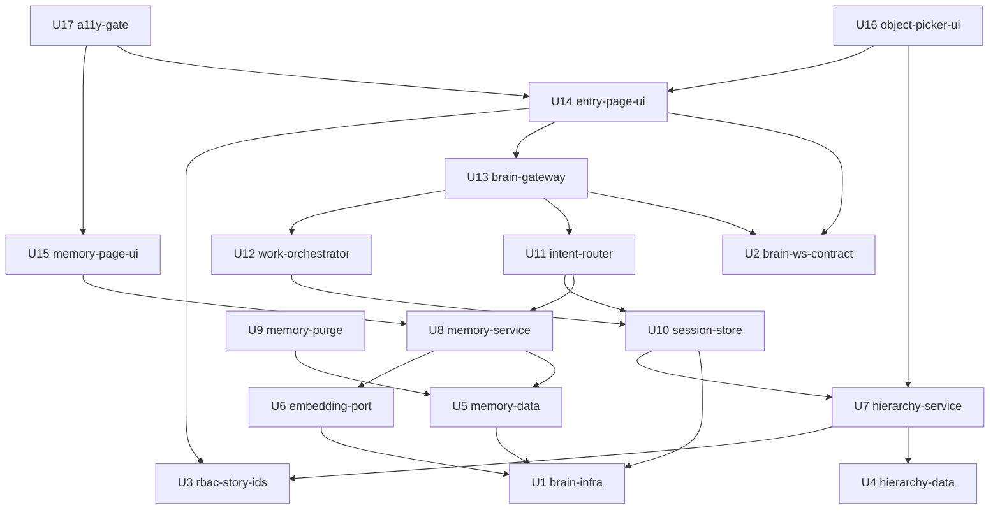

# Unit of Work Dependency — 統一入口大腦

<!-- Stage: units-generation（Inception 2.7）· Record: 260920-orchestration-brain -->

## 這份檔只描述拓樸

stage 檔明文：**本檔不挑「建議施工順序」、不指認關鍵路徑**——那是 2.9 Delivery
Planning 以本檔為輸入所做的經濟決策。下方的「層」是拓樸分層，**不是** Bolt 順序；
同一層的單元之間沒有依賴，故**可以**平行，但 2.9 未必選擇平行做。

依 `project.md` 的 `units-generation:c23`，本節就地註明：**以下任何排序或編號都
不構成 Bolt 順序的建議。**

## 機讀邊塊（下游 fan-out 由此計算，非由散文）

```yaml
units:
  - name: brain-infra
    kind: packaging
    depends_on: []
  - name: brain-ws-contract
    kind: spec
    depends_on: []
  - name: rbac-story-ids
    kind: spec
    depends_on: []
  - name: hierarchy-data
    kind: spec
    depends_on: []
  - name: memory-data
    kind: spec
    depends_on: [brain-infra]
  - name: embedding-port
    kind: library
    depends_on: [brain-infra]
  - name: hierarchy-service
    kind: service
    depends_on: [hierarchy-data, rbac-story-ids]
  - name: memory-service
    kind: service
    depends_on: [memory-data, embedding-port]
  - name: memory-purge
    kind: packaging
    depends_on: [memory-data]
  - name: session-store
    kind: service
    depends_on: [brain-infra, hierarchy-service]
  - name: intent-router
    kind: service
    depends_on: [memory-service, session-store]
  - name: work-orchestrator
    kind: service
    depends_on: [session-store]
  - name: brain-gateway
    kind: service
    depends_on: [brain-ws-contract, intent-router, work-orchestrator]
  - name: entry-page-ui
    kind: ui
    depends_on: [brain-ws-contract, brain-gateway, rbac-story-ids]
  - name: memory-page-ui
    kind: ui
    depends_on: [memory-service]
  - name: object-picker-ui
    kind: ui
    depends_on: [hierarchy-service, entry-page-ui]
  - name: a11y-gate
    kind: packaging
    depends_on: [entry-page-ui, memory-page-ui]
```

**well-formedness**（本站以腳本驗證，非目測）：17 個名稱唯一；每個
`depends_on` 成員皆為已宣告單元；無單元依賴自己；**無環**（DFS 三色法）；
每個 `kind` 皆為 `service｜spec｜ui｜packaging｜library` 五者之一。
邊數 **23**。

## 依賴圖



<!-- Text fallback: 四個可平行根為 U1 brain-infra、U2 brain-ws-contract、
U3 rbac-story-ids、U4 hierarchy-data。U5 memory-data 與 U6 embedding-port 依賴 U1；
U7 hierarchy-service 依賴 U4 與 U3。U8 memory-service 依賴 U5 與 U6；U9 memory-purge
依賴 U5；U10 session-store 依賴 U1 與 U7。U11 intent-router 依賴 U8 與 U10；
U12 work-orchestrator 依賴 U10；U15 memory-page-ui 依賴 U8。U13 brain-gateway 依賴
U2、U11、U12。U14 entry-page-ui 依賴 U2、U13、U3。U16 object-picker-ui 依賴 U7 與 U14；
U17 a11y-gate 依賴 U14 與 U15。 -->

## 整合點（逐邊）

| 依賴方 | 被依賴方 | 這條邊承載什麼（整合點） |
|---|---|---|
| `U5` `memory-data` | `U1` `brain-infra` | 記憶 schema 的 `vector(1024)` 欄位需要 pgvector 擴充，而該擴充來自 `pgvector/pgvector:pg16` image |
| `U6` `embedding-port` | `U1` `brain-infra` | `ollama` 實作需要 Ollama 服務在位才能被驗證；`fastembed` 實作需要模型快取 volume |
| `U7` `hierarchy-service` | `U4` `hierarchy-data` | 端點讀寫 `projects`／`systems`／`DiagramChangeRecord` 三表 |
| `U7` `hierarchy-service` | `U3` `rbac-story-ids` | 端點的 `require_story_action("K2", …)` 需要 `K2` 這個 story id 已存在於 `role_permissions` |
| `U8` `memory-service` | `U5` `memory-data` | 服務讀寫記憶 schema，並受其 grant 邊界限制 |
| `U8` `memory-service` | `U6` `embedding-port` | 檢索時經 `EmbeddingPort` 取得查詢向量；寫入時記錄 `embeddingModel` |
| `U9` `memory-purge` | `U5` `memory-data` | workflow 刪除逾期的 `MemoryRecord` 列並寫入對應稽核事件 |
| `U10` `session-store` | `U1` `brain-infra` | session 狀態一律放 Redis，不得放行程記憶體 |
| `U10` `session-store` | `U7` `hierarchy-service` | 驗證並解析作業對象的三層識別（**審查 R-01 指出此邊的授權語意未定，見下方風險註**） |
| `U11` `intent-router` | `U8` `memory-service` | 讀該使用者的語意與程序記憶以輔助意圖判定 |
| `U11` `intent-router` | `U10` `session-store` | 讀當前作業對象與對話歷程以解析指涉詞 |
| `U12` `work-orchestrator` | `U10` `session-store` | 工作項集合隨 session key 存放；讀作業對象決定交辦目標 |
| `U13` `brain-gateway` | `U2` `brain-ws-contract` | 對外訊息一律依該型別來源編解，並受其 CI 一致性檢查 |
| `U13` `brain-gateway` | `U11` `intent-router` | 把使用者輸入交給它判定意圖與信心值 |
| `U13` `brain-gateway` | `U12` `work-orchestrator` | 取工作項集合以推送 `work_items` 訊息；轉送逐項更正 |
| `U14` `entry-page-ui` | `U2` `brain-ws-contract` | 前端以同一份型別來源解讀 WS 訊息（含 `clarify` 候選） |
| `U14` `entry-page-ui` | `U13` `brain-gateway` | 入口頁的唯一資料來源是這個 WebSocket |
| `U14` `entry-page-ui` | `U3` `rbac-story-ids` | `DefaultRedirect` 的瀑布之首需要 `K1`；Sidebar 入口項的顯示條件同一個 |
| `U15` `memory-page-ui` | `U8` `memory-service` | 記憶頁三區的檢視與逐則刪除皆打該服務的 HTTP 端點 |
| `U16` `object-picker-ui` | `U7` `hierarchy-service` | 選單的清單與建立表單皆打階層端點（共用 `ObjectCreateAction`） |
| `U16` `object-picker-ui` | `U14` `entry-page-ui` | 選單掛在入口頁與子頁面共用的 `ContextBar` 內，需其先存在 |
| `U17` `a11y-gate` | `U14` `entry-page-ui` | axe 掃描的兩個目標之一 |
| `U17` `a11y-gate` | `U15` `memory-page-ui` | axe 掃描的兩個目標之二 |

### 一條邊上的已知風險（如實記載）

`U10 session-store → U7 hierarchy-service` 與 `U12 work-orchestrator → U7` 兩條邊，
在 domain-design 的審查中被標為 **R-01（Major）**：`components.md` 的
`ProjectHierarchy.behaviour` 無條件寫「不得有任何繞過 `require_story_action` 的路徑，
**含同進程直呼 service 層**」，而這兩條邊在該站被宣告為 `style: sync`（同進程）。
使用者在該站的核可關卡選擇 **Approve**，故此項為**已接受的風險**，並由該站的交接
事項指派 `functional-design` 決定這兩條邊的實際授權形式（帶 token 的 HTTP 呼叫，
或一個等價的同進程授權呼叫）。**本站不改變該決定，只在受影響的兩條邊上標出它**，
避免下游把這兩條邊讀成已解決。

## 可平行機會

| 層 | 單元數 | 該層成員（層內無依賴，可互相平行） |
|---|---|---|
| 0 | 4 | `U1` `brain-infra`、`U2` `brain-ws-contract`、`U3` `rbac-story-ids`、`U4` `hierarchy-data` |
| 1 | 3 | `U5` `memory-data`、`U6` `embedding-port`、`U7` `hierarchy-service` |
| 2 | 3 | `U8` `memory-service`、`U9` `memory-purge`、`U10` `session-store` |
| 3 | 3 | `U11` `intent-router`、`U12` `work-orchestrator`、`U15` `memory-page-ui` |
| 4 | 1 | `U13` `brain-gateway` |
| 5 | 1 | `U14` `entry-page-ui` |
| 6 | 2 | `U16` `object-picker-ui`、`U17` `a11y-gate` |

**完全互相獨立的單元對**（兩者之間沒有任何方向的依賴路徑）共 **56** 對。
這表示本 DAG 允許**多種**有效的拓樸序——選哪一種是 2.9 的事。

**四個可平行根**（`depends_on: []`）：`U1` `brain-infra`、`U2` `brain-ws-contract`、
`U3` `rbac-story-ids`、`U4` `hierarchy-data`。這四個之間互無依賴，是本 DAG 中
**沒有任何前置**的單元。

## 既有模組為前提，不在本 DAG 內

依 `project.md` 的 `units-generation:c22`，yaml 邊塊只列本 intent 待建單元。
下列既有模組是**前提**，本 DAG 不含它們，但多個單元依賴它們已在位：

| 既有模組 | 哪些單元假設它已在位 |
|---|---|
| `require_story_action`（`services/rbac.py`） | `U3`、`U7`、`U8`、`U14` |
| `get_user_from_token`（`services/auth.py`，`record` 參數） | `U13` |
| `prompt_guard`（`services/prompt_guard.py`） | `U11`、`U13` |
| A1／A3 端點（`agent_router`、`review_router`） | `U12` |
| C1 端點 `/api/cost/v1`（`estimate_intake_router`、`advice_stream_router`） | `U12` |
| `UserDiagram` 與 `diagram_shares`（`models.py`） | `U4` |
| `apiUrl()`／`wsUrl()`（`src/config/api.ts`） | `U14`、`U15`、`U16` |
| `PaginationControl`、`Layout`、`Sidebar`、`RouteGuard` | `U14`、`U15`、`U16` |
| `nginx.conf` 的 `location /api/`（唯一帶 Upgrade 標頭者） | `U13` |

## Assumptions & Open Questions

- 本 DAG 的邊表達「**可以**依賴」而非「**必須**先做」。2.9 在選 Bolt 序時可以把
  多個層併進同一個 Bolt，也可以把同層拆開——只要不違反邊的方向 [assumption]
- `U6 → U1` 這條邊取的是較嚴的判準（見 `unit-of-work.md` 的 Assumptions）；
  若改為只驗 `stub`／`fulltext`，`U6` 會變成第五個可平行根 [assumption]
- **deploy-on-merge 之下每個 Bolt 邊界都是一次真實部署**，故「破壞性契約變更與其
  消費端不得分批」這條隱含約束比 DAG 邊更強（`project.md` 的 `delivery-planning:c6`）。
  本 intent 至少有一處落在此形狀：`U2 brain-ws-contract` 與其兩個消費端
  `U13`／`U14`。**這是 2.9 必須代入的約束，本站只標出它的存在，不做批次決定** [assumption]
