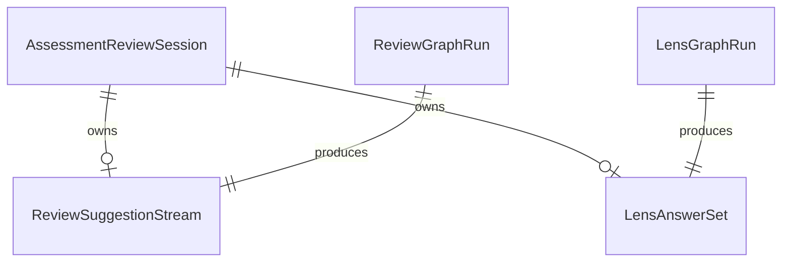

# Functional Spec — A3 Assessment → LangGraph

> Intent `261001-a2-langgraph`｜workflows／state machines 的 source of truth  
> ER 圖與規則摘要為衍生視圖。

## 工作流程

### WF1 — 發起評核（行為不變）

1. 使用者於 `/assessment` 發起評核（既有 UI）。
2. 前端以既有 HTTP／SSE 連線呼叫 `/api/architecture` 評核相關端點（路徑集合不變）。
3. Orchestrator 執行規則引擎（純函式，本輪不改）。
4. Orchestrator 啟動 **LensGraphRun**（經 langgraph_runtime；structured output／tool 節點 → **LensAnswerSet**）。
5. Orchestrator 啟動 **ReviewGraphRun**（經 langgraph_runtime；串流增量 → **ReviewSuggestionStream**）。
6. Router 將串流增量映射為 SSE `type=suggestion_delta`（欄位語意與現況相容）。
7. 完成時送出既有 complete／等價結束事件；前端更新分數／findings／建議顯示。

**硬失敗：** 任一步 LLM／runtime 硬錯誤依 BR3.1 上拋，由既有錯誤路徑呈現；不得靜默成功。

### WF2 — 重試建議（retry-suggestions）

1. 使用者觸發既有 retry 建議操作。
2. 僅重新執行 **ReviewGraphRun**（仍經 langgraph_runtime）。
3. 同樣映射為 `suggestion_delta`；前端處理不變。

### WF3 — WA Collab（若路徑呼叫 Review／Lens）

1. 既有 collab 流程可呼叫 Design（本輪不改）與 Review／Lens。
2. 凡觸及 Review／Lens，必須走 WF1 同款 LangGraph 路徑（BR1.1），不得殘留 SDK。

### WF4 — SDK／CLI 退場（交付順序）

1. 完成 Review／Lens 迁徙與測試（BR5.1）。
2. 驗證 `backend/` 無 `ClaudeSDKClient` 執行期呼叫（BR1.1／FR4.1）。
3. 移除 Dockerfile 內 Node／claude-code（BR4.1）；更新過時註解。
4. 若步驟 2 失敗 → 不執行步驟 3，記為阻擋項（FR4.4）。

## 狀態機 — AssessmentReviewSession.phase

```
rules → lens → suggestions → complete
                ↘ failed
         ↘ failed
  rules ↘ failed

complete --[retry]--> suggestions
failed   --[retry]--> suggestions
```

- `failed`：硬失敗上拋後的對外可觀測失敗態（語意對齊現況，不新發明使用者錯誤碼，除非現況已有）。
- 不得從 `suggestions` 在無錯誤時跳到「空建議 + complete」假裝成功。
- **retry（WF2，維持現況）**：使用者觸發既有「重試建議」時，`phase` 自 `complete` 或 `failed` 回到 `suggestions`，僅重跑 ReviewGraphRun 並再次產生 `suggestion_delta`；不重跑 rules／lens（與現況 orchestrator 行為一致）。

## 衍生：ER（自 entities.md）



**文字 fallback：** Session 擁有可選的建議串流與 Lens 答案集；各自由獨立的 Review／Lens graph run 產生。

## 衍生：規則摘要（自 rules.md）

見 `rules.md` 表格；契約關鍵為 BR2.1（SSE）、BR2.2（前端）、BR1.1（runtime）、BR5.1（雙測試）。
